<p align="center">
  
</p>

<h1 align="center">Universidad Peruana de Ciencias Aplicadas</h1>
<h2 align="center">Carrera de Ingeniería de Software</h2>

<h3 align="center">1ASI0657</h3>

<h3 align="center">Fundamentos de Arquitectura de Software </h3>
<h3 align="center">NRC</h3>
<h3 align="center">15987</h3>

<h1 align="center">Informe de Trabajo Final</h1>

<h3 align="center">Docente</h3>
<h2 align="center">Wilder Aurelio Vega Calero</h2>

<h3 align="center">Equipo</h3>
<h2 align="center">LogiGo</h2>

<h3 align="center">Proyecto</h3>
<h2 align="center">TrackTruck</h2>

<h2 align="center">Integrantes</h2>

<table align="center">
  <tr>
    <th>Código</th>
    <th>Apellidos y Nombres</th>
  </tr>
  <tr>
    <td>U20241E406</td>
    <td>Loa Rojas, Jean Franck</td>
  </tr>
  <tr>
    <td>U20221C803</td>
    <td>Rocca Leon, Anhelo Rodrigo</td>
  </tr>
  <tr>
    <td>U202019498</td>
    <td>Fernandez Garfias, Alexander Piero</td>
  </tr>
  <tr>
    <td>U202213553</td>
    <td>De Las Casas Latour, Sebastián</td>
  </tr>
  <tr>
    <td>U20201f051</td>
    <td>Aldair Joaquin Ramos Aguirre</td>
  </tr>
</table>

<h3 align="center">Periodo 202620</h3>

<div style="page-break-after: always;"></div>

<h2 align="center">Registro de Versiones del Informe</h2>

| Versión | Fecha      | Autor | Descripción de modificación                                                                                                                                                                                                                                                              |
|---------|------------|-------|------------------------------------------------------------------------------------------------------------------------------------------------------------------------------------------------------------------------------------------------------------------------------------------|
| AV1     | 07-09-2026 | LogiGo | Creación del informe. Inclusión de los Capítulos I, II y III, junto con el avance del diseño arquitectónico del Capítulo IV.                                                                                                                                                                                              |
| TP1     | 09-10-2026 | LogiGo | Reconciliación de los Capítulos IV y V con la implementación reutilizada de TrackTruck, incorporación de evidencia verificable y separación explícita entre arquitectura actual y arquitectura objetivo. |

<div style="page-break-after: always;"></div>

<h2 align="center">Project Report Collaboration Insights</h2>


**AV1.** Para la AV1, la elaboración del informe se centró en desarrollar los contenidos establecidos en la rúbrica, incluyendo la presentación de la startup y del producto, el proceso Lean UX, el análisis de competidores, las entrevistas, el Needfinding y la especificación de requisitos mediante User Stories, Impact Map y Product Backlog. Todos los integrantes participaron en la elaboración y revisión del informe, coordinándose mediante reuniones presenciales y reuniones virtuales por Discord, además del uso de GitHub para gestionar y consolidar los avances realizados.

<div style="page-break-after: always;"></div>

## Contenido

- [Student Outcome](#student-outcome)
- [Capítulo I: Introducción](#capítulo-i-introducción)
    - [1.1. Startup Profile](#11-startup-profile)
        - [1.1.1. Descripción de la Startup](#111-descripción-de-la-startup)
        - [1.1.2. Perfiles de integrantes del equipo](#112-perfiles-de-integrantes-del-equipo)
    - [1.2. Solution Profile](#12-solution-profile)
        - [1.2.1. Nombre del producto](#121-nombre-del-producto)
        - [1.2.2. Antecedentes y problemática](#122-antecedentes-y-problemática)
        - [1.2.3. Lean UX Process](#123-lean-ux-process)
            - [1.2.3.1. Lean UX Problem Statement](#1231-lean-ux-problem-statement)
            - [1.2.3.2. Lean UX Assumptions](#1232-lean-ux-assumptions)
            - [1.2.3.3. Lean UX Hypothesis](#1233-lean-ux-hypothesis)
            - [1.2.3.4. Lean UX Canvas](#1234-lean-ux-canvas)
    - [1.3. Segmentos objetivo](#13-segmentos-objetivo)
- [Capítulo II: Requirements Elicitation & Analysis](#capítulo-ii-requirements-elicitation--analysis)
    - [2.1. Competidores](#21-competidores)
        - [2.1.1. Análisis Competitivo](#211-análisis-competitivo)
        - [2.1.2. Estrategias y tácticas frente a competidores](#212-estrategias-y-tácticas-frente-a-competidores)
    - [2.2. Entrevistas](#22-entrevistas)
        - [2.2.1. Diseño de entrevistas](#221-diseño-de-entrevistas)
        - [2.2.2. Registro de entrevistas](#222-registro-de-entrevistas)
        - [2.2.3. Análisis de entrevistas](#223-análisis-de-entrevistas)
    - [2.3. Needfinding](#23-needfinding)
        - [2.3.1. User Personas](#231-user-personas)
        - [2.3.2. User Task Matrix](#232-user-task-matrix)
        - [2.3.3. Empathy Maps](#233-empathy-maps)
        - [2.3.4. As-Is Scenario Mapping](#234-as-is-scenario-mapping)
- [Capítulo III: Requirements Elicitation & Analysis](#capítulo-iii-requirements-elicitation--analysis)
    - [3.1. To-Be Scenario Mapping](#31-to-be-scenario-mapping)
    - [3.2. User Stories](#32-user-stories)
    - [3.3. Impact Map](#33-impact-map)
    - [3.4. Product Backlog](#34-product-backlog)
- [Capítulo IV: Product Architecture Design](#capítulo-iv-product-architecture-design)
    - [4.1. Design Concepts, ViewPoints & ER Diagrams](#41-design-concepts-viewpoints--er-diagrams)
        - [4.1.1. Principles Statements](#411-principles-statements)
        - [4.1.2. Approaches Statements Architectural Styles & Patterns](#412-approaches-statements-architectural-styles--patterns)
        - [4.1.3. Context Diagram](#413-context-diagram)
        - [4.1.4. Approach Driven ViewPoints Diagrams](#414-approach-driven-viewpoints-diagrams)
        - [4.1.5. Relational/Non Relational Database Diagram](#415-relationalnon-relational-database-diagram)
        - [4.1.6. Design Patterns](#416-design-patterns)
        - [4.1.7. Tactics](#417-tactics)
        - [4.1.8. Product UI/UX Design Guidelines](#418-product-uiux-design-guidelines)
            - [4.1.8.1. General Style Guidelines](#4181-general-style-guidelines)
            - [4.1.8.2. Information Architecture](#4182-information-architecture)
            - [4.1.8.3. Landing Page UI Design](#4183-landing-page-ui-design)
            - [4.1.8.4. Mobile Applications UX/UI Design](#4184-mobile-applications-uxui-design)
            - [4.1.8.5. Mobile Applications Prototyping](#4185-mobile-applications-prototyping)
    - [4.2. Architectural Drivers](#42-architectural-drivers)
        - [4.2.1. Design Purpose](#421-design-purpose)
        - [4.2.2. Primary Functionality (Primary User Stories)](#422-primary-functionality-primary-user-stories)
        - [4.2.3. Quality Attribute Scenarios](#423-quality-attribute-scenarios)
        - [4.2.4. Constraints](#424-constraints)
        - [4.2.5. Architectural Concerns](#425-architectural-concerns)
    - [4.3. ADD Iterations](#43-add-iterations)
        - [4.3.1. Iteration 1: Global System Structure](#431-iteration-1-global-system-structure)
            - [4.3.1.1. Architectural Design Backlog 1](#4311-architectural-design-backlog-1)
            - [4.3.1.2. Establish Iteration Goal by Selecting Drivers](#4312-establish-iteration-goal-by-selecting-drivers)
            - [4.3.1.3. Choose One or More Elements of the System to Refine](#4313-choose-one-or-more-elements-of-the-system-to-refine)
            - [4.3.1.4. Choose One or More Design Concepts That Satisfy the Selected Drivers](#4314-choose-one-or-more-design-concepts-that-satisfy-the-selected-drivers)
            - [4.3.1.5. Instantiate Architectural Elements, Allocate Responsibilities, and Define Interfaces](#4315-instantiate-architectural-elements-allocate-responsibilities-and-define-interfaces)
            - [4.3.1.6. Sketch Views (C4 & UML) and Record Design Decisions](#4316-sketch-views-c4--uml-and-record-design-decisions)
            - [4.3.1.7. Analysis of Current Design and Review Iteration Goal (Kanban Board)](#4317-analysis-of-current-design-and-review-iteration-goal-kanban-board)
        - [4.3.2. Iteration 2: Shipment and Warehouse Operations](#432-iteration-2-shipment-and-warehouse-operations)
            - [4.3.2.1. Architectural Design Backlog 2](#4321-architectural-design-backlog-2)
            - [4.3.2.2. Establish Iteration Goal by Selecting Drivers](#4322-establish-iteration-goal-by-selecting-drivers)
            - [4.3.2.3. Choose One or More Elements of the System to Refine](#4323-choose-one-or-more-elements-of-the-system-to-refine)
            - [4.3.2.4. Choose One or More Design Concepts That Satisfy the Selected Drivers](#4324-choose-one-or-more-design-concepts-that-satisfy-the-selected-drivers)
            - [4.3.2.5. Instantiate Architectural Elements, Allocate Responsibilities, and Define Interfaces](#4325-instantiate-architectural-elements-allocate-responsibilities-and-define-interfaces)
            - [4.3.2.6. Sketch Views (C4 & UML) and Record Design Decisions](#4326-sketch-views-c4--uml-and-record-design-decisions)
            - [4.3.2.7. Analysis of Current Design and Review Iteration Goal (Kanban Board)](#4327-analysis-of-current-design-and-review-iteration-goal-kanban-board)
        - [4.3.3. Iteration 3: Intelligent Dispatch Planning and Resource Assignment](#433-iteration-3-intelligent-dispatch-planning-and-resource-assignment)
            - [4.3.3.1. Architectural Design Backlog 3](#4331-architectural-design-backlog-3)
            - [4.3.3.2. Establish Iteration Goal by Selecting Drivers](#4332-establish-iteration-goal-by-selecting-drivers)
            - [4.3.3.3. Choose One or More Elements of the System to Refine](#4333-choose-one-or-more-elements-of-the-system-to-refine)
            - [4.3.3.4. Choose One or More Design Concepts That Satisfy the Selected Drivers](#4334-choose-one-or-more-design-concepts-that-satisfy-the-selected-drivers)
            - [4.3.3.5. Instantiate Architectural Elements, Allocate Responsibilities, and Define Interfaces](#4335-instantiate-architectural-elements-allocate-responsibilities-and-define-interfaces)
            - [4.3.3.6. Sketch Views (C4 & UML) and Record Design Decisions](#4336-sketch-views-c4--uml-and-record-design-decisions)
            - [4.3.3.7. Analysis of Current Design and Review Iteration Goal (Kanban Board)](#4337-analysis-of-current-design-and-review-iteration-goal-kanban-board)
        - [4.3.4. Iteration 4: Trip Execution, Tracking and Delivery](#434-iteration-4-trip-execution-tracking-and-delivery)
            - [4.3.4.1. Architectural Design Backlog 4](#4341-architectural-design-backlog-4)
            - [4.3.4.2. Establish Iteration Goal by Selecting Drivers](#4342-establish-iteration-goal-by-selecting-drivers)
            - [4.3.4.3. Choose One or More Elements of the System to Refine](#4343-choose-one-or-more-elements-of-the-system-to-refine)
            - [4.3.4.4. Choose One or More Design Concepts That Satisfy the Selected Drivers](#4344-choose-one-or-more-design-concepts-that-satisfy-the-selected-drivers)
            - [4.3.4.5. Instantiate Architectural Elements, Allocate Responsibilities, and Define Interfaces](#4345-instantiate-architectural-elements-allocate-responsibilities-and-define-interfaces)
            - [4.3.4.6. Sketch Views (C4 & UML) and Record Design Decisions](#4346-sketch-views-c4--uml-and-record-design-decisions)
            - [4.3.4.7. Analysis of Current Design and Review Iteration Goal (Kanban Board)](#4347-analysis-of-current-design-and-review-iteration-goal-kanban-board)
        - [4.3.5. Iteration 5: Billing, Operational History and Analytics](#435-iteration-5-billing-operational-history-and-analytics)
            - [4.3.5.1. Architectural Design Backlog 5](#4351-architectural-design-backlog-5)
            - [4.3.5.2. Establish Iteration Goal by Selecting Drivers](#4352-establish-iteration-goal-by-selecting-drivers)
            - [4.3.5.3. Choose One or More Elements of the System to Refine](#4353-choose-one-or-more-elements-of-the-system-to-refine)
            - [4.3.5.4. Choose One or More Design Concepts That Satisfy the Selected Drivers](#4354-choose-one-or-more-design-concepts-that-satisfy-the-selected-drivers)
            - [4.3.5.5. Instantiate Architectural Elements, Allocate Responsibilities, and Define Interfaces](#4355-instantiate-architectural-elements-allocate-responsibilities-and-define-interfaces)
            - [4.3.5.6. Sketch Views (C4 & UML) and Record Design Decisions](#4356-sketch-views-c4--uml-and-record-design-decisions)
            - [4.3.5.7. Analysis of Current Design and Review Iteration Goal (Kanban Board)](#4357-analysis-of-current-design-and-review-iteration-goal-kanban-board)
- [Capítulo V: Product Implementation, Validation & Deployment](#capítulo-v-product-implementation-validation--deployment)
    - [5.1. Testing Suites & General Patterns](#51-testing-suites--general-patterns)
        - [5.1.1. Backend Application Core Testing Suite](#511-backend-application-core-testing-suite)
            - [5.1.1.1. Core Entities Unit Tests](#5111-core-entities-unit-tests)
            - [5.1.1.2. Core Integration Tests](#5112-core-integration-tests)
            - [5.1.1.3. Core Behavior-Driven Development](#5113-core-behavior-driven-development)
            - [5.1.1.4. Core System Tests](#5114-core-system-tests)
            - [5.1.1.5. Static Testing & Verification](#5115-static-testing--verification)
        - [5.1.2. Pattern Based Backend Application(s)](#512-pattern-based-backend-applications)
        - [5.1.3. Pattern Based Custom Software Library](#513-pattern-based-custom-software-library)
        - [5.1.4. Framework Pattern Driven Refactoring Report](#514-framework-pattern-driven-refactoring-report)
    - [5.2. Software Configuration Management](#52-software-configuration-management)
        - [5.2.1. Software Development Environment Configuration](#521-software-development-environment-configuration)
        - [5.2.2. Source Code Management](#522-source-code-management)
        - [5.2.3. Source Code Style Guide & Conventions](#523-source-code-style-guide--conventions)
            - [5.2.3.1. Backend — .NET y C#](#5231-backend--net-y-c)
            - [5.2.3.2. Mobile Application — Kotlin y Jetpack Compose](#5232-mobile-application--kotlin-y-jetpack-compose)
            - [5.2.3.3. Landing Page — HTML, CSS y JavaScript](#5233-landing-page--html-css-y-javascript)
            - [5.2.3.4. Tests, contratos y revisión](#5234-tests-contratos-y-revisión)
        - [5.2.4. Software Deployment Configuration](#524-software-deployment-configuration)
    - [5.3. MicroServices Implementation](#53-microservices-implementation)
        - [5.3.1. Sprint 1](#531-sprint-1)
            - [5.3.1.1. Sprint Backlog 1](#5311-sprint-backlog-1)
            - [5.3.1.2. Development Evidence for Sprint Review](#5312-development-evidence-for-sprint-review)
            - [5.3.1.3. Testing Suite Evidence for Sprint Review](#5313-testing-suite-evidence-for-sprint-review)
            - [5.3.1.4. Execution Evidence for Sprint Review](#5314-execution-evidence-for-sprint-review)
            - [5.3.1.5. Microservices Documentation Evidence for Sprint Review](#5315-microservices-documentation-evidence-for-sprint-review)
            - [5.3.1.6. Software Deployment Evidence for Sprint Review](#5316-software-deployment-evidence-for-sprint-review)
            - [5.3.1.7. Team Collaboration Insights during Sprint](#5317-team-collaboration-insights-during-sprint)
            - [5.3.1.8. Kanban Board](#5318-kanban-board)
- [Conclusiones](#conclusiones)
- [Referencias Bibliográficas](#referencias-bibliográficas)
- [Anexos](#anexos)
- [Links](#links)

<div style="page-break-after: always;"></div>

# Student Outcome

### ABET – EAC - Student Outcome 7

**Aprendizaje Continuo y Autónomo**

**Criterio:** La capacidad de adquirir y aplicar nuevos conocimientos según sea necesario, utilizando estrategias de aprendizaje apropiadas.

En el siguiente cuadro se describen las acciones realizadas y los enunciados de conclusiones por parte del equipo, que permiten sustentar el haber alcanzado el logro del ABET – EAC - Student Outcome 7.

| **Avance** | **Integrante** | **Actualiza conceptos y conocimientos necesarios para su desarrollo profesional y en especial para su proyecto en soluciones de software.** | **Reconoce la necesidad del aprendizaje permanente para el desempeño profesional y el desarrollo de proyectos en soluciones de software.** |
|---|---|---|---|
| **AV1** | **Loa Rojas, Jean Franck** | Investigó y aplicó conceptos de Lean UX para contribuir en la definición de la problemática, los supuestos y las hipótesis de la solución propuesta. | Reconoció la importancia de actualizar continuamente sus conocimientos sobre metodologías UX para comprender mejor las necesidades de los usuarios y orientar el desarrollo del producto. |
|  | **Rocca Leon, Anhelo Rodrigo** | Aplicó técnicas de análisis de competidores y entrevistas para obtener información relevante sobre el mercado, los usuarios y sus principales necesidades. | Identificó la necesidad de fortalecer continuamente sus conocimientos en investigación y análisis de usuarios para sustentar decisiones durante el desarrollo de soluciones de software. |
|  | **Fernandez Garfias, Alexander Piero** | Profundizó en técnicas de Needfinding mediante la elaboración de User Personas, User Task Matrix y Empathy Maps para representar las características y necesidades de los usuarios. | Reconoció que el aprendizaje continuo de técnicas de UX y análisis de usuarios permite adaptar las soluciones de software a necesidades y contextos cambiantes. |
|  | **De Las Casas Latour, Sebastián** | Aplicó nuevos conocimientos en la especificación de requisitos mediante la elaboración y organización de User Stories orientadas a las necesidades identificadas. | Reconoció la importancia de actualizar sus conocimientos sobre gestión y especificación de requisitos para mantener una adecuada relación entre las necesidades del usuario y las funcionalidades del producto. |
|  | **Aldair Joaquin Ramos Aguirre** | Fortaleció sus conocimientos sobre planificación de productos mediante la elaboración del Impact Map y la organización y priorización del Product Backlog. | Identificó la necesidad del aprendizaje permanente en técnicas de planificación y gestión de productos de software para responder adecuadamente a nuevos requerimientos y cambios del proyecto. |
|  | **Conclusiones** | **El equipo actualizó y aplicó conocimientos relacionados con Lean UX, investigación de usuarios, análisis de requisitos y planificación del producto, integrándolos en el desarrollo de los capítulos I, II y III del proyecto.** | **El equipo reconoció la importancia del aprendizaje continuo y autónomo para fortalecer sus competencias y adaptar el desarrollo de soluciones de software a las necesidades de los usuarios y a la evolución del proyecto.** |


**Student Outcome para TP1:** pendiente incorporar por integrante los aprendizajes y aplicaciones reales de C#/ASP.NET Core, arquitectura móvil, pruebas, IA e integración, junto con las evidencias correspondientes. Las acciones registradas para AV1 se conservan como antecedentes de esa entrega.

<div style="page-break-after: always;"></div>

# Capítulo I: Introducción

## 1.1. Startup Profile

### 1.1.1. Descripción de la Startup

LogiGo es una startup tecnológica orientada a mejorar la planificación, ejecución y trazabilidad del transporte terrestre de carga. Su propuesta responde a la dispersión de información que puede existir entre clientes, envíos, almacenes, flota, jornadas de conductores, mantenimiento, viajes, entregas y cobros. Esta dispersión dificulta conocer el estado de una operación, asignar recursos adecuados y responder oportunamente ante incidencias.

LogiGo desarrolla **TrackTruck**, una solución compuesta por una aplicación móvil y servicios backend en C#. La app permite acceder a las funciones autorizadas de cada rol; el backend conserva los datos, aplica las reglas del negocio y coordina las integraciones. La arquitectura se organiza en 17 bounded contexts que abarcan el ciclo logístico completo, desde la gestión de clientes y solicitudes de transporte hasta la entrega, facturación y análisis de resultados.

La propuesta incorpora planificación asistida por inteligencia artificial dentro de **Dispatch Planning**. El componente de IA apoyará la evaluación de alternativas de conductor, vehículo y ruta mediante información operacional, mientras las reglas obligatorias de disponibilidad, jornada, descansos y mantenimiento controlarán la elegibilidad de los recursos. La decisión final se registrará con la aprobación del responsable de operaciones.

La implementación se desarrollará por incrementos. El objetivo es entregar funciones ejecutables con pruebas y evidencias verificables, manteniendo correspondencia entre requisitos, código, modelos arquitectónicos y resultados de cada Sprint.

<div style="page-break-after: always;"></div>

### 1.1.2. Perfiles de integrantes del equipo

| Foto | Información |
|---|---|
|  | **Nombre:** Jean Franck Loa Rojas<br><br>**Código:** U20241E406<br><br>**Carrera:** Ingeniería de Software<br><br>**Acerca de mí:**<br><br><br/>Soy Jean Franck Loa Rojas, estudiante de séptimo ciclo de Ingeniería de Software. Mi fortaleza es trabajar el producto completo: desde el modelado con Domain-Driven Design y la definición de bounded contexts hasta la construcción de servicios backend con Java y Spring Boot, aplicaciones web con Angular y soluciones móviles con Flutter. También organizo repositorios con GitFlow, documento decisiones técnicas y valido que cada componente se integre correctamente. En el equipo aporto criterio arquitectónico, capacidad para convertir requerimientos complejos en implementaciones concretas y disciplina para respaldar cada avance con evidencia.|
|  | **Nombre:** Anhelo Rodrigo Rocca Leon<br><br>**Código:** U20221C803<br><br>**Carrera:** Ingeniería de Software<br><br>**Acerca de mí:**<br><br>Soy Anhelo Rodrigo Rocca Leon, estudiante de la carrera de Ingeniería de Software en la UPC. Tengo conocimientos en C++, HTML, CSS, JavaScript, C#, Python, Java y Flutter. Me interesa el desarrollo frontend para aplicaciones web y móviles, enfocándome en crear experiencias dinámicas, funcionales y adaptadas a las necesidades de los usuarios. |
|  | **Nombre:** Alexander Piero Fernandez Garfias<br><br>**Código:** U202019498<br><br>**Carrera:** Ingeniería de Software<br><br>**Acerca de mí:**<br><br>Soy Alexander Piero Fernandez Garfias, estudiante de la carrera de Ingeniería de Software en la UPC. Poseo conocimientos en C++, HTML, CSS, JavaScript, C#, Python, Java y Flutter. Me enfoco en el diseño y desarrollo frontend para aplicaciones web y móviles, aplicando creatividad y buenas prácticas para construir soluciones tecnológicas modernas y eficientes. |
|  | **Nombre:** Sebastián De Las Casas Latour<br><br>**Código:** U202213553<br><br>**Carrera:** Ingeniería de Software<br><br>**Acerca de mí:**<br><br>Soy Sebastián De Las Casas Latour, estudiante de Ingeniería de Software en la UPC. En TrackTruck contribuyo a transformar las necesidades de los segmentos objetivo en User Stories claras, criterios de aceptación verificables y una priorización coherente del producto. Me interesa fortalecer mis competencias en análisis, especificación de requisitos y trabajo colaborativo para construir soluciones de software alineadas con problemas reales.|
|  | **Nombre:** Aldair Joaquin Ramos Aguirre<br>**Código:** U20201f051<br><br>**Carrera:** Ingeniería de Software<br><br>**Acerca de mí:**<br><br>Soy estudiante de la carrera de Ingeniería de Software en la UPC. Tengo interés en seguir aprendiendo sobre tecnologías y metodologías relacionadas con el desarrollo de software, contribuyendo al trabajo colaborativo y al cumplimiento de los objetivos del proyecto. |


<div style="page-break-after: always;"></div>

## 1.2. Solution Profile

### 1.2.1. Nombre del producto

**TrackTruck** es el producto digital de LogiGo para gestionar y supervisar operaciones de transporte de carga. Integra la información de clientes, envíos, almacén, flota, personal, jornadas, mantenimiento, despachos, viajes, ubicaciones, incidencias, entregas, cobros e historial operacional.

El nombre representa el seguimiento del transporte como parte de una solución logística más amplia. Su frontend será una aplicación móvil Android y su backend se implementará en C# con ASP.NET Core. La planificación asistida por IA será una capacidad de Dispatch Planning, integrada con las fuentes de información operacional y las reglas obligatorias del negocio.

### 1.2.2. Antecedentes y problemática

**Who (¿Quién?) — ¿A quiénes afecta?**  
A empresas de transporte de carga y organizaciones que coordinan o contratan servicios logísticos. Los usuarios operativos incluyen administradores, coordinadores, supervisores de flota, conductores y personal de almacén; los clientes requieren visibilidad sobre sus propios envíos.

**What (¿Qué?) — ¿Cuál es el problema?**  
La información de la operación puede mantenerse separada entre hojas de cálculo, rastreo GPS, llamadas y registros manuales. Esto dificulta relacionar el envío con la carga preparada, el conductor disponible, las horas ya trabajadas, el vehículo apto, la ruta, las incidencias y la confirmación de entrega. El problema comprende tanto la visibilidad del viaje como la coordinación previa y el cierre posterior.

**Where (¿Dónde?) — ¿En qué contexto ocurre?**  
En operaciones terrestres de carga, desde la recepción de una solicitud y la preparación de la mercancía hasta su traslado, entrega y cierre administrativo. El mercado inicial considerado es el peruano.

**When (¿Cuándo?) — ¿Cuándo se manifiesta?**  
Al crear y preparar envíos, asignar recursos, iniciar viajes, supervisar el recorrido, atender interrupciones, comprobar entregas y revisar cobros o resultados. Se vuelve especialmente relevante cuando existen varias operaciones simultáneas o recursos con restricciones de jornada y mantenimiento.

**Why (¿Por qué?) — ¿Qué lo origina?**  
La fragmentación de los datos y la falta de reglas compartidas de coordinación hacen necesario consultar varias fuentes antes de decidir. La disponibilidad administrativa de un conductor o vehículo, por sí sola, no demuestra que pueda ser asignado a un nuevo despacho: también deben revisarse horarios, descansos, reservas y condición técnica.

**How (¿Cómo?) — ¿Cómo afecta al usuario?**  
El responsable de operaciones dedica tiempo a reunir información, puede detectar tarde un problema y tiene dificultades para reconstruir lo sucedido. Una asignación inadecuada puede obligar a replanificar; una entrega sin confirmación suficiente dificulta el cierre del envío; un historial incompleto limita la evaluación posterior.

**How Much (¿Cuánto?) — ¿Cuál es su magnitud?**  
El documento base recoge siete entrevistas que describen necesidades de seguimiento, comunicación, organización y seguridad de la carga. Esta muestra permite un análisis exploratorio, sin estimar pérdidas monetarias ni generalizar porcentajes al mercado. Para cuantificar la magnitud se deberá levantar una línea base de tiempos de planificación, consultas manuales, retrasos, incidencias y entregas confirmadas.

**Respuesta propuesta.** TrackTruck centralizará estas capacidades mediante una app móvil y un backend en C#, organizado en bounded contexts. La planificación incorporará recomendaciones de IA sujetas a reglas obligatorias y aprobación humana. La solución se evaluará mediante pruebas del software y validación con usuarios, comparando sus resultados con la línea base obtenida.

<div style="page-break-after: always;"></div>

### 1.2.3. Lean UX Process


#### 1.2.3.1. Lean UX Problem Statement

Las empresas de transporte y las organizaciones que utilizan servicios logísticos necesitan coordinar envíos, recursos y entregas con información actualizada. Los resúmenes de las entrevistas registradas describen uso de Excel, herramientas GPS y canales de comunicación separados, además de dificultades para conocer el avance del transporte y mantener organizada la información de la carga.

El desafío de TrackTruck es ofrecer una experiencia móvil que permita consultar y gestionar la operación con trazabilidad, apoyada por servicios backend que apliquen las reglas de acceso, jornada, mantenimiento, planificación y ejecución. La ampliación del alcance hacia almacén, gestión laboral, facturación e IA constituye una propuesta de producto que requiere validación adicional con los roles correspondientes.

Se buscará comprobar si la centralización reduce el tiempo necesario para consultar una operación y planificar un despacho, mejora la comprensión de sus estados y permite reconocer incidencias con mayor facilidad. Las mejoras se medirán durante pruebas con usuarios; las hipótesis iniciales se mantendrán abiertas hasta disponer de evidencia suficiente.

<div style="page-break-after: always;"></div>

#### 1.2.3.2. Lean UX Assumptions

Las siguientes suposiciones orientan la construcción y validación del producto. Se distinguen las necesidades descritas en los registros de entrevistas de las capacidades ampliadas que aún deben contrastarse con usuarios.

##### Business Outcomes

**Creemos que nuestros clientes necesitan:** centralizar el estado de sus envíos y viajes, coordinar conductores y vehículos y conservar evidencia del desarrollo de la operación. Como ampliación del alcance se consideran almacén, jornadas, mantenimiento, entregas, cobros y reportes.

**Estas necesidades se pueden resolver con:** una aplicación móvil conectada a servicios C# que mantengan los datos y reglas del negocio, con integraciones de mapas y una capacidad de recomendación de IA dentro de Dispatch Planning.

**Nuestros clientes iniciales serán:** empresas de transporte de carga y organizaciones que coordinan o contratan servicios logísticos, con operaciones que requieran visibilidad y trazabilidad.

**El valor principal que busca el cliente es:** tomar decisiones sobre la operación con información relacionada y actualizada, reduciendo consultas manuales entre fuentes dispersas.

**Beneficios adicionales esperados:** mayor trazabilidad, asignaciones compatibles con restricciones operativas, atención de incidencias, confirmación de entregas y revisión del desempeño.

**Adquisición de clientes:** contacto B2B, demostraciones del producto y contenido digital dirigido al sector. Estos canales constituyen una estrategia por validar, con seguimiento de contactos, demostraciones y adopción.

**Modelo de ingresos:** suscripción empresarial como hipótesis comercial. La tarifa y la unidad de cobro deberán establecerse después de analizar costos, capacidad y disposición de pago. Billing & Payments registra los cargos por los servicios logísticos; el cobro de una suscripción SaaS requerirá una definición comercial expresa.

**Competencia:** plataformas de visibilidad logística, telemática y gestión de entregas, como FourKites, Powerfleet —antes Fleet Complete— y Tookan.

**Diferenciación esperada:** una experiencia móvil en español, un flujo operativo claro y recomendaciones que muestren sus criterios. Esta propuesta se contrastará con usuarios; la presencia de IA o GPS por sí sola no demuestra una ventaja competitiva.

**Riesgos del producto:** alcance excesivo para la capacidad del equipo, información operacional incompleta, baja adopción y falta de datos adecuados para evaluar un modelo de IA.

**Reducción de riesgos:** implementar incrementos verificables, priorizar historias de mayor valor, probar el flujo móvil con usuarios, revisar la calidad de los datos y comparar la recomendación de IA con una alternativa básica.

##### User Outcomes

**Usuarios:** administrador, coordinador de operaciones, supervisor de flota, conductor, personal de almacén y cliente autorizado. Los arquetipos Carlos Mendoza y Andrea Salazar se conservan como base del análisis; los nuevos roles requieren validación específica.

**Uso cotidiano:** consultar y gestionar operaciones desde el móvil según el rol y la organización. Las acciones que requieren validación central, como aprobar un despacho, necesitan conexión con el backend.

**Problemas que se busca resolver:** información dispersa, incertidumbre sobre el viaje, dificultad para contactar al conductor, asignaciones con datos incompletos y falta de evidencia de entrega e historial.

**Momentos de uso:** preparación del envío, planificación del despacho, consulta de asignaciones, ejecución del viaje, seguimiento, registro de incidencias, confirmación de entrega y revisión posterior.

**Dificultades posibles:** permisos de ubicación, conectividad móvil, datos GPS antiguos, recomendaciones poco claras y formularios demasiado extensos. La app indicará la antigüedad de los datos y el estado de sincronización de los reportes pendientes.

**Características prioritarias:** navegación clara, autenticación y acceso por rol, gestión básica de flota y viajes, seguimiento con fecha de actualización, incidencias, historial y planificación explicable. Las funciones adicionales se incorporarán conforme al Product Backlog.

<div style="page-break-after: always;"></div>

#### 1.2.3.3. Lean UX Hypothesis

Las metas siguientes son criterios iniciales de validación y no representan resultados obtenidos. El equipo deberá registrar la línea base, el tamaño del piloto, las tareas evaluadas y los resultados antes de aceptar o rechazar cada hipótesis.

| ID | Hipótesis | Validación y criterio inicial de éxito |
|---|---|---|
| H01 | Creemos que consultar ubicación, estado y antigüedad del reporte desde la app reducirá las consultas manuales sobre un viaje. | Comparar la misma tarea con el proceso actual y con TrackTruck; meta piloto: reducir al menos 20 % el tiempo mediano de consulta. |
| H02 | Creemos que relacionar paradas e incidencias con un viaje facilitará reconocer situaciones que requieren atención. | Presentar escenarios controlados; meta: al menos 4 de 5 participantes identifican la incidencia y el viaje afectado sin ayuda. |
| H03 | Creemos que acceder a los datos de contacto desde el viaje facilitará comunicarse con el conductor. | Medir tiempo y errores al localizar el contacto; meta: al menos 4 de 5 participantes llegan al marcador telefónico correcto sin ayuda. |
| H04 | Creemos que un historial consolidado facilitará reconstruir lo ocurrido durante una operación. | Solicitar localizar conductor, vehículo, estados e incidencia de un viaje finalizado; meta: al menos 4 de 5 participantes completan la tarea. |
| H05 | Creemos que usar la información de jornada y mantenimiento antes de asignar recursos reducirá propuestas inválidas. | Ensayar casos válidos e inválidos; meta funcional: bloquear el 100 % de los casos preparados que incumplan una regla obligatoria. |
| H06 | Creemos que la recomendación asistida por IA, acompañada de criterios y aprobación humana, reducirá el esfuerzo de planificación. | Comparar planificación básica y asistida sobre casos equivalentes; meta piloto: reducir 20 % el tiempo mediano de planificación, respetando todas las reglas obligatorias. |
| H07 | Creemos que relacionar envío, entrega, comprobante e historial mejorará la comprensión del cierre de la operación. | Prueba de tareas de cierre y consulta; meta: al menos 4 de 5 participantes reconocen qué envío fue entregado y qué registro financiero está asociado. |

Las metas podrán ajustarse antes del piloto según la línea base y la disponibilidad de participantes. La evidencia deberá diferenciar pruebas de aceptación del software, evaluación técnica del modelo y validación de la experiencia del usuario.

<div style="page-break-after: always;"></div>

#### 1.2.3.4. Lean UX Canvas

El contenido actualizado del Canvas relaciona la problemática inicial con el alcance ampliado de TrackTruck. La figura del documento base deberá actualizarse con la siguiente información.

| Bloque | Contenido |
|---|---|
| Business Problem | Información dispersa y dificultades para coordinar, supervisar y reconstruir una operación de transporte. |
| Business Outcomes | Reducir tiempo de consulta y planificación; mejorar trazabilidad y cumplimiento de reglas; facilitar la confirmación y revisión del cierre. |
| Users & Customers | Empresas de transporte y organizaciones usuarias de servicios logísticos; administradores, coordinadores, supervisores, conductores, personal de almacén y clientes autorizados. |
| User Benefits | Información relacionada, acceso móvil, criterios de asignación visibles y registros consultables del viaje y la entrega. |
| Solutions | App Android, backend C#, 17 bounded contexts, integración con mapas, planificación asistida por IA y conservación del historial. |
| Hypotheses | H01–H07: consulta, atención de incidencias, contacto, historial, elegibilidad, planificación asistida y cierre. |
| Most Important Thing to Learn First | Si los usuarios pueden completar el flujo móvil y si los datos disponibles son suficientes para validar asignaciones y evaluar la recomendación. |
| Least Work to Learn | Probar un flujo operativo mínimo con API y app integradas; utilizar escenarios controlados y un conjunto de evaluación de IA claramente identificado; registrar tiempos, errores y comentarios. |


<div style="page-break-after: always;"></div>

## 1.3. Segmentos objetivo

### Segmento 1: Empresas de transporte de carga

Empresas que administran vehículos y conductores y requieren organizar despachos, supervisar viajes y conservar trazabilidad. Los registros de Gianfranco Quispe, Diego Cisneros y Valeria Cardenas aportan información exploratoria sobre este segmento.

| Característica | Descripción |
|---|---|
| Tipo de cliente | Empresa, relación B2B. |
| Sector y mercado inicial | Transporte terrestre de carga en Perú. |
| Usuarios operativos | Administradores, coordinadores, supervisores de flota y conductores. |
| Necesidades identificadas | Seguimiento, organización de vehículos y viajes, puntualidad, seguridad y comunicación. |
| Ampliaciones por validar | Jornada y descansos, mantenimiento integrado y planificación asistida por IA. |
| Capacidades de interés | Fleet Management, Maintenance Management, Workforce Management, Time & Attendance, Driver Safety & Compliance, Dispatch Planning, Trip Execution, Tracking & Geolocation e Incident Management. |

<div style="page-break-after: always;"></div>

### Segmento 2: Organizaciones que coordinan o contratan servicios logísticos

Organizaciones que coordinan el traslado de mercancías o contratan transporte para sus actividades comerciales. Los registros de Rodrigo Guerra, el participante de la empresa de mobiliario, Jael Pinta y Alonso Shovl corresponden principalmente a usuarios comerciales de servicios de transporte. Sus testimonios sustentan necesidades sobre estado del envío, comunicación y seguridad de la mercancía; la experiencia de operadores internos de almacén y despacho deberá validarse con participantes de esos roles.

| Característica | Descripción |
|---|---|
| Tipo de cliente | Empresa, relación B2B. |
| Actividad | Coordinación logística, comercialización y contratación de transporte de mercancías. |
| Usuarios | Coordinadores y representantes comerciales; clientes autorizados para consultar sus propios envíos. |
| Necesidades identificadas | Conocer estado y avance de la carga, reducir incertidumbre y mantener comunicación y registros. |
| Ampliaciones por validar | Recepción y preparación de carga, confirmación digital de entrega, cobros y reportes consolidados. |
| Capacidades de interés | Customer Management, Shipment Management, Warehouse Operations, Delivery Management, Billing & Payments, Operational History y Reporting & Analytics. |

Identity & Access protege las operaciones de ambos segmentos. Los segmentos representan grupos de clientes; los roles representan las responsabilidades y permisos de las personas dentro de la app.

<div style="page-break-after: always;"></div>

# Capítulo II: Requirements Elicitation & Analysis

## 2.1. Competidores

El análisis considera soluciones que se superponen con distintas capacidades de TrackTruck. Las funciones descritas se contrastaron con páginas oficiales consultadas el 08 de octubre de 2026. Las valoraciones sobre adecuación al segmento son inferencias del equipo y se deberán comprobar mediante demostraciones y cotizaciones.

### FourKites

**Tipo: competidor directo en visibilidad logística.** Su propuesta relaciona seguimiento de envíos, información de la cadena de suministro y capacidades predictivas y de IA. Compite especialmente con Shipment Management, Tracking & Geolocation y Reporting & Analytics. [Fuente oficial: FourKites](https://www.fourkites.com/network/).

### Powerfleet — antes Fleet Complete

**Tipo: competidor directo en gestión de flotas.** La página oficial de Fleet Complete presenta la marca Powerfleet y una plataforma que reúne información de vehículos, telemática, seguridad y cumplimiento. Compite principalmente con Fleet Management, Tracking & Geolocation y las capacidades de análisis de recursos. [Fuente oficial: Powerfleet](https://www.fleetcomplete.com/product/).

### Tookan

**Tipo: competidor directo en despacho y entregas; su grado de sustitución depende de la operación.** Su propuesta incluye asignación, rutas, seguimiento y aplicaciones para actores de la entrega. Coincide con Dispatch Planning, Trip Execution y Delivery Management. [Fuente oficial: Tookan](https://jungleworks.com/tookan/).

<div style="page-break-after: always;"></div>

### 2.1.1. Análisis Competitivo

| Criterio | TrackTruck | FourKites | Powerfleet / Fleet Complete | Tookan |
|---|---|---|---|---|
| Estado | Producto académico en desarrollo. | Solución comercial. | Solución comercial. | Solución comercial. |
| Foco | Ciclo logístico con app móvil y backend C#. | Visibilidad de la cadena de suministro. | Flota y telemática. | Despacho y entregas. |
| Capacidades comparadas | 17 contextos como arquitectura objetivo; avance por Sprint. | Seguimiento, información predictiva e IA. | Datos de flota, seguridad y cumplimiento. | Asignación, rutas y seguimiento de entregas. |
| Propuesta de TrackTruck frente a la alternativa | Flujo móvil en español y criterios de asignación visibles. | Validar adaptación al tamaño y proceso de la empresa. | Validar profundidad requerida de telemática e integración. | Validar requisitos propios del transporte de carga. |
| Costos | Hipótesis de suscripción; estructura comercial pendiente de validación. | Requerir cotización vigente. | Requerir cotización vigente. | Revisar plan y cotización según uso. |
| Evidencia para decidir | Probar las mismas tareas con usuarios y registrar tiempos, errores y aceptación. | Demostración del flujo requerido. | Demostración e integración de datos requerida. | Demostración del despacho y entrega requerida. |

**SWOT de TrackTruck.**

| Dimensión | Análisis |
|---|---|
| Fortalezas previstas | Responsabilidades del negocio delimitadas; experiencia móvil; trazabilidad y planificación con criterios visibles. Su efectividad requiere implementación y validación. |
| Debilidades actuales | Producto en desarrollo; recursos limitados; evidencia operativa y datos de entrenamiento aún por completar. |
| Oportunidades | Atender tareas concretas de las empresas entrevistadas y validar adopción mediante pilotos de alcance controlado. |
| Amenazas | Competidores establecidos, cambios en servicios externos y dificultad para demostrar suficiente valor con un producto inicial. |

El uso de IA no se presenta como una capacidad exclusiva de TrackTruck. La diferenciación se medirá sobre la utilidad del flujo completo para los segmentos objetivo.

<div style="page-break-after: always;"></div>

### 2.1.2. Estrategias y tácticas frente a competidores

| Estrategia | Táctica | Forma de evaluación |
|---|---|---|
| Adecuación al proceso del cliente | Demostrar un envío y viaje completo con datos del escenario del usuario. | Tareas completadas, errores y comentarios del piloto. |
| Claridad de la experiencia móvil | Reducir pasos innecesarios y mostrar estado, última actualización y acciones por rol. | Tiempo por tarea y solicitudes de ayuda. |
| Planificación comprensible | Mostrar alternativas elegibles, criterios de recomendación y responsable de aprobación. | Tiempo de planificación y comprensión de la decisión. |
| Trazabilidad | Relacionar envío, plan, viaje, incidencias, entrega y registro financiero mediante identificadores. | Capacidad de reconstruir una operación de principio a fin. |
| Evolución gradual | Priorizar funciones verificables y revisar el backlog después de cada Sprint. | Historias aceptadas con evidencia y defectos pendientes. |
| Validación comercial | Recabar disposición de pago y costos reales de operación antes de fijar tarifas. | Entrevistas comerciales y evaluación de costos del servicio. |

<div style="page-break-after: always;"></div>

## 2.2. Entrevistas

### 2.2.1. Diseño de entrevistas

Las entrevistas tienen como objetivo conocer las necesidades, dificultades y procesos actuales de los segmentos objetivo de **TrackTruck** en relación con la supervisión de vehículos, conductores, rutas y operaciones de transporte. Asimismo, buscan identificar las herramientas que utilizan actualmente, la manera en que gestionan incidencias y el nivel de importancia que tiene para ellos disponer de información en tiempo real.

La información obtenida permitirá validar las principales suposiciones planteadas durante el proceso Lean UX y determinar qué funcionalidades de TrackTruck generan mayor valor para los usuarios.

### Segmento objetivo 1: Empresas de transporte de carga

1. ¿Cuánto tiempo lleva su empresa realizando operaciones de transporte de carga?
2. ¿Cuántos vehículos y conductores aproximadamente gestionan actualmente?
3. ¿Cómo supervisan actualmente la ubicación y el recorrido de sus vehículos durante un viaje?
4. ¿Qué herramientas o tecnologías utilizan para realizar el seguimiento de sus vehículos y conductores?
5. ¿Cuáles son los principales problemas que enfrentan al supervisar sus operaciones de transporte?
6. ¿Cómo identifican actualmente retrasos, paradas no previstas, problemas en la ruta u otras incidencias durante un recorrido?
7. ¿Cómo se comunican con los conductores cuando necesitan conocer el estado de un viaje o cuando ocurre algún problema?
8. ¿Qué procedimiento siguen cuando ocurre una incidencia o emergencia durante el transporte?
9. ¿Mantienen algún registro o historial de los viajes, rutas e incidencias ocurridas? ¿Cómo gestionan actualmente esta información?
10. ¿Qué información consideran más importante visualizar para supervisar adecuadamente un vehículo durante su recorrido?
11. ¿Qué dificultades encuentran al administrar información relacionada con vehículos, conductores, rutas y viajes?
12. ¿Qué tan útil sería para su empresa contar con una plataforma que centralice el monitoreo de vehículos, recorridos, comunicación e incidencias?
13. ¿Qué funcionalidades consideraría indispensables en una plataforma de gestión y monitoreo del transporte de carga?
14. ¿Qué factores tomaría en cuenta su empresa antes de adoptar una plataforma como TrackTruck?

<div style="page-break-after: always;"></div>

### Segmento objetivo 2: Organizaciones que coordinan o contratan servicios logísticos

1. ¿Qué tipo de operaciones logísticas y de transporte gestiona actualmente su empresa?
2. ¿Con qué frecuencia necesitan supervisar vehículos, rutas o viajes durante el transporte de mercancías?
3. ¿Cómo realizan actualmente el seguimiento de las operaciones de transporte?
4. ¿Qué herramientas o sistemas utilizan para conocer la ubicación y el estado de los vehículos o cargas?
5. ¿Cuáles son las principales dificultades que encuentran al supervisar múltiples operaciones de transporte?
6. ¿Cómo detectan actualmente retrasos, paradas, problemas de tráfico u otras incidencias que puedan afectar un viaje?
7. ¿Cómo mantienen la comunicación con los conductores o responsables del transporte durante los recorridos?
8. ¿Qué información necesitan conocer para determinar si una operación de transporte se está desarrollando correctamente?
9. ¿Cómo registran y consultan actualmente la información de rutas, recorridos e incidencias de operaciones anteriores?
10. ¿Qué dificultades tienen para mantener la trazabilidad de una operación desde su inicio hasta su finalización?
11. ¿Qué tan importante es para sus operaciones disponer de información actualizada sobre vehículos, conductores y recorridos?
12. ¿Qué tan útil sería contar con una plataforma que permita visualizar y centralizar esta información en tiempo real?
13. ¿Qué funcionalidades esperaría encontrar en una plataforma como TrackTruck?
14. ¿Qué aspectos relacionados con facilidad de uso, acceso a la información o comunicación considerarían importantes para utilizar este tipo de plataforma?


<div style="page-break-after: always;"></div>

### 2.2.2. Registro de entrevistas

En esta sección se presenta el registro de las entrevistas realizadas a los usuarios pertenecientes a los segmentos objetivo de **TrackTruck**. Para cada entrevista se registrarán los datos del entrevistado, la evidencia visual, el enlace al video, el timing correspondiente y un resumen de las principales respuestas obtenidas.

---

## Segmento objetivo 1: Empresas de transporte de carga

### Entrevista 1

| Campo | Detalle |
|---|---|
| Nombres y apellidos | Gianfranco Quispe |
| Segmento objetivo | Empresas de transporte de carga |
| Cargo / actividad | Empresario del sector de transporte y logística |
| Duración | 4:34 |
| URL del video | [Ver video](https://upcedupe-my.sharepoint.com/:v:/g/personal/u202218899_upc_edu_pe/IQDkzObcE5ATSpmZvlKaZk58ARkz3Yp5qF9_nS_ZYSTAGaQ?nav=eyJyZWZlcnJhbEluZm8iOnsicmVmZXJyYWxBcHAiOiJPbmVEcml2ZUZvckJ1c2luZXNzIiwicmVmZXJyYWxBcHBQbGF0Zm9ybSI6IldlYiIsInJlZmVycmFsTW9kZSI6InZpZXciLCJyZWZlcnJhbFZpZXciOiJNeUZpbGVzTGlua0NvcHkifX0&e=QOjMzT) |

<p align="center">
  
</p>

**Resumen:**  
Gianfranco Quispe es un empresario con cinco años de experiencia en el sector logístico y de transporte. Durante la entrevista destacó la importancia de utilizar tecnología para mejorar la eficiencia y seguridad de las operaciones, especialmente en zonas rurales del Perú. Actualmente emplea herramientas GPS y medios de comunicación en tiempo real para supervisar y coordinar los viajes. También recopila información de sus clientes mediante encuestas y sistemas de calificación. Frente a incrementos de demanda, aumenta temporalmente la disponibilidad de vehículos y reorganiza sus operaciones. Sus respuestas evidencian la necesidad de contar con una aplicación como **TrackTruck**, que permita centralizar la gestión de vehículos, conductores, rutas y viajes.

---

<div style="page-break-after: always;"></div>

### Entrevista 2

| Campo | Detalle |
|---|---|
| Nombres y apellidos | Diego Cisneros |
| Segmento objetivo | Empresas de transporte de carga |
| Cargo / actividad | Personal relacionado con la gestión de transporte |
| Duración | 6:25 |
| URL del video | [Ver video](https://upcedupe-my.sharepoint.com/:v:/g/personal/u202218899_upc_edu_pe/IQA-12ReLDzQR49ealZCQkCfATl5EcCRvhjS1SzkyXFY-xU?nav=eyJyZWZlcnJhbEluZm8iOnsicmVmZXJyYWxBcHAiOiJPbmVEcml2ZUZvckJ1c2luZXNzIiwicmVmZXJyYWxBcHBQbGF0Zm9ybSI6IldlYiIsInJlZmVycmFsTW9kZSI6InZpZXciLCJyZWZlcnJhbFZpZXciOiJNeUZpbGVzTGlua0NvcHkifX0&e=Ujrc4n) |

<p align="center">
  
</p>

**Resumen:**  
Diego Cisneros considera que una aplicación móvil permitiría automatizar y optimizar diferentes procesos relacionados con el transporte, brindando mayor control sobre las operaciones. Señala que uno de los principales problemas son los retrasos ocasionados por el mal estado de algunas carreteras. Actualmente utiliza Excel para registrar información sobre los camiones, controlar su estado y programar mantenimientos según el tiempo de uso. Esto demuestra la necesidad de una solución como **TrackTruck**, donde la información de vehículos, viajes, rutas y estados pueda mantenerse centralizada y disponible de manera más rápida.

<div style="page-break-after: always;"></div>

---

### Entrevista 3

| Campo | Detalle |
|---|---|
| Nombres y apellidos | Valeria Cardenas |
| Segmento objetivo | Empresas de transporte de carga |
| Cargo / actividad | Administradora en empresa de transporte de carga |
| Duración | 4:08 |
| URL del video | [Ver video](https://upcedupe-my.sharepoint.com/:v:/g/personal/u202218899_upc_edu_pe/IQBtRonP6CraSJUSB36JKYOyActf48po9v-Z1ghUJw-bAgE?nav=eyJyZWZlcnJhbEluZm8iOnsicmVmZXJyYWxBcHAiOiJPbmVEcml2ZUZvckJ1c2luZXNzIiwicmVmZXJyYWxBcHBQbGF0Zm9ybSI6IldlYiIsInJlZmVycmFsTW9kZSI6InZpZXciLCJyZWZlcnJhbFZpZXciOiJNeUZpbGVzTGlua0NvcHkifX0&e=6Xlw1F) |

<p align="center">
  
</p>

**Resumen:**  
Valeria Cardenas cuenta con dos años de experiencia como administradora en el sector de transporte de carga. Menciona que las condiciones geográficas y de infraestructura del país representan dificultades importantes para las operaciones. Actualmente utiliza herramientas como Excel y rastreo satelital para gestionar los envíos y consultar su avance. También considera importantes la seguridad, puntualidad y adecuada gestión de los vehículos y conductores. La entrevista evidencia la necesidad de centralizar la información operativa y mantener un historial de vehículos, viajes y recorridos mediante una solución móvil como **TrackTruck**.

<div style="page-break-after: always;"></div>

---

## Segmento objetivo 2: Organizaciones que coordinan o contratan servicios logísticos

### Entrevista 4

| Campo | Detalle |
|---|---|
| Nombres y apellidos | Rodrigo Guerra |
| Segmento objetivo | Organizaciones que coordinan o contratan servicios logísticos |
| Cargo / actividad | Emprendedor |
| Duración | 5:49 |
| URL del video | [Ver video](https://upcedupe-my.sharepoint.com/:v:/g/personal/u202218899_upc_edu_pe/IQAV3DQLGB33SpVkVyUbv9pQAUsYOLoLLNGkZGiAaly_qig?nav=eyJyZWZlcnJhbEluZm8iOnsicmVmZXJyYWxBcHAiOiJPbmVEcml2ZUZvckJ1c2luZXNzIiwicmVmZXJyYWxBcHBQbGF0Zm9ybSI6IldlYiIsInJlZmVycmFsTW9kZSI6InZpZXciLCJyZWZlcnJhbFZpZXciOiJNeUZpbGVzTGlua0NvcHkifX0&e=wJlceN) |

<p align="center">
  
</p>

**Resumen:**  
Rodrigo Guerra es un emprendedor que depende de servicios de transporte de mercancías para desarrollar sus actividades comerciales. Durante la entrevista destacó problemas relacionados con la falta de visibilidad de los envíos y el control de los costos. Considera importante poder consultar el estado de un traslado y conocer su avance de forma sencilla. Mostró interés en utilizar una aplicación móvil que mejore la transparencia de las operaciones y destacó que la interfaz debería ser intuitiva y contar con un diseño moderno.

<div style="page-break-after: always;"></div>

---

### Entrevista 5

| Campo | Detalle |
|---|---|
| Nombres y apellidos | Por completar |
| Segmento objetivo | Organizaciones que coordinan o contratan servicios logísticos |
| Cargo / actividad | Personal de empresa de mobiliario |
| Duración | 3:35 |
| URL del video | [Ver video](https://upcedupe-my.sharepoint.com/:v:/g/personal/u202218899_upc_edu_pe/IQCYIb0z_NwBTLbajN-6r4f9AWyuPx7pVcLQDYFiSKfXhjQ?nav=eyJyZWZlcnJhbEluZm8iOnsicmVmZXJyYWxBcHAiOiJPbmVEcml2ZUZvckJ1c2luZXNzIiwicmVmZXJyYWxBcHBQbGF0Zm9ybSI6IldlYiIsInJlZmVycmFsTW9kZSI6InZpZXciLCJyZWZlcnJhbFZpZXciOiJNeUZpbGVzTGlua0NvcHkifX0&e=ah7IkZ) |

<p align="center">
  
</p>

**Resumen:**  
El entrevistado trabaja en una empresa dedicada al sector mobiliario y considera fundamental el servicio de transporte para realizar las entregas de sus productos. Entre los principales problemas identifica los retrasos, los posibles daños a la mercancía y la falta de comunicación con los transportistas. Considera útil disponer de una aplicación que permita conocer el estado de los envíos y mejorar la transparencia durante el traslado. También menciona como importante conocer la ubicación y el progreso de la entrega. Sus respuestas muestran interés por una solución que facilite el seguimiento y reduzca la incertidumbre durante las operaciones de transporte.

<div style="page-break-after: always;"></div>

---

### Entrevista 6

| Campo | Detalle |
|---|---|
| Nombres y apellidos | Jael Pinta |
| Segmento objetivo | Organizaciones que coordinan o contratan servicios logísticos |
| Cargo / actividad | Comerciante mayorista de prendas |
| Duración | 4:12 |
| URL del video | [Ver video](https://upcedupe-my.sharepoint.com/:v:/g/personal/u202218899_upc_edu_pe/IQAz-85vOfF1R46gy8UA0z54AfCV6TF7BxvrpjY63Y2yBAs?nav=eyJyZWZlcnJhbEluZm8iOnsicmVmZXJyYWxBcHAiOiJPbmVEcml2ZUZvckJ1c2luZXNzIiwicmVmZXJyYWxBcHBQbGF0Zm9ybSI6IldlYiIsInJlZmVycmFsTW9kZSI6InZpZXciLCJyZWZlcnJhbFZpZXciOiJNeUZpbGVzTGlua0NvcHkifX0&e=CS9mfl) |

<p align="center">
  
</p>

**Resumen:**  
Jael Pinta se dedica a la venta mayorista de prendas hacia diferentes zonas del interior del país y utiliza servicios de transporte para realizar sus envíos. Su principal preocupación es la seguridad de la mercancía, debido a que en algunas ocasiones los productos no llegan completos o en las mismas condiciones en las que fueron enviados. También menciona que la comunicación mediante canales tradicionales puede resultar lenta y generar pérdida de tiempo al consultar el estado de los envíos. Considera importante contar con mayor información sobre el traslado y mejorar la organización y trazabilidad de las operaciones.

<div style="page-break-after: always;"></div>

---

### Entrevista 7

| Campo | Detalle |
|---|---|
| Nombres y apellidos |  Alonso Shovl |
| Segmento objetivo | Organizaciones que coordinan o contratan servicios logísticos |
| Cargo / actividad | Comerciante de equipo de ferretería |
| Duración | 8:22 |
| URL del video | [Ver video](https://upcedupe-my.sharepoint.com/:v:/g/personal/u202213553_upc_edu_pe/IQBnolRqUlm5SoIE66MFLH98AU3jHadHbl2VdK9mHX7oo6A?nav=eyJyZWZlcnJhbEluZm8iOnsicmVmZXJyYWxBcHAiOiJPbmVEcml2ZUZvckJ1c2luZXNzIiwicmVmZXJyYWxBcHBQbGF0Zm9ybSI6IldlYiIsInJlZmVycmFsTW9kZSI6InZpZXciLCJyZWZlcnJhbFZpZXciOiJNeUZpbGVzTGlua0NvcHkifX0&e=OfYgGa) |

<p align="center">
  
</p>

**Resumen:**  
Alonso habla de las dificultades que tiene a la hora de comunicarse con los conductores de los camiones y cómo es díficil mantener organizado el estado de los mismos, igual que la carga.


<div style="page-break-after: always;"></div>

### 2.2.3. Análisis de entrevistas

El registro del documento base contiene **siete entrevistas: tres del segmento 1 y cuatro del segmento 2**. El análisis siguiente se construye a partir de los resúmenes disponibles. Para reportar frecuencias o porcentajes se deberá elaborar una matriz de codificación con preguntas, respuestas y evidencia temporal de cada video; los resúmenes actuales permiten identificar temas de forma cualitativa.

#### Segmento 1: Empresas de transporte de carga

| Registro | Hallazgo presente en el resumen | Implicación para el producto |
|---|---|---|
| Gianfranco Quispe | Utiliza GPS y comunicación en tiempo real; reorganiza recursos cuando cambia la demanda. | Relacionar seguimiento, recursos y planificación de operaciones. |
| Diego Cisneros | Registra camiones y mantenimiento en Excel; identifica retrasos asociados al estado de carreteras. | Centralizar datos de flota y mantenimiento y conservar la planificación y sus cambios. |
| Valeria Cardenas | Usa Excel y rastreo satelital; valora seguridad, puntualidad y gestión de los recursos. | Facilitar la consulta móvil del estado del envío y viaje y mantener registros operacionales. |

Los tres registros aportan necesidades sobre organización y visibilidad de la operación. La definición de reglas laborales y la utilidad de una recomendación de IA requieren entrevistas específicas y pruebas adicionales.

#### Segmento 2: Organizaciones que coordinan o contratan servicios logísticos

| Registro | Hallazgo presente en el resumen | Implicación para el producto |
|---|---|---|
| Rodrigo Guerra | Falta de visibilidad de envíos y control de costos; interés en una interfaz móvil sencilla. | Consultar estado del envío y datos del servicio con una experiencia clara. |
| Participante de empresa de mobiliario | Retrasos, posibles daños y comunicación insuficiente con transportistas. | Relacionar seguimiento, incidencias y confirmación de entrega. |
| Jael Pinta | Preocupación por mercancía incompleta o dañada y demora en consultas por canales tradicionales. | Conservar evidencia de carga, entrega e incidencias e historial de la operación. |
| Alonso Shovl | Dificultad para comunicarse con conductores y organizar el estado de la carga. | Facilitar el acceso a contacto autorizado y al estado del envío y viaje. |

Estos cuatro registros describen principalmente experiencias de empresas que utilizan servicios de transporte. Para representar a coordinadores internos, operarios de almacén y responsables de facturación se deberán incorporar entrevistas de esos perfiles.

#### Relación con el alcance ampliado

| Necesidad | Sustento disponible | Contextos relacionados |
|---|---|---|
| Seguimiento y consulta del estado | Resúmenes de los segmentos 1 y 2. | Shipment Management, Trip Execution, Tracking & Geolocation. |
| Organización de vehículos y mantenimiento | Resúmenes de Diego Cisneros y Valeria Cardenas. | Fleet Management, Maintenance Management. |
| Comunicación e incidencias | Resúmenes de participantes de ambos segmentos. | Incident Management, Trip Execution y acceso al contacto desde la app. |
| Seguridad e integridad de la mercancía | Resúmenes de mobiliario y Jael Pinta. | Warehouse Operations, Delivery Management, Operational History. |
| Costos del servicio | Resumen de Rodrigo Guerra. | Billing & Payments; detalle comercial por validar. |
| Jornadas, elegibilidad e IA | Ampliación de requisitos del proyecto. | Workforce Management, Time & Attendance, Driver Safety & Compliance, Dispatch Planning; validación de usuarios pendiente. |

La evidencia permite orientar el backlog inicial. La aceptación del alcance ampliado y de sus reglas se comprobará con investigación adicional y con pruebas de los incrementos implementados.

<div style="page-break-after: always;"></div>

## 2.3. Needfinding


### 2.3.1. User Personas

Las siguientes fichas de **User Persona** fueron elaboradas en **UXPressia** a partir del análisis de los segmentos objetivo de TrackTruck, considerando las necesidades, comportamientos, objetivos y dificultades identificadas durante el proceso de entrevistas. Cada ficha representa un arquetipo de usuario que permite comprender mejor el contexto en el que se desarrollan las operaciones de transporte y las necesidades que TrackTruck busca atender.

Para el primer segmento, correspondiente a **empresas de transporte de carga**, se identificó un perfil relacionado con la gestión y supervisión de flotas, cuyo principal objetivo es mantener control sobre los vehículos, conductores y recorridos. Este usuario necesita conocer la ubicación de sus unidades, detectar retrasos o incidencias y mantener comunicación con los conductores para responder oportunamente ante situaciones que puedan afectar el transporte.

Para el segundo segmento, correspondiente a **organizaciones que coordinan o contratan servicios logísticos**, se identificó un perfil orientado a la coordinación y seguimiento de múltiples operaciones de transporte. Este usuario valora especialmente el acceso rápido a información actualizada, la trazabilidad de los recorridos y la posibilidad de centralizar información sobre vehículos, conductores, rutas e incidencias para facilitar la supervisión y toma de decisiones.

<div style="page-break-after: always;"></div>

**1. Primer segmento: Empresas de transporte de carga**

<p align="center">
  
</p>

<div style="page-break-after: always;"></div>

**2. Segundo segmento: Organizaciones que coordinan o contratan servicios logísticos**

<p align="center">
  
</p>


<div style="page-break-after: always;"></div>

### 2.3.2. User Task Matrix

El **User Task Matrix** permite identificar y comparar las principales tareas que realizan los User Personas de los segmentos objetivo de TrackTruck para alcanzar sus objetivos dentro de las operaciones de transporte.

Para este análisis se consideran dos User Personas. **Carlos Mendoza** representa al segmento de empresas de transporte de carga y desempeña funciones relacionadas con la supervisión de vehículos y conductores. Por otro lado, **Andrea Salazar** representa al segmento de organizaciones que coordinan o contratan servicios logísticos y se encarga principalmente de coordinar y supervisar las operaciones de transporte.

Las tareas presentadas corresponden a actividades propias de cada usuario dentro de su contexto de trabajo, independientemente de la existencia de TrackTruck.


| **User Task** | **Carlos Mendoza** | | **Andrea Salazar** | |
|---|---|---|---|---|
| | **Frecuencia** | **Importancia** | **Frecuencia** | **Importancia** |
| Supervisar la ubicación de los vehículos durante los recorridos | Siempre | Alta | Siempre | Alta |
| Verificar el cumplimiento de las rutas planificadas | Siempre | Alta | Siempre | Alta |
| Comunicarse con los conductores durante las operaciones | Siempre | Alta | A veces | Alta |
| Identificar retrasos, paradas o problemas durante un recorrido | Siempre | Alta | Siempre | Alta |
| Atender y coordinar acciones frente a incidencias durante el transporte | A veces | Alta | A veces | Alta |
| Revisar el estado de los conductores y vehículos asignados a una operación | Siempre | Alta | A veces | Media |
| Coordinar diferentes operaciones de transporte simultáneamente | A veces | Media | Siempre | Alta |
| Registrar información relacionada con los viajes realizados | Siempre | Media | Siempre | Media |
| Consultar información de recorridos y operaciones anteriores | A veces | Media | A veces | Media |
| Informar sobre el estado y progreso de una operación de transporte | A veces | Media | Siempre | Alta |
| Evaluar el cumplimiento de una operación al finalizar el recorrido | Siempre | Alta | Siempre | Alta |

<div style="page-break-after: always;"></div>


### Análisis de la User Task Matrix

La matriz evidencia que ambos User Personas comparten como tareas de **alta importancia** la supervisión de los recorridos, la verificación del cumplimiento de las rutas, la identificación de retrasos o incidencias y la evaluación del cumplimiento de las operaciones. Esto demuestra que ambos segmentos requieren mantener visibilidad constante sobre el desarrollo del transporte.

En el caso de **Carlos Mendoza**, debido a su rol como supervisor de flota, destacan con mayor frecuencia las tareas relacionadas con la supervisión directa de vehículos y conductores, la comunicación durante los recorridos y la verificación del estado de los recursos asignados a cada operación.

Por otro lado, **Andrea Salazar**, como coordinadora de operaciones logísticas, realiza con mayor frecuencia tareas relacionadas con la coordinación simultánea de diferentes operaciones y la comunicación del estado y progreso de los transportes.

La principal coincidencia entre ambos perfiles se encuentra en la necesidad de conocer el estado de las operaciones y responder oportunamente ante situaciones que puedan afectar los recorridos. La principal diferencia radica en que el primer User Persona presenta un enfoque más orientado al **control de la flota y los conductores**, mientras que el segundo tiene un enfoque relacionado con la **coordinación y seguimiento general de las operaciones logísticas**.


<div style="page-break-after: always;"></div>


### 2.3.3. Empathy Maps

En esta sección se presentan los **Empathy Maps** elaborados en **UXPressia** para cada uno de los User Personas identificados en los segmentos objetivo de TrackTruck. Estos mapas permiten comprender con mayor profundidad las necesidades, comportamientos, pensamientos, preocupaciones y expectativas de los usuarios dentro de su contexto de trabajo.

Para su elaboración, se colocó a cada User Persona como elemento central y se analizaron las observaciones obtenidas durante las entrevistas. A partir de ello, se organizaron los principales hallazgos considerando qué necesita hacer el usuario, qué dice, qué ve, qué hace, qué escucha y qué piensa o siente. Finalmente, se identificaron sus principales **Pains** y **Gains**, los cuales permiten reconocer los problemas que enfrenta actualmente y los resultados que espera obtener.


#### 1. Empathy Map del primer segmento: Empresas de transporte de carga

El primer Empathy Map corresponde a **Carlos Mendoza**, supervisor de flota y representante del segmento de empresas de transporte de carga. Este perfil se caracteriza por la necesidad de mantener control sobre los vehículos y conductores durante los recorridos, verificar el cumplimiento de las rutas y responder oportunamente ante retrasos o incidencias.

Entre sus principales preocupaciones se encuentran la dificultad para conocer inmediatamente lo que ocurre durante un recorrido, la necesidad de comunicarse constantemente con los conductores y la falta de información centralizada sobre viajes anteriores. Como principales resultados esperados, busca disponer de mayor visibilidad sobre su flota, responder rápidamente ante problemas y mantener un mejor registro de las operaciones realizadas.


<div style="page-break-after: always;"></div>

#### 2. Empathy Map del segundo segmento: Organizaciones que coordinan o contratan servicios logísticos

El segundo Empathy Map corresponde a **Andrea Salazar**, coordinadora de operaciones y representante del segmento de organizaciones que coordinan o contratan servicios logísticos. Este perfil necesita coordinar y supervisar diferentes operaciones de transporte, conocer el progreso de los recorridos e identificar situaciones que puedan afectar el cumplimiento de las operaciones.

Sus principales preocupaciones están relacionadas con la dificultad para supervisar simultáneamente diferentes operaciones, la información dispersa entre distintos medios y la necesidad de obtener información actualizada cuando ocurre un retraso o incidencia. Como principales resultados esperados, busca centralizar la información de las operaciones, mejorar la trazabilidad de los recorridos y disponer de información que facilite la toma de decisiones.


<div style="page-break-after: always;"></div>

### 2.3.4. As-Is Scenario Mapping

En esta sección se presentan los **As-Is Scenario Mapping** elaborados en **LucidChart** para los User Personas de cada segmento objetivo. Estos escenarios representan la manera en que los usuarios realizan actualmente sus actividades de supervisión y coordinación del transporte de carga **sin contar con TrackTruck**, permitiendo identificar sus acciones, pensamientos y emociones durante las diferentes etapas de una operación.

Para su elaboración, el equipo inició con una etapa de preparación tomando como referencia los User Personas, las entrevistas y los hallazgos obtenidos durante el Needfinding. Posteriormente, se realizó una lluvia de ideas individual para identificar las principales actividades, pensamientos y emociones experimentadas por cada usuario. Los resultados fueron revisados en conjunto y agrupados en diferentes fases que representan el desarrollo de una operación de transporte.

Finalmente, se identificaron las áreas positivas, negativas y **blank areas** presentes durante la experiencia. Las áreas positivas representan situaciones que actualmente funcionan de manera adecuada; las negativas corresponden a dificultades, frustraciones o problemas experimentados por los usuarios; mientras que las blank areas representan aspectos sobre los cuales todavía es necesario obtener mayor información.

Cada As-Is Scenario Mapping se encuentra organizado mediante las filas **Phases, Doing, Thinking y Feeling**.

#### 1. As-Is Scenario Mapping del primer segmento: Empresas de transporte de carga

El primer escenario corresponde a **Carlos Mendoza**, supervisor de flota y representante del segmento de empresas de transporte de carga. El escenario representa el proceso actual que realiza para preparar un viaje, supervisar el recorrido de los vehículos, atender posibles incidencias y revisar el cumplimiento de la operación.

Las fases identificadas para este escenario son **Preparación del viaje, Inicio del recorrido, Supervisión del recorrido, Gestión de incidencias y Finalización del viaje**.

Durante este proceso, Carlos debe consultar diferentes fuentes de información y mantener comunicación frecuente con los conductores para conocer el estado de las unidades. Los principales puntos negativos aparecen cuando necesita identificar rápidamente retrasos, paradas o incidencias y no dispone de toda la información de manera centralizada.


<div style="page-break-after: always;"></div>

#### 2. As-Is Scenario Mapping del segundo segmento: Organizaciones que coordinan o contratan servicios logísticos

El segundo escenario corresponde a **Andrea Salazar**, coordinadora de operaciones y representante del segmento de organizaciones que coordinan o contratan servicios logísticos. El escenario representa el proceso actual que realiza para coordinar diferentes operaciones de transporte, realizar seguimiento a los recorridos, gestionar problemas y verificar posteriormente el cumplimiento de las operaciones.

Las fases identificadas para este escenario son **Planificación de operaciones, Coordinación del transporte, Seguimiento de operaciones, Gestión de incidencias y Evaluación de resultados**.

Durante este proceso, Andrea necesita consultar constantemente información sobre diferentes vehículos y recorridos, además de mantener comunicación con las personas involucradas en cada operación. Los principales puntos negativos se presentan cuando debe supervisar varias operaciones simultáneamente o cuando necesita obtener rápidamente información actualizada sobre un retraso o incidencia.


<div style="page-break-after: always;"></div>

# Capítulo III: Requirements Elicitation & Analysis

En esta sección se especifican los principales requisitos de **TrackTruck** a partir de la información obtenida durante las entrevistas y el proceso de Needfinding. Los hallazgos identificados permiten comprender las necesidades, dificultades y objetivos de los segmentos analizados y utilizarlos como base para definir las funcionalidades que deberá ofrecer la solución.

La especificación de requisitos comprende el **To-Be Scenario Mapping**, las **User Stories**, el **Impact Map** y el **Product Backlog**, permitiendo transformar las necesidades identificadas en requisitos concretos para el desarrollo de TrackTruck.


## 3.1. To-Be Scenario Mapping

Los escenarios To-Be conservan los dos arquetipos del documento base y amplían sus tareas con la planificación y trazabilidad del flujo logístico. Las nuevas experiencias son propuestas que se validarán con usuarios. Las figuras se actualizarán con el contenido siguiente.

### 1. To-Be Scenario Mapping del primer segmento: Empresas de transporte de carga

Carlos Mendoza supervisará la operación desde la app móvil. El backend aplicará las reglas y conservará los cambios, mientras la interfaz mostrará las acciones permitidas y el estado de la información.

| Phase | Doing | Thinking | Feeling |
|---|---|---|---|
| Preparar recursos | Consulta flota, mantenimiento, disponibilidad y jornada. | ¿Qué recursos cumplen las restricciones para este viaje? | Mayor claridad al reunir información relacionada. |
| Planificar despacho | Revisa alternativas de ruta, conductor y vehículo; consulta los criterios de la recomendación y aprueba el plan. | ¿La propuesta respeta disponibilidad, descansos y mantenimiento? | Confianza condicionada a los datos y explicación disponibles. |
| Iniciar y supervisar | Verifica el viaje programado y consulta ubicaciones con su fecha de captura. | ¿El vehículo sigue el plan y el reporte es reciente? | Mayor control, con aviso cuando los datos estén antiguos. |
| Atender incidencias | Consulta el reporte, accede al contacto y solicita replanificación si corresponde. | ¿Qué acción permite continuar de forma adecuada? | Atención enfocada en la situación registrada. |
| Revisar resultado | Consulta finalización del viaje, entregas e historial. | ¿Qué ocurrió y qué quedó pendiente? | Mejor comprensión del cierre y sus excepciones. |


<div style="page-break-after: always;"></div>

### 2. To-Be Scenario Mapping del segundo segmento: Organizaciones que coordinan o contratan servicios logísticos

Andrea Salazar coordinará operaciones y relacionará información del envío, preparación, viaje, entrega e historial. Las consultas financieras estarán disponibles conforme a sus permisos.

| Phase | Doing | Thinking | Feeling |
|---|---|---|---|
| Registrar operación | Relaciona cliente, solicitud de transporte y carga. | ¿La solicitud tiene información suficiente para procesarse? | Claridad sobre el envío y sus requisitos. |
| Preparar despacho | Comprueba preparación de carga y revisa prioridad y recursos elegibles. | ¿Qué puede despacharse y qué requiere atención? | Mayor organización de las operaciones. |
| Coordinar transporte | Aprueba la planificación y consulta el avance de los viajes. | ¿Qué envíos están en curso y qué información está actualizada? | Visibilidad sobre varias operaciones. |
| Resolver excepciones | Revisa incidencias, interrupciones y entregas parciales o fallidas. | ¿Qué ocurrió y quién debe actuar? | Menor incertidumbre gracias a los registros. |
| Cerrar y evaluar | Revisa confirmación de entrega, cobros, historial e indicadores. | ¿Qué operación terminó y qué registros respaldan el resultado? | Comprensión del servicio y de sus pendientes. |


<div style="page-break-after: always;"></div>

## 3.2. User Stories

Las historias US01–US50 conservan sus identificadores del documento base y se ajustan a los límites del dominio vigente. Se incorporan US51–US80 para cubrir las capacidades ampliadas. Constituyen requisitos para implementar y validar; su inclusión en el informe no establece que estén terminadas.

**Condiciones comunes de aceptación:** el backend valida autenticación, rol y acceso a la organización y recurso para toda operación protegida; valida entradas; conserva auditoría de cambios sensibles; aplica idempotencia donde se requiere; y devuelve errores consistentes. El frontend muestra los estados de carga, datos vacíos y error correspondientes. Las pruebas incluyen casos válidos, inválidos y acceso ajeno conforme al riesgo de cada historia.

Los datos de perfil de acceso permanecen en Identity & Access; las fichas de cliente, empleado y conductor tienen propietarios distintos. Las llamadas utilizan el marcador nativo del móvil. Las rutas y selección de recursos pertenecen a Dispatch Planning, mientras Trip Execution conserva el plan aprobado utilizado por el viaje.

<div style="page-break-after: always;"></div>

### Primary Functionality (Primary User Stories)

| Epic / Story ID | Título | Descripción | Criterios de aceptación | Bounded context responsable | Relacionado con |
| --- | --- | --- | --- | --- | --- |
| **EP01** | **Gestión de organizaciones y clientes** | Epic del producto. | Se acepta a través de las historias relacionadas. | — | EP01 |
| US01 | Registrar empresa | Como representante de una empresa de transporte o logística, deseo registrar mi empresa para comenzar a gestionar mis operaciones de transporte en TrackTruck. | **Scenario 1: Registro exitoso** <br> **Given** que ingreso los datos obligatorios de la empresa, <br> **When** confirmo el registro, <br> **Then** el sistema registra la empresa correctamente. | Customer Management | EP01 |
| US02 | Visualizar información de la empresa | Como responsable de operaciones, deseo consultar la información de mi empresa para verificar los datos registrados. | **Scenario 1: Consulta exitosa** <br> **Given** que la empresa se encuentra registrada, <br> **When** accedo a su información, <br> **Then** el sistema muestra los datos correspondientes. | Customer Management | EP01 |
| US53 | Registrar cliente del servicio | Como responsable de operaciones, deseo registrar los clientes del servicio logístico para relacionarlos con sus envíos y cobros. | **Scenario 1:** **Given** datos válidos del cliente y organización propietaria; **When** registro el cliente; **Then** Customer Management conserva su ficha y datos de contacto.<br>**Scenario 2:** Given datos obligatorios ausentes; When guardo; Then se rechaza sin crear un cliente incompleto. | Customer Management | EP01 |
| **EP02** | **Gestión de vehículos** | Epic del producto. | Se acepta a través de las historias relacionadas. | — | EP02 |
| US03 | Registrar vehículo | Como supervisor de flota, deseo registrar un vehículo para incluirlo en las operaciones de transporte de mi empresa. | **Scenario 1:** **Given** datos válidos, placa no repetida en la organización y capacidad positiva; **When** registro el vehículo; **Then** se crea con estado administrativo ACTIVE.<br>**Scenario 2:** Given datos inválidos o placa repetida; When registro; Then se rechaza sin crear otro vehículo. La aptitud para despacho se evalúa con mantenimiento y reservas. | Fleet Management | EP02 |
| US04 | Consultar vehículos | Como supervisor de flota, deseo visualizar los vehículos registrados para conocer las unidades disponibles de la empresa. | **Scenario 1: Vehículos disponibles** <br> **Given** que existen vehículos registrados, <br> **When** accedo a la sección de vehículos, <br> **Then** el sistema muestra las unidades pertenecientes a la empresa. | Fleet Management | EP02 |
| US05 | Actualizar información de vehículo | Como supervisor de flota, deseo actualizar la información de un vehículo para mantener sus datos correctos. | **Scenario 1: Actualización exitosa** <br> **Given** que selecciono un vehículo existente, <br> **When** modifico sus datos y confirmo los cambios, <br> **Then** el sistema almacena la información actualizada. | Fleet Management | EP02 |
| US23 | Consultar detalle de vehículo | Como supervisor de flota, deseo consultar el detalle de un vehículo para conocer su información y los viajes asociados. | **Scenario 1: Consulta exitosa** <br> **Given** que existe un vehículo registrado, <br> **When** selecciono el vehículo, <br> **Then** el sistema muestra su información disponible. | Fleet Management | EP02 |
| **EP03** | **Gestión de conductores** | Epic del producto. | Se acepta a través de las historias relacionadas. | — | EP03 |
| US06 | Registrar conductor | Como supervisor de flota, deseo registrar un conductor para asignarlo posteriormente a las operaciones de transporte. | **Scenario 1:** **Given** datos de conductor válidos y licencia no repetida en la organización; **When** registro el conductor; **Then** se crea su ficha operativa.<br>**Scenario 2:** Given datos inválidos o una licencia repetida; When registro; Then se rechaza la operación. | Fleet Management | EP03 |
| US07 | Consultar conductores | Como supervisor de flota, deseo consultar las fichas de conductores para conocer sus datos y estado administrativo. | **Scenario 1:** **Given** conductores registrados en mi organización; **When** consulto la lista; **Then** se muestran sus datos y estado; la elegibilidad para un despacho se consulta por separado. | Fleet Management | EP03 |
| US08 | Actualizar información de conductor | Como supervisor de flota, deseo actualizar los datos de un conductor para mantener su información vigente. | **Scenario 1: Actualización exitosa** <br> **Given** que selecciono un conductor registrado, <br> **When** modifico y guardo sus datos, <br> **Then** el sistema actualiza la información del conductor. | Fleet Management | EP03 |
| US24 | Consultar detalle de conductor | Como supervisor de flota, deseo consultar el detalle de un conductor para conocer su información y los viajes en los que ha participado. | **Scenario 1: Consulta exitosa** <br> **Given** que existe un conductor registrado, <br> **When** selecciono al conductor, <br> **Then** el sistema muestra su información disponible. | Fleet Management | EP03 |
| **EP04** | **Ejecución de viajes** | Epic del producto. | Se acepta a través de las historias relacionadas. | — | EP04 |
| US10 | Registrar viaje programado | Como responsable de operaciones, deseo registrar un viaje a partir de un plan aprobado para ejecutar el transporte con recursos definidos. | **Scenario 1:** **Given** un plan aprobado y no utilizado para crear otro viaje; **When** confirmo el registro del viaje; **Then** Trip Execution crea un viaje SCHEDULED con referencias a plan, conductor, vehículo y envíos.<br>**Scenario 2:** Given el mismo identificador de aprobación reenviado; When se procesa; Then se recupera el mismo viaje sin duplicarlo. | Trip Execution | EP04 |
| US13 | Consultar viajes activos | Como responsable de operaciones, deseo visualizar los viajes activos para conocer qué operaciones se encuentran actualmente en ejecución. | **Scenario 1: Consulta de viajes** <br> **Given** que existen viajes activos, <br> **When** accedo a las operaciones actuales, <br> **Then** el sistema muestra los viajes que se encuentran en ejecución. | Trip Execution | EP04 |
| US26 | Consultar detalle de viaje activo | Como responsable de operaciones, deseo consultar el detalle de un viaje activo para conocer su vehículo, conductor, ruta y estado actual. | **Scenario 1: Viaje activo** <br> **Given** que existe un viaje en ejecución, <br> **When** selecciono el viaje, <br> **Then** el sistema muestra la información actual de la operación. | Trip Execution | EP04 |
| US27 | Iniciar viaje | Como conductor, deseo iniciar el viaje que me fue asignado para indicar que la operación de transporte ha comenzado. | **Scenario 1:** **Given** un viaje SCHEDULED, conductor autorizado y validaciones obligatorias vigentes; **When** confirmo el inicio; **Then** el backend cambia a IN_PROGRESS, guarda startedAt y publica TripStarted.<br>**Scenario 2:** Given un estado distinto o una restricción impeditiva; When inicio; Then se rechaza sin cambiar el viaje. | Trip Execution | EP04 |
| US28 | Finalizar viaje | Como conductor, deseo finalizar la ejecución del viaje para registrar el término del recorrido. | **Scenario 1:** **Given** un viaje IN_PROGRESS que puedo operar; **When** confirmo la finalización del recorrido; **Then** se cambia a COMPLETED, se guarda completedAt y se publica TripCompleted.<br>**Scenario 2:** Given una solicitud repetida; When se procesa; Then no se duplica el cambio. Delivery Management conserva por separado la confirmación de cada envío. | Trip Execution | EP04 |
| US29 | Visualizar estado de un viaje | Como responsable de operaciones, deseo visualizar el estado de un viaje para conocer si se encuentra pendiente, en curso o finalizado. | **Scenario 1:** **Given** un viaje que puedo consultar; **When** visualizo su detalle; **Then** se muestra SCHEDULED, IN_PROGRESS, COMPLETED o CANCELLED con su etiqueta y fechas correspondientes. | Trip Execution | EP04 |
| US71 | Cancelar viaje programado | Como responsable de operaciones, deseo cancelar un viaje programado con motivo para liberar recursos y mantener el registro de la decisión. | **Scenario 1:** **Given** un viaje SCHEDULED y permiso de cancelación; **When** confirmo el motivo; **Then** se cambia a CANCELLED y Dispatch Planning libera las reservas según el evento.<br>**Scenario 2:** Given un viaje COMPLETED; When intento cancelarlo; Then se rechaza la transición. | Trip Execution | EP04 |
| **EP05** | **Seguimiento y geolocalización** | Epic del producto. | Se acepta a través de las historias relacionadas. | — | EP05 |
| US14 | Visualizar ubicación del vehículo | Como supervisor de flota, deseo visualizar la ubicación actual de un vehículo para conocer dónde se encuentra durante el viaje. | **Scenario 1:** **Given** un viaje accesible y una ubicación válida recibida; **When** consulto el mapa; **Then** se muestra la última posición y su fecha de captura.<br>**Scenario 2:** Given que no existe ubicación; When consulto; Then se muestra el estado sin datos de posición. | Tracking & Geolocation | EP05 |
| US15 | Visualizar recorrido del viaje | Como responsable de operaciones, deseo visualizar el recorrido realizado por un vehículo para supervisar el progreso de la operación. | **Scenario 1: Recorrido disponible** <br> **Given** que existe información de geolocalización del viaje, <br> **When** visualizo el recorrido, <br> **Then** el sistema representa en el mapa el trayecto registrado. | Tracking & Geolocation | EP05 |
| US16 | Identificar paradas durante el recorrido | Como supervisor de flota, deseo identificar las paradas realizadas durante un viaje para comprender mejor el desarrollo del recorrido. | **Scenario 1:** **Given** reportes válidos que demuestran inmovilidad durante al menos 10 minutos conforme al umbral configurado; **When** el backend procesa el seguimiento; **Then** se registra una parada con ubicación e inicio.<br>**Scenario 2:** Given ausencia de reportes o inmovilidad menor al umbral; When se evalúa; Then no se confirma automáticamente una parada. | Tracking & Geolocation | EP05 |
| US17 | Identificar retrasos en el viaje | Como responsable de operaciones, deseo identificar retrasos durante un viaje para tomar decisiones oportunamente. | **Scenario 1:** **Given** un viaje con referencia de llegada estimada y datos suficientes de seguimiento; **When** se evalúa su avance; **Then** Trip Execution informa el retraso estimado, su referencia temporal y la fecha de evaluación.<br>**Scenario 2:** Given datos insuficientes; When consulto; Then se informa que la estimación no está disponible. | Trip Execution | EP05 |
| US30 | Visualizar vehículos en mapa | Como supervisor de flota, deseo visualizar los vehículos que se encuentran realizando viajes en un mapa para supervisar la flota desde una vista centralizada. | **Scenario 1: Vehículos activos** <br> **Given** que existen vehículos realizando viajes, <br> **When** accedo al mapa de monitoreo, <br> **Then** el sistema muestra sus ubicaciones disponibles. | Tracking & Geolocation | EP05 |
| US31 | Seleccionar vehículo desde el mapa | Como supervisor de flota, deseo seleccionar un vehículo desde el mapa para consultar rápidamente la información de su operación actual. | **Scenario 1: Selección de vehículo** <br> **Given** que el mapa muestra un vehículo activo, <br> **When** selecciono su marcador, <br> **Then** el sistema muestra información relacionada con el viaje. | Tracking & Geolocation | EP05 |
| US32 | Consultar última ubicación conocida | Como responsable de operaciones, deseo consultar la última ubicación conocida de un vehículo para disponer de información cuando no exista una actualización reciente. | **Scenario 1:** **Given** no hay un reporte reciente y existe una posición anterior; **When** consulto el vehículo; **Then** se muestra la última posición conocida, recordedAt y un aviso de antigüedad; no se presenta como ubicación actual confirmada. | Tracking & Geolocation | EP05 |
| US33 | Visualizar progreso del recorrido | Como responsable de operaciones, deseo visualizar el progreso de un recorrido para conocer el avance de un vehículo hacia su destino. | **Scenario 1: Viaje en curso** <br> **Given** que el vehículo se encuentra realizando un viaje, <br> **When** consulto el recorrido, <br> **Then** el sistema muestra la información disponible sobre su progreso. | Tracking & Geolocation | EP05 |
| US34 | Consultar información de una parada | Como supervisor de flota, deseo consultar una parada identificada durante un recorrido para conocer dónde ocurrió dentro del viaje. | **Scenario 1: Parada disponible** <br> **Given** que existe una parada registrada, <br> **When** selecciono la parada, <br> **Then** el sistema muestra su información asociada. | Tracking & Geolocation | EP05 |
| US72 | Sincronizar reportes de ubicación pendientes | Como conductor, deseo conservar temporalmente reportes cuando pierdo conexión y reenviarlos al recuperarla para mantener el seguimiento sin duplicaciones. | **Scenario 1:** **Given** captura autorizada y pérdida de conexión; **When** se recupera una conexión permitida por el sistema operativo; **Then** la app reenvía reportes persistidos con reportId y recordedAt originales.<br>**Scenario 2:** Given reportes repetidos o fuera de orden; When llegan; Then el backend deduplica y mantiene la posición más reciente por fecha de captura. | Tracking & Geolocation | EP05 |
| US73 | Actualizar motivo de parada | Como responsable autorizado, deseo registrar o corregir el motivo de una parada para distinguir descansos, esperas e incidencias. | **Scenario 1:** **Given** una parada existente y permiso de edición; **When** actualizo su motivo; **Then** se conserva el motivo y la auditoría del cambio sin alterar tiempos registrados.<br>**Scenario 2:** Given una parada ajena; When intento editar; Then se restringe el acceso. | Tracking & Geolocation | EP05 |
| **EP06** | **Gestión de incidencias** | Epic del producto. | Se acepta a través de las historias relacionadas. | — | EP06 |
| US18 | Registrar incidencia | Como conductor, deseo registrar una incidencia durante el recorrido para informar a la empresa sobre una situación que afecta el viaje. | **Scenario 1: Incidencia registrada** <br> **Given** que el conductor se encuentra realizando un viaje, <br> **When** registra la información de una incidencia, <br> **Then** el sistema la relaciona con la operación correspondiente. | Incident Management | EP06 |
| US19 | Consultar incidencias de un viaje | Como responsable de operaciones, deseo visualizar las incidencias de un viaje para conocer los problemas ocurridos durante el recorrido. | **Scenario 1: Consulta exitosa** <br> **Given** que existen incidencias registradas, <br> **When** consulto el viaje, <br> **Then** el sistema muestra las incidencias asociadas. | Incident Management | EP06 |
| US35 | Visualizar incidencias en el recorrido | Como responsable de operaciones, deseo visualizar las incidencias asociadas al recorrido para identificar dónde ocurrieron los problemas durante el viaje. | **Scenario 1: Incidencias disponibles** <br> **Given** que existen incidencias asociadas al viaje, <br> **When** consulto el recorrido, <br> **Then** el sistema muestra las incidencias registradas. | Incident Management | EP06 |
| US36 | Consultar detalle de incidencia | Como responsable de operaciones, deseo consultar el detalle de una incidencia para comprender la situación reportada durante el viaje. | **Scenario 1: Consulta exitosa** <br> **Given** que existe una incidencia registrada, <br> **When** selecciono la incidencia, <br> **Then** el sistema muestra su información correspondiente. | Incident Management | EP06 |
| US37 | Consultar incidencias anteriores | Como supervisor de flota, deseo consultar incidencias ocurridas en operaciones anteriores para revisar los problemas registrados durante los viajes. | **Scenario 1: Historial disponible** <br> **Given** que existen incidencias anteriores, <br> **When** accedo al historial de incidencias, <br> **Then** el sistema muestra los registros disponibles. | Incident Management | EP06 |
| **EP07** | **Contacto con conductores desde la app** | Epic del producto. | Se acepta a través de las historias relacionadas. | — | EP07 |
| US20 | Abrir marcador para contactar al conductor | Como responsable de operaciones, deseo iniciar una llamada con el conductor asignado para comunicarme rápidamente cuando necesite información sobre el viaje. | **Scenario 1:** **Given** el conductor del viaje tiene un teléfono disponible y tengo permiso para consultarlo; **When** elijo llamar; **Then** la app abre el marcador telefónico del dispositivo con ese número.<br>**Scenario 2:** Given que no hay teléfono; When consulto la acción; Then se informa su indisponibilidad. El usuario confirma la llamada en el marcador. | Trip Execution; Fleet Management; app móvil | EP07 |
| US38 | Consultar contacto desde el viaje | Como responsable de operaciones, deseo consultar los datos de contacto del conductor desde el viaje para identificar a quién comunicarme. | **Scenario 1:** **Given** un viaje con conductor y permiso de consulta; **When** abro su contacto; **Then** se muestran el nombre y teléfono disponible del conductor asignado.<br>**Scenario 2:** Given un cambio de conductor aprobado; When actualizo la consulta; Then se muestran los datos de la asignación vigente. | Trip Execution; Fleet Management; app móvil | EP07 |
| **EP08** | **Historial operacional** | Epic del producto. | Se acepta a través de las historias relacionadas. | — | EP08 |
| US21 | Consultar historial de viajes | Como responsable de operaciones, deseo consultar los viajes realizados anteriormente para revisar las operaciones de transporte de la empresa. | **Scenario 1: Historial disponible** <br> **Given** que existen viajes finalizados, <br> **When** accedo al historial, <br> **Then** el sistema muestra las operaciones anteriores. | Operational History | EP08 |
| US22 | Consultar detalle de viaje finalizado | Como responsable de operaciones, deseo consultar el detalle de un viaje finalizado para revisar el vehículo, conductor, ruta, recorrido e incidencias relacionadas. | **Scenario 1: Detalle disponible** <br> **Given** que selecciono un viaje finalizado, <br> **When** solicito visualizar sus detalles, <br> **Then** el sistema muestra la información registrada durante la operación. | Operational History | EP08 |
| US39 | Filtrar historial de viajes | Como responsable de operaciones, deseo filtrar los viajes anteriores para encontrar con mayor facilidad una operación específica. | **Scenario 1: Aplicación de filtro** <br> **Given** que existen viajes registrados, <br> **When** aplico un criterio disponible, <br> **Then** el sistema muestra los viajes que cumplen con dicho criterio. | Operational History | EP08 |
| US40 | Consultar historial de un vehículo | Como supervisor de flota, deseo consultar los viajes realizados por un vehículo para revisar su participación en operaciones anteriores. | **Scenario 1: Historial disponible** <br> **Given** que el vehículo ha participado en viajes, <br> **When** consulto su historial, <br> **Then** el sistema muestra sus operaciones anteriores. | Operational History | EP08 |
| US41 | Consultar historial de un conductor | Como supervisor de flota, deseo consultar los viajes realizados por un conductor para revisar las operaciones en las que participó. | **Scenario 1: Historial disponible** <br> **Given** que el conductor ha participado en viajes, <br> **When** consulto su historial, <br> **Then** el sistema muestra las operaciones asociadas. | Operational History | EP08 |
| US42 | Consultar historial de una ruta | Como responsable de operaciones, deseo consultar los viajes realizados sobre una ruta para revisar las operaciones asociadas a dicho recorrido. | **Scenario 1: Operaciones existentes** <br> **Given** que existen viajes asociados a la ruta, <br> **When** consulto su historial, <br> **Then** el sistema muestra las operaciones registradas. | Operational History | EP08 |
| US79 | Consultar historial consolidado | Como responsable de operaciones, deseo consultar los eventos relacionados de envío, plan, viaje, entrega y cobro para reconstruir la operación completa. | **Scenario 1:** **Given** eventos autorizados recibidos de varios contextos; **When** consulto la operación; **Then** se muestran eventId, origen, momento del hecho y correlación con fecha de actualización.<br>**Scenario 2:** Given un evento repetido; When se procesa; Then aparece una sola vez; el orden se reconstruye con origen y secuencia del agregado. | Operational History | EP08 |
| **EP09** | **Resumen e indicadores** | Epic del producto. | Se acepta a través de las historias relacionadas. | — | EP09 |
| US43 | Visualizar resumen de operaciones | Como responsable de operaciones, deseo visualizar un resumen de las operaciones para conocer rápidamente el estado general de los transportes gestionados. | **Scenario 1: Información disponible** <br> **Given** que existen operaciones registradas, <br> **When** accedo al dashboard, <br> **Then** el sistema muestra un resumen del estado de las operaciones. | Reporting & Analytics | EP09 |
| US44 | Visualizar viajes activos en dashboard | Como responsable de operaciones, deseo visualizar los viajes activos desde el dashboard para acceder rápidamente a las operaciones que requieren seguimiento. | **Scenario 1: Viajes activos** <br> **Given** que existen viajes en ejecución, <br> **When** accedo al dashboard, <br> **Then** el sistema muestra las operaciones activas. | Reporting & Analytics | EP09 |
| US45 | Visualizar incidencias actuales | Como responsable de operaciones, deseo visualizar las incidencias asociadas a operaciones activas para identificar situaciones que requieren atención. | **Scenario 1: Incidencias existentes** <br> **Given** que existen incidencias en operaciones activas, <br> **When** accedo al resumen de operaciones, <br> **Then** el sistema muestra las incidencias correspondientes. | Reporting & Analytics | EP09 |
| US80 | Consultar indicadores operacionales | Como responsable de operaciones, deseo consultar indicadores definidos sobre viajes, incidencias y entregas para evaluar los resultados del servicio. | **Scenario 1:** **Given** datos procesados del período y filtros autorizados; **When** consulto el indicador; **Then** se muestran valor, definición, período y fecha de actualización.<br>**Scenario 2:** Given un período sin datos; When consulto; Then se indica ausencia de datos sin inventar valores. | Reporting & Analytics | EP09 |
| **EP10** | **Identidad y acceso** | Epic del producto. | Se acepta a través de las historias relacionadas. | — | EP10 |
| US46 | Iniciar sesión | Como usuario registrado, deseo iniciar sesión para acceder a las funciones de TrackTruck correspondientes a mi cuenta. | **Scenario 1:** **Given** credenciales válidas y cuenta activa; **When** solicito acceso; **Then** Identity & Access entrega credenciales de sesión con expiración y organización autorizada.<br>**Scenario 2:** Given credenciales inválidas o cuenta inactiva; When solicito acceso; Then se rechaza sin revelar cuál dato fue incorrecto. | Identity & Access | EP10 |
| US47 | Cerrar sesión | Como usuario autenticado, deseo cerrar mi sesión para finalizar de forma segura mi acceso a TrackTruck. | **Scenario 1:** **Given** una sesión activa; **When** cierro sesión; **Then** se revoca la sesión de renovación y se eliminan las credenciales locales.<br>**Scenario 2:** Given un token de acceso emitido previamente; When se utiliza; Then su validez se controla hasta expiración o revocación adicional según la política documentada. | Identity & Access | EP10 |
| US48 | Recuperar contraseña | Como usuario registrado, deseo recuperar mi contraseña para volver a acceder a TrackTruck si olvido mis credenciales. | **Scenario 1:** **Given** una solicitud de recuperación; **When** se procesa el correo proporcionado; **Then** la respuesta evita revelar la existencia de la cuenta y, si procede, se envía un token de un solo uso con expiración.<br>**Scenario 2:** Given un token vencido o ya utilizado; When intento cambiar la contraseña; Then se rechaza. | Identity & Access | EP10 |
| US49 | Consultar perfil | Como usuario autenticado, deseo consultar los datos básicos de mi cuenta para revisar mi información de acceso y contacto. | **Scenario 1: Perfil disponible** <br> **Given** que tengo una sesión activa, <br> **When** accedo a mi perfil, <br> **Then** el sistema muestra la información correspondiente a mi cuenta. | Identity & Access | EP10 |
| US50 | Actualizar perfil | Como usuario autenticado, deseo actualizar los datos básicos permitidos de mi cuenta para mantener vigente mi información de contacto. | **Scenario 1:** **Given** datos válidos de mi propia cuenta; **When** guardo los cambios permitidos; **Then** Identity & Access actualiza esos campos.<br>**Scenario 2:** Given un intento de cambiar mis roles, organización o datos laborales desde el perfil; When guardo; Then se rechaza la modificación no autorizada. | Identity & Access | EP10 |
| US51 | Gestionar roles y permisos | Como administrador, deseo administrar roles y permisos de la organización para controlar las operaciones autorizadas. | **Scenario 1:** **Given** un administrador autorizado; **When** asigno o retiro un permiso; **Then** el backend aplica la política a las operaciones protegidas.<br>**Scenario 2:** Given un usuario sin permiso; When intenta modificar roles; Then se rechaza con 403. | Identity & Access | EP10 |
| US52 | Habilitar cuenta de usuario | Como administrador, deseo habilitar una cuenta y su pertenencia a la organización para dar acceso al personal autorizado. | **Scenario 1:** **Given** un administrador autorizado y datos de cuenta válidos; **When** habilito la cuenta; **Then** se registra una identidad vinculada a la organización y a roles permitidos.<br>**Scenario 2:** Given una invitación o correo duplicado según la política; When registro; Then se evita una cuenta duplicada. | Identity & Access | EP10 |
| **EP11** | **Gestión de envíos** | Epic del producto. | Se acepta a través de las historias relacionadas. | — | EP11 |
| US54 | Crear solicitud de envío | Como responsable de operaciones, deseo registrar un envío con cliente, carga, origen y destino para iniciar el servicio de transporte. | **Scenario 1:** **Given** cliente accesible y carga con cantidades y unidades válidas; **When** creo el envío; **Then** se registra con estado CREATED e identificador único.<br>**Scenario 2:** Given cantidades no positivas o referencias no válidas; When creo; Then se rechaza. | Shipment Management | EP11 |
| US55 | Consultar estado del envío | Como cliente autorizado, deseo consultar el estado de mis envíos para conocer su avance hasta la entrega. | **Scenario 1:** **Given** un envío vinculado al cliente y organización autorizados; **When** consulto su estado; **Then** se muestra su estado consolidado y fecha de actualización.<br>**Scenario 2:** Given un envío ajeno; When intento consultarlo; Then se restringe el acceso sin revelar información. | Shipment Management | EP11 |
| **EP12** | **Operaciones de almacén** | Epic del producto. | Se acepta a través de las historias relacionadas. | — | EP12 |
| US56 | Registrar recepción de carga | Como personal de almacén, deseo registrar la recepción y ubicación de mercancía asociada a un envío para mantener control de la carga recibida. | **Scenario 1:** **Given** un envío válido y unidades verificadas; **When** registro la recepción; **Then** Warehouse Operations conserva cantidades, ubicación y recepción identificada.<br>**Scenario 2:** Given la misma solicitud repetida; When se procesa; Then se conserva una sola recepción. | Warehouse Operations | EP12 |
| US57 | Preparar carga para despacho | Como personal de almacén, deseo preparar y liberar la carga para despacho para informar que el envío puede planificarse. | **Scenario 1:** **Given** carga recibida y cantidades suficientes; **When** confirmo la preparación; **Then** se publica CargoPrepared; Shipment Management actualiza su estado y publica ShipmentReadyForDispatch.<br>**Scenario 2:** Given diferencias de cantidad o carga no recibida; When libero; Then se rechaza y se registra el motivo. | Warehouse Operations | EP12 |
| **EP13** | **Mantenimiento** | Epic del producto. | Se acepta a través de las historias relacionadas. | — | EP13 |
| US58 | Programar y cerrar mantenimiento | Como responsable de mantenimiento, deseo registrar mantenimientos preventivos y correctivos para conocer la condición técnica y restricciones del vehículo. | **Scenario 1:** **Given** un vehículo accesible; **When** registro el mantenimiento y su condición; **Then** Maintenance Management conserva el trabajo y comunica restricciones vigentes.<br>**Scenario 2:** Given una restricción crítica abierta; When se solicita aptitud; Then el vehículo no se considera apto. | Maintenance Management | EP13 |
| US59 | Registrar kilometraje | Como responsable de mantenimiento, deseo registrar lecturas de kilometraje y su fecha para evaluar intervalos de mantenimiento. | **Scenario 1:** **Given** una lectura con vehículo, fecha y procedencia; **When** registro kilometraje; **Then** se conserva la lectura válida y se revisa el umbral de mantenimiento.<br>**Scenario 2:** Given una lectura inconsistente o un reinicio de odómetro sin justificar; When guardo; Then se rechaza o requiere corrección auditada. | Maintenance Management | EP13 |
| **EP14** | **Gestión de personal** | Epic del producto. | Se acepta a través de las historias relacionadas. | — | EP14 |
| US60 | Registrar empleado | Como responsable de personal, deseo registrar empleados y su relación operativa para organizar el personal de la empresa. | **Scenario 1:** **Given** datos válidos y permiso de gestión; **When** registro al empleado; **Then** se conserva su ficha laboral; la cuenta de acceso y ficha de conductor se relacionan por referencia.<br>**Scenario 2:** Given un registro duplicado; When guardo; Then se evita duplicación. | Workforce Management | EP14 |
| US61 | Gestionar disponibilidad laboral | Como responsable de personal, deseo registrar disponibilidad y asignaciones laborales para planificar recursos sin conflictos de horario. | **Scenario 1:** **Given** empleado e intervalo válidos; **When** registro disponibilidad o ausencia; **Then** se conserva el intervalo y su motivo para consulta de planificación.<br>**Scenario 2:** Given intervalos incompatibles; When guardo; Then se identifica y resuelve el conflicto antes de confirmar. | Workforce Management | EP14 |
| **EP15** | **Jornadas y asistencia** | Epic del producto. | Se acepta a través de las historias relacionadas. | — | EP15 |
| US62 | Registrar jornada trabajada | Como empleado autorizado, deseo registrar el inicio y cierre de mi jornada para mantener las horas de trabajo disponibles para validación. | **Scenario 1:** **Given** empleado autorizado e intervalo válido; **When** registro o cierro la jornada; **Then** se conservan horas y fecha sin intervalos superpuestos.<br>**Scenario 2:** Given cierre anterior al inicio o doble jornada incompatible; When guardo; Then se rechaza. | Time & Attendance | EP15 |
| US63 | Registrar descansos | Como empleado autorizado, deseo registrar descansos dentro de la jornada para permitir la evaluación de mis restricciones operativas. | **Scenario 1:** **Given** una jornada y un intervalo de descanso válidos; **When** registro el descanso; **Then** queda separado del tiempo trabajado y disponible para Compliance.<br>**Scenario 2:** Given intervalos superpuestos o fuera de la jornada; When guardo; Then se rechaza. | Time & Attendance | EP15 |
| US64 | Registrar horas adicionales | Como responsable de personal, deseo registrar horas adicionales separadas de las ordinarias para consultarlas y preparar su liquidación al cierre de mes. | **Scenario 1:** **Given** horas adicionales justificadas y aprobadas conforme a la política; **When** registro su clasificación; **Then** las horas ordinarias y adicionales se muestran por separado y ambas se consideran en el total para elegibilidad.<br>**Scenario 2:** Given doble contabilización del mismo intervalo; When proceso; Then se rechaza. La liquidación se exporta al proceso de planilla definido por la empresa. | Time & Attendance | EP15 |
| **EP16** | **Seguridad y elegibilidad del conductor** | Epic del producto. | Se acepta a través de las historias relacionadas. | — | EP16 |
| US65 | Evaluar elegibilidad del conductor | Como coordinador, deseo evaluar disponibilidad, jornada, descansos y restricciones del conductor para considerar únicamente recursos válidos para un despacho. | **Scenario 1:** **Given** datos vigentes del conductor y del intervalo propuesto; **When** solicito elegibilidad; **Then** se entrega decisión, motivos, versión de reglas y fecha de evaluación.<br>**Scenario 2:** Given ausencia de datos obligatorios o incumplimiento; When se evalúa; Then se informa no elegible o no evaluable sin autorizar el despacho. | Driver Safety & Compliance | EP16 |
| **EP17** | **Planificación de despachos** | Epic del producto. | Se acepta a través de las historias relacionadas. | — | EP17 |
| US09 | Registrar alternativa de ruta | Como responsable de operaciones, deseo registrar origen, destino y una alternativa de ruta dentro de la planificación para organizar el transporte. | **Scenario 1:** **Given** ubicaciones válidas; **When** solicito una alternativa de ruta; **Then** Dispatch Planning conserva su distancia, duración, fuente y fecha de cálculo.<br>**Scenario 2:** Given que el proveedor no responde; When solicito la ruta; Then se informa la indisponibilidad y un borrador manual queda identificado como tal. | Dispatch Planning | EP17 |
| US11 | Seleccionar vehículo para el despacho | Como responsable de operaciones, deseo seleccionar un vehículo para el plan de despacho para utilizar una unidad apta y sin reservas superpuestas. | **Scenario 1:** **Given** un plan en preparación y un vehículo activo, apto y de capacidad suficiente; **When** selecciono la unidad; **Then** Dispatch Planning incluye y reserva el vehículo según el proceso de aprobación.<br>**Scenario 2:** Given una restricción crítica o reserva superpuesta; When confirmo; Then el backend rechaza la asignación. | Dispatch Planning | EP17 |
| US12 | Seleccionar conductor para el despacho | Como responsable de operaciones, deseo seleccionar un conductor elegible para el plan de despacho para asignar el recorrido respetando su jornada y disponibilidad. | **Scenario 1:** **Given** un conductor elegible, disponible para el intervalo y sin reserva superpuesta; **When** selecciono al conductor; **Then** Dispatch Planning incorpora la propuesta y valida su elegibilidad al aprobar.<br>**Scenario 2:** Given jornada excedida, descanso incumplido o datos obligatorios ausentes; When apruebo; Then se rechaza la asignación. | Dispatch Planning | EP17 |
| US25 | Consultar rutas registradas | Como responsable de operaciones, deseo consultar las rutas registradas para seleccionar o revisar los recorridos utilizados por la empresa. | **Scenario 1: Rutas disponibles** <br> **Given** que existen rutas registradas, <br> **When** accedo a la sección de rutas, <br> **Then** el sistema muestra las rutas disponibles. | Dispatch Planning | EP17 |
| US66 | Solicitar recomendación asistida por IA | Como coordinador, deseo obtener alternativas de conductor, vehículo y ruta con una recomendación asistida por IA para reducir el esfuerzo de planificación. | **Scenario 1:** **Given** envío listo, datos suficientes y recursos previamente elegibles; **When** solicito recomendación; **Then** se muestran alternativas, estimación y criterios; el backend registra el resultado y la versión del modelo.<br>**Scenario 2:** Given una alternativa inválida; When el motor recomienda; Then se descarta antes de presentarla como aprobable. | Dispatch Planning | EP17 |
| US67 | Aprobar plan de despacho | Como coordinador autorizado, deseo aprobar una alternativa de despacho para confirmar los recursos y permitir el registro del viaje. | **Scenario 1:** **Given** plan vigente y recursos nuevamente validados; **When** apruebo la alternativa; **Then** se confirman las reservas, se registra el responsable y se publica DispatchPlanApproved.<br>**Scenario 2:** Given cambios de elegibilidad o conflicto de reservas; When apruebo; Then se rechaza y solicita actualizar el plan. | Dispatch Planning | EP17 |
| US68 | Continuar con planificación básica | Como coordinador, deseo usar una estrategia básica cuando la IA no está disponible para mantener la planificación con las mismas reglas obligatorias. | **Scenario 1:** **Given** la IA falla y hay datos obligatorios suficientes; **When** solicito alternativas; **Then** se muestra una propuesta basada en reglas e identificada como modo básico.<br>**Scenario 2:** Given datos críticos ausentes; When se solicita fallback; Then no se confirma una asignación. | Dispatch Planning | EP17 |
| US69 | Evitar reservas superpuestas | Como coordinador, deseo reservar conductor y vehículo por intervalo para evitar asignarlos a viajes simultáneos incompatibles. | **Scenario 1:** **Given** dos solicitudes concurrentes para un recurso en intervalos superpuestos; **When** se aprueban los planes; **Then** una reserva se confirma y la otra devuelve conflicto sin duplicar asignaciones.<br>**Scenario 2:** Given un reintento con la misma clave; When se procesa; Then se recupera el resultado existente. | Dispatch Planning | EP17 |
| US70 | Replanificar ante una excepción | Como coordinador, deseo solicitar una nueva planificación cuando exista una interrupción justificada para continuar la operación conservando el historial. | **Scenario 1:** **Given** una incidencia o interrupción documentada; **When** apruebo la sustitución; **Then** se valida el nuevo recurso y se registra la revisión del plan y el cambio operativo.<br>**Scenario 2:** Given una propuesta que incumple jornada o mantenimiento; When apruebo; Then se rechaza. | Dispatch Planning | EP17 |
| **EP18** | **Gestión de entregas** | Epic del producto. | Se acepta a través de las historias relacionadas. | — | EP18 |
| US74 | Confirmar entrega | Como responsable de entrega, deseo registrar recepción, cantidades y evidencia de entrega para confirmar el resultado del envío. | **Scenario 1:** **Given** envío en transporte y datos válidos de recepción; **When** confirmo la entrega; **Then** Delivery Management conserva evidencia y publica DeliveryConfirmed para que Shipment Management actualice su estado.<br>**Scenario 2:** Given una solicitud repetida; When se procesa; Then no se duplica la entrega. | Delivery Management | EP18 |
| US75 | Registrar entrega parcial o fallida | Como responsable de entrega, deseo registrar cantidades entregadas y motivo de una excepción para mantener el estado real de la mercancía. | **Scenario 1:** **Given** entrega con diferencia o rechazo; **When** registro el resultado y su motivo; **Then** se conserva la excepción y se comunica el resultado a Shipment Management.<br>**Scenario 2:** Given cantidades superiores a la carga pendiente; When guardo; Then se rechaza. | Delivery Management | EP18 |
| **EP19** | **Facturación y pagos** | Epic del producto. | Se acepta a través de las historias relacionadas. | — | EP19 |
| US76 | Cotizar servicio logístico | Como responsable de facturación, deseo registrar precio y condiciones del servicio para conocer el importe antes del cobro. | **Scenario 1:** **Given** un servicio, moneda y condiciones válidas; **When** registro la cotización; **Then** se conserva el importe y su relación con el cliente y envío.<br>**Scenario 2:** Given un importe negativo o moneda ausente; When guardo; Then se rechaza. | Billing & Payments | EP19 |
| US77 | Emitir comprobante del servicio | Como responsable de facturación, deseo solicitar boleta o factura con los datos de la operación para documentar el cobro del servicio. | **Scenario 1:** **Given** datos de facturación completos y condición contractual cumplida; **When** solicito el comprobante; **Then** se registra solicitud, estado y referencia devuelta por el proveedor configurado.<br>**Scenario 2:** Given timeout o respuesta incierta; When se reintenta; Then se consulta y usa la misma clave para evitar duplicación; un sandbox se identifica como evidencia de prueba. | Billing & Payments | EP19 |
| US78 | Registrar pago del servicio | Como responsable de facturación, deseo registrar o confirmar un pago para mantener el estado financiero de la operación. | **Scenario 1:** **Given** un cargo válido y confirmación autorizada; **When** registro el pago o verifico el callback del proveedor; **Then** se actualiza el estado una sola vez y se conserva su referencia.<br>**Scenario 2:** Given callback duplicado o firma inválida; When llega; Then se deduplica o rechaza según el caso. | Billing & Payments | EP19 |

<div style="page-break-after: always;"></div>

### Requisitos de calidad y técnicos

| ID | Requisito | Escenario o restricción relacionada | Criterio de comprobación |
|---|---|---|---|
| NFR01 | Mantener seguimiento básico ante falla del proveedor de mapas. | QAS01. | Prueba de interrupción y conservación de reportes recibidos. |
| NFR02 | Procesar la carga de ubicaciones definida para el piloto. | QAS02. | Informe de carga con volumen, duración y percentil 95. |
| NFR03 | Aplicar autorización por rol, organización y recurso. | QAS03. | Casos 401/403 y acceso cruzado con datos de prueba controlados. |
| NFR04 | Mantener contratos de API y eventos documentados y versionados. | QAS04. | Pruebas de contrato y comparación de campos y errores. |
| NFR05 | Respetar reglas obligatorias en modo IA y básico, mostrando su procedencia. | QAS05, QAS06. | Casos de recursos inválidos, fallo de IA, explicación y auditoría del plan. |
| NFR06 | Evitar efectos duplicados y reservas incompatibles. | QAS07. | Pruebas de reintentos, eventos repetidos y aprobación concurrente. |
| NFR07 | Conservar reportes móviles autorizados pendientes de sincronización. | QAS08. | Prueba en dispositivo de pérdida y recuperación de conexión. |
| NFR08 | Permitir correlacionar solicitudes, eventos y resultados operacionales. | QAS09. | Reconstrucción de una operación por correlationId sin exponer credenciales. |
| NFR09 | Implementar y probar backend C# y app móvil con evidencia por incremento. | CON01–CON04. | Compilación, suites ejecutadas, flujo integrado y artefactos identificables. |

<div style="page-break-after: always;"></div>

## 3.3. Impact Map

El Impact Map relaciona el objetivo de negocio con cambios esperados en las tareas de los usuarios y los incrementos que los habilitan. La figura del documento base se actualizará con esta relación.

**Objetivo de negocio:** mejorar la coordinación, visibilidad y trazabilidad del transporte de carga, reduciendo el tiempo de consulta y planificación y evitando asignaciones que incumplan las reglas operativas. Las metas de H01–H07 se evaluarán durante el piloto.

| Actor | Impacto esperado | Entregable | Historias relacionadas |
|---|---|---|---|
| Administrador | Mantener acceso acorde con responsabilidades y organización. | Gestión de cuentas, roles y autorización en API y app. | US46–US52. |
| Carlos Mendoza — supervisor de flota | Revisar recursos, seguimiento e incidencias con información relacionada. | Flota, mantenimiento, mapa con fecha de actualización y detalle del viaje. | US03–US08, US14–US19, US23–US24, US58–US59. |
| Andrea Salazar — coordinadora | Planificar con recursos válidos y comprender la recomendación. | Envíos listos, consulta de elegibilidad, alternativas de despacho y aprobación. | US09–US12, US54–US57, US65–US70. |
| Conductor — rol adicional por validar | Consultar asignaciones, registrar incidencias y mantener reportes pendientes. | Viajes, registro móvil de incidencias y sincronización autorizada. | US18, US27–US28, US62–US64, US72–US73. |
| Personal de almacén — rol adicional por validar | Relacionar preparación de carga con envío y despacho. | Recepción, preparación y liberación de carga. | US56–US57. |
| Cliente autorizado — rol adicional por validar | Consultar sus envíos y reconocer la evidencia de entrega. | Consulta de envío y resultado de entrega. | US53–US55, US74–US75. |
| Responsable de facturación — rol adicional por validar | Relacionar servicio, importe, documento y pago. | Cotización, comprobante y registro de pago. | US76–US78. |
| Responsable de operaciones | Reconstruir el flujo y revisar resultados. | Historial consolidado e indicadores con definiciones y fecha de actualización. | US21–US22, US39–US45, US79–US80. |

<div style="page-break-after: always;"></div>


<div style="page-break-after: always;"></div>

## 3.4. Product Backlog

El Product Backlog reúne las **80 historias** especificadas en 3.2. Se conserva la estimación original de US01–US50 y se añade la historia US31, que estaba ausente del backlog del documento base. Las estimaciones de historias incorporadas y su Sprint sugerido son propuestas iniciales que el equipo deberá revisar durante la planificación. Los Story Points expresan complejidad relativa y no equivalen directamente a horas.

El estado **Pendiente contrastar evidencia** significa que este archivo no incluye el código, commit, pruebas ni aceptación necesarios para establecer el estado real de implementación. El equipo debe trasladar al tablero los avances comprobados y mantener correspondencia con la revisión de cada Sprint.

| Orden | Story ID | Título | Contexto responsable | Prioridad | Story Points | Incremento sugerido | Estado documental |
| --- | --- | --- | --- | --- | --- | --- | --- |
| 1 | US46 | Iniciar sesión | Identity & Access | Alta | 3 | Sprint 1 | Pendiente contrastar evidencia |
| 2 | US52 | Habilitar cuenta de usuario | Identity & Access | Alta | 5 | Sprint 1 | Pendiente contrastar evidencia |
| 3 | US51 | Gestionar roles y permisos | Identity & Access | Alta | 5 | Sprint 1 | Pendiente contrastar evidencia |
| 4 | US01 | Registrar empresa | Customer Management | Alta | 5 | Sprint 1 | Pendiente contrastar evidencia |
| 5 | US02 | Visualizar información de la empresa | Customer Management | Alta | 2 | Sprint 1 | Pendiente contrastar evidencia |
| 6 | US03 | Registrar vehículo | Fleet Management | Alta | 3 | Sprint 1 | Pendiente contrastar evidencia |
| 7 | US04 | Consultar vehículos | Fleet Management | Alta | 2 | Sprint 1 | Pendiente contrastar evidencia |
| 8 | US06 | Registrar conductor | Fleet Management | Alta | 3 | Sprint 1 | Pendiente contrastar evidencia |
| 9 | US07 | Consultar conductores | Fleet Management | Alta | 2 | Sprint 1 | Pendiente contrastar evidencia |
| 10 | US09 | Registrar alternativa de ruta | Dispatch Planning | Alta | 3 | Sprint 1 | Pendiente contrastar evidencia |
| 11 | US65 | Evaluar elegibilidad del conductor | Driver Safety & Compliance | Alta | 8 | Sprint 1 | Pendiente contrastar evidencia |
| 12 | US11 | Seleccionar vehículo para el despacho | Dispatch Planning | Alta | 3 | Sprint 1 | Pendiente contrastar evidencia |
| 13 | US12 | Seleccionar conductor para el despacho | Dispatch Planning | Alta | 3 | Sprint 1 | Pendiente contrastar evidencia |
| 14 | US69 | Evitar reservas superpuestas | Dispatch Planning | Alta | 8 | Sprint 1 | Pendiente contrastar evidencia |
| 15 | US67 | Aprobar plan de despacho | Dispatch Planning | Alta | 5 | Sprint 1 | Pendiente contrastar evidencia |
| 16 | US10 | Registrar viaje programado | Trip Execution | Alta | 5 | Sprint 1 | Pendiente contrastar evidencia |
| 17 | US26 | Consultar detalle de viaje activo | Trip Execution | Alta | 5 | Sprint 1 | Pendiente contrastar evidencia |
| 18 | US27 | Iniciar viaje | Trip Execution | Alta | 3 | Sprint 1 | Pendiente contrastar evidencia |
| 19 | US14 | Visualizar ubicación del vehículo | Tracking & Geolocation | Alta | 8 | Sprint 1 | Pendiente contrastar evidencia |
| 20 | US13 | Consultar viajes activos | Trip Execution | Alta | 5 | Sprint 1 | Pendiente contrastar evidencia |
| 21 | US18 | Registrar incidencia | Incident Management | Alta | 5 | Sprint 1 | Pendiente contrastar evidencia |
| 22 | US19 | Consultar incidencias de un viaje | Incident Management | Alta | 3 | Sprint 1 | Pendiente contrastar evidencia |
| 23 | US20 | Abrir marcador para contactar al conductor | Trip Execution; Fleet Management; app móvil | Alta | 5 | Sprint 1 | Pendiente contrastar evidencia |
| 24 | US29 | Visualizar estado de un viaje | Trip Execution | Alta | 2 | Sprint 1 | Pendiente contrastar evidencia |
| 25 | US28 | Finalizar viaje | Trip Execution | Alta | 3 | Sprint 1 | Pendiente contrastar evidencia |
| 26 | US47 | Cerrar sesión | Identity & Access | Alta | 1 | Sprint 1 | Pendiente contrastar evidencia |
| 27 | US49 | Consultar perfil | Identity & Access | Alta | 2 | Sprint 1 | Pendiente contrastar evidencia |
| 28 | US05 | Actualizar información de vehículo | Fleet Management | Media | 2 | Sprint 2 | Pendiente contrastar evidencia |
| 29 | US08 | Actualizar información de conductor | Fleet Management | Media | 2 | Sprint 2 | Pendiente contrastar evidencia |
| 30 | US15 | Visualizar recorrido del viaje | Tracking & Geolocation | Media | 8 | Sprint 2 | Pendiente contrastar evidencia |
| 31 | US16 | Identificar paradas durante el recorrido | Tracking & Geolocation | Media | 5 | Sprint 2 | Pendiente contrastar evidencia |
| 32 | US17 | Identificar retrasos en el viaje | Trip Execution | Media | 5 | Sprint 2 | Pendiente contrastar evidencia |
| 33 | US23 | Consultar detalle de vehículo | Fleet Management | Media | 3 | Sprint 2 | Pendiente contrastar evidencia |
| 34 | US24 | Consultar detalle de conductor | Fleet Management | Media | 3 | Sprint 2 | Pendiente contrastar evidencia |
| 35 | US25 | Consultar rutas registradas | Dispatch Planning | Media | 2 | Sprint 2 | Pendiente contrastar evidencia |
| 36 | US30 | Visualizar vehículos en mapa | Tracking & Geolocation | Media | 8 | Sprint 2 | Pendiente contrastar evidencia |
| 37 | US31 | Seleccionar vehículo desde el mapa | Tracking & Geolocation | Media | 3 | Sprint 2 | Pendiente contrastar evidencia |
| 38 | US32 | Consultar última ubicación conocida | Tracking & Geolocation | Media | 3 | Sprint 2 | Pendiente contrastar evidencia |
| 39 | US33 | Visualizar progreso del recorrido | Tracking & Geolocation | Media | 5 | Sprint 2 | Pendiente contrastar evidencia |
| 40 | US34 | Consultar información de una parada | Tracking & Geolocation | Media | 3 | Sprint 2 | Pendiente contrastar evidencia |
| 41 | US35 | Visualizar incidencias en el recorrido | Incident Management | Media | 5 | Sprint 2 | Pendiente contrastar evidencia |
| 42 | US36 | Consultar detalle de incidencia | Incident Management | Media | 2 | Sprint 2 | Pendiente contrastar evidencia |
| 43 | US38 | Consultar contacto desde el viaje | Trip Execution; Fleet Management; app móvil | Media | 3 | Sprint 2 | Pendiente contrastar evidencia |
| 44 | US48 | Recuperar contraseña | Identity & Access | Media | 3 | Sprint 2 | Pendiente contrastar evidencia |
| 45 | US50 | Actualizar perfil | Identity & Access | Media | 2 | Sprint 2 | Pendiente contrastar evidencia |
| 46 | US53 | Registrar cliente del servicio | Customer Management | Media | 3 | Sprint 2 | Pendiente contrastar evidencia |
| 47 | US54 | Crear solicitud de envío | Shipment Management | Media | 5 | Sprint 2 | Pendiente contrastar evidencia |
| 48 | US55 | Consultar estado del envío | Shipment Management | Media | 3 | Sprint 2 | Pendiente contrastar evidencia |
| 49 | US56 | Registrar recepción de carga | Warehouse Operations | Alta | 5 | Sprint 2 | Pendiente contrastar evidencia |
| 50 | US57 | Preparar carga para despacho | Warehouse Operations | Alta | 5 | Sprint 2 | Pendiente contrastar evidencia |
| 51 | US58 | Programar y cerrar mantenimiento | Maintenance Management | Alta | 5 | Sprint 2 | Pendiente contrastar evidencia |
| 52 | US59 | Registrar kilometraje | Maintenance Management | Media | 3 | Sprint 2 | Pendiente contrastar evidencia |
| 53 | US60 | Registrar empleado | Workforce Management | Media | 3 | Sprint 2 | Pendiente contrastar evidencia |
| 54 | US61 | Gestionar disponibilidad laboral | Workforce Management | Media | 5 | Sprint 2 | Pendiente contrastar evidencia |
| 55 | US62 | Registrar jornada trabajada | Time & Attendance | Alta | 5 | Sprint 2 | Pendiente contrastar evidencia |
| 56 | US63 | Registrar descansos | Time & Attendance | Alta | 3 | Sprint 2 | Pendiente contrastar evidencia |
| 57 | US64 | Registrar horas adicionales | Time & Attendance | Alta | 5 | Sprint 2 | Pendiente contrastar evidencia |
| 58 | US66 | Solicitar recomendación asistida por IA | Dispatch Planning | Alta | 8 | Sprint 2 | Pendiente contrastar evidencia |
| 59 | US68 | Continuar con planificación básica | Dispatch Planning | Alta | 5 | Sprint 2 | Pendiente contrastar evidencia |
| 60 | US70 | Replanificar ante una excepción | Dispatch Planning | Media | 8 | Sprint 2 | Pendiente contrastar evidencia |
| 61 | US71 | Cancelar viaje programado | Trip Execution | Media | 3 | Sprint 2 | Pendiente contrastar evidencia |
| 62 | US72 | Sincronizar reportes de ubicación pendientes | Tracking & Geolocation | Alta | 8 | Sprint 2 | Pendiente contrastar evidencia |
| 63 | US73 | Actualizar motivo de parada | Tracking & Geolocation | Media | 3 | Sprint 2 | Pendiente contrastar evidencia |
| 64 | US21 | Consultar historial de viajes | Operational History | Media | 5 | Sprint 3 | Pendiente contrastar evidencia |
| 65 | US22 | Consultar detalle de viaje finalizado | Operational History | Media | 5 | Sprint 3 | Pendiente contrastar evidencia |
| 66 | US37 | Consultar incidencias anteriores | Incident Management | Media | 3 | Sprint 3 | Pendiente contrastar evidencia |
| 67 | US39 | Filtrar historial de viajes | Operational History | Media | 3 | Sprint 3 | Pendiente contrastar evidencia |
| 68 | US40 | Consultar historial de un vehículo | Operational History | Media | 3 | Sprint 3 | Pendiente contrastar evidencia |
| 69 | US41 | Consultar historial de un conductor | Operational History | Media | 3 | Sprint 3 | Pendiente contrastar evidencia |
| 70 | US42 | Consultar historial de una ruta | Operational History | Media | 3 | Sprint 3 | Pendiente contrastar evidencia |
| 71 | US43 | Visualizar resumen de operaciones | Reporting & Analytics | Media | 5 | Sprint 3 | Pendiente contrastar evidencia |
| 72 | US44 | Visualizar viajes activos en dashboard | Reporting & Analytics | Media | 3 | Sprint 3 | Pendiente contrastar evidencia |
| 73 | US45 | Visualizar incidencias actuales | Reporting & Analytics | Media | 3 | Sprint 3 | Pendiente contrastar evidencia |
| 74 | US74 | Confirmar entrega | Delivery Management | Alta | 5 | Sprint 3 | Pendiente contrastar evidencia |
| 75 | US75 | Registrar entrega parcial o fallida | Delivery Management | Media | 5 | Sprint 3 | Pendiente contrastar evidencia |
| 76 | US76 | Cotizar servicio logístico | Billing & Payments | Media | 5 | Sprint 3 | Pendiente contrastar evidencia |
| 77 | US77 | Emitir comprobante del servicio | Billing & Payments | Media | 8 | Sprint 3 | Pendiente contrastar evidencia |
| 78 | US78 | Registrar pago del servicio | Billing & Payments | Media | 8 | Sprint 3 | Pendiente contrastar evidencia |
| 79 | US79 | Consultar historial consolidado | Operational History | Alta | 8 | Sprint 3 | Pendiente contrastar evidencia |
| 80 | US80 | Consultar indicadores operacionales | Reporting & Analytics | Media | 5 | Sprint 3 | Pendiente contrastar evidencia |

<div style="page-break-after: always;"></div>

### Plan de tres Sprints

| Sprint | Objetivo propuesto | Incremento esperado y evidencia |
|---|---|---|
| Sprint 1 | Construir el flujo operativo mínimo protegido: acceso, flota, selección y aprobación de recursos, viaje, seguimiento e incidencia. | Servicios C# ejecutables, primer flujo Android integrado y pruebas de las reglas y endpoints implementados. Las fuentes auxiliares simuladas se identificarán expresamente y no se contarán como contextos implementados. |
| Sprint 2 | Ampliar envíos, almacén, mantenimiento, personal y jornada; incorporar IA en Dispatch Planning y mayor cobertura móvil. | Datos y validaciones de recursos integradas con servicios reales del incremento; componente IA evaluado, fallback comprobado y pruebas de integración y sincronización. |
| Sprint 3 | Completar el cierre de operación, historial e indicadores comprometidos; integrar, probar y desplegar la versión final. | APK final, backend integrado, entrega y registros financieros del alcance acordado, pruebas de calidad, documentación y evidencia de despliegue. |

Las historias sugeridas no constituyen compromisos automáticos de capacidad. En el Sprint Planning se fijarán fechas, duración, capacidad disponible, historias seleccionadas y dependencias. Cualquier porcentaje de avance debe indicar el conjunto de historias evaluadas y la evidencia de aceptación correspondiente a la versión C# y a la app móvil.


<div style="page-break-after: always;"></div>

### Product Backlog en Trello

El tablero existente deberá actualizarse con la revisión de historias, sus estimaciones, dependencias y estado real. El enlace proporcionado en el documento base es una invitación; su acceso debe revisarse antes de usarlo como evidencia de consulta del informe.


[Tablero registrado en el documento base](https://trello.com/invite/b/6a9f35b637f25ac414075cf7/ATTIf84a9d213de599cd378224b9c2fa3fe4F4197A6F/mi-tablero-de-trello)

<div style="page-break-after: always;"></div>

# Capítulo IV: Product Architecture Design

## 4.1. Design Concepts, ViewPoints & ER Diagrams

### 4.1.1. Principles Statements

Los principios orientan la arquitectura objetivo y su implementación incremental. Los atributos prioritarios son disponibilidad, interoperabilidad, rendimiento y seguridad; la mantenibilidad, integridad y trazabilidad apoyan su realización.

| Principio | Aplicación |
|---|---|
| Separar responsabilidades del negocio | Mantener los 17 bounded contexts con modelos y reglas propios y una terminología consistente. |
| Mantener un propietario para cada dato | Cada servicio modifica sus datos y publica resultados mediante contratos; las referencias externas no se convierten en relaciones físicas entre bases. |
| Validar las decisiones en el backend | La app orienta al usuario; C# aplica permisos, estados, restricciones y consistencia. |
| Mantener el dominio independiente | Entidades, agregados y Value Objects conservan reglas del negocio; HTTP, EF Core y proveedores se sitúan en capas externas. |
| Aplicar restricciones antes de recomendar | Jornada, descanso, disponibilidad y mantenimiento delimitan las opciones que la IA puede evaluar y que el usuario puede aprobar. |
| Diseñar con acceso limitado por rol y organización | Las API verifican identidad, permiso y pertenencia del recurso para cada operación protegida. |
| Tolerar fallas delimitadas | Timeouts, reintentos seguros, Circuit Breaker, almacenamiento de reportes pendientes y fallback mantienen las capacidades que puedan continuar. |
| Conservar trazabilidad | Identificar solicitudes, eventos, cambios de estado, aprobaciones y resultados del modelo con fechas y correlación. |
| Implementar y comprobar por incrementos | Relacionar requisitos con código, pruebas, ejecución móvil y artefactos de cada Sprint. |

<div style="page-break-after: always;"></div>

### 4.1.2. Approaches Statements Architectural Styles & Patterns

**Domain-Driven Design.** Se adopta la delimitación de 17 bounded contexts del apartado 4.3.1.3. Cada contexto conserva su lenguaje, agregados, reglas y propiedad de datos. La arquitectura objetivo propone servicios asociados a esas capacidades; su condición de servicio desplegable deberá quedar reflejada en el código, configuración y vistas C4 del incremento.

**Backend en C# con ASP.NET Core.** Los servicios se organizan mediante Clean Architecture con capas Domain, Application, Infrastructure y API. Domain contiene agregados, entidades y Value Objects; Application define casos de uso, commands, queries y puertos; Infrastructure implementa persistencia y adaptadores; API expone y valida contratos HTTP. Las dependencias de negocio apuntan hacia Domain. La composición de implementaciones se realiza en el arranque de la API.

**CQRS.** Los commands y sus handlers se sitúan en Application y producen cambios mediante el modelo de dominio. Las queries proporcionan consultas autorizadas. Esta separación puede utilizar la misma base del servicio; bases de lectura adicionales se incorporarán solamente cuando se justifique su necesidad. Los commands no se ubican en Domain.

**Microservicios y eventos.** REST se utiliza para respuestas inmediatas y APIs de consulta o comando. Los eventos de integración comunican hechos ya persistidos y permiten que otros servicios actualicen sus propias proyecciones. Los eventos de dominio locales y los de integración tienen propósitos distintos. La publicación confiable utiliza Outbox y los consumidores aplican deduplicación; se diseña para entrega al menos una vez. La separación de modelos y casos de uso se apoya en los patrones DDD/CQRS documentados por Microsoft [R03].

**App móvil Android.** Se adopta Kotlin, Jetpack Compose y Material 3 como elección técnica. La app usa MVVM, un flujo de estado unidireccional y separación de presentación, casos de uso y acceso a datos. ViewModel expone estados de carga, datos, vacío y error. El repositorio de datos implementa el acceso a la API y la persistencia local de reportes pendientes; se propone Room para esos reportes [R07]. Android recomienda separar UI y datos y usar repositorios y ViewModel [R04].

**Persistencia.** Se propone PostgreSQL con EF Core para los servicios transaccionales. Cada servicio mantiene su base o almacenamiento privado y sus migraciones. Los servicios se integran por identificadores, contratos y eventos. No se realizan joins ni claves foráneas entre bases de distintos servicios.

**IA en Dispatch Planning.** Un componente interno implementará la recomendación asistida por un modelo evaluado, detrás de una interfaz de Application. Se propone ML.NET como opción compatible con C#; su incorporación requiere un conjunto de datos identificado, entrenamiento y evaluación [R06]. Las reglas de elegibilidad y la aprobación del responsable conservan autoridad sobre el resultado final.

**Patrones de apoyo.** Repository, Adapter y Anti-Corruption Layer, Strategy, Publish–Subscribe, Outbox/Inbox, idempotencia y Circuit Breaker se aplicarán conforme a las interacciones documentadas. Una biblioteca técnica BuildingBlocks reunirá únicamente componentes comunes estables; los modelos del negocio permanecen en su contexto propietario.

<div style="page-break-after: always;"></div>

### 4.1.3. Context Diagram

El contexto C4 nivel 1 representa TrackTruck como un solo sistema, sus personas usuarias y sus dependencias externas. El detalle de app, gateway, servicios, broker y datos se representa en el nivel de contenedores.

| Actor o sistema externo | Interacción con TrackTruck |
|---|---|
| Administrador | Habilita usuarios, pertenencia a organización y permisos. |
| Coordinador y supervisor de flota | Gestionan recursos, envíos, despachos, viajes e incidencias y consultan historial. |
| Conductor | Consulta asignaciones, opera su viaje y registra reportes e incidencias autorizados. |
| Personal de almacén, mantenimiento y gestión laboral | Registra operaciones de sus áreas conforme a permisos. |
| Cliente autorizado | Consulta sus envíos y resultados de entrega. |
| Responsable de entrega y facturación | Registra entrega, excepciones y operaciones financieras permitidas. |
| Proveedor de mapas y rutas | Proporciona mapa, alternativas de ruta, distancia y duración según su contrato. |
| Fuente externa de posicionamiento, cuando se integre | Envía telemetría identificada de vehículos. La captura móvil es otra fuente prevista. |
| Proveedor de pagos | Procesa pagos y comunica estados verificados mediante contrato. |
| Proveedor de facturación electrónica | Procesa solicitudes de comprobante y devuelve estado y referencias. |
| Servicio de correo, si se utiliza | Entrega mensajes de habilitación o recuperación de acceso. |

<div style="page-break-after: always;"></div>

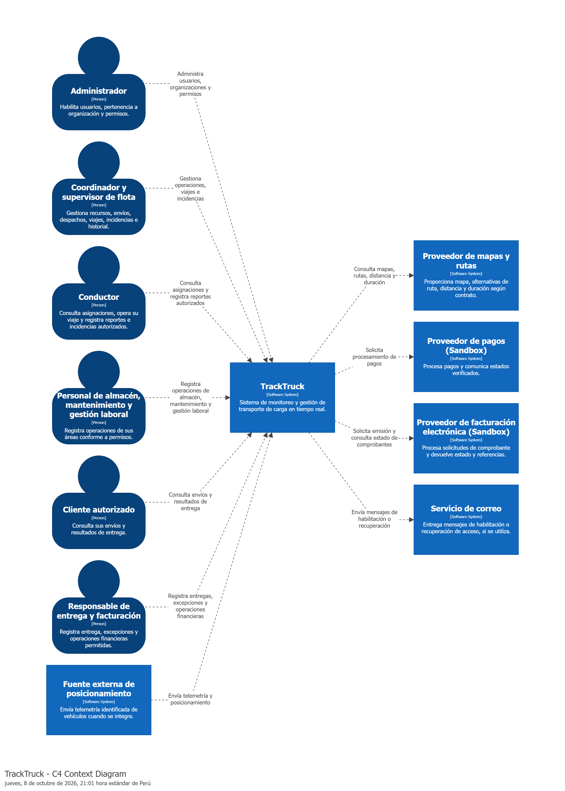

<div style="page-break-after: always;"></div>

### 4.1.4. Approach Driven ViewPoints Diagrams

Las vistas se organizan según la pregunta que responde cada una y se mantendrán consistentes con los contratos y el código del incremento.

| Vista | Elementos que representa | Criterio de revisión |
|---|---|---|
| C4 Context | TrackTruck, personas y sistemas externos. | Límite del sistema y accesos por actor. |
| C4 Containers | App Android, gateway, servicios C#, broker y almacenamiento por servicio. | Distinguir arquitectura objetivo y componentes realmente ejecutables del Sprint. |
| C4 Components | Componentes de un servicio: endpoints, handlers, agregados, repositorios y adaptadores. | Coherencia con las capas y dependencias del código. |
| UML Activity | Recepción, preparación, planificación, viaje y entrega, con alternativas y rechazos. | Las decisiones utilizan las reglas del propietario correspondiente. |
| UML State | Estados y transiciones de un agregado, especialmente Trip y Shipment. | No confundir fin del recorrido con confirmación de entrega. |
| UML Class | Agregados y Value Objects de cada contexto. | Los agregados de otros contextos se representan como referencias. |
| UML Sequence | Aprobación de despacho, inicio de viaje, ingestión de ubicación y cierre de entrega. | Separar llamadas síncronas, eventos, validación y reintentos. |
| Deployment | APK, APIs, contenedores, broker, datos y acceso a proveedores. | Puertos, configuración y endpoints coinciden con el entorno probado. |

<div style="page-break-after: always;"></div>

**Estados de Trip Execution:**

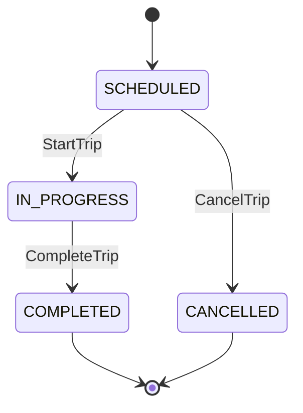
```mermaid
stateDiagram-v2
    [*] --> SCHEDULED
    SCHEDULED --> IN_PROGRESS: StartTrip
    SCHEDULED --> CANCELLED: CancelTrip
    IN_PROGRESS --> COMPLETED: CompleteTrip
    COMPLETED --> [*]
    CANCELLED --> [*]
```

Una interrupción durante IN_PROGRESS se registra como hecho operacional y puede solicitar una revisión del plan. La sustitución autorizada conserva el historial de asignación. Las restricciones y efectos de cada comando se comprueban en el backend.

<div style="page-break-after: always;"></div>

**Figuras del documento base que deben actualizarse:**


<div style="page-break-after: always;"></div>

### 4.1.5. Relational/Non Relational Database Diagram

Se propone persistencia relacional con PostgreSQL y EF Core para los servicios transaccionales. El modelo siguiente es un diseño inicial que se refinará mediante migraciones del servicio correspondiente. No se requiere una base no relacional para el incremento inicial; la necesidad de otra tecnología se justificará con carga y consultas observadas.

**Propiedad y referencias.** Cada servicio mantiene almacenamiento privado. Una clave foránea física se utiliza únicamente entre tablas del mismo servicio. Campos terminados en `_ref` representan identificadores de otro contexto: se validan mediante contratos y procesos de integración, sin claves foráneas ni acceso directo a su base. El mismo identificador de organización se propaga para aplicar aislamiento y autorización.

| Bounded context | Tablas propuestas | Campos principales y relaciones locales |
| --- | --- | --- |
| Identity & Access | users; roles; user_roles; refresh_sessions | users: id, organization_id_ref, email, password_hash, status. refresh_sessions: id, user_id FK local, token_hash, expires_at, revoked_at. |
| Customer Management | organizations; customers; customer_contacts | organization: id, name, contact. customer: id, organization_id FK local, name, document_reference, status. |
| Shipment Management | shipments; shipment_items | shipment: id, organization_id_ref, customer_id_ref, origin, destination, priority, status. item: id, shipment_id FK local, description, quantity, unit, weight_kg. |
| Warehouse Operations | warehouse_receipts; receipt_items; storage_locations; cargo_preparations | receipt: id, organization_id_ref, shipment_id_ref, received_at. item: id, receipt_id FK local, quantity, unit, location_id FK local. preparation: id, shipment_id_ref, status. |
| Fleet Management | drivers; vehicles | driver: id, organization_id_ref, employee_id_ref, user_id_ref opcional, full_name, license_number, phone, status. vehicle: id, organization_id_ref, plate, capacity_kg, status. |
| Maintenance Management | maintenance_orders; mileage_readings; vehicle_restrictions | order: id, vehicle_id_ref, type, status, scheduled_at, completed_at. reading: id, vehicle_id_ref, kilometers, recorded_at, source. restriction: id, vehicle_id_ref, reason, active. |
| Workforce Management | employees; labor_availability; labor_assignments | employee: id, organization_id_ref, user_id_ref opcional, name, status. availability: id, employee_id FK local, starts_at, ends_at, type. |
| Time & Attendance | work_sessions; work_intervals; break_intervals; overtime_entries | session: id, employee_id_ref, local_work_date, started_at, ended_at. interval: id, session_id FK local, starts_at, ends_at, classification. break: id, session_id FK local, starts_at, ends_at. overtime: intervalo local referenciado y estado de aprobación. |
| Driver Safety & Compliance | compliance_policies; driver_eligibility_evaluations | policy: id, organization_id_ref, version, parameters, effective_from. evaluation: id, driver_id_ref, requested_interval, eligible, reasons, evaluated_at, policy_version, inputs_version. |
| Dispatch Planning | dispatch_plans; plan_alternatives; resource_reservations; recommendation_evaluations | plan: id, shipment_id_ref, status, revision, approved_by_ref, approved_at. alternative: id, plan_id FK local, driver_id_ref, vehicle_id_ref, route_snapshot. reservation: recurso, intervalo y estado. evaluation: model_version, input_snapshot, predicted_value, explanation, mode. |
| Trip Execution | trips; trip_shipment_refs; trip_assignment_changes | trip: id, organization_id_ref, plan_id_ref, driver_id_ref, vehicle_id_ref, status, scheduled_at, started_at, completed_at, concurrency_version. shipment_ref: trip_id FK local y shipment_id_ref externo. |
| Tracking & Geolocation | trip_trackings; position_reports; tracking_stops | tracking: id, trip_id_ref, vehicle_id_ref, started_at, ended_at. report: id, tracking_id FK local, report_id, latitude, longitude, recorded_at, received_at, accuracy_m opcional. stop: id, tracking_id FK local, started_at, ended_at, reason. |
| Incident Management | incidents; incident_actions | incident: id, trip_id_ref, organization_id_ref, type, description, status, reported_at. action: id, incident_id FK local, action, recorded_at, actor_id_ref. |
| Delivery Management | deliveries; delivery_items; delivery_evidence | delivery: id, shipment_id_ref, trip_id_ref, status, delivered_at, receiver_reference. item: id, delivery_id FK local, quantity. evidence: id, delivery_id FK local, storage_reference, checksum. |
| Billing & Payments | quotes; charges; invoices; payment_transactions | quote: id, customer_id_ref, shipment_id_ref, amount, currency. invoice: id, charge_id FK local, type, provider_reference, status. payment: id, charge_id FK local, idempotency_key, provider_reference, status, amount. |
| Operational History | operational_events; operation_timelines | event: event_id, source, aggregate_id_ref, aggregate_version, occurred_at, received_at, correlation_id, organization_id_ref, payload. timeline: operación, última actualización y referencias. |
| Reporting & Analytics | operation_read_models; indicator_snapshots | read_model: organización, operación y campos proyectados. indicator: definición, período, value, calculated_at, source_checkpoint. |

<div style="page-break-after: always;"></div>

#### Relaciones y restricciones

- Identificadores UUID para entidades y referencias; cantidades y valores monetarios con precisión decimal y unidad o moneda explícita.
- Índices y unicidad según el propietario: placa y licencia por organización en Fleet; reportId por fuente/seguimiento en Tracking; eventId por consumidor; idempotencyKey en las operaciones definidas.
- Latitud entre −90 y 90, longitud entre −180 y 180 y tiempos de cierre mayores o iguales al inicio. Se conserva la precisión disponible del origen.
- Instantes en UTC mediante columnas compatibles; la jornada utiliza además fecha laboral y zona horaria de la organización para evaluar los límites por día.
- Las referencias entre Trip, Fleet, Shipment y Delivery no producen relaciones físicas entre sus bases. La aplicación valida referencias y conserva snapshots cuando necesita reconstruir decisiones históricas.
- Dispatch Planning aplica control transaccional de reservas en su propio almacenamiento para impedir intervalos incompatibles. Se revalida la información obligatoria al confirmar el plan y al iniciar el viaje.
- Cada servicio que publica eventos persiste el cambio y la salida Outbox en su misma transacción. Los consumidores registran Inbox o una clave deduplicadora propia antes de aplicar nuevamente un efecto.
- Concurrency tokens permiten detectar cambios simultáneos de agregados. Los conflictos se traducen a una respuesta controlada, sin sobrescribir silenciosamente cambios previos.
- El historial conserva los eventos relevantes para trazabilidad. Esto no exige reconstruir todos los agregados mediante Event Sourcing.

<div style="page-break-after: always;"></div>

#### Diagrama de base de datos

El diagrama mostrado es un modelo relacional conceptual y parcial del flujo de viajes y flota. No representa el `AppDbContext` completo de la API actual ni las bases separadas previstas para los 17 bounded contexts. La versión objetivo deberá elaborarse por contexto, identificar claves locales y referencias externas, y coincidir con las migraciones de cada servicio cuando estos sean implementados.


<div style="page-break-after: always;"></div>

### 4.1.6. Design Patterns

| Patrón | Aplicación y límite |
|---|---|
| Repository | Interfaces de persistencia de agregados; EF Core implementa el acceso sin trasladar entidades de base de otros contextos al dominio. |
| Adapter / Anti-Corruption Layer | Convierte contratos de mapas, pagos, facturación, IA y otros servicios a modelos propios. |
| Strategy | Intercambia recomendación asistida por IA y selección básica manteniendo el mismo filtro de elegibilidad. |
| Publish–Subscribe | Distribuye hechos de integración a los consumidores interesados. |
| Outbox / Inbox | Mantiene publicación recuperable y deduplicación en la integración asíncrona. |
| Idempotencia | Conserva el resultado de solicitudes repetidas y evita duplicar viajes, reservas, pagos o entregas. |
| Circuit Breaker y timeout | Limita fallas repetidas y espera máxima de proveedores; sus valores se registran en configuración. |
| Máquina de estados | Controla transiciones de Trip, Shipment, cargo y documentos según el agregado propietario. Su implementación se mantiene tan simple como permitan las reglas. |
| Modelos de lectura | Reporting y Operational History mantienen proyecciones autorizadas sin consultar bases ajenas. |

CQRS y Clean Architecture se utilizan para organizar responsabilidades y dependencias. Se reportarán como aplicados en código únicamente cuando existan las clases, configuraciones y pruebas que lo demuestren.

<div style="page-break-after: always;"></div>

### 4.1.7. Tactics

| Atributo | Táctica | Realización prevista | Evidencia necesaria |
|---|---|---|---|
| Disponibilidad | Detectar y aislar fallas | Health checks, timeouts y Circuit Breaker en adaptadores. | Falla controlada y recuperación registrada. |
| Disponibilidad | Mantener funciones degradadas | Tracking conserva reportes sin mapas; Dispatch usa fallback cuando hay datos obligatorios suficientes. | QAS01 y QAS05. |
| Rendimiento | Reducir trabajo de consultas | Paginación, índices por organización/viaje/fecha y proyecciones de lectura. | Medición de consulta y carga. |
| Rendimiento | Controlar recursos | Concurrencia y tamaño de lotes limitados en ingestión y consumidores. | QAS02 con parámetros de entorno. |
| Seguridad | Autenticar y autorizar | Validación de token, permisos, organización y pertenencia del recurso en cada servicio. | Casos 401/403 y acceso cruzado. |
| Seguridad | Reducir exposición | TLS, credenciales por entorno, hashing de secretos persistidos y registros sin tokens. | Revisión de configuración y pruebas pertinentes. |
| Interoperabilidad | Mantener contratos explícitos | OpenAPI para API; esquemas de eventos con versión, identificador, origen y correlación. | QAS04 y compatibilidad de consumidores. |
| Interoperabilidad | Aislar traducciones | ACL y Adapter para proveedores y modelos externos. | Pruebas de adaptador con respuestas válidas e inválidas. |
| Integridad y trazabilidad | Detectar duplicación y concurrencia | Outbox/Inbox, idempotencia, reservas y concurrency tokens. | QAS07 y reconstrucción por correlationId. |
| Explicabilidad y control de IA | Registrar entradas y procedencia | Versiones del modelo y reglas, criterios y responsable de aprobación. | QAS06 y evaluación del conjunto de prueba. |

<div style="page-break-after: always;"></div>


### 4.1.8. Product UI/UX Design Guidelines

Esta sección complementa el diseño arquitectónico con las guías de la landing page y de la aplicación móvil. Se adapta la organización de estilos, arquitectura de información, wireframes, wireflows, mock-ups y prototipado del documento de referencia [R14]. Las pantallas, permisos y flujos corresponden a TrackTruck y a sus 17 bounded contexts. La marca del producto es TrackTruck y la startup es LogiGo.

Los elementos siguientes constituyen la guía de diseño y los entregables previstos. Los wireframes, mock-ups, prototipos y capturas de implementación se incorporarán cuando estén disponibles; su descripción no acredita que ya hayan sido construidos o validados.

#### 4.1.8.1. General Style Guidelines

**Color.** Se adopta la paleta de la referencia para las interfaces de TrackTruck. Los colores se implementarán como tokens compartidos dentro de cada frontend, para mantener consistencia entre pantallas.

| Token | Color | Aplicación |
|---|---|---|
| Primary | `#F1F504` | Acciones principales, acentos e identificación de la sección activa. |
| PrimaryVariant | `#E0E200` | Variante para interacción y fondos de énfasis moderado. |
| TextPrimary | `#000000` | Texto, iconos principales y contraste sobre el amarillo. |
| Background | `#FFFFFF` | Fondo principal y superficies de lectura. |
| Neutral | `#D3D3D3` | Bordes, divisores y superficies secundarias; evitarlo para texto de lectura. |

Las confirmaciones, advertencias y errores combinarán texto, icono y color semántico. Cada combinación deberá comprobar su contraste. Un botón amarillo utilizará texto negro; el estado de un viaje o de un envío se expresará también con su nombre, de forma que pueda comprenderse sin distinguir colores.

**Typography.** Se conserva la distribución de familias de la referencia. Las fuentes se declararán en el tema de Compose y en los estilos de la landing; los tamaños móviles se expresarán en `sp` y los web en unidades relativas.

| Elemento | Familia y peso | Criterio de aplicación |
|---|---|---|
| Titulares | Roboto Regular / Light | Jerarquía clara; Light se reservará para titulares grandes con contraste suficiente. |
| Párrafos | Rubik Regular | Lectura de descripciones, instrucciones y detalles operativos. |
| Enlaces | Rubik Light Italic | Enlaces identificados también mediante subrayado o señal visual equivalente. |
| Campos de entrada | Open Sans Regular | Etiquetas visibles, valores y mensajes de ayuda. |
| Botones | Rubik Medium | Acciones con verbos claros y consistentes. |

<div style="page-break-after: always;"></div>

**Branding.** Se utilizarán el nombre y los recursos gráficos propios de TrackTruck/LogiGo. Las secciones de equipo mostrarán a los cinco integrantes registrados en 1.1.2. El logo, sus variantes y los archivos de fuente deberán quedar identificados en los recursos del proyecto.

**Spacing y Grid System.** Se toma el espaciado de referencia como base, adaptando `px/rem` a la web y `dp` a Android. La app admitirá desplazamiento vertical y crecimiento de texto; las fichas operativas no dependerán de una anchura fija.

| Elemento | Espaciado base |
|---|---|
| Padding vertical de botones | 12–16. |
| Padding horizontal de botones | 24–32. |
| Separación entre textos relacionados | 8–12. |
| Separación entre elementos | 16–20. |
| Separación entre secciones | 48–64 en landing; ajustar a la densidad de información de la app. |

La landing utilizará una grilla adaptable que pase de varias columnas a una columna en pantallas estrechas. La app agrupará información mediante tarjetas y listas; las acciones importantes deberán permanecer accesibles al abrir el teclado o ampliar el texto.

**Buttons.** El botón primario resalta la acción principal; el secundario permite cancelar, volver o consultar. Se representarán los estados habilitado, deshabilitado, foco, interacción y procesamiento. Durante una operación en curso se mostrará progreso y se evitarán envíos repetidos accidentales. La API seguirá aplicando idempotencia cuando corresponda.

**Input System.** Los formularios tendrán etiqueta, ayuda, valor y error identificables. Se utilizará el tipo de teclado apropiado para correo, teléfono, cantidades y números. La validación local ayuda al usuario; el backend conserva la validación definitiva y la autorización. Ante un error recuperable se preservarán los valores ingresados y se mostrará cómo continuar.

<div style="page-break-after: always;"></div>

#### 4.1.8.2. Information Architecture

La información se organiza de forma jerárquica para localizar funciones, secuencial para completar operaciones y tabular para comparar alternativas cuando el tamaño de pantalla lo permita. Los historiales se presentan cronológicamente; los recursos y clientes permiten orden alfabético y filtros por estado, fecha o identificación.

| Rol o función operativa | Agrupación de navegación | Contextos que respaldan las operaciones |
|---|---|---|
| Cliente autorizado | Mis envíos, seguimiento, entregas, documentos y pagos. | Customer, Shipment, Tracking, Delivery, Billing. |
| Coordinación logística | Envíos, almacén, planificación, viajes e incidencias. | Shipment, Warehouse, Dispatch, Trip, Incident. |
| Conductor | Viaje asignado, ruta, jornada, incidencias y confirmación de entrega. | Trip, Tracking, Time & Attendance, Incident, Delivery. |
| Administración operativa | Flota, mantenimiento, personal, jornadas y elegibilidad. | Fleet, Maintenance, Workforce, Time & Attendance, Compliance. |
| Administración comercial | Clientes, comprobantes, pagos e indicadores autorizados. | Customer, Billing, Reporting. |
| Funciones transversales | Cuenta, permisos, historial y reportes autorizados. | Identity, Operational History, Reporting. |

Estas agrupaciones sirven para diseñar pantallas; la autorización concreta se define en Identity & Access y se aplica en las APIs. Un usuario puede recibir varios permisos. Ocultar una opción en la app no reemplaza el control de acceso del backend.

**Labeling Systems.** Se utilizarán nombres de negocio comprensibles: “Envíos”, “Almacén”, “Flota”, “Mantenimiento”, “Jornada”, “Planificar despacho”, “Viajes”, “Incidencias”, “Entregas”, “Comprobantes” e “Historial”. Los nombres técnicos de microservicios, eventos o modelos permanecerán en la documentación de desarrollo.

**Searching Systems.** Las listas operativas incorporarán búsqueda y filtros pertinentes: envío o viaje por identificador; vehículo por placa; conductor por nombre; historial por fecha y estado. Cada consulta mostrará resultados, estado vacío, carga y error. Se conservarán los filtros al regresar desde un detalle. El mapa y la última ubicación incluirán fecha de captura y estado de actualización.

**Navigation Systems.** La landing enlaza sus secciones mediante navegación visible. La app presenta las funciones de mayor frecuencia según permisos y mantiene una ruta clara de regreso. Las operaciones extensas separan consulta, edición y confirmación; los errores recuperables permitirán continuar sin perder información.

**SEO y metadatos.** El título HTML, la descripción, la jerarquía de encabezados y los textos alternativos se aplican a la landing. La app nativa utiliza nombre, descripción, recursos de publicación y etiquetas de accesibilidad; su navegación no depende de etiquetas HTML.

<div style="page-break-after: always;"></div>

#### 4.1.8.3. Landing Page UI Design

**Landing Page Wireframe.** Se conserva la estructura de cinco secciones de la referencia, con contenido propio de TrackTruck.

| Sección | Contenido de TrackTruck | Acción o propósito |
|---|---|---|
| Inicio | Nombre del producto y propuesta de valor para coordinar el transporte de carga. | Acceder a información de la app o solicitar una demostración, según el mecanismo que implemente el equipo. |
| Servicio | Envíos, planificación asistida, seguimiento, incidencias y entrega; distinguir funciones implementadas de las previstas. | Comprender el servicio y consultar sus beneficios. |
| Sobre nosotros | Descripción de LogiGo y del problema que aborda. | Presentar la startup y el objetivo del proyecto. |
| Integrantes | Los cinco integrantes del informe original. | Mostrar los perfiles autorizados del equipo. |
| Contáctanos | Información de contacto verificada y formulario, si se implementa. | Consultar sobre el servicio y recibir confirmación del envío. |

La página incluirá cabecera, navegación y pie; sus imágenes tendrán descripción y sus textos mantendrán una jerarquía legible. La implementación deberá funcionar con teclado y en diferentes anchuras. Un formulario de contacto deberá informar carga, éxito y error de acuerdo con su comportamiento real.

**Landing Page Mock-up.** El mock-up aplicará la paleta, tipografías, grilla y estados de componentes de 4.1.8.1 al wireframe aprobado. El documento registrará enlace o archivo, versión y fecha. Las imágenes y cifras del servicio deberán corresponder a recursos autorizados y resultados verificables.

**Pendiente:** wireframe y mock-up desktop/mobile, recursos gráficos, enlace de diseño y capturas de la landing implementada. La landing presenta el producto; las funciones operativas del frontend requerido se implementan en la aplicación móvil.

<div style="page-break-after: always;"></div>

#### 4.1.8.4. Mobile Applications UX/UI Design

**Mobile Applications Wireframes.** Se toma de la referencia la separación de pantallas de acceso, operación y consulta. El catálogo se adapta a las historias de TrackTruck y se implementará por incrementos.

| Grupo de pantallas | Contenido requerido | Relación con la arquitectura |
|---|---|---|
| Acceso y cuenta | Inicio de sesión, recuperación y gestión de cuenta según el alcance; mensajes de credenciales inválidas y sesión vencida. | Identity & Access. |
| Clientes y envíos | Datos del cliente, creación/consulta del envío, carga y estado. | Customer y Shipment. |
| Almacén | Recepción, preparación y salida, con cantidades y estados visibles. | Warehouse Operations. |
| Recursos | Conductores, vehículos, mantenimiento, personal y disponibilidad. | Fleet, Maintenance y Workforce. |
| Jornada y elegibilidad | Horas registradas, descansos y resultado de restricciones operativas. | Time & Attendance y Driver Safety & Compliance. |
| Planificación | Alternativas de conductor, vehículo y ruta; prioridad, duración estimada y motivos; aprobación autorizada. | Dispatch Planning, con IA interna y reglas obligatorias. |
| Viaje y mapa | Viaje asignado, inicio, estado, posición actualizada y reportes pendientes de sincronización. | Trip Execution y Tracking & Geolocation. |
| Incidencia y entrega | Registro de incidencia, atención, cantidades entregadas, resultado y evidencia. | Incident y Delivery. |
| Documentos y consulta | Comprobantes, pagos, historial e indicadores visibles según permisos. | Billing, Operational History y Reporting. |

**Mobile Applications Wireflow Diagrams.** Cada wireflow combinará pantallas y decisiones. Para coordinación: envío preparado → solicitud de alternativas → revisión → aprobación o ajuste → viaje programado. Para conductor: viaje asignado → inicio → seguimiento y posibles incidencias → finalización del recorrido y registro de entrega correspondiente. Para cliente: consulta de envío → detalle → seguimiento, evidencia y documentos autorizados. El diagrama representará también falta de recursos aptos, conflicto de reserva, sesión vencida y desconexión.

**Mobile Applications Mock-ups.** Los mock-ups aplicarán el tema de TrackTruck a las pantallas priorizadas. Se documentarán estados normal, carga, vacío, validación, error, procesamiento y sin conexión. La UI mostrará la última fecha de ubicación; una lectura antigua no se presentará como información actual. Las recomendaciones de IA se mostrarán como alternativas que requieren aprobación.

**Mobile Applications User Flow Diagrams.** Los flujos describirán el objetivo, actor, precondiciones, decisiones, recuperación y resultado. Las funciones de inicio/finalización de viaje, confirmación de entrega y aprobación de despacho mostrarán sus consecuencias antes de confirmar. La finalización del recorrido y la entrega mantienen sus responsabilidades y estados propios.

**Pendiente:** archivos y enlaces de wireframes, wireflows, mock-ups y user flows; versión, historias cubiertas y revisión de consistencia con permisos y contratos. El diseño de pantallas no modifica la propiedad de datos de los bounded contexts.

<div style="page-break-after: always;"></div>

#### 4.1.8.5. Mobile Applications Prototyping

Se elaborará un prototipo navegable de los flujos comprometidos para el incremento. La revisión comprobará que el usuario identifica la acción principal, entiende el estado, puede corregir errores y distingue una operación pendiente de otra confirmada. La aceptación del prototipo se registrará por tarea y observación; las pruebas de sistema de 5.1.1 comprobarán posteriormente la app conectada al backend.

**Registro por completar:** herramienta, enlace accesible, versión/fecha, pantallas e historias incluidas, participantes, tareas, observaciones, ajustes y resultado de revisión. Los participantes y resultados se incorporarán desde actividades reales del equipo.

<div style="page-break-after: always;"></div>

## 4.2. Architectural Drivers

Los drivers arquitectónicos de TrackTruck orientan las decisiones de diseño según los objetivos del negocio, las funcionalidades requeridas y los atributos de calidad prioritarios: disponibilidad, interoperabilidad, rendimiento y seguridad.

### 4.2.1. Design Purpose

El propósito del diseño es establecer una arquitectura implementable para la app móvil y los servicios C# de TrackTruck, organizada en los 17 bounded contexts y comprobable mediante pruebas e incrementos desplegados.

La arquitectura debe sostener tanto el flujo operacional mínimo como su ampliación progresiva: cliente y envío, preparación de carga, planificación con recursos elegibles, ejecución y seguimiento, incidencias, entrega y cierre financiero e histórico. La IA apoya la recomendación y las reglas obligatorias y la aprobación autorizada controlan el despacho.

| Driver de negocio | Resultado esperado | Relación con el diseño |
|---|---|---|
| BD01 — Visibilidad | Consultar estado de envío y viaje y antigüedad de la ubicación. | Shipment, Trip, Tracking y app móvil. |
| BD02 — Continuidad y seguridad operacional | Considerar jornada, descanso, disponibilidad y aptitud técnica antes de asignar. | Workforce, Time & Attendance, Compliance, Maintenance y Dispatch. |
| BD03 — Trazabilidad | Reconstruir decisiones, recorrido, incidencias y entrega. | Eventos de integración y Operational History. |
| BD04 — Eficiencia de coordinación | Reducir consultas dispersas y esfuerzo de planificación. | Contratos entre contextos y recomendación asistida por IA. |
| BD05 — Control del cierre | Relacionar entrega, cargo, comprobante y pago. | Delivery, Shipment y Billing & Payments. |

Las metas de negocio se medirán durante el piloto. Los objetivos de calidad de 4.2.3 son condiciones de prueba y no resultados obtenidos.

<div style="page-break-after: always;"></div>

### 4.2.2. Primary Functionality (Primary User Stories)

Las PUS agrupan historias existentes para identificar su influencia arquitectónica. La trazabilidad se conserva mediante los identificadores US de 3.2; las PUS no sustituyen ni duplican historias del backlog.

| Código | Funcionalidad y US relacionadas | Impacto arquitectónico |
|---|---|---|
| PUS01 | Acceso y permisos: US46–US52. | Identity & Access, autorización en cada servicio y manejo de sesión móvil. |
| PUS02 | Organización, cliente y envío: US01–US02, US53–US55. | Propiedad diferenciada de datos y consulta limitada al cliente autorizado. |
| PUS03 | Recepción y preparación: US56–US57. | Warehouse informa CargoPrepared; Shipment publica disponibilidad de envío. |
| PUS04 | Flota, mantenimiento y kilometraje: US03–US08, US23–US24, US58–US59. | Fichas operativas y condición técnica en propietarios distintos. |
| PUS05 | Personal, disponibilidad, jornada y elegibilidad: US60–US65. | Datos laborales y evaluación versionada para la asignación. |
| PUS06 | Planificación y recomendación: US09, US11–US12, US25, US66–US70. | Dispatch, IA interna, proveedor de rutas, reservas, fallback y aprobación. |
| PUS07 | Registro y ejecución de viaje: US10, US13, US17, US26–US29, US71. | Estados de Trip, plan aprobado e integración de inicio/finalización. |
| PUS08 | Seguimiento y paradas: US14–US16, US30–US34, US72–US73. | Ingestión, deduplicación, fechas, persistencia móvil y actualización de ubicación. |
| PUS09 | Incidencias y contacto: US18–US20, US35–US38. | Incident, consulta de asignación y datos de contacto, marcador móvil. |
| PUS10 | Entrega y cierre financiero: US74–US78. | Delivery, Shipment, Billing y adaptadores de pago/facturación. |
| PUS11 | Historial y análisis: US21–US22, US39–US45, US79–US80. | Proyecciones propias, consumidores idempotentes e indicadores definidos. |

<div style="page-break-after: always;"></div>

### 4.2.3. Quality Attribute Scenarios

Los escenarios utilizan fuente, estímulo, ambiente, artefacto, respuesta y medida. Disponibilidad, rendimiento, seguridad e interoperabilidad son los atributos prioritarios; se añaden escenarios sobre IA, concurrencia, continuidad móvil y trazabilidad por su impacto en el alcance. Todas las medidas son objetivos iniciales de prueba y requieren un informe con versión y condiciones de ejecución.

#### QAS01: Disponibilidad

| Parte | Descripción |
| --- | --- |
| Fuente de estímulo | Proveedor de mapas y rutas |
| Estímulo | Deja de responder durante una operación. |
| Medioambiente | Viajes en curso y reportes GPS válidos llegando al backend. |
| Artefacto | Adaptador externo y Tracking. |
| Respuesta | Se informa indisponibilidad del mapa sin detener la persistencia de reportes. |
| Medida de respuesta | Respuesta controlada de falla en máximo 5 s; todos los reportes válidos aceptados por la API durante una interrupción de 10 min quedan persistidos sin duplicación. |

#### QAS02: Rendimiento

| Parte | Descripción |
| --- | --- |
| Fuente de estímulo | 100 fuentes de ubicación |
| Estímulo | Cada fuente envía un reporte cada 10 s. |
| Medioambiente | Carga controlada durante 30 min; infraestructura y versión registradas. |
| Artefacto | Ingestión y consulta de Tracking. |
| Respuesta | Valida, persiste y deja consultables los reportes. |
| Medida de respuesta | Al menos 95 % de reportes queda disponible para consulta en ≤ 3 s desde su recepción en el servidor; registrar errores, percentiles y volumen efectivo. |

#### QAS03: Seguridad

| Parte | Descripción |
| --- | --- |
| Fuente de estímulo | Usuario sin el permiso requerido o de otra organización |
| Estímulo | Solicita una operación o dato protegido. |
| Medioambiente | Cuentas y recursos de prueba de dos organizaciones. |
| Artefacto | API protegidas e Identity & Access. |
| Respuesta | Rechaza la solicitud sin modificar ni revelar el recurso protegido. |
| Medida de respuesta | 100 % de los casos de acceso ajeno y permisos insuficientes se rechaza; credenciales ausentes o inválidas producen 401, y permiso insuficiente 403 según contrato. |

<div style="page-break-after: always;"></div>

#### QAS04: Interoperabilidad

| Parte | Descripción |
| --- | --- |
| Fuente de estímulo | App Android y fuente de posición |
| Estímulo | Envían solicitudes y reportes según contrato; también envían entradas inválidas. |
| Medioambiente | Versiones de contrato registradas y entorno de integración. |
| Artefacto | OpenAPI, endpoint de ingestión y adaptador. |
| Respuesta | Acepta entradas válidas y rechaza las inválidas con error documentado. |
| Medida de respuesta | 100/100 reportes válidos conservan identidad, coordenadas y recordedAt; el conjunto inválido se rechaza sin persistir datos incorrectos. |

#### QAS05: Disponibilidad de planificación

| Parte | Descripción |
| --- | --- |
| Fuente de estímulo | Motor de recomendación de IA |
| Estímulo | Falla o supera su tiempo máximo. |
| Medioambiente | Existe información obligatoria suficiente y recursos elegibles. |
| Artefacto | Dispatch Planning y Strategy. |
| Respuesta | Activa la estrategia básica, identifica el modo y conserva las validaciones. |
| Medida de respuesta | En los casos preparados, entrega alternativa básica en ≤ 5 s y ninguna utiliza recursos inválidos; si faltan datos críticos no autoriza el plan. |

#### QAS06: Control y trazabilidad de IA

| Parte | Descripción |
| --- | --- |
| Fuente de estímulo | Coordinador de operaciones |
| Estímulo | Solicita y aprueba una recomendación. |
| Medioambiente | Modelo, datos y reglas identificados; conjunto de evaluación separado. |
| Artefacto | Planning Recommendation Engine y registro del plan. |
| Respuesta | Registra resultado del modelo, criterios, entradas relevantes, versiones y aprobación. |
| Medida de respuesta | Todas las recomendaciones aprobables respetan restricciones en los casos de prueba. La evaluación del modelo registra MAE en minutos y comparación con la línea base; objetivo inicial: mejorar esa línea base antes de aceptar el componente como útil. |

<div style="page-break-after: always;"></div>

#### QAS07: Integridad y concurrencia

| Parte | Descripción |
| --- | --- |
| Fuente de estímulo | Dos solicitudes concurrentes y reintentos |
| Estímulo | Intentan aprobar planes que reservan el mismo recurso en intervalos superpuestos. |
| Medioambiente | Servicios operativos y persistencia de Dispatch disponible. |
| Artefacto | Reservas y handlers de aprobación. |
| Respuesta | Confirma una reserva, rechaza la incompatible y conserva resultados idempotentes. |
| Medida de respuesta | Una sola reserva incompatible se confirma; la otra recibe 409 según contrato. Reenviar la misma clave recupera el resultado sin duplicarlo. |

#### QAS08: Continuidad móvil

| Parte | Descripción |
| --- | --- |
| Fuente de estímulo | Dispositivo Android con permisos concedidos |
| Estímulo | Pierde conexión, conserva reportes y recupera conexión con la app en primer plano. |
| Medioambiente | Veinte reportes identificados; captura autorizada durante el viaje. |
| Artefacto | Persistencia local y sincronización con Tracking. |
| Respuesta | Conserva y reenvía reportes con reportId y recordedAt originales. |
| Medida de respuesta | 20/20 reportes válidos llegan una sola vez en efecto al backend dentro de 60 s del reintento activo; la fecha de captura determina la última posición. Se documenta aparte el comportamiento permitido en segundo plano. |

#### QAS09: Trazabilidad

| Parte | Descripción |
| --- | --- |
| Fuente de estímulo | Responsable de operaciones |
| Estímulo | Consulta una operación que produjo eventos en varios servicios. |
| Medioambiente | Conjunto de diez eventos controlados, procesados por consumidores. |
| Artefacto | Operational History y registros correlacionados. |
| Respuesta | Reconstruye los hechos y su origen mediante identificadores y secuencias. |
| Medida de respuesta | Los diez eventos son consultables sin duplicados con eventId, origen, occurredAt y correlationId; los logs no incluyen contraseñas ni tokens completos. |

<div style="page-break-after: always;"></div>

### 4.2.4. Constraints

| Código | Restricción o decisión vigente | Implicación |
|---|---|---|
| CON01 | Backend implementado en C#, según la rectificación del alcance. | Se adopta ASP.NET Core y un SDK .NET con soporte; código, ejecución y pruebas corresponden a esa implementación. |
| CON02 | Frontend mediante app móvil. | Se adopta Android con Kotlin y Jetpack Compose como elección del proyecto; se entrega un APK identificable y el flujo integrado. |
| CON03 | Pruebas de software del incremento. | Se ejecutan pruebas de dominio, API/integración, app y flujo end-to-end pertinentes; el informe conserva sus resultados reales. |
| CON04 | Despliegue y documentación del incremento implementado. | Se registra entorno, versión, servicios, configuración reproducible y evidencia de ejecución. |
| CON05 | API y eventos con contratos explícitos. | REST/JSON y OpenAPI para HTTP; esquemas y versiones para eventos. |
| CON06 | Autonomía de persistencia. | Datos privados del servicio, migraciones propias y referencias externas sin FK entre bases. |
| CON07 | Acceso según rol, organización y recurso. | Autorización en cada servicio además de los controles de la app y gateway. |
| CON08 | IA como capacidad de Dispatch Planning. | Modelo y evaluación identificados; filtro obligatorio, explicación, aprobación humana y fallback. |
| CON09 | Reglas laborales del caso. | Se modelan 8 h ordinarias y un límite total de 14 h al día como reglas configurables del producto. Las adicionales se registran separadas y los descansos se planifican. |
| CON10 | Control de versiones del equipo. | Repositorios identificables, GitFlow, Conventional Commits, versiones y trazabilidad por historia. |
| CON11 | Condiciones de integración externa y Android. | Se respetan contratos, permisos de ubicación y restricciones del sistema operativo; las fuentes simuladas y sandbox se identifican. |

CON09 refleja los parámetros del caso de estudio y no establece una equivalencia con límites legales. Driver Safety & Compliance conserva la política aplicable y su versión. Time & Attendance conserva las horas ordinarias, adicionales y descansos; el total trabajado utiliza ambos tipos de horas para evaluar elegibilidad. El cálculo de planilla y pago de remuneraciones requiere su proceso propio, distinto de Billing & Payments del servicio logístico.

<div style="page-break-after: always;"></div>

### 4.2.5. Architectural Concerns

| Código | Preocupación | Orientación y comprobación |
|---|---|---|
| AC01 | Falla de proveedor de mapas, pagos o IA. | Adaptadores, timeout, Circuit Breaker y respuesta controlada; QAS01 y QAS05. |
| AC02 | Aumento de carga de posicionamiento. | Índices, ingestión con recursos limitados y medición de QAS02. |
| AC03 | Acceso por rol o a otra organización. | Autorización de recurso en API y pruebas de QAS03. |
| AC04 | Reportes y eventos repetidos o fuera de orden. | Identificadores, fechas de captura, secuencia del agregado e Inbox; QAS04 y QAS09. |
| AC05 | Cambios de proveedor o contrato. | ACL, versionado y pruebas de adaptador y contrato. |
| AC06 | Elegibilidad desactualizada entre propuesta y aprobación. | Registrar vigencia y fuentes; revalidar datos críticos al aprobar e iniciar. |
| AC07 | Reservas simultáneas y consistencia entre servicios. | Reserva transaccional en Dispatch, idempotencia y compensación de fallos del flujo; QAS07. |
| AC08 | Datos insuficientes o evaluación inadecuada de IA. | Dataset identificado, separación de entrenamiento y evaluación, baseline, métricas y modo básico explícito. |
| AC09 | Captura móvil afectada por permisos, batería o conectividad. | Estado visible, almacenamiento autorizado de reportes y pruebas en dispositivo; QAS08. |
| AC10 | Confundir viaje completado con envío entregado. | Trip y Delivery conservan estados propios; Shipment actualiza su estado con eventos de entrega. |
| AC11 | Alcance empresarial excesivo para los Sprints. | Mantener arquitectura objetivo y acordar historias de cada incremento con capacidad y evidencia. |
| AC12 | Declarar un patrón o resultado sin implementación comprobable. | Vincular clases, commits, pruebas y ejecución; mantener pendientes los datos no disponibles. |

<div style="page-break-after: always;"></div>

## 4.3. ADD Iterations

Se aplica ADD mediante cinco iteraciones de diseño. Cada una selecciona drivers, refina elementos, define conceptos, responsabilidades e interfaces y establece criterios de revisión. Las iteraciones ADD refinan la arquitectura; los Sprints implementan incrementos de software y no tienen una correspondencia uno a uno con ellas.

Las vistas y decisiones siguientes constituyen diseño documentado. Sus diagramas, revisiones, tableros y realización en código se completarán con evidencia del equipo. Se conservan los temas logísticos del informe y se alinean con C#, app móvil, pruebas y los 17 contextos.
### 4.3.1. Iteration 1: Global System Structure

Definir la estructura global del producto, su frontend móvil, backend C# y mecanismos de integración, identificando los 17 bounded contexts y un flujo implementable por incrementos.

#### 4.3.1.1. Architectural Design Backlog 1

| ID | Trabajo de diseño | Drivers relacionados | Prioridad |
| --- | --- | --- | --- |
| ADB01 | Delimitar los 17 contextos y su lenguaje | PUS01–PUS11; BD01–BD05 | Alta |
| ADB02 | Definir propietarios de modelos, reglas y datos | CON06; AC10 | Alta |
| ADB03 | Definir relaciones, contratos y eventos entre contextos | QAS04; AC04 | Alta |
| ADB04 | Definir servicios C# y estructura Clean Architecture/CQRS | CON01; CON04 | Alta |
| ADB05 | Definir REST, broker y publicación Outbox/consumo idempotente | QAS01; QAS04; QAS07 | Alta |
| ADB06 | Definir adaptadores de mapas, posicionamiento, pagos y facturación | AC01; AC05; CON11 | Alta |
| ADB07 | Definir Identity & Access y acceso móvil por rol y organización | PUS01; QAS03 | Alta |
| ADB08 | Definir almacenamiento privado y referencias entre servicios | CON06; QAS07 | Alta |
| ADB09 | Definir trazabilidad, vistas C4/UML y comprobación por incremento | QAS09; CON03; CON04 | Alta |

#### 4.3.1.2. Establish Iteration Goal by Selecting Drivers

Establecer un mapa coherente de responsabilidades, aplicaciones, servicios y contratos que permita implementar el primer incremento protegido y mantener una arquitectura objetivo con crecimiento gradual.

| Tipo | Drivers seleccionados |
| --- | --- |
| Funcionalidad | PUS01–PUS11: ciclo logístico completo y acceso por rol. |
| Calidad prioritaria | QAS01–QAS04: disponibilidad, rendimiento, seguridad e interoperabilidad. |
| Calidad complementaria | QAS07–QAS09: integridad, continuidad móvil y trazabilidad. |
| Restricciones | CON01–CON08: C#, app móvil, pruebas, despliegue, contratos y datos privados. |
| Preocupaciones | AC03, AC04, AC11 y AC12: aislamiento, duplicación, capacidad y evidencia. |

<div style="page-break-after: always;"></div>

#### 4.3.1.3. Choose One or More Elements of the System to Refine

Se refina TrackTruck como sistema y se separan sus modelos según las siguientes capacidades. Estas definiciones son la referencia del resto del informe.

| Código | Bounded context | Responsabilidad | Límite principal |
| --- | --- | --- | --- |
| BC01 | Identity & Access | Usuarios, credenciales, pertenencia, roles, permisos y sesiones. | No administra fichas laborales, flota ni clientes del servicio. |
| BC02 | Customer Management | Organizaciones usuarias y clientes del servicio logístico. | Distingue la organización propietaria del cliente remitente o contratante. |
| BC03 | Shipment Management | Envíos, cargas y solicitudes de transporte hasta su entrega. | Es propietario del estado del envío y consume resultados de almacén, viaje y entrega. |
| BC04 | Warehouse Operations | Recepción, ubicación, almacenamiento, preparación y salida de mercancía. | Conserva cantidades físicas y operaciones de almacén; informa preparación al contexto de envíos. |
| BC05 | Fleet Management | Fichas operativas de conductores y vehículos y estado administrativo. | La elegibilidad laboral y condición de mantenimiento tienen propietarios distintos. |
| BC06 | Maintenance Management | Mantenimiento preventivo y correctivo, kilometraje y aptitud técnica. | Publica restricciones del vehículo; no asigna recursos a viajes. |
| BC07 | Workforce Management | Empleados, relación operativa, asignaciones laborales y disponibilidad. | Mantiene el calendario laboral; Dispatch Planning conserva las reservas de despacho. |
| BC08 | Time & Attendance | Jornadas, intervalos trabajados, descansos y horas adicionales. | Registra hechos y clasificaciones de tiempo; Compliance evalúa las restricciones operativas. |
| BC09 | Driver Safety & Compliance | Políticas operativas y evaluación de elegibilidad del conductor. | Utiliza jornada y disponibilidad y devuelve decisión, motivos y versión de reglas. |
| BC10 | Dispatch Planning | Alternativas de conductor, vehículo y ruta, recomendaciones de IA, reservas y aprobación. | Aplica restricciones antes de recomendar y revalida antes de aprobar; conserva revisiones del plan. |
| BC11 | Trip Execution | Inicio, ejecución, estados, cambios autorizados y finalización del viaje. | Conserva una referencia al plan aprobado; el fin del recorrido y la entrega del envío son hechos distintos. |
| BC12 | Tracking & Geolocation | Reportes de ubicación, última posición conocida, recorrido y paradas. | Registra fecha de captura y recepción; no administra incidencias ni aprueba recursos. |
| BC13 | Incident Management | Incidencias, emergencias, clasificación, atención y resolución operativa. | Puede iniciar una solicitud de replanificación; no modifica directamente el viaje. |
| BC14 | Delivery Management | Confirmación, cantidades, recepción y evidencia de entrega y sus excepciones. | Publica resultados para actualizar el envío; no emite facturas. |
| BC15 | Billing & Payments | Precios, cotizaciones, cargos, pagos, boletas, facturas y comprobantes. | Gestiona ingresos del servicio logístico; la liquidación de horas laborales se deriva al proceso de planilla. |
| BC16 | Operational History | Historial consolidado de eventos relevantes de una operación. | Construye una proyección consultable y conserva el origen; cada contexto mantiene sus datos fuente. |
| BC17 | Reporting & Analytics | Indicadores, reportes y análisis operacional. | Consume eventos o contratos y construye sus propios modelos de lectura. |

Fleet conserva la ficha del conductor; Workforce su relación laboral y disponibilidad; Time & Attendance los intervalos de tiempo; Compliance la evaluación de elegibilidad. La IA queda como componente de Dispatch Planning. No se añade un contexto independiente de IA, Profiles o Route Planning a esta versión del mapa.

<div style="page-break-after: always;"></div>

#### 4.3.1.4. Choose One or More Design Concepts That Satisfy the Selected Drivers

| Concepto | Aplicación |
| --- | --- |
| DDD | Definir los límites del lenguaje y reglas por contexto. |
| Microservicios | Proponer unidades desplegables independientes, reflejando solo las implementadas en la vista del Sprint. |
| Clean Architecture y CQRS | Separar Domain, Application, Infrastructure y API; commands y queries en Application. |
| MVVM y flujo unidireccional | Organizar la app Android por estados, casos de uso y repositorios. |
| REST y OpenAPI | Definir solicitudes, respuestas, errores y autorización explícitos. |
| Eventos y Outbox/Inbox | Propagar hechos persistidos, recuperar publicación y deduplicar consumidores. |
| Almacenamiento privado | Evitar bases compartidas y claves foráneas entre servicios. |
| Adapter / ACL | Aislar proveedores y contratos externos. |
| Gateway y autorización de servicio | Centralizar entrada y conservar validación de acceso en cada API. |

<div style="page-break-after: always;"></div>

#### 4.3.1.5. Instantiate Architectural Elements, Allocate Responsibilities, and Define Interfaces

| Elemento propuesto | Contexto/capa | Responsabilidad | Interfaces propuestas |
| --- | --- | --- | --- |
| IdentityService | Identity & Access | Usuarios, credenciales, pertenencia, roles, permisos y sesiones. | POST /api/v1/auth/login; /refresh; /logout; GET/POST /api/v1/users; roles y permisos. |
| CustomerService | Customer Management | Organizaciones usuarias y clientes del servicio logístico. | GET/POST /api/v1/organizations; GET/POST /api/v1/customers. |
| ShipmentService | Shipment Management | Envíos, cargas y solicitudes de transporte hasta su entrega. | GET/POST /api/v1/shipments; GET /api/v1/shipments/{id}; comando de disponibilidad. |
| WarehouseService | Warehouse Operations | Recepción, ubicación, almacenamiento, preparación y salida de mercancía. | POST /api/v1/warehouse/receipts; POST /api/v1/warehouse/preparations. |
| FleetService | Fleet Management | Fichas operativas de conductores y vehículos y estado administrativo. | GET/POST /api/v1/drivers; GET/POST /api/v1/vehicles; actualización autorizada. |
| MaintenanceService | Maintenance Management | Mantenimiento preventivo y correctivo, kilometraje y aptitud técnica. | GET/POST /api/v1/maintenance/orders; POST /api/v1/maintenance/mileage; consulta de aptitud. |
| WorkforceService | Workforce Management | Empleados, relación operativa, asignaciones laborales y disponibilidad. | GET/POST /api/v1/workforce/employees; calendario de disponibilidad. |
| TimeAttendanceService | Time & Attendance | Jornadas, intervalos trabajados, descansos y horas adicionales. | POST /api/v1/attendance/sessions; /breaks; /overtime; consulta de jornada. |
| DriverComplianceService | Driver Safety & Compliance | Políticas operativas y evaluación de elegibilidad del conductor. | POST /api/v1/compliance/eligibility-evaluations; consulta de política vigente. |
| DispatchPlanningService | Dispatch Planning | Alternativas de conductor, vehículo y ruta, recomendaciones de IA, reservas y aprobación. | POST /api/v1/dispatch/plans; /recommendations; /{id}/approval; /{id}/revisions. |
| TripExecutionService | Trip Execution | Inicio, ejecución, estados, cambios autorizados y finalización del viaje. | GET/POST /api/v1/trips; POST /api/v1/trips/{id}/start; /completion; /cancellation. |
| TrackingService | Tracking & Geolocation | Reportes de ubicación, última posición conocida, recorrido y paradas. | POST /api/v1/tracking/positions; GET /api/v1/tracking/trips/{tripId}; actualización de motivo de parada. |
| IncidentService | Incident Management | Incidencias, emergencias, clasificación, atención y resolución operativa. | GET/POST /api/v1/incidents; acciones y resolución autorizadas. |
| DeliveryService | Delivery Management | Confirmación, cantidades, recepción y evidencia de entrega y sus excepciones. | POST /api/v1/deliveries; GET /api/v1/deliveries/{id}; evidencia y resultado. |
| BillingService | Billing & Payments | Precios, cotizaciones, cargos, pagos, boletas, facturas y comprobantes. | POST /api/v1/billing/quotes; /invoices; /payments; callback verificado. |
| OperationalHistoryService | Operational History | Historial consolidado de eventos relevantes de una operación. | GET /api/v1/history/operations/{id}; consumidores de eventos. |
| ReportingService | Reporting & Analytics | Indicadores, reportes y análisis operacional. | GET /api/v1/reports/operations; indicadores y filtros autorizados. |
| Android App | Frontend móvil | Pantallas, estado, captura autorizada y sincronización. | API por HTTPS y repositorio local. |
| API Gateway | Infraestructura | Entrada, enrutamiento y políticas generales. | Rutas de los servicios publicados. |
| Event Broker | Infraestructura | Distribuir eventos y conservar mensajes según configuración. | Publish–Subscribe y reintentos definidos. |

Los endpoints son contratos iniciales para refinar en OpenAPI; no establecen que ya estén publicados. Commands, queries y sus handlers pertenecen a Application. Ningún servicio escribe en la base de otro. Los envelopes de integración conservan eventId, schemaVersion, occurredAt, source, aggregateId, aggregateVersion, organizationId y correlationId.

| Relación | Mecanismo | Propietario del resultado |
| --- | --- | --- |
| Identity → API y app | Autenticación y autorización | Identity conserva cuentas; cada servicio verifica acceso. |
| Warehouse → Shipment → Dispatch | CargoPrepared y ShipmentReadyForDispatch | Cada servicio cambia su propio estado. |
| Fleet / Workforce / Attendance / Compliance / Maintenance → Dispatch | Consultas y hechos de cambio | Dispatch conserva el plan y reservas, fuentes conservan datos. |
| Dispatch → Trip | Consulta/contrato de plan aprobado y evento de aprobación | Trip valida y registra el viaje mediante comando idempotente. |
| Trip → Tracking | TripStarted y TripCompleted | Tracking controla su stream y reportes. |
| Delivery → Shipment / Billing | Resultado de entrega y datos del servicio | Shipment y Billing aplican sus reglas respectivas. |
| Contextos → History / Reporting | Eventos y proyecciones | Cada consumidor mantiene su lectura privada. |

<div style="page-break-after: always;"></div>

#### 4.3.1.6. Sketch Views (C4 & UML) and Record Design Decisions

| Vista | Archivo previsto | Contenido a revisar |
| --- | --- | --- |
| Bounded Context Map | assets/images/chapter4/iteration1-bounded-context-map.png | 17 contextos, propietarios y relaciones de colaboración. |
| C4 Containers | assets/images/chapter4/iteration1-c4-containers.png | App Android, gateway, APIs C#, broker y bases privadas; distinguir objetivo e incremento. |
| UML Components | assets/images/chapter4/iteration1-uml-components.png | Puertos y dependencias entre componentes de servicio y adaptadores. |

Las figuras se incorporarán o actualizarán conforme al diseño descrito y se contrastarán con el incremento ejecutable.


<div style="page-break-after: always;"></div>


| ID | Decisión documentada | Justificación |
| --- | --- | --- |
| DD01 | Conservar los 17 contextos como arquitectura objetivo | Los modelos de negocio tienen propietarios claros. |
| DD02 | Implementar servicios C# y app Android por incrementos | Permite entregar código ejecutable y comprobar el flujo móvil. |
| DD03 | Mantener datos privados por servicio | Reduce dependencia de persistencia y mantiene integridad local. |
| DD04 | Usar REST para respuestas inmediatas | Contratos y errores verificables por cliente y API. |
| DD05 | Publicar hechos del negocio mediante eventos de integración | Los consumidores conservan modelos propios. |
| DD06 | Utilizar Outbox y deduplicación al integrar servicios | Se recuperan fallas de publicación y reintentos. |
| DD07 | Aislar modelos externos mediante adaptadores | Se limita el efecto de cambios de proveedor. |
| DD08 | Utilizar gateway como entrada de servicios publicados | Simplifica rutas externas sin sustituir autorización de cada servicio. |
| DD09 | Aplicar identidad, permisos y organización en las API | El control de acceso se mantiene aunque un servicio se invoque directamente. |
| DD10 | Vincular historias, código, pruebas y evidencia del incremento | Evita equiparar diseño documentado con software aceptado. |

<div style="page-break-after: always;"></div>

#### 4.3.1.7. Analysis of Current Design and Review Iteration Goal (Kanban Board)

El diseño se revisará con los criterios siguientes. Los resultados de revisión, responsables y evidencias se completarán cuando el equipo valide las vistas y decisiones. La definición escrita es un avance de diseño y debe distinguirse de la implementación y sus pruebas.

| Aspecto | Criterio de revisión | Estado |
| --- | --- | --- |
| Cobertura | Los 17 contextos tienen responsabilidad, límites y propietario. | Pendiente revisión y evidencia |
| Dependencias | Modelos externos ingresan mediante contratos y ACL. | Pendiente revisión y evidencia |
| Datos | Solo relaciones físicas locales y referencias externas. | Pendiente revisión y evidencia |
| Tecnologías | C# y frontend móvil se reflejan en contenedores y entorno. | Pendiente revisión y evidencia |
| Seguridad | Cada servicio protege rol, organización y recurso. | Pendiente revisión y evidencia |
| Entrega | El primer incremento tiene criterios de prueba y evidencia. | Pendiente revisión y evidencia |

El tablero de esta iteración seguirá ADB01–ADB09 con columnas Por hacer, En proceso, En revisión y Terminado. El estado de cada tarjeta se actualizará con el avance real; una tarea de diseño se cierra con modelo y revisión y una tarea de software con la Definition of Done.


[Tablero de Iteración 1](https://trello.com/invite/b/6ac84cc391ecbbd25f3fd0d3/ATTI97b4450368046dc64bf149328a4c1591125F1969/tracktruck-iteracion-1-diseno-de-arquitectura)


<div style="page-break-after: always;"></div>

### 4.3.2. Iteration 2: Shipment and Warehouse Operations

Refinar clientes, envíos y operaciones de almacén hasta disponer de carga preparada para planificar el despacho, con contratos y estados consistentes.

#### 4.3.2.1. Architectural Design Backlog 2

| ID | Trabajo de diseño | Drivers relacionados | Prioridad |
| --- | --- | --- | --- |
| ADB10 | Definir límites entre cliente, envío y operación física de almacén | PUS02–PUS03; CON06 | Alta |
| ADB11 | Definir estados y comandos del envío | US54–US55; AC10 | Alta |
| ADB12 | Definir recepción, cantidades, ubicación y almacenamiento de carga | US56; QAS07 | Alta |
| ADB13 | Definir preparación, liberación y salida de carga | US57 | Alta |
| ADB14 | Definir integración Warehouse–Shipment y disponibilidad para Dispatch | QAS04 | Alta |
| ADB15 | Definir CargoPrepared y ShipmentReadyForDispatch con sus propietarios | QAS09; AC04 | Media |
| ADB16 | Definir idempotencia y consistencia local de operaciones | QAS07; AC07 | Alta |

#### 4.3.2.2. Establish Iteration Goal by Selecting Drivers

Permitir que un envío mantenga datos y estados válidos, que el almacén registre sus operaciones físicas y que Dispatch reciba una disponibilidad publicada por Shipment Management.

| Tipo | Drivers seleccionados |
| --- | --- |
| Funcionalidad | PUS02–PUS03; US53–US57. |
| Calidad | QAS03, QAS04 y QAS07: autorización, contratos e integridad. |
| Restricciones | CON01, CON03 y CON06: C#, pruebas y almacenamiento privado. |
| Preocupaciones | AC04 y AC10: duplicación y separación de estados. |

#### 4.3.2.3. Choose One or More Elements of the System to Refine

- Customer Management: ficha del cliente y organización.
- Shipment Management: envío, carga solicitada, prioridad y estado consolidado.
- Warehouse Operations: recepción, cantidades, ubicación y preparación.
- Dispatch Planning: consume la disponibilidad del envío.
- Identity & Access y Operational History: acceso autorizado y trazabilidad.

<div style="page-break-after: always;"></div>

#### 4.3.2.4. Choose One or More Design Concepts That Satisfy the Selected Drivers

| Concepto | Aplicación |
| --- | --- |
| Agregados y máquina de estados | Shipment y recepción/preparación validan sus transiciones locales. |
| Repository y transacción local | Datos de almacén y envíos se persisten dentro del servicio propietario. |
| REST y eventos de integración | Los comandos responden al usuario; los hechos informan cambios a otros contextos. |
| Outbox e idempotencia | Evitar que una recepción o liberación repetida duplique cantidades. |
| ACL | Traducir la preparación física al estado del envío según sus reglas. |


#### 4.3.2.5. Instantiate Architectural Elements, Allocate Responsibilities, and Define Interfaces

| Elemento | Responsabilidad | Interfaz o integración |
| --- | --- | --- |
| CustomerService | Validar referencia de cliente accesible | GET /customers/{id}; DTO de ficha autorizada |
| ShipmentService | Crear y consultar envíos y publicar disponibilidad | POST/GET /shipments; ShipmentCreated y ShipmentReadyForDispatch |
| WarehouseService | Recibir, almacenar, preparar y registrar salida | POST /warehouse/receipts y /preparations; CargoStored y CargoPrepared |
| DispatchPlanningService | Recibir envíos disponibles | Consumo ShipmentReadyForDispatch |
| OperationalHistoryService | Proyectar hechos de la operación | Consumo idempotente de eventos |

Warehouse publica CargoPrepared después de guardar la preparación. Shipment consume ese hecho, valida su transición y publica ShipmentReadyForDispatch. Los envíos que no utilizan almacén siguen una transición de disponibilidad autorizada definida por Shipment; no se inventa una recepción física.

| Evento | Productor | Contenido/efecto |
| --- | --- | --- |
| ShipmentCreated | Shipment Management | Datos mínimos y referencia del cliente. |
| CargoStored | Warehouse Operations | Recepción y ubicación confirmadas. |
| CargoPrepared | Warehouse Operations | Cantidades preparadas y referencia del envío. |
| ShipmentReadyForDispatch | Shipment Management | Envío autorizado para planificación. |
| ShipmentCancelled | Shipment Management | Cancelación y motivo; los consumidores aplican sus efectos locales. |

<div style="page-break-after: always;"></div>

#### 4.3.2.6. Sketch Views (C4 & UML) and Record Design Decisions

| Vista | Archivo previsto | Contenido a revisar |
| --- | --- | --- |
| C4 Containers | assets/images/chapter4/iteration2-c4-containers.png | Cliente, Shipment, Warehouse, Dispatch y datos privados. |
| UML Sequence | assets/images/chapter4/iteration2-shipment-sequence.png | Registro, recepción, preparación, actualización de envío y publicación de disponibilidad. |


| ID | Decisión documentada | Justificación |
| --- | --- | --- |
| DD11 | Mantener Shipment separado de Warehouse | El envío y las operaciones físicas poseen reglas diferentes. |
| DD12 | Separar clientes de usuarios de acceso | Una cuenta no sustituye la ficha del cliente ni su relación comercial. |
| DD13 | Asignar dueño explícito a cada estado y evento | Warehouse informa preparación; Shipment confirma disponibilidad. |
| DD14 | Evitar FK entre servicios | Las referencias se validan mediante contratos y eventos. |
| DD15 | Deduplicar recepción y preparación | Los reintentos no modifican dos veces las cantidades. |
| DD16 | Conservar el flujo sin almacén cuando corresponda | El diseño soporta transporte directo sin registrar movimientos inexistentes. |

<div style="page-break-after: always;"></div>

#### 4.3.2.7. Analysis of Current Design and Review Iteration Goal (Kanban Board)

El diseño se revisará con los criterios siguientes. Los resultados de revisión, responsables y evidencias se completarán cuando el equipo valide las vistas y decisiones. La definición escrita es un avance de diseño y debe distinguirse de la implementación y sus pruebas.

| Aspecto | Criterio de revisión | Estado |
| --- | --- | --- |
| Estados | Solo el propietario cambia el estado de su agregado. | Pendiente revisión y evidencia |
| Cantidades | Recepción y preparación respetan las cantidades y unidades. | Pendiente revisión y evidencia |
| Eventos | Se distinguen CargoPrepared y ShipmentReadyForDispatch. | Pendiente revisión y evidencia |
| Reintentos | Una solicitud repetida conserva un solo efecto. | Pendiente revisión y evidencia |
| Acceso | Cliente y personal consultan únicamente datos autorizados. | Pendiente revisión y evidencia |

El tablero de esta iteración seguirá ADB10–ADB16 con columnas Por hacer, En proceso, En revisión y Terminado. El estado de cada tarjeta se actualizará con el avance real; una tarea de diseño se cierra con modelo y revisión y una tarea de software con la Definition of Done.


[Tablero de Iteración 2](https://trello.com/invite/b/6ac84e48b10b83160de2d45e/ATTI6f6e2e7b29b94f97f7810c8e1176bec35BBCC523/tracktruck-iteracion-2-shipment-warehouse-y-dispatch)


<div style="page-break-after: always;"></div>

### 4.3.3. Iteration 3: Intelligent Dispatch Planning and Resource Assignment

Refinar la planificación con datos de personal, jornada, mantenimiento, envío y rutas; incorporar la IA dentro de Dispatch Planning y conservar aprobación humana y control obligatorio de elegibilidad.

#### 4.3.3.1. Architectural Design Backlog 3

| ID | Trabajo de diseño | Drivers relacionados | Prioridad |
| --- | --- | --- | --- |
| ADB17 | Definir entradas del envío, recursos, rutas y su vigencia | PUS04–PUS06; AC06 | Alta |
| ADB18 | Definir reglas de elegibilidad del conductor y día laboral | US65; CON09 | Alta |
| ADB19 | Definir aptitud, capacidad, kilometraje y reservas del vehículo | US58–US59; US69 | Alta |
| ADB20 | Integrar Workforce, Time & Attendance y Compliance | US60–US65; CON09 | Alta |
| ADB21 | Integrar restricciones y proyección de kilometraje de Maintenance | US58–US59 | Alta |
| ADB22 | Definir contrato del adaptador de rutas y errores | US09; QAS04 | Alta |
| ADB23 | Definir modelo, datos, evaluación y motor de recomendación de IA | US66; QAS06 | Alta |
| ADB24 | Definir Strategy básica y respuesta ante falla o datos insuficientes | US68; QAS05 | Alta |
| ADB25 | Definir aprobación, reservas, versiones y revisión excepcional | US67; US69–US70; QAS07 | Alta |

#### 4.3.3.2. Establish Iteration Goal by Selecting Drivers

Obtener alternativas válidas de conductor, vehículo y ruta, evaluar su utilidad mediante IA y registrar una aprobación que conserve restricciones, procedencia y reservas de recursos.

| Tipo | Drivers seleccionados |
| --- | --- |
| Funcionalidad | PUS04–PUS06; US58–US70. |
| Calidad prioritaria | QAS03–QAS05: seguridad, interoperabilidad y disponibilidad. |
| IA e integridad | QAS06–QAS07: evaluación, explicación y reservas. |
| Restricciones | CON08–CON09: IA interna y reglas laborales del caso. |
| Preocupaciones | AC01, AC06–AC08: fallas, datos antiguos, concurrencia y datos de entrenamiento. |

<div style="page-break-after: always;"></div>

#### 4.3.3.3. Choose One or More Elements of the System to Refine

- Dispatch Planning: planes, alternativas, recomendaciones, reservas y aprobación.
- Fleet Management: identidad y estado administrativo de los recursos.
- Maintenance Management: kilometraje, condición y restricciones del vehículo.
- Workforce Management: disponibilidad laboral del empleado.
- Time & Attendance: intervalos trabajados, descansos y horas adicionales.
- Driver Safety & Compliance: política y resultado de elegibilidad.
- Shipment Management y Warehouse Operations: prioridad, carga y disponibilidad para despacho.
- Adaptador de mapas/rutas y Planning Recommendation Engine: alternativas geográficas y predicción/recomendación.
- Trip Execution: registra el viaje con referencia al plan aprobado.

#### 4.3.3.4. Choose One or More Design Concepts That Satisfy the Selected Drivers

| Concepto | Aplicación |
| --- | --- |
| Filtros determinísticos | Aplicar reglas obligatorias antes del modelo y nuevamente antes de aprobar. |
| Strategy | Usar una interfaz para recomendación asistida y modo básico. |
| Modelo supervisado evaluado | Proponer ML.NET para estimar duración o demora y apoyar comparación de alternativas. |
| Snapshots versionados | Conservar datos, reglas y modelo utilizados en cada evaluación. |
| Reserva transaccional | Evitar intervalos incompatibles dentro de Dispatch Planning. |
| Adapter / ACL | Separar contratos de Compliance, Maintenance y rutas. |
| Timeout, Circuit Breaker y fallback | Controlar fallas sin aprobar con datos críticos ausentes. |

<div style="page-break-after: always;"></div>

#### 4.3.3.5. Instantiate Architectural Elements, Allocate Responsibilities, and Define Interfaces

| Elemento | Responsabilidad | Interfaz o integración |
| --- | --- | --- |
| DispatchPlanningService | Coordinar entradas, filtros, reservas y aprobación | POST /dispatch/plans, /recommendations y /{id}/approval |
| Fleet / Workforce | Proporcionar ficha operativa y disponibilidad laboral | Consultas autorizadas por referencia y ventana temporal |
| TimeAttendanceService | Proporcionar horas ordinarias, adicionales y descansos | Consulta por empleado, fecha laboral e intervalo |
| DriverComplianceService | Evaluar política y devolver motivos y vigencia | POST /compliance/eligibility-evaluations |
| MaintenanceService | Evaluar aptitud técnica y kilometraje proyectado | Consulta de restricciones y mantenimiento |
| RouteProviderAdapter | Obtener alternativas, duración y distancia | Contrato externo transformado a RouteAlternative |
| PlanningRecommendationEngine | Estimar y comparar alternativas ya elegibles | IPlanningRecommendationEngine en Application; implementación de IA en Infrastructure |
| BasicPlanningStrategy | Mantener comparación básica con las mismas restricciones | Strategy identificada como BASIC |
| TripExecutionService | Registrar viaje basado en plan aprobado | CreateTrip validado e idempotente |

Dispatch obtiene las fuentes necesarias, verifica su vigencia y pide elegibilidad y aptitud. Filtra candidatos inválidos, obtiene alternativas de ruta y evalúa las válidas. Presenta criterios y modo de recomendación. Al aprobar, vuelve a validar y confirma reservas en su almacenamiento; el registro del viaje utiliza el plan aprobado.

| Evento | Productor | Contenido/efecto |
| --- | --- | --- |
| DriverEligibilityChanged | Driver Safety & Compliance | Cambio en elegibilidad y motivos. |
| VehicleMaintenanceRequired | Maintenance Management | Restricción o mantenimiento requerido. |
| DispatchPlanned | Dispatch Planning | Propuesta y revisión del plan. |
| DispatchPlanApproved | Dispatch Planning | Alternativa, recursos, intervalo y aprobación. |
| TripReplanningRequested | Trip Execution | Solicitud de revisión justificada, conservando el origen. |

<div style="page-break-after: always;"></div>


##### Diseño del componente IA y de las reglas operativas

1. **Recopilar datos vigentes.** Envío, prioridad, capacidad y peso de carga, recursos disponibles, intervalos laborales, horas acumuladas, descansos, restricciones técnicas, kilometraje y alternativas de ruta. Cada evaluación conserva referencias y fecha de los datos utilizados.
2. **Aplicar restricciones.** Compliance considera horas ya trabajadas —ordinarias y adicionales— y duración prevista de las asignaciones del día. La jornada ordinaria de 8 h y límite total de 14 h son parámetros del caso; no se reinician al comenzar otro viaje. Descansos y reservas se revisan por intervalo. Maintenance valida restricciones críticas y el kilometraje previsto respecto del próximo mantenimiento.
3. **Evaluar alternativas con el modelo.** Se propone un modelo supervisado de estimación de duración o demora en ML.NET. Las entradas disponibles pueden incluir distancia, duración del proveedor, franja horaria y registros históricos comparables; la etiqueta corresponde al resultado observado del transporte. El motor utiliza esa estimación para comparar alternativas elegibles junto con prioridad, carga laboral y margen de mantenimiento.
4. **Representar riesgo operacional.** La relación con fatiga se expresa mediante horas acumuladas, descansos y declaración o restricciones registradas del conductor. El kilometraje y las restricciones técnicas provienen de Maintenance. Estos criterios tienen reglas explícitas; una comprobación por umbral no se contabiliza por sí sola como un modelo de IA.
5. **Evaluar y versionar.** Se conserva origen, período, variables y versión del dataset; la evaluación utiliza viajes separados de los usados para entrenamiento y evita incluir información del resultado dentro de las entradas. Para duración se registra MAE en minutos y se compara con una estimación básica. Dataset, modelo, métricas y commit quedan pendientes hasta la implementación.
6. **Mostrar y aprobar.** La app presenta recursos, ruta, resultado estimado, criterios relevantes y modo utilizado. El responsable confirma la propuesta; Dispatch revalida fuentes obligatorias y reservas y registra la decisión y la versión del modelo.
7. **Continuar en modo básico cuando corresponda.** El fallo del modelo activa otra Strategy, conservando todas las restricciones. Si faltan datos necesarios para comprobar jornada, aptitud o duración del servicio, se informa que el plan no puede aprobarse.

Los datos sintéticos sirven para probar contratos y flujo del componente; una evaluación con ellos deberá identificarse y no se usará para atribuir eficacia operacional a datos reales. El componente de IA se considerará implementado cuando exista el modelo o integración real, su evaluación y su consumo desde Dispatch Planning; una interfaz vacía o selección por reglas deja esa parte pendiente.

<div style="page-break-after: always;"></div>

#### 4.3.3.6. Sketch Views (C4 & UML) and Record Design Decisions

| Vista | Archivo previsto | Contenido a revisar |
| --- | --- | --- |
| C4 Components / Containers | assets/images/chapter4/iteration3-c4-containers.png | Dispatch, motor IA interno, fuentes de elegibilidad, rutas y datos. |
| UML Sequence | assets/images/chapter4/iteration3-dispatch-sequence.png | Consultas, filtro, modelo, propuesta, revalidación, reserva y aprobación. |


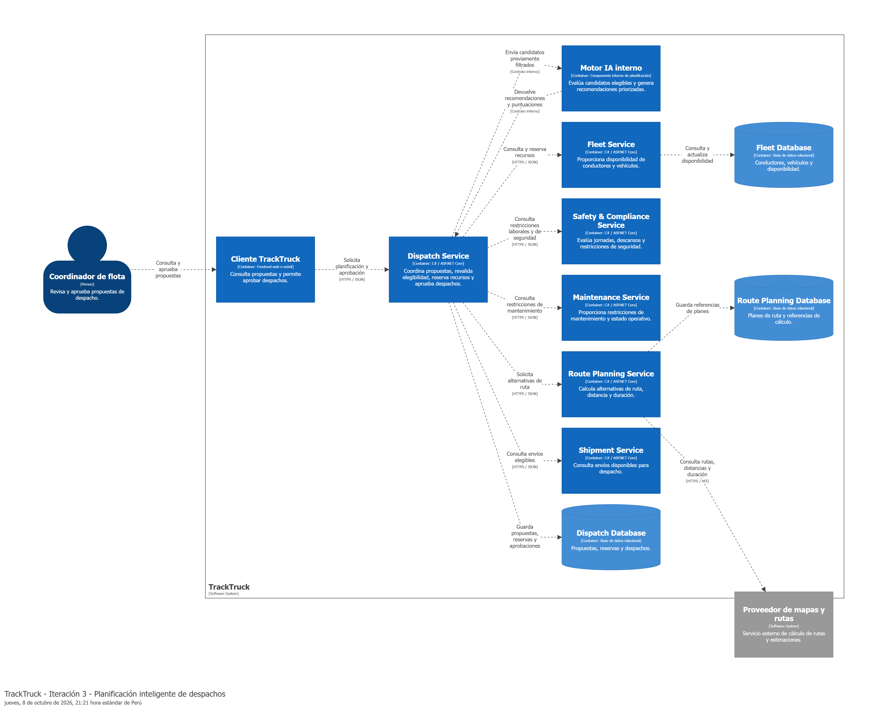

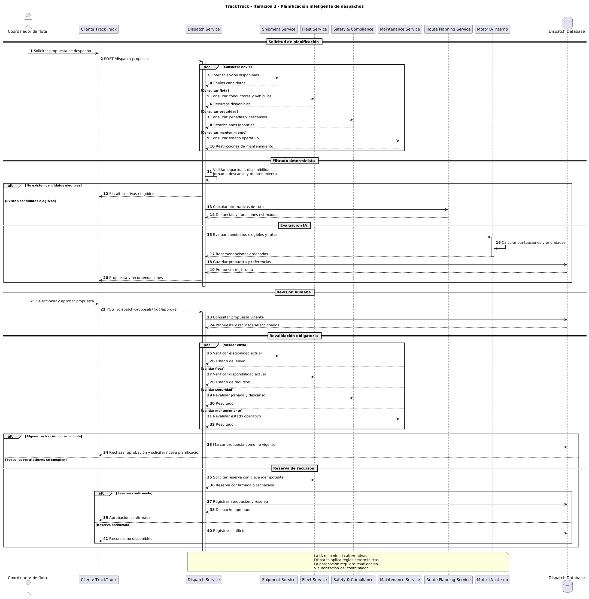

<div style="page-break-after: always;"></div>

| ID | Decisión documentada | Justificación |
| --- | --- | --- |
| DD17 | Mantener la coordinación en Dispatch Planning | Las fuentes conservan sus datos y el plan centraliza la decisión. |
| DD18 | Evaluar restricciones antes y después de recomendar | Los cambios de datos no deben convertir una propuesta antigua en asignación válida. |
| DD19 | Mantener la IA como componente de Dispatch | Su responsabilidad es apoyar la planificación, dentro de ese contexto. |
| DD20 | Obtener rutas mediante un adaptador | La planificación mantiene modelos propios. |
| DD21 | Aplicar Strategy básica ante falla de IA | La continuidad respeta las mismas restricciones y muestra el modo. |
| DD22 | Separar reglas y predicción del modelo | Facilita pruebas de elegibilidad y evaluación de utilidad por separado. |
| DD23 | Registrar versión, entradas, criterios y aprobación | Permite reconstruir por qué se eligió una alternativa. |
| DD24 | Confirmar reservas antes del viaje | Evita asignaciones superpuestas y permite liberar recursos ante cancelación. |
| DD25 | Conservar revisiones para sustituciones justificadas | Mantiene historial de conductor, vehículo y motivo de cambio. |

<div style="page-break-after: always;"></div>

#### 4.3.3.7. Analysis of Current Design and Review Iteration Goal (Kanban Board)

El diseño se revisará con los criterios siguientes. Los resultados de revisión, responsables y evidencias se completarán cuando el equipo valide las vistas y decisiones. La definición escrita es un avance de diseño y debe distinguirse de la implementación y sus pruebas.

| Aspecto | Criterio de revisión | Estado |
| --- | --- | --- |
| Jornada | Incluye horas normales y adicionales acumuladas del día y duración planificada. | Pendiente revisión y evidencia |
| Descanso | Usa intervalos y política vigente; no asume elegibilidad si faltan datos. | Pendiente revisión y evidencia |
| Mantenimiento | Revisa restricciones y kilometraje previsto del servicio. | Pendiente revisión y evidencia |
| IA | El modelo y su conjunto de evaluación están identificados y comparados con baseline. | Pendiente revisión y evidencia |
| Aprobación | El responsable confirma una alternativa válida con reservas compatibles. | Pendiente revisión y evidencia |
| Fallback | El modo básico está identificado y no omite validaciones. | Pendiente revisión y evidencia |


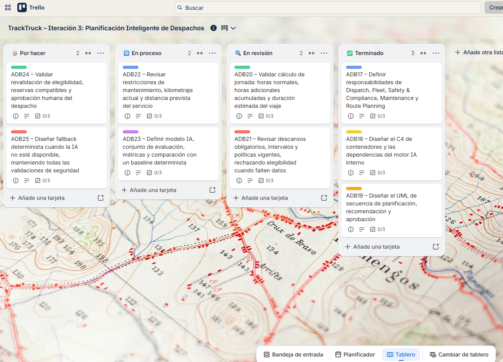

**Tablero Trello:** [TrackTruck – Iteración 3](https://trello.com/invite/b/6ac85027fdd2ae7e47cb9609/ATTI1f9364609742d0282f64597493c0d70a633AD43E/tracktruck-iteracion-3-planificacion-inteligente-de-despachos)

<div style="page-break-after: always;"></div>

### 4.3.4. Iteration 4: Trip Execution, Tracking and Delivery

Refinar ejecución de viaje, posicionamiento, paradas, incidencias y entrega, incluyendo integración móvil, sincronización y cambios excepcionales de asignación.

#### 4.3.4.1. Architectural Design Backlog 4

| ID | Trabajo de diseño | Drivers relacionados | Prioridad |
| --- | --- | --- | --- |
| ADB26 | Definir estados de Trip y validaciones al iniciar y terminar | US10; US27–US29; US71 | Alta |
| ADB27 | Definir ingestión y fecha de última ubicación conocida | US14–US15; US32; QAS02 | Alta |
| ADB28 | Definir parada por inmovilidad y actualización de motivo | US16; US34; US73 | Alta |
| ADB29 | Definir reporte, atención y resolución de incidencia | US18–US19; US35–US37 | Alta |
| ADB30 | Definir deduplicación y sincronización móvil de reportes | US72; QAS08 | Media |
| ADB31 | Definir TripStarted/TripCompleted y activación/cierre de Tracking | QAS04; AC04 | Alta |
| ADB32 | Definir evidencia y resultados de entrega | US74–US75 | Alta |
| ADB33 | Definir interrupción y sustitución autorizada de recursos | US70; AC06 | Media |
| ADB34 | Definir eventos y proyección del historial de la operación | US79; QAS09 | Alta |

#### 4.3.4.2. Establish Iteration Goal by Selecting Drivers

Controlar el recorrido y sus excepciones y registrar un resultado de entrega comprobable, conservando el estado real de viaje y envío y la procedencia temporal del seguimiento.

| Tipo | Drivers seleccionados |
| --- | --- |
| Funcionalidad | PUS07–PUS10; ejecución, seguimiento, incidencia y entrega. |
| Calidad prioritaria | QAS01–QAS04: continuidad, ingestión, acceso y contratos. |
| Calidad complementaria | QAS07–QAS09: deduplicación, app móvil e historial. |
| Restricciones | CON02–CON03, CON06 y CON11: móvil, pruebas, propiedad y permisos. |
| Preocupaciones | AC04, AC09 y AC10: orden de reportes, Android y cierre diferenciado. |

<div style="page-break-after: always;"></div>

#### 4.3.4.3. Choose One or More Elements of the System to Refine

- Trip Execution: estados, tiempos y cambios autorizados.
- Tracking & Geolocation: stream de posiciones, última posición y paradas.
- Incident Management: incidencias y acciones de resolución.
- Delivery Management: cantidades recibidas, evidencia y excepciones.
- Shipment Management: estado consolidado actualizado a partir de resultados.
- Dispatch Planning: reservas y revisiones autorizadas.
- App Android: pantallas por rol, captura autorizada y reportes pendientes.
- Operational History: trazabilidad del viaje y resultados.

#### 4.3.4.4. Choose One or More Design Concepts That Satisfy the Selected Drivers

| Concepto | Aplicación |
| --- | --- |
| Máquina de estados | SCHEDULED, IN_PROGRESS, COMPLETED y CANCELLED en Trip. |
| Outbox y consumidores idempotentes | Comunicar inicio, cierre e incidencias con recuperación. |
| Fecha de captura y reportId | Deduplicar y ordenar sin convertir una posición antigua en actual. |
| Persistencia local y reintento autorizado | Mantener reportes pendientes según condiciones de Android. |
| Separación de agregados | El viaje y la entrega del envío conservan estados propios. |
| Snapshot y revisión de asignación | Guardar recursos y motivos de sustitución sin borrar la historia. |

<div style="page-break-after: always;"></div>

#### 4.3.4.5. Instantiate Architectural Elements, Allocate Responsibilities, and Define Interfaces

| Elemento | Responsabilidad | Interfaz o integración |
| --- | --- | --- |
| TripExecutionService | Validar inicio, ejecución y cierre del recorrido | POST /trips/{id}/start, /completion y /cancellation |
| TrackingService | Procesar posición, parada y última ubicación | POST /tracking/positions; GET /tracking/trips/{tripId} |
| IncidentService | Registrar incidencia, acciones y resultado | POST/GET /incidents |
| DeliveryService | Confirmar entrega total, parcial o fallida | POST /deliveries; referencias de evidencia |
| ShipmentService | Actualizar estado del envío | Consumo de DeliveryConfirmed y DeliveryExceptionReported |
| App Android | Consultar viaje, mapa, incidencias y entrega autorizada | API y repositorio local de reportes |
| OperationalHistoryService | Consultar los hechos relacionados | Consumo de eventos con origen y correlación |

StartTrip valida estado, usuario y restricciones vigentes y publica TripStarted. Tracking abre el seguimiento y conserva los reportes válidos. CompleteTrip registra término del recorrido y publica TripCompleted. Delivery registra por separado el resultado de cada envío y publica su confirmación o excepción. Shipment actualiza su estado y los consumidores completan el historial.

| Evento | Productor | Contenido/efecto |
| --- | --- | --- |
| TripStarted | Trip Execution | TripId, recursos, plan y momento de inicio. |
| VehicleLocationUpdated | Tracking & Geolocation | Referencia del viaje, posición y momento de captura. |
| StopDetected | Tracking & Geolocation | Parada confirmada, inicio y ubicación. |
| IncidentReported | Incident Management | Incidencia, tipo, viaje y fecha. |
| TripCompleted | Trip Execution | Finalización del recorrido. |
| DeliveryConfirmed | Delivery Management | Envío, cantidades y resultado de entrega. |
| DeliveryExceptionReported | Delivery Management | Entrega parcial o fallida con motivo. |

<div style="page-break-after: always;"></div>

#### 4.3.4.6. Sketch Views (C4 & UML) and Record Design Decisions

| Vista | Archivo previsto | Contenido a revisar |
| --- | --- | --- |
| C4 Containers | assets/images/chapter4/iteration4-c4-containers.png | App, Trip, Tracking, Incident, Delivery, Shipment y persistencia privada. |
| UML Sequence | assets/images/chapter4/iteration4-tracking-sequence.png | Inicio, posición, incidencia, finalización y entrega, incluyendo reintentos. |


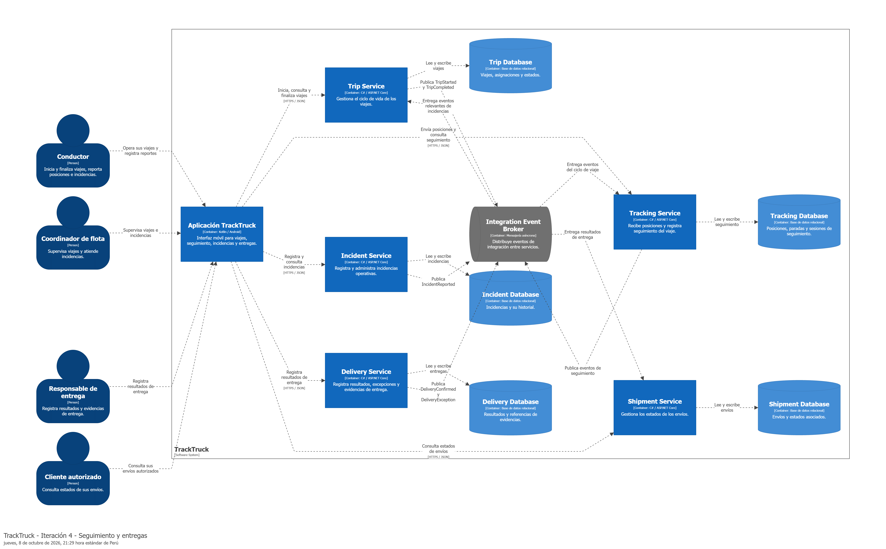

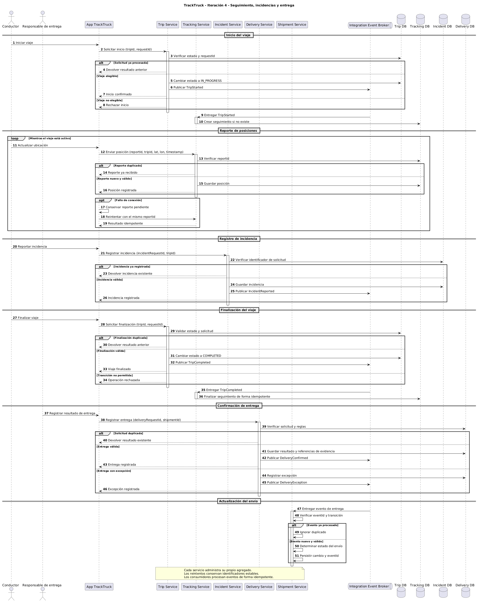

<div style="page-break-after: always;"></div>

| ID | Decisión documentada | Justificación |
| --- | --- | --- |
| DD26 | Separar Trip de Tracking | Estados de viaje y procesamiento de telemetría requieren responsabilidades distintas. |
| DD27 | Comunicar inicio y cierre con eventos | Tracking y otros consumidores actualizan sus modelos propios. |
| DD28 | Deduplicar por reportId y ordenar por recordedAt | Un reintento o reporte antiguo no reemplaza la posición más reciente. |
| DD29 | Conservar coordenadas sin depender de la visualización del mapa | La persistencia continúa ante falla del proveedor. |
| DD30 | Mantener Incident como contexto propietario | Registro y resolución de la excepción son independientes del posicionamiento. |
| DD31 | Registrar sustituciones como revisiones auditadas | El historial conserva los recursos anteriores y su intervalo. |
| DD32 | Persistir reportes pendientes en la app | La pérdida de red no elimina muestras ya capturadas y autorizadas. |
| DD33 | Separar resultado de entrega de cierre del viaje | Un recorrido finalizado puede incluir un envío pendiente o una entrega fallida. |
| DD34 | Mantener evidencia y correlación para el historial | Permite reconstruir el recorrido y resultado del servicio. |

<div style="page-break-after: always;"></div>

#### 4.3.4.7. Analysis of Current Design and Review Iteration Goal (Kanban Board)

El diseño se revisará con los criterios siguientes. Los resultados de revisión, responsables y evidencias se completarán cuando el equipo valide las vistas y decisiones. La definición escrita es un avance de diseño y debe distinguirse de la implementación y sus pruebas.

| Aspecto | Criterio de revisión | Estado |
| --- | --- | --- |
| Estado | Las transiciones inválidas se rechazan y el resultado permanece consistente. | Pendiente revisión y evidencia |
| Posiciones | Las muestras válidas se conservan, deduplican y ordenan por fecha de captura. | Pendiente revisión y evidencia |
| Paradas | Inmovilidad se comprueba con muestras suficientes y umbral configurado. | Pendiente revisión y evidencia |
| Móvil | Pérdida de conexión y permisos producen estados visibles y pruebas en dispositivo. | Pendiente revisión y evidencia |
| Entrega | La confirmación y excepciones actualizan Shipment por contrato. | Pendiente revisión y evidencia |
| Historial | Se conservan cambios de recursos y hechos con correlación. | Pendiente revisión y evidencia |

El tablero de esta iteración seguirá ADB26–ADB34 con columnas Por hacer, En proceso, En revisión y Terminado. El estado de cada tarjeta se actualizará con el avance real; una tarea de diseño se cierra con modelo y revisión y una tarea de software con la Definition of Done.

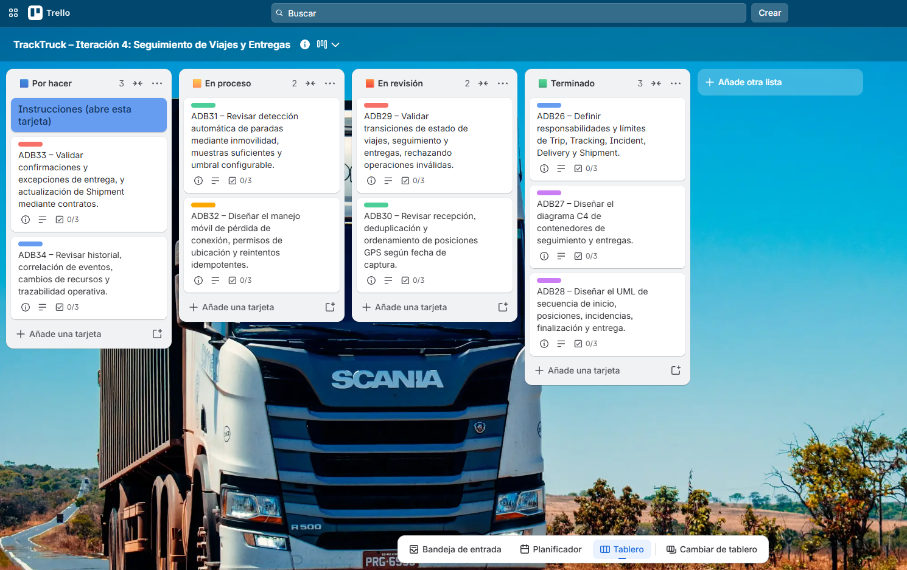

**Tablero Trello:** [TrackTruck – Iteración 4](https://trello.com/invite/b/6ac851ed986af29a616e9d68/ATTI3335c368a8c996bd1f7ac36a3f4afe5c251EDFB5/tracktruck-iteracion-4-seguimiento-de-viajes-y-entregas)

<div style="page-break-after: always;"></div>

### 4.3.5. Iteration 5: Billing, Operational History and Analytics

Refinar cotización, cobros y comprobantes del servicio, el historial consolidado y los indicadores, con contratos de proveedores y protección de operaciones sensibles.

#### 4.3.5.1. Architectural Design Backlog 5

| ID | Trabajo de diseño | Drivers relacionados | Prioridad |
| --- | --- | --- | --- |
| ADB35 | Definir cotización, cargo y condición de facturación | US76–US77 | Alta |
| ADB36 | Definir pago, confirmación y callback verificado | US78; QAS03 | Alta |
| ADB37 | Definir contrato y estado del comprobante electrónico | US77; QAS04 | Alta |
| ADB38 | Definir historial con identidad, origen y orden por agregado | US79; QAS09 | Alta |
| ADB39 | Definir eventos financieros y de la operación | AC04 | Alta |
| ADB40 | Definir indicadores, períodos, filtros y fecha de actualización | US80 | Media |
| ADB41 | Definir idempotencia y conciliación de respuestas inciertas | QAS07; AC01 | Alta |
| ADB42 | Definir protección y recuperación ante fallas de proveedores | QAS01; QAS03 | Alta |

#### 4.3.5.2. Establish Iteration Goal by Selecting Drivers

Relacionar el resultado del servicio con sus cargos y registros financieros, preservar el historial completo y ofrecer indicadores con definiciones y fuentes claras.

| Tipo | Drivers seleccionados |
| --- | --- |
| Funcionalidad | PUS10–PUS11; US76–US80. |
| Calidad prioritaria | QAS01, QAS03 y QAS04: recuperación, acceso y proveedores. |
| Integridad y trazabilidad | QAS07 y QAS09: duplicación y reconstrucción de hechos. |
| Restricciones | CON03, CON06 y CON11: pruebas, datos propios y sandbox explícito. |
| Preocupaciones | AC01, AC04, AC10 y AC12: fallas, orden, cierre y evidencia. |

<div style="page-break-after: always;"></div>

#### 4.3.5.3. Choose One or More Elements of the System to Refine

- Billing & Payments: cotización, cargo, documento, pago y conciliación.
- Delivery y Shipment: resultado y referencias del servicio facturable.
- Operational History: proyección cronológica con origen y secuencia.
- Reporting & Analytics: indicadores y modelos de lectura propios.
- Adaptadores de pago y facturación: solicitudes, callbacks y consulta de estado.
- Identity & Access: permisos para información financiera e histórica.

#### 4.3.5.4. Choose One or More Design Concepts That Satisfy the Selected Drivers

| Concepto | Aplicación |
| --- | --- |
| Adapter / ACL | Traducir solicitudes y resultados de proveedores sin acoplar el dominio. |
| Idempotencia y conciliación | Consultar resultado incierto antes de repetir un cobro o documento. |
| Outbox/Inbox | Propagar resultados persistidos y actualizar proyecciones una sola vez en efecto. |
| Modelos de lectura | Construir historial e indicadores sin joins a bases ajenas. |
| Autorización y correlación | Proteger las consultas y registrar quién ejecutó una operación sensible. |
| Retry acotado y Circuit Breaker | Reintentar fallas transitorias solamente cuando la operación sea segura. |

<div style="page-break-after: always;"></div>

#### 4.3.5.5. Instantiate Architectural Elements, Allocate Responsibilities, and Define Interfaces

| Elemento | Responsabilidad | Interfaz o integración |
| --- | --- | --- |
| BillingService | Cotizar, registrar cargos, documentos y pagos | POST /billing/quotes, /invoices y /payments |
| PaymentProviderAdapter | Verificar solicitudes, callbacks y estados inciertos | API/sandbox identificado y firma de callback según contrato |
| ElectronicBillingAdapter | Procesar solicitud y estado de boleta o factura | API/sandbox identificado y referencia del proveedor |
| OperationalHistoryService | Mantener hechos consultables por operación | Consumo idempotente y GET /history/operations/{id} |
| ReportingService | Calcular indicadores y consultas autorizadas | Modelos propios y GET /reports/operations |
| Delivery / Shipment | Comunicar resultado y datos del servicio | Eventos y consulta por contrato |

Billing registra precio, condiciones y cargo según el servicio. La entrega puede activar la condición de facturación cuando así lo establece el contrato. Pago y comprobante mantienen estados propios. Ante respuesta incierta, el adaptador consulta la referencia y conserva la misma clave de idempotencia. History y Reporting consumen hechos y muestran su fecha de actualización.

| Evento | Productor | Contenido/efecto |
| --- | --- | --- |
| InvoiceGenerated | Billing & Payments | Comprobante y estado confirmado por el proveedor. |
| PaymentRequested | Billing & Payments | Solicitud de pago identificada. |
| PaymentCompleted | Billing & Payments | Confirmación y referencia del pago. |
| PaymentFailed | Billing & Payments | Falla confirmada y motivo. |
| OperationalEventRecorded | Operational History, si se requiere | Confirmación de registro en la proyección; no sustituye el hecho origen. |

<div style="page-break-after: always;"></div>

#### 4.3.5.6. Sketch Views (C4 & UML) and Record Design Decisions

| Vista | Archivo previsto | Contenido a revisar |
| --- | --- | --- |
| C4 Containers | assets/images/chapter4/iteration5-c4-containers.png | Billing, proveedores, History, Reporting y modelos privados. |
| UML Sequence | assets/images/chapter4/iteration5-billing-sequence.png | Condición de cargo, documento, pago, callback y conciliación de reintento. |


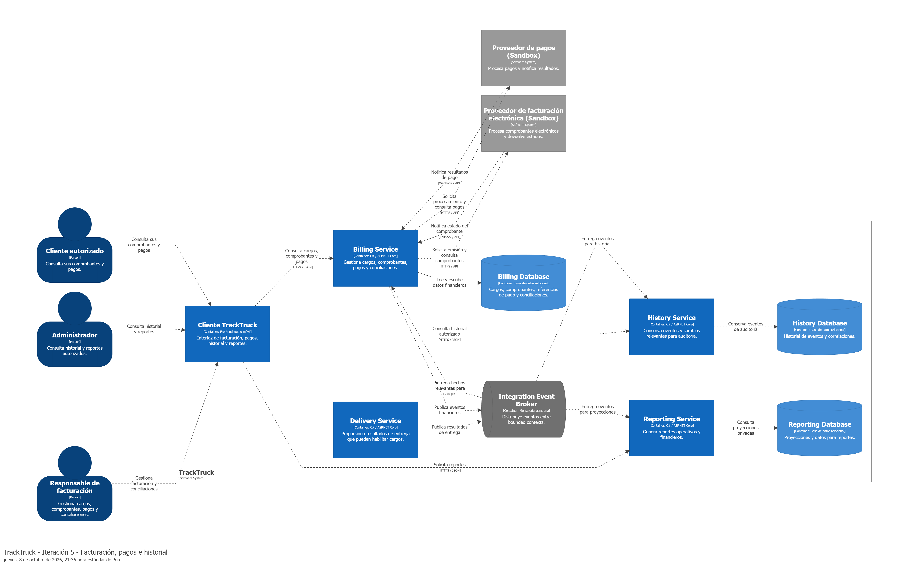

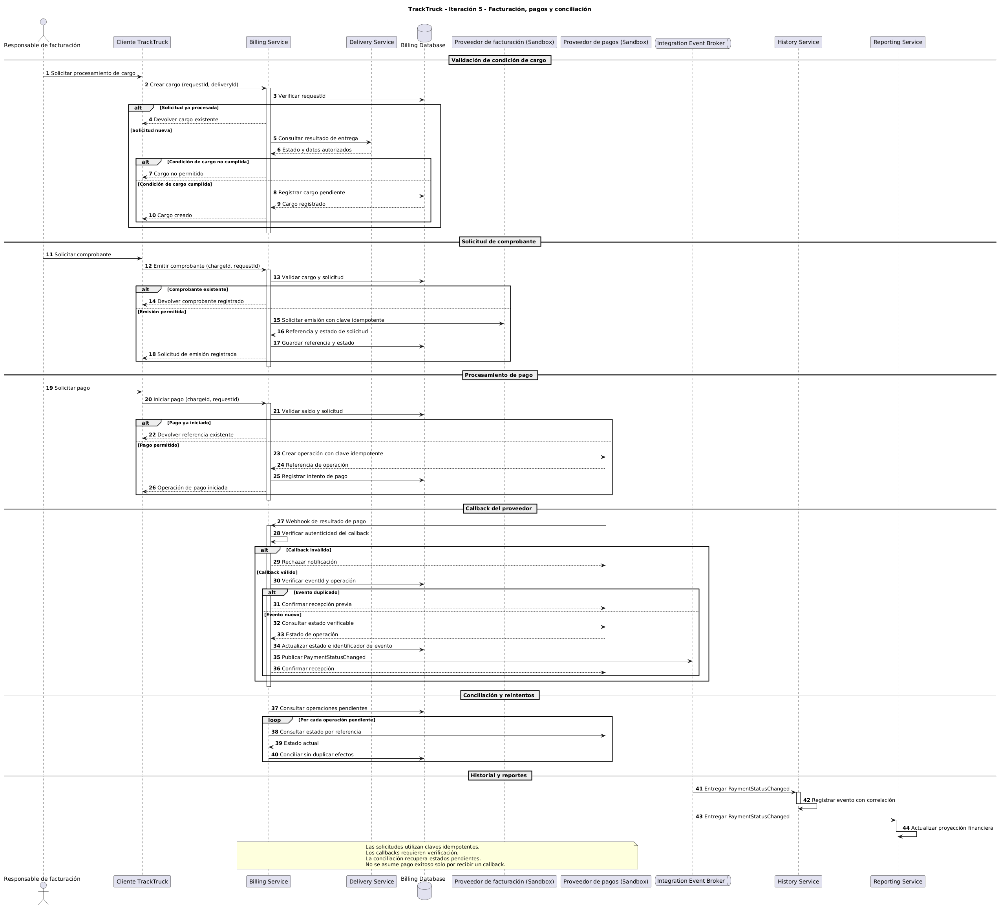

<div style="page-break-after: always;"></div>

| ID | Decisión documentada | Justificación |
| --- | --- | --- |
| DD35 | Separar fin de entrega y estado financiero | Su relación depende de condiciones del servicio y datos autorizados. |
| DD36 | Aislar proveedores en adaptadores | El dominio utiliza contratos propios de pago y comprobante. |
| DD37 | Mantener una clave en reintentos y conciliar estados inciertos | Se evita duplicar cargos o documentos. |
| DD38 | Usar reintentos acotados y Circuit Breaker | Se limita impacto de fallas temporales. |
| DD39 | Construir historial conservando origen y secuencia | Los hechos de servicios diferentes no se ordenan solo por llegada al broker. |
| DD40 | Mantener modelos de lectura de Reporting | Las consultas analíticas no acceden a bases transaccionales ajenas. |
| DD41 | Definir fórmula, período y antigüedad de indicadores | Los valores se interpretan de forma consistente. |
| DD42 | Identificar sandbox y entorno en la evidencia | Las pruebas de integración no se presentan como comprobantes o pagos de producción. |

<div style="page-break-after: always;"></div>

#### 4.3.5.7. Analysis of Current Design and Review Iteration Goal (Kanban Board)

El diseño se revisará con los criterios siguientes. Los resultados de revisión, responsables y evidencias se completarán cuando el equipo valide las vistas y decisiones. La definición escrita es un avance de diseño y debe distinguirse de la implementación y sus pruebas.

| Aspecto | Criterio de revisión | Estado |
| --- | --- | --- |
| Finanzas | Importes, monedas, referencias y estados son consistentes. | Pendiente revisión y evidencia |
| Proveedores | Callbacks y reintentos se validan por contrato. | Pendiente revisión y evidencia |
| Idempotencia | Respuesta incierta y mensaje repetido no duplican efectos. | Pendiente revisión y evidencia |
| Historia | Se conserva eventId, fuente, versión, instante y correlación. | Pendiente revisión y evidencia |
| Indicadores | Fórmula, período y actualización están documentados. | Pendiente revisión y evidencia |
| Evidencia | Entorno y alcance financiero probado están identificados. | Pendiente revisión y evidencia |

El tablero de esta iteración seguirá ADB35–ADB42 con columnas Por hacer, En proceso, En revisión y Terminado. El estado de cada tarjeta se actualizará con el avance real; una tarea de diseño se cierra con modelo y revisión y una tarea de software con la Definition of Done.

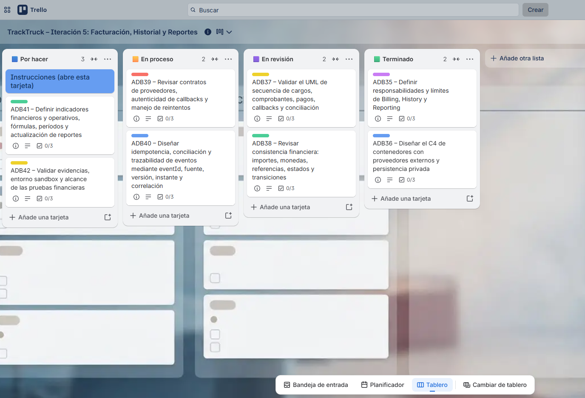


**Tablero Trello:** [TrackTruck – Iteración 5](https://trello.com/invite/b/6ac8537744e9cde920dd169b/ATTI92be952d15cbe2a205313c3c7d3920c740483926/tracktruck-iteracion-5-facturacion-historial-y-reportes)

### Vista arquitectónica general de TrackTruck

La vista general representa la arquitectura objetivo de 17 bounded contexts y su evolución por incrementos. Al cierre de esta revisión, el incremento reutilizado y renombrado ejecuta una sola API ASP.NET Core con los contextos de código `IAM`, `User` y `Registration`; este último concentra temporalmente viajes, flota, gastos, alertas, auditoría y viajes en curso. La aplicación Android consume esa API. Los servicios independientes, broker, Outbox/Inbox, bases privadas por servicio e IA de Dispatch permanecen como arquitectura objetivo y no se presentan como componentes desplegados.


<div style="page-break-after: always;"></div>

# Capítulo V: Product Implementation, Validation & Deployment

## 5.1. Testing Suites & General Patterns
TrackTruck reutiliza una base autorizada de backend, aplicación Android y landing page que fue importada conservando su historia y después renombrada. La verificación del incremento TrackTruck se ejecutó sobre los repositorios resultantes, no sobre una copia externa: la solución .NET compiló en Release y aprobó 326 pruebas unitarias y 96 pruebas de integración; la aplicación Android completó `gradlew test` para debug y release con JDK 17 y Android SDK 34.


Estos resultados acreditan compilación y pruebas automatizadas dentro de sus límites. No acreditan todavía un flujo extremo a extremo app–API, ejecución en dispositivo/emulador, despliegue público ni separación física en microservicios. La revisión de las vistas arquitectónicas se documenta en ADD y se distingue de la evidencia obtenida ejecutando el software.

<div style="page-break-after: always;"></div>

### 5.1.1. Backend Application Core Testing Suite
#### Niveles y herramientas
| Nivel | Alcance | Herramienta o enfoque | Evidencia |

|---|---|---|---|

| Unitario del dominio | Value Objects, agregados, transiciones y reglas. | xUnit para C# y datos de prueba explícitos . | Casos y reporte del runner. |

| Casos de uso | Commands/queries y resultados de validación. | xUnit y dobles de puertos para aislar la regla. | Resultado y dependencias sustituidas identificadas. |

| Integración de API | Autenticación, autorización, contrato HTTP y handlers. | WebApplicationFactory y Microsoft.AspNetCore.Mvc.Testing . | Solicitud, respuesta y reporte automatizado. |

| Persistencia | Migraciones, índices, restricciones y concurrencia. | Motor relacional de prueba aislado y equivalente al proveedor efectivamente usado por cada servicio (PostgreSQL si se confirma). | Versión y configuración del motor y casos ejecutados. |

| Contratos y eventos | Esquemas, errores, versiones, Outbox/Inbox y duplicación. | Pruebas de contrato, consumidores y broker de prueba. | Eventos y efectos registrados. |

| Adaptadores | Mapas, IA, pagos y comprobantes. | Respuestas controladas y sandbox identificado. | Entradas, salidas y tratamiento de falla. |

| App móvil | ViewModel, estado, navegación, validación e interacción. | Pruebas locales Kotlin y pruebas de UI de Compose . | Reportes y dispositivo/emulador utilizado. |

| BDD | Comportamiento expresado en Given/When/Then y automatización de escenarios. | Gherkin y runner a registrar al implementarlo. | Feature, steps y resultado trazado a la historia. |

| End-to-end | App → API C# → datos y flujo entre servicios del incremento. | Escenario reproducible en el entorno de revisión. | Video/capturas y datos persistidos correlacionados. |

| Atributos de calidad | QAS01–QAS09 aplicables al incremento. | Carga, fallas controladas, acceso y concurrencia. | Métricas y límites del ensayo. |

<div style="page-break-after: always;"></div>


#### 5.1.1.1. Core Entities Unit Tests

Las pruebas unitarias del backend de TrackTruck permiten verificar de forma aislada las reglas de negocio, validaciones y comportamientos definidos en sus entidades y agregados. Para su ejecución se utiliza xUnit en los componentes C# que cuentan con pruebas implementadas.

**Alert Unit Tests**

Las pruebas de alertas comprueban el registro y las reglas asociadas a las incidencias del transporte.

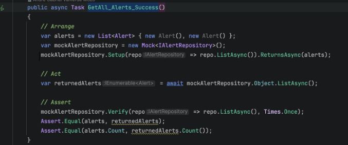

<div style="page-break-after: always;"></div>

**Expense Unit Tests**

Las pruebas de gastos verifican las operaciones y validaciones relacionadas con los importes registrados durante los viajes.

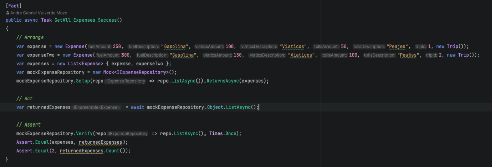

<div style="page-break-after: always;"></div>

**Ongoing Trip Unit Tests**

Las pruebas de viajes comprueban las reglas y los estados relacionados con la ejecución de viajes.

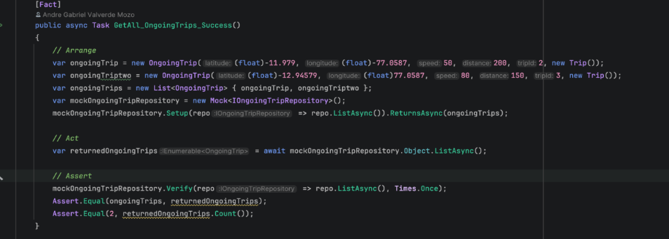

<div style="page-break-after: always;"></div>

**User Unit Tests**

Las pruebas de usuarios permiten validar las reglas de creación y los datos obligatorios de las cuentas.

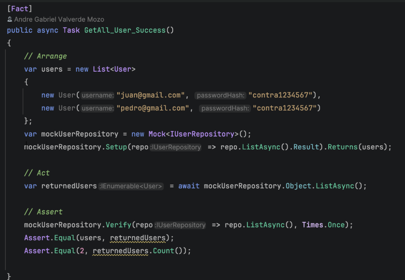


<div style="page-break-after: always;"></div>


#### 5.1.1.2. Core Integration Tests

Las pruebas de integración tienen como objetivo verificar que los distintos componentes del backend interactúen correctamente, incluyendo controladores, servicios, repositorios y bases de datos. Estas pruebas permiten evaluar el comportamiento de las operaciones principales del sistema y comprobar el manejo adecuado de solicitudes válidas e inválidas.

Para TrackTruck, se consideran escenarios relacionados con la gestión de viajes, usuarios y vehículos, tomando como referencia la organización de pruebas del backend desarrollado con ASP.NET Core y C#.

**Integration Test Base**

Se contempla una configuración compartida para preparar el entorno de pruebas, inicializar dependencias y ejecutar escenarios de integración de manera controlada. Esta estructura facilita la reutilización de configuraciones y el aislamiento de los casos.

**Trip Integration Tests**

Las pruebas de integración de viajes permiten comprobar las operaciones de registro, consulta y actualización, además del tratamiento de identificadores inexistentes.

| Prueba | Comportamiento esperado |
|---|---|
| `CreateTrip_WithValidData_ShouldSucceed` | Registrar correctamente un viaje con datos válidos. |
| `GetAllTrips_ShouldReturnMultipleTrips` | Recuperar los viajes registrados dentro del ámbito autorizado. |
| `UpdateTrip_ShouldSucceed` | Actualizar correctamente los datos permitidos de un viaje. |
| `GetTripById_WithInvalidId_ShouldReturnNull` | Comprobar el resultado definido para un identificador inexistente. |

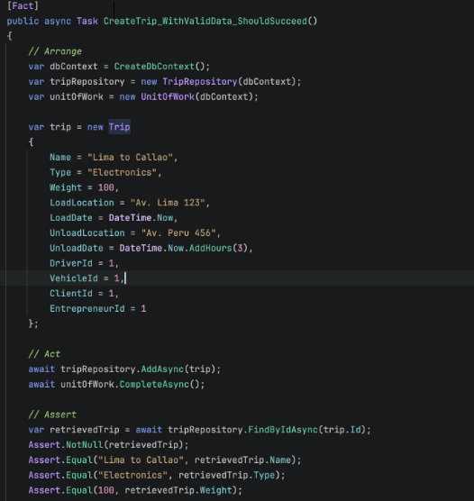

**User Integration Tests**

Estas pruebas permiten comprobar la creación, consulta y actualización de usuarios, así como el tratamiento de registros inexistentes.

| Prueba | Comportamiento esperado |
|---|---|
| `CreateUser_WithValidData_ShouldSucceed` | Registrar un usuario con información válida. |
| `GetAllUsers_WithMultipleUsers_ShouldReturnAll` | Recuperar los usuarios que correspondan al ámbito autorizado. |
| `UpdateUser_WithValidData_ShouldSucceed` | Actualizar los datos permitidos de un usuario. |
| `GetUserById_WithInvalidId_ShouldReturnNull` | Comprobar el comportamiento frente a un identificador inexistente. |

**Vehicle Integration Tests**

Las pruebas de integración de vehículos verifican el registro, consulta y actualización de los vehículos utilizados en las operaciones logísticas. También contemplan consultas con identificadores inexistentes.

| Prueba | Comportamiento esperado |
|---|---|
| `CreateVehicle_WithValidData_ShouldSucceed` | Registrar un vehículo válido. |
| `GetAllVehicles_ShouldReturnMultipleVehicles` | Recuperar los vehículos registrados según los permisos del usuario. |
| `UpdateVehicle_ShouldSucceed` | Actualizar correctamente los datos permitidos de un vehículo. |
| `GetVehicleById_WithInvalidId_ShouldReturnNull` | Comprobar el tratamiento de un vehículo inexistente. |

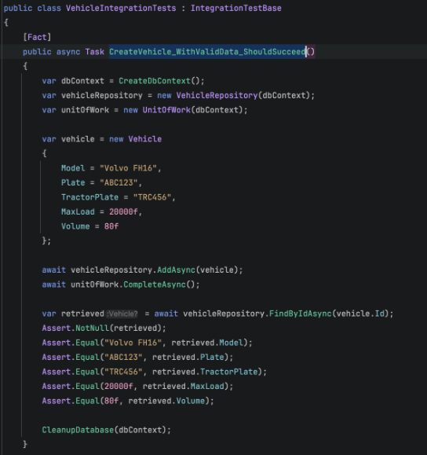

**Resultados y evidencias**

La ejecución verificada del 8 de octubre de 2026 utilizó .NET SDK 8.0.425 sobre el commit `cb9c336` de la rama de integración, posteriormente incorporado a `develop` mediante el PR #1 (`ffc6966`). El comando `dotnet test TrackTruck.Platform.API.sln --configuration Release` produjo los resultados siguientes:

| Proyecto ejecutable | Aprobadas | Fallidas | Omitidas | Alcance comprobado |
|---|---:|---:|---:|---|
| `TrackTruck.UnitTests` | 326 | 0 | 0 | Entidades, agregados, Value Objects y reglas de IAM, usuarios, viajes, flota, gastos, alertas y auditoría. |
| `TrackTruck.IntegrationTests` | 96 | 0 | 0 | Casos de integración con persistencia SQLite aislada y servicios/repositorios del incremento. |

**Límite de aceptación:** las pruebas de integración ejercitan la composición interna de la API; no demuestran por sí solas una arquitectura de microservicios, un despliegue cloud ni la integración real con el APK.

<div style="page-break-after: always;"></div>

#### 5.1.1.3. Core Behavior-Driven Development

Las pruebas basadas en comportamiento (Behavior-Driven Development, BDD) permiten verificar que las funcionalidades del sistema respondan a los requisitos del negocio y a los escenarios definidos para los usuarios.

Para TrackTruck se toma como referencia la utilización de Gherkin, que permite describir el comportamiento esperado mediante las estructuras Given (Dado), When (Cuando) y Then (Entonces). Estos escenarios facilitan la comprensión de los requisitos y la trazabilidad entre las historias de usuario y las pruebas funcionales.

La planificación de las pruebas BDD considera las principales operaciones de gestión logística, autenticación, seguimiento de viajes, administración de recursos y auditoría.

**Escenarios de prueba BDD**

| Área funcional | Escenarios considerados |
|---|---|
| Gestión de usuarios | Gestión de usuarios, registro de usuario y login. |
| Gestión de viajes | Registro de nuevo viaje, modificación de viaje y visualización de detalles. |
| Gestión de gastos | Registro de gastos y consulta de gastos de viaje. |
| Gestión de flota | Registro de conductor, registro de vehículo, visualización de conductores y vehículos. |
| Seguimiento y alertas | Alertas de viaje y visualización de viajes del empresario. |
| Portal del cliente | Visualización de viajes del cliente. |
| Auditoría | Auditoría de viajes y registro de cambios relevantes. |

**Evidencia de escenarios BDD**

Se consideran como ejemplos representativos los escenarios de registro de viajes, autenticación de usuarios y auditoría de operaciones. Su validación permite comprobar el comportamiento esperado de funcionalidades relacionadas con los procesos centrales de TrackTruck.

**Registro de nuevo viaje**

Este escenario verifica que un usuario autorizado pueda registrar un viaje con los datos requeridos, respetando las validaciones y condiciones definidas por el negocio.

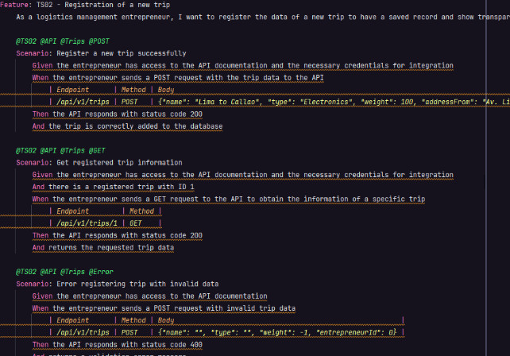

**Login**

Este escenario comprueba el comportamiento del acceso a la aplicación, incluyendo la validación de credenciales y el tratamiento de solicitudes de autenticación.

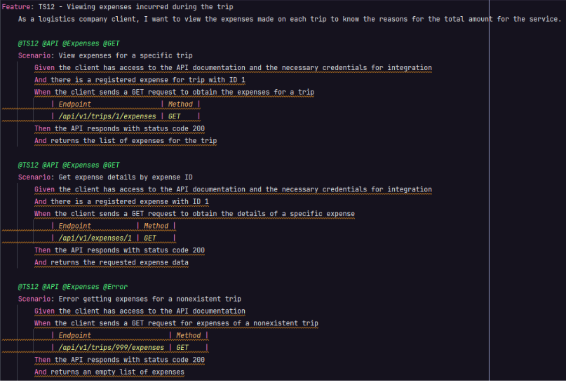

**Auditoría de viajes**

Este escenario considera la consulta del historial de cambios relevantes, permitiendo comprobar la trazabilidad de las operaciones realizadas sobre los viajes.

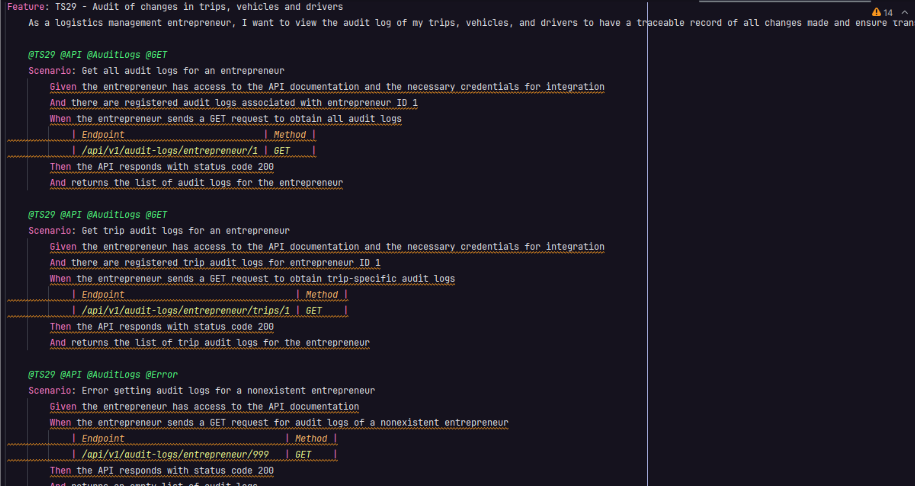

**Resultados y evidencias**

El repositorio conserva 16 archivos `.feature` con escenarios Gherkin para usuarios, autenticación, viajes, gastos, flota, alertas y auditoría. Durante la verificación se comprobó que la base importada no incluía step bindings de SpecFlow; además versionaba archivos `.feature.cs` generados y volvía a generarlos durante el build. Ese arnés incompleto fue retirado para no contabilizar escenarios pendientes como pruebas aprobadas.

Por tanto, los archivos Gherkin se presentan como **especificaciones de aceptación no automatizadas**. Los resultados ejecutados de este Sprint son las 326 pruebas unitarias y 96 pruebas de integración indicadas anteriormente. Automatizar BDD requiere implementar bindings reales y ejecutar el runner; no se atribuye ese resultado a la entrega actual.

<div style="page-break-after: always;"></div>


#### 5.1.1.4. Core System Tests

Las pruebas de sistema permiten evaluar el funcionamiento de TrackTruck desde la perspectiva del usuario, comprobando la interacción entre la aplicación móvil, sus interfaces y los servicios del backend.

La aplicación Android desarrollada con Kotlin y Jetpack Compose incluye pruebas locales y fuentes de pruebas instrumentadas. La ejecución verificada utilizó JDK 17, Android SDK Platform 34 y `gradlew test`: las tareas `testDebugUnitTest` y `testReleaseUnitTest` finalizaron con `BUILD SUCCESSFUL`. Las pruebas instrumentadas de Compose no fueron ejecutadas porque esta revisión no contó con emulador o dispositivo conectado.

**Flujos funcionales considerados**

| Flujo TrackTruck | Trazabilidad | Comprobación de sistema |
|---|---|---|
| Inicio de sesión | US46–US47; TC01, TC24 | Validación de credenciales, permisos, sesión y respuestas del sistema. |
| Registro y consulta de viajes | US10, US13, US27–US28; TC11, TC26 | Registro, visualización de información y transiciones de estado. |
| Seguimiento de viajes | US14, US72; TC12, TC21 | Visualización de posiciones, estados y recuperación de conectividad. |
| Gestión de incidencias | US18–US19; TC13 | Registro y consulta de incidencias asociadas a viajes autorizados. |
| Confirmación de entregas | US74–US75; TC14 | Resultado de entrega, cantidades y evidencias correspondientes. |
| Auditoría de operaciones | US79; TC16, TC27 | Consulta del historial y trazabilidad de cambios. |

**Evidencia de registro de nuevo viaje**

Este escenario permite revisar el proceso de registro de viajes desde la interfaz móvil, considerando los campos requeridos, las validaciones y la respuesta presentada al usuario.

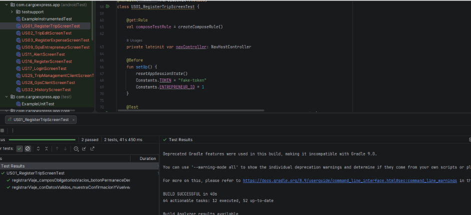

**Evidencia de inicio de sesión**

Este escenario contempla el acceso de usuarios mediante credenciales y la visualización de los estados correspondientes al proceso de autenticación.

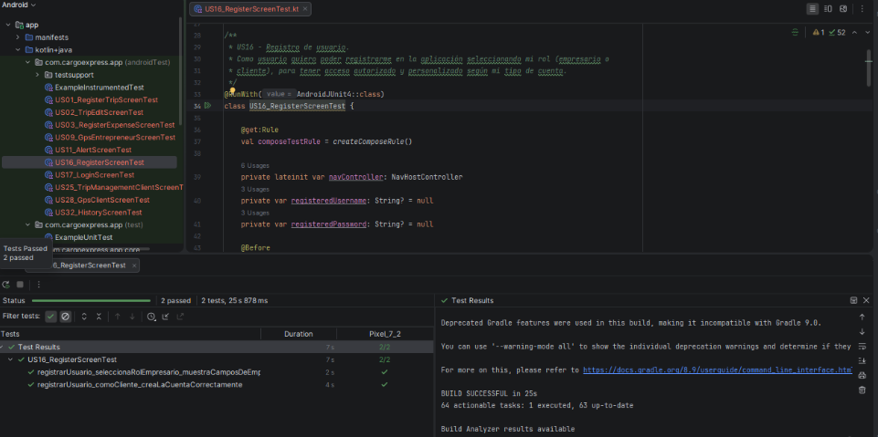

**Evidencia de auditoría de viajes**

Este escenario considera la visualización de registros históricos y la trazabilidad de cambios asociados a las operaciones logísticas.

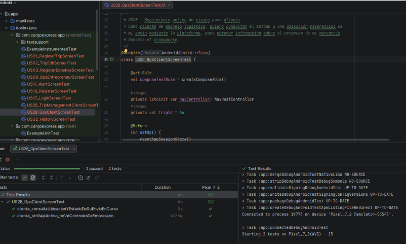

**Resultados y validación**

El build y las pruebas locales de debug/release están verificados en el commit `8c75add`, integrado en `develop` mediante el PR #1 (`b764487`). La ejecución instrumentada y el flujo extremo a extremo app–API permanecen como evidencia pendiente; las imágenes heredadas de interfaz no se contabilizan como ejecución en dispositivo de TrackTruck.

<div style="page-break-after: always;"></div>


#### 5.1.1.5. Static Testing & Verification

Las pruebas estáticas permiten evaluar la calidad, seguridad y mantenibilidad del código sin ejecutar la aplicación. En TrackTruck, estas verificaciones consideran el backend desarrollado con C#, la aplicación móvil Android con Kotlin y la landing page.

Se establecen criterios basados en Clean Code, Domain-Driven Design (DDD) y buenas prácticas de desarrollo para mantener un código organizado, legible y consistente.

**Criterios de verificación**

| Área | Criterio |
|---|---|
| Backend C# | Convenciones de nombres, separación de responsabilidades, validaciones y manejo de errores. |
| Aplicación Android | Arquitectura MVVM, buenas prácticas de Kotlin y revisión con Android Lint. |
| Landing Page | HTML semántico, estilos consistentes y diseño responsive. |
| Seguridad | Validación de entradas, protección de credenciales y revisión de dependencias. |
| Revisión de código | Uso de Pull Requests para revisar los cambios antes de integrarlos. |

Estas verificaciones se aplicarán durante el desarrollo y las revisiones de código, complementando las pruebas unitarias, de integración y de sistema.

<div style="page-break-after: always;"></div>


### 5.1.2. Pattern Based Backend Application(s)
El incremento actual no contiene aún servicios desplegables independientes. `tracktruck-platform` es una solución ASP.NET Core única organizada con DDD por módulos internos. La tabla separa lo comprobado en el código reutilizado de los refinamientos definidos por la arquitectura objetivo.


| Elemento | Estado comprobado en el incremento | Evolución objetivo |

|---|---|---|

| Domain | Agregados, entidades, Value Objects, repositorios y servicios de dominio en `IAM`, `User` y `Registration`; 326 pruebas unitarias aprobadas. | Separar modelos y reglas en los contextos objetivo cuando exista necesidad de despliegue independiente. |

| Application | Commands, queries, command services y query services se encuentran dentro de cada módulo. | Extraer una capa Application explícita y contratos por servicio durante la separación progresiva. |

| Infrastructure | Repositorios EF Core y persistencia compartida mediante `AppDbContext`; pruebas de integración con SQLite aislada. | Persistencia privada por servicio y adaptadores para contratos externos. |

| API | Controllers y Resources REST en una sola API; configuración Swagger/OpenAPI incluida. | APIs versionadas por servicio o gateway cuando se materialice la separación. |

| CQRS | Separación lógica mediante commands, queries y sus servicios dentro de los módulos. | Handlers y puertos explícitos por contexto, manteniendo reglas en Domain. |

| Eventos | No se comprobó broker, Outbox/Inbox ni mensajería entre servicios en el incremento actual. | Eventos de integración confiables cuando existan procesos distribuidos reales. |

| Strategy de planificación | No implementado en la base reutilizada. | Motor IA y modo básico detrás de una interfaz común, sujetos a reglas obligatorias. |

| App móvil | Kotlin/Compose con pantallas, ViewModels, servicios Retrofit y repositorios; build y pruebas locales aprobados. | Alinear por funcionalidades y verificar integración real app–API en dispositivo/emulador. |


****Organización propuesta de un servicio:****


```text

src/DispatchPlanning/

  DispatchPlanning.Domain/

  DispatchPlanning.Application/

    Commands/

    Queries/

    Ports/

  DispatchPlanning.Infrastructure/

    Persistence/

    Integrations/

    Recommendations/

  DispatchPlanning.Api/

tests/

  DispatchPlanning.Domain.Tests/

  DispatchPlanning.Application.Tests/

  DispatchPlanning.IntegrationTests/

```


Esta organización describe el destino de la evolución, no el árbol actual del repositorio. La separación se realizará solo cuando un bounded context cuente con modelo, casos de uso, persistencia, contratos y razones operativas suficientes para constituir una unidad desplegable.


**Evidencia actual:** repositorio `tracktruck-platform`, commits `e3b8da0` y `cb9c336`, PR #1 e integración en `develop` mediante `ffc6966`. La estructura comprobada del incremento se describe en la tabla anterior. La captura histórica del proyecto predecesor no se utiliza como evidencia de la arquitectura actual porque conserva namespaces que no corresponden a TrackTruck.

<div style="page-break-after: always;"></div>


### 5.1.3. Pattern Based Custom Software Library

La arquitectura propone desarrollar **TrackTruck.BuildingBlocks** cuando existan al menos dos servicios que requieran los mismos componentes técnicos. Esta biblioteca no existe en el incremento actual y no se presenta como entregable implementado.

La biblioteca seguirá principios de Clean Architecture y contará con componentes comunes para el manejo de eventos, validaciones y trazabilidad.

| Componente | Función |
|---|---|
| IntegrationEventEnvelope | Estandarizar los eventos de integración. |
| CorrelationContext | Identificar y relacionar operaciones. |
| PagedResult | Estandarizar resultados paginados. |
| Idempotency | Evitar efectos duplicados en operaciones repetidas. |

Las reglas de negocio permanecerán dentro de sus respectivos bounded contexts. La implementación y las pruebas de esta biblioteca se documentarán cuando estén disponibles.


<div style="page-break-after: always;"></div>

### 5.1.4. Framework Pattern Driven Refactoring Report

Se plantean los siguientes refinamientos para mantener la separación de responsabilidades del backend C# y la aplicación móvil de TrackTruck.

| Refinamiento previsto | Patrón o principio |
|---|---|
| Separar planificación, jornada y elegibilidad en sus contextos responsables. | DDD y responsabilidad única. |
| Ubicar commands y queries en Application, conservando las reglas en Domain. | CQRS y Clean Architecture. |
| Acceder a proveedores y otros servicios mediante interfaces y adaptadores. | Adapter y ACL. |
| Separar las restricciones obligatorias de las recomendaciones de IA. | Strategy. |
| Gestionar red y estado fuera de los Composables. | Repository y MVVM. |
| Evitar efectos duplicados al procesar reintentos y eventos. | Idempotencia y Outbox/Inbox. |

**Evidencia pendiente:** archivos antes y después, historia relacionada, commit o PR y resultados de las pruebas correspondientes.


<div style="page-break-after: always;"></div>

## 5.2. Software Configuration Management
La configuración debe permitir reproducir el incremento de backend C# y app móvil, identificar sus fuentes y relacionar cada entrega con código y pruebas. Se describen decisiones de trabajo y campos que se completarán con la configuración real del equipo.


### 5.2.1. Software Development Environment Configuration

El entorno de desarrollo de TrackTruck contempla herramientas para la implementación del backend, la aplicación móvil, las pruebas y la gestión del código fuente. Se busca mantener una configuración organizada y reproducible entre los integrantes del equipo.

| Área | Tecnologías y herramientas |
|---|---|
| Backend | C#, ASP.NET Core y Entity Framework Core. |
| Base de datos | Motor relacional por confirmar según el repositorio. |
| Aplicación móvil | Android Studio, Kotlin, Jetpack Compose y Material 3. |
| Pruebas | xUnit para backend y Compose UI Test para Android. |
| Integración y API | REST, JSON y OpenAPI. |
| Arquitectura | DDD, Clean Architecture, CQRS y bounded contexts. |
| Control de versiones | Git y GitHub. |
| Gestión y diseño | Trello, Structurizr y PlantUML. |
| Documentación | Markdown y README. |

Las versiones del SDK, dependencias y herramientas utilizadas se registrarán de acuerdo con la configuración real de los repositorios.

**Entorno de desarrollo del backend**


**Entorno de desarrollo de la aplicación Android**

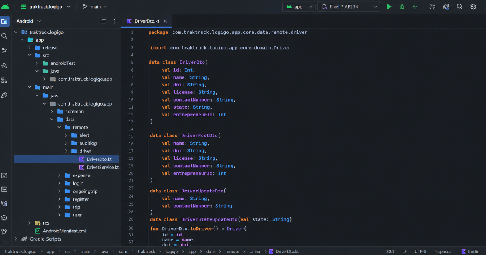

<div style="page-break-after: always;"></div>


### 5.2.2. Source Code Management

TrackTruck utiliza Git y GitHub para el control de versiones y la gestión colaborativa del código fuente. Los repositorios permiten organizar el backend, la aplicación móvil, la landing page y la documentación del proyecto.

**Repositorios del proyecto**

| Repositorio | Descripción | Enlace |
|---|---|---|
| Report | Informe, documentación y diagramas arquitectónicos. | [TrackTruck Report](https://github.com/1ASI0657-2620-15987-G4/tracktruck-report/tree/feature/dazai) |
| Backend | Servicios desarrollados con C# y ASP.NET Core. | [Repositorio pendiente](URL_BACKEND) |
| Mobile App | Aplicación Android desarrollada con Kotlin y Jetpack Compose. | [Repositorio pendiente](URL_MOBILE) |
| Landing Page | Página informativa de TrackTruck. | [Repositorio pendiente](URL_LANDING) |

**Organización GitHub:** [TrackTruck](https://github.com/1ASI0657-2620-15987-G4)

**GitFlow**

Se establece GitFlow como estrategia de organización de ramas para separar el desarrollo de funcionalidades, la integración y las versiones estables.

| Rama | Propósito |
|---|---|
| `main` | Versiones estables del proyecto. |
| `develop` | Integración de funcionalidades desarrolladas. |
| `feature/*` | Desarrollo de nuevas funcionalidades. |
| `release/*` | Preparación de versiones. |
| `hotfix/*` | Corrección de errores críticos. |

**Semantic Versioning**

Se utilizará el formato `MAJOR.MINOR.PATCH` para identificar las versiones del software, diferenciando cambios incompatibles, nuevas funcionalidades y correcciones.

**Conventional Commits**

Los commits seguirán una estructura uniforme para identificar el tipo y alcance de los cambios.

```text
feat(trip): add trip creation
fix(tracking): prevent duplicate positions
test(fleet): add vehicle unit tests
docs(report): update architecture documentation
```

Los cambios se integrarán mediante Pull Requests y revisiones de código. Las ramas y versiones utilizadas deberán corresponder a la configuración real de los repositorios.

<div style="page-break-after: always;"></div>

### 5.2.3. Source Code Style Guide & Conventions

TrackTruck establece convenciones de codificación para mantener un código legible, organizado y consistente entre los integrantes del equipo. Estas prácticas se basan en Clean Code, Domain-Driven Design (DDD) y los patrones arquitectónicos definidos para cada componente.

#### 5.2.3.1. Backend — .NET y C#

El backend utiliza convenciones de C# y una organización por capas para separar la lógica del dominio, los casos de uso y la infraestructura.

| Elemento | Convención |
|---|---|
| Clases y métodos | PascalCase: `TripService`, `CreateTrip`. |
| Interfaces | Prefijo `I`: `ITripRepository`. |
| Variables y parámetros | camelCase: `tripId`, `driverId`. |
| Campos privados | `_camelCase`: `_tripRepository`. |
| Arquitectura | Separación en Domain, Application, Infrastructure y API. |
| Código | Nombres descriptivos, validaciones y manejo adecuado de excepciones. |

Los servicios mantendrán las reglas de negocio dentro de sus bounded contexts, evitando dependencias directas entre los modelos de persistencia de diferentes servicios.

#### 5.2.3.2. Mobile Application — Kotlin y Jetpack Compose

La aplicación móvil utiliza Kotlin y Jetpack Compose, siguiendo el patrón MVVM para separar la interfaz de usuario y la gestión del estado.

| Elemento | Convención |
|---|---|
| Clases | PascalCase: `TripViewModel`. |
| Funciones y variables | camelCase: `loadTrips`, `isLoading`. |
| Composables | PascalCase: `TripScreen`. |
| Constantes | UPPER_SNAKE_CASE: `MAX_RETRY_COUNT`. |
| Arquitectura | MVVM y separación de responsabilidades. |
| Asincronía | Coroutines y Flow para operaciones asíncronas. |
| Interfaz | Material 3, componentes reutilizables y estados de carga y error. |

La aplicación mantendrá una estructura organizada por funcionalidades y accederá a los servicios del backend mediante contratos HTTP.

<div style="page-break-after: always;"></div>

#### 5.2.3.3. Landing Page — HTML, CSS y JavaScript

La landing page seguirá convenciones de desarrollo web orientadas a la claridad, mantenibilidad y accesibilidad.

| Elemento | Convención |
|---|---|
| HTML | Uso de etiquetas semánticas y estructura organizada. |
| CSS | Clases descriptivas, estilos reutilizables y variables de diseño. |
| JavaScript | Funciones organizadas y separación de responsabilidades. |
| Responsive | Adaptación a dispositivos móviles y de escritorio. |
| Accesibilidad | Textos alternativos, contraste y navegación comprensible. |

El diseño mantendrá la identidad visual definida para TrackTruck y conservará consistencia entre las distintas secciones de la página.

#### 5.2.3.4. Tests, Contracts & Code Review

Las pruebas y los contratos seguirán convenciones que faciliten su comprensión, ejecución y mantenimiento.

| Elemento | Convención |
|---|---|
| Pruebas C# | Nombres `Method_Scenario_ExpectedOutcome` y patrón Arrange-Act-Assert. |
| Pruebas Android | Pruebas locales e instrumentadas organizadas por funcionalidad. |
| BDD | Escenarios Given, When y Then. |
| API REST | JSON, códigos HTTP y contratos documentados. |
| Code Review | Revisión de cambios mediante Pull Requests. |

Estas convenciones se verificarán progresivamente durante la implementación y revisión de los Sprints.

<div style="page-break-after: always;"></div>


### 5.2.4. Software Deployment Configuration

La configuración de despliegue de TrackTruck tiene como objetivo permitir la ejecución del backend desarrollado con C# y ASP.NET Core, su conexión con la base de datos y la comunicación con la aplicación móvil Android.

El despliegue contempla la configuración de los servicios, las dependencias necesarias y los mecanismos de seguridad para garantizar el funcionamiento de la plataforma.

| Componente | Configuración |
|---|---|
| Backend | Servicios ASP.NET Core con configuración independiente. |
| Base de datos | Persistencia relacional y conexiones configuradas mediante variables de entorno. |
| API | Endpoints REST para la comunicación con la aplicación móvil. |
| Integraciones | Servicios externos configurados mediante adaptadores y credenciales protegidas. |
| Aplicación móvil | APK Android desarrollado con Kotlin y configurado para consumir los endpoints del backend; la ejecución integrada en emulador o dispositivo requiere evidencia adicional. |
| CI/CD | GitHub Actions para compilación y ejecución automatizada de pruebas, cuando esté configurado. |

**Evidencia de despliegue**

La evidencia deberá mostrar el estado del servicio publicado, su versión y la ejecución de las verificaciones correspondientes. Se distinguirán los componentes efectivamente desplegados de aquellos que todavía forman parte del diseño arquitectónico.


<div style="page-break-after: always;"></div>

## 5.3. MicroServices Implementation

La implementación de TrackTruck se organiza en tres Sprints, siguiendo la planificación del proyecto. Cada Sprint contempla el desarrollo progresivo del backend, la aplicación móvil Android, las integraciones y las pruebas correspondientes.

Las iteraciones ADD del Capítulo IV establecen las decisiones arquitectónicas, mientras que los Sprints permiten implementar y validar progresivamente las funcionalidades del sistema.

<div style="page-break-after: always;"></div>

### 5.3.1. Sprint 1
**Sprint Goal reconciliado:** establecer una base ejecutable de TrackTruck mediante la reutilización autorizada y el renombrado de una API ASP.NET Core, una aplicación Android y una landing page; comprobar autenticación, usuarios, flota, viajes, gastos, alertas y auditoría mediante las pruebas existentes, sin atribuir al incremento los microservicios y capacidades objetivo todavía no implementados.


**Fecha de integración comprobada:** 8 de octubre de 2026. La fecha de inicio y duración originales del desarrollo reutilizado no se reconstruyen como horas del equipo TrackTruck.

**Capacidad y responsables:** se registran únicamente aportes trazables por commits y PR. La planificación de capacidad del Sprint no está disponible en el repositorio.

**Alcance comprobado:** IAM, usuarios/clientes/empresarios, conductores, vehículos, viajes, viajes en curso, gastos, alertas y auditoría; app Android con pantallas y repositorios para esos recursos. La planificación inteligente, seguimiento geográfico persistido, servicios independientes, mensajería y BuildingBlocks permanecen fuera del incremento verificado.


La aceptación se expresa por capacidades y evidencia, no por un porcentaje global. Las características no comprobadas se mantienen en el backlog para incrementos posteriores.

<div style="page-break-after: always;"></div>

#### 5.3.1.1. Sprint Backlog 1
Las siguientes tareas proponen trabajo concreto sobre el incremento. Las estimaciones en horas son iniciales y deben revisarse con los responsables y capacidad del Sprint; no representan horas ejecutadas. El estado se completará con la evidencia existente.


| ID | Historias/driver | Tarea | Estimación inicial | Evidencia para cerrar | Estado documental |

|---|---|---|---|---|---|

| SB01 | ADB01–ADB09 | Actualizar arquitectura, responsabilidades y contratos para C# y móvil. | 6 h | Vistas/ADR revisados y fuentes versionadas. | Diseño actualizado; revisión pendiente. |

| SB02 | CON01, CON03 | Preparar solución C#, proyectos, DI, compilación y runner de tests. | 6 h | Build y ejecución inicial de suites. | Pendiente contrastar evidencia. |

| SB03 | US46–US52 | Implementar cuentas, acceso y políticas básicas de organización/rol. | 12 h | API, tests y flujo de login móvil. | Pendiente contrastar evidencia. |

| SB04 | US03–US08 | Implementar registro y consulta de flota con persistencia. | 10 h | Endpoints, migraciones y casos válidos/invalidación. | Pendiente contrastar evidencia. |

| SB05 | US09, US11–US12, US65 | Implementar planificación básica y contrato de elegibilidad inicial. | 12 h | Validaciones y fuentes identificadas; pruebas de recursos válidos e inválidos. | Pendiente contrastar evidencia. |

| SB06 | US67, US69 | Implementar aprobación y reserva de recursos. | 8 h | Prueba de conflicto e idempotencia. | Pendiente contrastar evidencia. |

| SB07 | US10, US26–US29 | Implementar viaje, inicio y finalización autorizados. | 10 h | Estados, persistencia y tests de transición. | Pendiente contrastar evidencia. |

| SB08 | US14, US32 | Implementar ingestión, última posición y consulta de seguimiento. | 10 h | Reporte válido, fecha de captura y deduplicación. | Pendiente contrastar evidencia. |

| SB09 | US18–US19 | Implementar registro y consulta de incidencias. | 6 h | API, persistencia y autorización del viaje. | Pendiente contrastar evidencia. |

| SB10 | CON02 | Construir estructura MVVM, navegación, estado y pantallas móviles del incremento. | 12 h | APK y pantallas con estados de carga, vacío y error. | Pendiente contrastar evidencia. |

| SB11 | US46, US10, US14, US18 | Conectar app con las API reales y manejar sesión y errores. | 12 h | Flujo end-to-end y capturas correlacionadas. | Pendiente contrastar evidencia. |

| SB12 | TC01, TC05, TC09–TC13, TC18 | Ejecutar pruebas de dominio, casos de uso, API y persistencia aplicables. | 8 h | Reportes de suites y defectos tratados. | Pendiente resultado real. |

| SB13 | TC24, TC26–TC27 | Ejecutar pruebas móviles y flujo integrado del Sprint. | 8 h | Reportes, dispositivo y video/capturas. | Pendiente resultado real. |

| SB14 | 5.1.3 | Implementar los BuildingBlocks necesarios para el incremento. | 4 h | Proyecto, consumo y tests propios. | Pendiente contrastar evidencia. |

| SB15 | CON04 | Preparar y ejecutar entorno de revisión del incremento. | 6 h | Configuración, health, endpoint y prueba desde APK. | Pendiente resultado real. |

| SB16 | QAS04; QAS09 | Documentar contratos, eventos y evidencias del Sprint Review. | 6 h | OpenAPI, commits, resultados y tableros. | Pendiente incorporar evidencias. |


El equipo podrá dividir, reasignar o reducir tareas antes de comprometer el Sprint. Las tareas SB05 y SB11 deben indicar qué dependencias usan servicios reales y cuáles utilizan datos controlados. La validación integrada de jornada, mantenimiento y la IA se amplía en Sprint 2; cada fuente simulada permanece identificada como dependencia pendiente.


**Captura del Sprint Backlog:** no incorporada; debe añadirse únicamente desde el tablero real del equipo.


****Enlace de planificación/Sprint Backlog:**** pendiente incorporar el tablero y las tarjetas correspondientes.

<div style="page-break-after: always;"></div>


#### 5.3.1.2. Development Evidence for Sprint Review

El incremento reúne la base backend C#/ASP.NET Core, la aplicación Android y la landing page importadas con autorización, renombradas y saneadas como TrackTruck.

La implementación actual materializa parcialmente la arquitectura del Capítulo IV. La API conserva módulos DDD internos, pero todavía no implementa los 17 bounded contexts como microservicios independientes.

| Repositorio | Branch/PR | Commits principales | Resultado incorporado |
|---|---|---|---|
| `tracktruck-platform` | Feature de migración → PR #1 → `develop` | `e3b8da0`, `cb9c336`, merge `ffc6966` | API ASP.NET Core renombrada; secretos y artefactos generados retirados; solución y tests normalizados. |
| `tracktruck-mobile` | Feature de migración → PR #1 → `develop` | `8809c33`, `8c75add`, merge `b764487` | Namespace `com.tracktruck.app`, URL de API configurable, Firebase local opcional y build Gradle verificado. |
| `tracktruck-website` | Feature de migración → PR #1 → `develop` | `6d24a33`, `de17b4b`, merge `77a07e9` | Marca, equipo, contactos, enlaces, textos legales y recursos migrados a TrackTruck. |

Los commits de importación conservan la procedencia autorizada. Los commits de refactorización representan la adecuación realizada por TrackTruck y no atribuyen al equipo la autoría original del código reutilizado.

**Repositorio backend:** [TrackTruck Backend](https://github.com/1ASI0657-2620-15987-G4/tracktruck-platform)

**Repositorio móvil:** [TrackTruck Mobile](https://github.com/1ASI0657-2620-15987-G4/tracktruck-mobile)

<div style="page-break-after: always;"></div>


#### 5.3.1.3. Testing Suite Evidence for Sprint Review
Las suites se ejecutaron sobre las ramas TrackTruck antes de su integración a `develop`. El registro siguiente distingue resultados ejecutados de especificaciones y verificaciones pendientes.


| Suite | Comando/entorno | Resultado verificado |

|---|---|---|

| Unit tests C# | .NET SDK 8.0.425; `dotnet test TrackTruck.Platform.API.sln --configuration Release` | PASS: 326 aprobadas, 0 fallidas, 0 omitidas. |

| Integration tests C# | Mismo comando; persistencia SQLite aislada en tests | PASS: 96 aprobadas, 0 fallidas, 0 omitidas. |

| Especificaciones Gherkin | 16 archivos `.feature` conservados en el repositorio | NOT_AUTOMATED: la base no contiene step bindings. |

| App móvil | JDK 17, Android SDK 34; `gradlew test` | PASS: build y unit tests debug/release. |

| Instrumented/E2E | Requiere dispositivo/emulador y backend ejecutándose | NOT_VERIFIED. |

| QAS/carga/fallas | Requiere ensayos específicos y métricas | NOT_VERIFIED. |


La captura disponible en los recursos corresponde a una especificación Gherkin y no a una ejecución de pruebas; por ello no se presenta como evidencia de aprobación. Queda pendiente exportar los reportes de consola de las suites verificadas y añadirlos sin alterar sus resultados.

<div style="page-break-after: always;"></div>

#### 5.3.1.4. Execution Evidence for Sprint Review

La evidencia disponible demuestra compilación y ejecución de suites en backend y mobile. La revisión de integración confirmó que la app usa `http://10.0.2.2:8080/api/v1/` por defecto para el emulador, que el contenedor de la plataforma expone el puerto `8080` y que los contratos principales de autenticación, usuarios, conductores, vehículos, viajes, gastos, alertas y auditoría coinciden en rutas y recursos. Esto acredita preparación contractual, no una ejecución end-to-end. El flujo app móvil → backend → persistencia permanece pendiente de ejecutarse en emulador o dispositivo; la figura se conserva como guion del ensayo, no como captura de una ejecución completada.


| Paso de demostración | Evidencia a capturar |

|---|---|

| Acceder con usuario autorizado | Pantalla de acceso y resultado de autenticación del entorno. |

| Consultar conductor y vehículo | Datos de prueba de la organización y fuente consultada. |

| Seleccionar y aprobar plan válido | Resultado de elegibilidad, reserva y aprobación. |

| Registrar e iniciar viaje | TripId, estado y fechas devueltos por la API. |

| Enviar o recibir una ubicación | Origen real o simulado, reportId, recordedAt y ubicación consultada. |

| Registrar incidencia | Formulario móvil y registro retornado por la API. |

| Finalizar el recorrido | Estado COMPLETED y persistencia; entrega diferenciada según alcance. |

| Ensayar un rechazo | Ejemplo de permiso insuficiente, estado inválido o reserva incompatible. |


<div style="page-break-after: always;"></div>


#### 5.3.1.5. Microservices Documentation Evidence for Sprint Review

El diseño de TrackTruck organiza sus responsabilidades mediante bounded contexts, pero el incremento actual se despliega como una API modular única. La tabla evita equiparar módulos de código con microservicios:

| Elemento | Estado | Responsabilidad |
|---|---|---|
| `IAM` | Implementado dentro de la API | Autenticación, tokens, usuarios y estado de cuenta. |
| `User` | Implementado dentro de la API | Clientes y empresarios. |
| `Registration` | Implementado como contexto transicional | Conductores, vehículos, viajes, viajes en curso, gastos, alertas y auditoría. |
| IdentityService, FleetService y TripExecutionService | Arquitectura objetivo | Separación progresiva de las capacidades ya presentes. |
| DispatchPlanningService, TrackingService e IncidentService | Arquitectura objetivo/no implementada como servicio independiente | Planificación, geolocalización e incidencias desacopladas. |

Swagger/OpenAPI está configurado en la API. Una lista de microservicios propuestos no acredita despliegue independiente; esa aceptación requerirá proyectos o imágenes separadas, contratos versionados, persistencia definida y evidencia de ejecución.

**Documentación del backend:** [Repositorio TrackTruck](https://github.com/1ASI0657-2620-15987-G4/tracktruck-platform)

<div style="page-break-after: always;"></div>


#### 5.3.1.6. Software Deployment Evidence for Sprint Review
El repositorio contiene Dockerfile y configuración de Railway heredados y renombrados, pero las credenciales de base de datos y JWT fueron retiradas del control de versiones. La compilación local está verificada; no se comprobó un servicio TrackTruck publicado ni acceso desde el APK. El estado de esta sección es **PARTIAL** y la figura representa la configuración prevista.


| Campo | Estado comprobado |

|---|---|

| Ambiente y proveedor/host | Configuración Railway presente; despliegue TrackTruck no verificado. |

| Fecha y responsable | Revisión local: 8 de octubre de 2026, JeanLoa. |

| Tag, commits e imágenes/versiones | `cb9c336` / merge `ffc6966`; .NET 8.0.425. Sin tag de release ni imagen publicada verificados. |

| Servicios ejecutados y endpoint | Build y tests locales; endpoint público no verificado. |

| Health y migraciones | No verificados en un entorno desplegado. |

| Broker/consumidores, si están integrados | No implementados en el incremento comprobado. |

| APK, versión, hash y dispositivo | Build Gradle verificado; APK de revisión, hash y dispositivo no verificados. |

| Flujo probado desde el móvil | NOT_VERIFIED. |

| Dependencias externas, sandbox y limitaciones observadas | Firebase local opcional y API base configurable; integración externa no ejecutada. |

| Capturas/logs y enlace de evidencia | Resultados de consola disponibles en la revisión técnica; captura de despliegue real pendiente. |


<div style="page-break-after: always;"></div>

#### 5.3.1.7. Team Collaboration Insights during Sprint
Se registran solamente contribuciones trazables por identidad Git, commit o PR. Las identidades técnicas que no estén confirmadas con un integrante no se asignan por inferencia.


| Integrante | Aporte del Sprint | PR/commit o tarjeta | Revisión y evidencia |

|---|---|---|---|

| Jean Franck Loa Rojas | Importación autorizada, rebranding, saneamiento de secretos/artefactos, verificación de backend/mobile/website y reconciliación documental. | Platform/Mobile/Website PR #1; commits `cb9c336`, `8c75add`, `de17b4b`. | Builds y suites descritos en 5.3.1.3. |

| Anhelo Rodrigo Rocca Leon | Pendiente registrar aporte real. | Pendiente. | Pendiente. |

| Alexander Piero Fernandez Garfias | Existe evidencia Git con autor `Alexander` para corrección de sintaxis arquitectónica; la correspondencia personal debe confirmarse antes de la calificación individual. | `5f2e8c1`. | Commit de documentación. |

| Sebastián De Las Casas Latour | Pendiente registrar aporte real. | Pendiente. | Pendiente. |

| Aldair Joaquin Ramos Aguirre | Pendiente registrar aporte real. | Pendiente. | Pendiente. |


Los commits arquitectónicos `5269cb8`–`c9ef0b9` fueron registrados por la identidad Git `Dostoyevsk1`. Su correspondencia con un integrante debe confirmarse antes de incorporarla al informe individual de desempeño.


**Captura de colaboración:** pendiente generar desde las contribuciones verificadas y la identificación confirmada de cada autor.

<div style="page-break-after: always;"></div>

#### 5.3.1.8. Kanban Board
El tablero del Sprint representará tareas de backend C#, app móvil, pruebas, integración, documentación y despliegue. El tablero de una iteración ADD conserva tareas de diseño y revisión; sus tarjetas se vincularán cuando exista una dependencia entre ambos trabajos.


| Columna | Criterio de entrada/salida |

|---|---|

| Por hacer | Tarea acordada y todavía no iniciada. |

| En proceso | Responsable trabajando en el resultado. |

| En revisión | Código o artefacto listo para revisar y comprobar. |

| Terminado | Resultado revisado y evidencia que cumple la Definition of Done. |


****Pendiente incorporar:**** enlace verificable, captura del estado del Sprint Review, fechas y tarjetas relacionadas con SB01–SB16 y US comprometidas. El estado de las tarjetas debe reflejar los avances comprobados; no se fija todo como Terminado a partir de este documento.


**Captura del Kanban de Sprint 1:** pendiente incorporar desde un tablero verificable.


<div style="page-break-after: always;"></div>

# Conclusiones

TrackTruck se plantea como una solución logística de LogiGo con aplicación móvil y backend en C#, organizada en 17 bounded contexts. La revisión mantiene las necesidades de seguimiento, comunicación y organización del documento base y alinea las capacidades ampliadas con propietarios de datos, contratos y reglas definidos.

El análisis exploratorio utiliza siete registros de entrevistas. Sus resúmenes permiten identificar temas, mientras la validación de roles adicionales, reglas laborales, cierre financiero y planificación con IA requiere investigación y pruebas específicas.

La IA se integra como capacidad de Dispatch Planning, con datos y modelo identificados, evaluación frente a una línea base, restricciones obligatorias, aprobación autorizada y fallback. Su realización se comprobará con implementación, métricas y consumo desde el flujo de planificación.

Los siguientes avances deberán materializar el diseño mediante servicios C#, app móvil, pruebas, integración y despliegue. El informe conservará la relación entre historias, decisiones, código, resultados y evidencias, completando los registros pendientes conforme a los incrementos aceptados.

<div style="page-break-after: always;"></div>

# Referencias Bibliográficas

Fuentes oficiales consultadas para la revisión tecnológica y competitiva. Fecha de consulta: 08 de octubre de 2026. Las decisiones concretas de dominio y las metas de prueba son propuestas del proyecto.

[R01] Microsoft. (s. f.). *.NET Support Policy*. [https://dotnet.microsoft.com/en-us/platform/support/policy/dotnet-core](https://dotnet.microsoft.com/en-us/platform/support/policy/dotnet-core)

[R02] Microsoft. (s. f.). *Integration tests in ASP.NET Core*. [https://learn.microsoft.com/en-us/aspnet/core/test/integration-tests?view=aspnetcore-10.0](https://learn.microsoft.com/en-us/aspnet/core/test/integration-tests?view=aspnetcore-10.0)

[R03] Microsoft. (s. f.). *Design a microservice domain model — DDD and CQRS patterns*. [https://learn.microsoft.com/en-us/dotnet/architecture/microservices/microservice-ddd-cqrs-patterns/microservice-domain-model](https://learn.microsoft.com/en-us/dotnet/architecture/microservices/microservice-ddd-cqrs-patterns/microservice-domain-model)

[R04] Android Developers. (s. f.). *Recommendations for Android architecture*. [https://developer.android.com/topic/architecture/recommendations](https://developer.android.com/topic/architecture/recommendations)

[R05] Android Developers. (s. f.). *Test your Compose layout*. [https://developer.android.com/develop/ui/compose/testing](https://developer.android.com/develop/ui/compose/testing)

[R06] Microsoft. (s. f.). *Train and evaluate a model — ML.NET*. [https://learn.microsoft.com/en-us/dotnet/machine-learning/how-to-guides/train-machine-learning-model-ml-net](https://learn.microsoft.com/en-us/dotnet/machine-learning/how-to-guides/train-machine-learning-model-ml-net)

[R07] Android Developers. (s. f.). *Save data in a local database using Room*. [https://developer.android.com/training/data-storage/room](https://developer.android.com/training/data-storage/room)

[R08] Microsoft. (s. f.). *Choosing a testing strategy — EF Core*. [https://learn.microsoft.com/en-us/ef/core/testing/choosing-a-testing-strategy](https://learn.microsoft.com/en-us/ef/core/testing/choosing-a-testing-strategy)

[R09] Microsoft. (s. f.). *Configure JWT bearer authentication in ASP.NET Core*. [https://learn.microsoft.com/en-us/aspnet/core/security/authentication/configure-jwt-bearer-authentication?view=aspnetcore-10.0](https://learn.microsoft.com/en-us/aspnet/core/security/authentication/configure-jwt-bearer-authentication?view=aspnetcore-10.0)

[R10] Microsoft. (s. f.). *Unit testing C# with xUnit*. [https://learn.microsoft.com/en-us/dotnet/core/testing/unit-testing-csharp-with-xunit](https://learn.microsoft.com/en-us/dotnet/core/testing/unit-testing-csharp-with-xunit)

[R11] FourKites. (s. f.). *Real-Time Network*. [https://www.fourkites.com/network/](https://www.fourkites.com/network/)

[R12] Powerfleet / Fleet Complete. (s. f.). *Products Overview*. [https://www.fleetcomplete.com/product/](https://www.fleetcomplete.com/product/)

[R13] JungleWorks. (s. f.). *Tookan — Enterprise Delivery Management System*. [https://jungleworks.com/tookan/](https://jungleworks.com/tookan/)

Herramientas y convenciones del documento base:

- Git. (s. f.). *Git documentation*. [https://git-scm.com/doc](https://git-scm.com/doc).
- GitHub. (s. f.). *GitHub documentation*. [https://docs.github.com/](https://docs.github.com/).
- OpenAPI Initiative. (s. f.). *OpenAPI Specification*. [https://spec.openapis.org/oas/latest.html](https://spec.openapis.org/oas/latest.html).
- Structurizr. (s. f.). *Documentation*. [https://docs.structurizr.com/](https://docs.structurizr.com/).
- PlantUML. (s. f.). *PlantUML*. [https://plantuml.com/](https://plantuml.com/).
- Trello. (s. f.). *Trello*. [https://trello.com/](https://trello.com/).
- Lucid Software. (s. f.). *Lucidchart*. [https://www.lucidchart.com/](https://www.lucidchart.com/).
- UXPressia. (s. f.). *UXPressia*. [https://uxpressia.com/](https://uxpressia.com/).

- **[R14] Proyecto predecesor reutilizado con autorización del compañero responsable.** Su historia se conserva en los commits de importación; las pruebas y el código se verifican nuevamente bajo los repositorios TrackTruck y no se atribuyen como desarrollo original del equipo actual.
- **[R15] Microsoft Learn — C# coding conventions.** https://learn.microsoft.com/en-us/dotnet/csharp/fundamentals/coding-style/coding-conventions
- **[R16] Kotlin — Coding conventions.** https://kotlinlang.org/docs/coding-conventions.html
- **[R17] Google — HTML/CSS Style Guide.** https://google.github.io/styleguide/htmlcssguide.html
- **[R18] Android Developers — Espresso.** https://developer.android.com/training/testing/espresso

<div style="page-break-after: always;"></div>

# Anexos

## Anexo A. Herramientas y artefactos del proyecto

| Actividad | Herramienta o artefacto |
|---|---|
| User Personas y Empathy Maps del documento base | UXPressia. |
| As-Is y To-Be | Lucidchart; figuras por actualizar según alcance. |
| Arquitectura C4 | Structurizr y fuentes versionadas. |
| UML y mapa de contextos | PlantUML/Lucidchart y Miro. |
| Informe y contratos | Markdown y OpenAPI. |
| Backend | C#/ASP.NET Core y proyectos de tests. |
| App móvil | Android/Kotlin/Compose y APK del incremento. |
| IA | Dataset, modelo, evaluación y Strategy de Dispatch. |
| Control de cambios y tareas | Git/GitHub y Trello. |

<div style="page-break-after: always;"></div>

## Anexo B. Trazabilidad de contextos

| Código | Contexto | Historias principales | Iteración ADD | Grupo de pruebas | Servicio propuesto |
| --- | --- | --- | --- | --- | --- |
| BC01 | Identity & Access | US46–US52 | 1 | TC01 | IdentityService |
| BC02 | Customer Management | US01–US02, US53 | 1–2 | TC02 | CustomerService |
| BC03 | Shipment Management | US54–US55 | 2 | TC03 | ShipmentService |
| BC04 | Warehouse Operations | US56–US57 | 2 | TC04 | WarehouseService |
| BC05 | Fleet Management | US03–US08, US23–US24 | 1 y 3 | TC05 | FleetService |
| BC06 | Maintenance Management | US58–US59 | 3 | TC06 | MaintenanceService |
| BC07 | Workforce Management | US60–US61 | 3 | TC07 | WorkforceService |
| BC08 | Time & Attendance | US62–US64 | 3 | TC08 | TimeAttendanceService |
| BC09 | Driver Safety & Compliance | US65 | 3 | TC09 | DriverComplianceService |
| BC10 | Dispatch Planning | US09, US11–US12, US25, US66–US70 | 3 | TC10 | DispatchPlanningService |
| BC11 | Trip Execution | US10, US13, US17, US26–US29, US71 | 4 | TC11 | TripExecutionService |
| BC12 | Tracking & Geolocation | US14–US16, US30–US34, US72–US73 | 4 | TC12 | TrackingService |
| BC13 | Incident Management | US18–US19, US35–US37 | 4 | TC13 | IncidentService |
| BC14 | Delivery Management | US74–US75 | 4 | TC14 | DeliveryService |
| BC15 | Billing & Payments | US76–US78 | 5 | TC15 | BillingService |
| BC16 | Operational History | US21–US22, US39–US42, US79 | 1 y 5 | TC16 | OperationalHistoryService |
| BC17 | Reporting & Analytics | US43–US45, US80 | 5 | TC17 | ReportingService |

Los casos críticos TC18–TC27 complementan la comprobación de integraciones y calidad. Las US20 y US38 relacionan la consulta del viaje y datos de Fleet con el marcador móvil. Los NFR se trazan a QAS y restricciones en 3.2.

<div style="page-break-after: always;"></div>

## Anexo C. Pendientes para completar progresivamente

| Apartado | Contenido pendiente | Criterio para completar |
|---|---|---|
| Student Outcome TB1 | Aprendizajes y aportes de cada integrante. | Acciones efectivamente realizadas y evidencia correspondiente. |
| 1.1.2 y 2.2.2 | Datos personales o del participante que falten en el documento base. | Confirmar con la persona; no sustituir por datos inventados. |
| 1.2.3.4 | Imagen del Canvas actualizado. | Coherencia con tabla e hipótesis H01–H07. |
| 2.2 y 2.3 | Entrevistas de nuevos roles y validación de arquetipos. | Registro, respuestas y matriz de análisis. |
| 2.3, 3.1 y 3.3 | Figuras de escenarios, mapas e impactos. | Incorporar tareas ampliadas sin atribuirlas a entrevistas que no las cubren. |
| 3.4 | Prioridad, estimaciones y compromiso real de Sprints. | Revisar capacidad, dependencias y evidencia de estados. |
| 4.1.3–4.1.5 | Contexto, vistas UML/C4 y ER por servicio. | Límites y referencias correctos; consistencia con migraciones/código. |
| 4.3.1–4.3.5 | Vistas, revisión de decisiones y tableros ADD. | Modelos revisados y enlaces verificables. |
| 5.1.1 | Completado parcialmente: 326 unit tests, 96 integration tests y Gradle test aprobados; instrumented/E2E y BDD automatizado pendientes. | Añadir dispositivo/emulador, bindings BDD y flujo integrado solo cuando se ejecuten. |
| 5.1.2–5.1.4 | Arquitectura actual contrastada; BuildingBlocks, eventos distribuidos y separación física permanecen como objetivo. | Incorporar clases/PR y tests cuando cada refinamiento sea implementado. |
| 5.2.1–5.2.4 | Repositorios, commits y entorno local identificados; despliegue público no verificado. | Añadir tag, endpoint, configuración y evidencia de entorno cuando exista. |
| 5.3.1.1 | Planificación y backlog aceptado. | Fechas, capacidad, responsables e historias del Sprint. |
| 5.3.1.2–5.3.1.8 | Desarrollo y pruebas locales reconciliados; E2E, despliegue, identificación completa de autores y Kanban siguen pendientes. | Evidencias reales del incremento C# y móvil. |

<div style="page-break-after: always;"></div>

## Anexo D. Guía de figuras de arquitectura

| Figura | Contenido mínimo |
|---|---|
| iteration1-bounded-context-map.png | Los 17 contextos y sus relaciones principales. |
| iteration1-c4-containers.png | App Android, gateway, servicios C#, broker y datos privados. |
| iteration1-uml-components.png | Interfaces y componentes de la estructura global. |
| iteration2-shipment-sequence.png | Cliente/envío, recepción, preparación y disponibilidad de despacho. |
| iteration3-dispatch-sequence.png | Elegibilidad, mantenimiento, rutas, IA, fallback, reserva y aprobación. |
| iteration4-tracking-sequence.png | Inicio, ingestión, incidencia, cierre del recorrido y entrega. |
| iteration5-billing-sequence.png | Condición del cobro, comprobante, pago y reconciliación. |
| database-diagram.png | Vista por servicio con FK locales y referencias externas diferenciadas. |

Cada figura se guarda bajo la ruta indicada en su sección y conserva su fuente editable en el repositorio. Las imágenes de ejecución y resultados se incorporan después de realizar el ensayo correspondiente.

<div style="page-break-after: always;"></div>

# Links

| Recurso | Enlace/estado |
|---|---|
| Organización del proyecto | [GitHub — organización registrada](https://github.com/1ASI0657-2620-15987-G4). |
| Informe | [tracktruck-report — develop](https://github.com/1ASI0657-2620-15987-G4/tracktruck-report/tree/develop). |
| Backend C# | [tracktruck-platform — develop](https://github.com/1ASI0657-2620-15987-G4/tracktruck-platform/tree/develop). |
| App móvil | [tracktruck-mobile — develop](https://github.com/1ASI0657-2620-15987-G4/tracktruck-mobile/tree/develop). |
| Landing page | [tracktruck-website — develop](https://github.com/1ASI0657-2620-15987-G4/tracktruck-website/tree/develop). |
| Biblioteca BuildingBlocks | Arquitectura objetivo; no implementada en el incremento actual. |
| Product Backlog | [Invitación registrada de Trello](https://trello.com/invite/b/6a9f35b637f25ac414075cf7/ATTIf84a9d213de599cd378224b9c2fa3fe4F4197A6F/mi-tablero-de-trello). Revisar acceso para evidencia. |
| Iteración ADD 1 | [Tablero registrado](https://trello.com/invite/b/6ac2dd2b34ad352f3eb33e7a/ATTIf963f61854ba1e4384cb7fcf73ed07f28507791F/tracktruck-iteracion-1-gestion-de-viajes-y-seguimiento-🚚). Actualizar nombre/alcance. |
| Iteraciones ADD 2–5 | Pendiente incorporar enlaces verificables. |
| Sprint 1 y sus evidencias | Pendiente incorporar tablero, PR, reportes y ejecución real. |
| APK y entorno de revisión | Pendiente incorporar versión, archivo/enlace y endpoint. |
