

  

<h1 align="center">Universidad Peruana de Ciencias Aplicadas</h1>
<h2 align="center">Carrera de Ingeniería de Software</h2>

<h3 align="center">1ASI0657</h3>

<h3 align="center">Fundamentos de Arquitectura de Software </h3>
<h3 align="center">NRC</h3>
<h3 align="center">15987</h3>

<h1 align="center">Informe de Trabajo Final</h1>

<h3 align="center">Docente</h3>
<h2 align="center">Wilder Aurelio Vega Calero</h2>

<h3 align="center">Equipo</h3>
<h2 align="center">LogiGo</h2>

<h3 align="center">Proyecto</h3>
<h2 align="center">TrackTruck</h2>

<h2 align="center">Integrantes</h2>

<table align="center">
  <tr>
    <th>Código</th>
    <th>Apellidos y Nombres</th>
  </tr>
  <tr>
    <td>U20241E406</td>
    <td>Loa Rojas, Jean Franck</td>
  </tr>
  <tr>
    <td>U20221C803</td>
    <td>Rocca Leon, Anhelo Rodrigo</td>
  </tr>
  <tr>
    <td>U202019498</td>
    <td>Fernandez Garfias, Alexander Piero</td>
  </tr>
  <tr>
    <td>U202213553</td>
    <td>De Las Casas Latour, Sebastián</td>
  </tr>
  <tr>
    <td>U20201f051</td>
    <td>Aldair Joaquin Ramos Aguirre</td>
  </tr>
</table>

<h3 align="center">Periodo 202620</h3>

<h2 align="center">Registro de Versiones del Informe</h2>

| Versión | Fecha      | Autor | Descripción de modificación                                                                                                                                                                                                                                                              |
|---------|------------|-------|------------------------------------------------------------------------------------------------------------------------------------------------------------------------------------------------------------------------------------------------------------------------------------------|
| AV1     | 07-09-2026 | LogiGo | Creación del informe. Inclusión de los Capítulos I, II y III, junto con el avance del diseño arquitectónico del Capítulo IV.                                                                                                                                                                                              |

<h2 align="center">Project Report Collaboration Insights</h2>

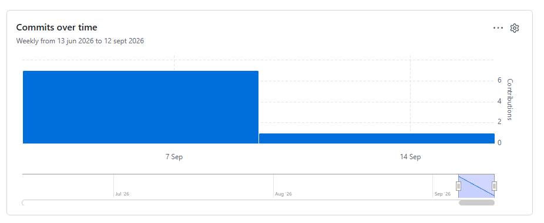

**AV1.** Para la AV1, la elaboración del informe se centró en desarrollar los contenidos establecidos en la rúbrica, incluyendo la presentación de la startup y del producto, el proceso Lean UX, el análisis de competidores, las entrevistas, el Needfinding y la especificación de requisitos mediante User Stories, Impact Map y Product Backlog. Todos los integrantes participaron en la elaboración y revisión del informe, coordinándose mediante reuniones presenciales y reuniones virtuales por Discord, además del uso de GitHub para gestionar y consolidar los avances realizados.

## Contenido

- [Student Outcome](#student-outcome)

- [Capítulo I: Introducción](#capítulo-i-introducción)
    - [1.1. Startup Profile](#11-startup-profile)
        - [1.1.1. Descripción de la Startup](#111-descripción-de-la-startup)
        - [1.1.2. Perfiles de integrantes del equipo](#112-perfiles-de-integrantes-del-equipo)
    - [1.2. Solution Profile](#12-solution-profile)
        - [1.2.1. Nombre del producto](#121-nombre-del-producto)
        - [1.2.2. Antecedentes y problemática](#122-antecedentes-y-problemática)
        - [1.2.3. Lean UX Process](#123-lean-ux-process)
            - [1.2.3.1. Lean UX Problem Statement](#1231-lean-ux-problem-statement)
            - [1.2.3.2. Lean UX Assumptions](#1232-lean-ux-assumptions)
            - [1.2.3.3. Lean UX Hypothesis](#1233-lean-ux-hypothesis)
            - [1.2.3.4. Lean UX Canvas](#1234-lean-ux-canvas)
    - [1.3. Segmentos objetivo](#13-segmentos-objetivo)

- [Capítulo II: Requirements Elicitation & Analysis](#capítulo-ii-requirements-elicitation--analysis)
    - [2.1. Competidores](#21-competidores)
        - [2.1.1. Análisis competitivo](#211-análisis-competitivo)
        - [2.1.2. Estrategias y tácticas frente a competidores](#212-estrategias-y-tácticas-frente-a-competidores)
    - [2.2. Entrevistas](#22-entrevistas)
        - [2.2.1. Diseño de entrevistas](#221-diseño-de-entrevistas)
        - [2.2.2. Registro de entrevistas](#222-registro-de-entrevistas)
        - [2.2.3. Análisis de entrevistas](#223-análisis-de-entrevistas)
    - [2.3. Needfinding](#23-needfinding)
        - [2.3.1. User Personas](#231-user-personas)
        - [2.3.2. User Task Matrix](#232-user-task-matrix)
        - [2.3.3. Empathy Maps](#233-empathy-maps)
        - [2.3.4. As-Is Scenario Mapping](#234-as-is-scenario-mapping)

- [Capítulo III: Requirements Specification](#capítulo-iii-requirements-specification)
    - [3.1. To-Be Scenario Mapping](#31-to-be-scenario-mapping)
    - [3.2. User Stories](#32-user-stories)
    - [3.3. Impact Mapping](#33-impact-mapping)
    - [3.4. Product Backlog](#34-product-backlog)

- [Capítulo IV: Product Architecture Design](#capítulo-iv-product-architecture-design)
    - [4.1. Design Concepts, ViewPoints & ER Diagrams](#41-design-concepts-viewpoints--er-diagrams)
        - [4.1.1. Principles Statements](#411-principles-statements)
        - [4.1.2. Approaches Statements Architectural Styles & Patterns](#412-approaches-statements-architectural-styles--patterns)
        - [4.1.3. Context Diagram](#413-context-diagram)
        - [4.1.4. Approach Driven ViewPoints Diagrams](#414-approach-driven-viewpoints-diagrams)
        - [4.1.5. Relational/Non Relational Database Diagram](#415-relationalnon-relational-database-diagram)
        - [4.1.6. Design Patterns](#416-design-patterns)
        - [4.1.7. Tactics](#417-tactics)
    - [4.2. Architectural Drivers](#42-architectural-drivers)
        - [4.2.1. Design Purpose](#421-design-purpose)
        - [4.2.2. Primary Functionality (Primary User Stories)](#422-primary-functionality-primary-user-stories)
        - [4.2.3. Quality Attribute Scenarios](#423-quality-attribute-scenarios)
        - [4.2.4. Constraints](#424-constraints)
        - [4.2.5. Architectural Concerns](#425-architectural-concerns)
    - [4.3. ADD Iterations](#43-add-iterations)
        - [4.3.1. Iteration 1: Gestión de viajes y seguimiento](#431-iteration-1-gestión-de-viajes-y-seguimiento)
        - [4.3.2. Iteration 2](#432-iteration-2)
        - [4.3.3. Iteration 3](#433-iteration-3)
        - [4.3.4. Iteration 4](#434-iteration-4)
        - [4.3.5. Iteration 5](#435-iteration-5)

- [Capítulo V: Product Implementation, Validation & Deployment](#capítulo-v-product-implementation-validation--deployment)
    - [5.1. Testing Suites & General Patterns](#51-testing-suites--general-patterns)
    - [5.2. Software Configuration Management](#52-software-configuration-management)
    - [5.3. Microservices Implementation](#53-microservices-implementation)
        - [5.3.1. Sprint 1](#531-sprint-1)

- [Conclusiones](#conclusiones)
- [Referencias Bibliográficas](#referencias-bibliográficas)
- [Anexos](#anexos)
- [Links](#links)

# Student Outcome

### ABET – EAC - Student Outcome 7

**Aprendizaje Continuo y Autónomo**

**Criterio:** La capacidad de adquirir y aplicar nuevos conocimientos según sea necesario, utilizando estrategias de aprendizaje apropiadas.

En el siguiente cuadro se describen las acciones realizadas y los enunciados de conclusiones por parte del equipo, que permiten sustentar el haber alcanzado el logro del ABET – EAC - Student Outcome 7.

| **Avance** | **Integrante** | **Actualiza conceptos y conocimientos necesarios para su desarrollo profesional y en especial para su proyecto en soluciones de software.** | **Reconoce la necesidad del aprendizaje permanente para el desempeño profesional y el desarrollo de proyectos en soluciones de software.** |
|---|---|---|---|
| **AV1** | **Loa Rojas, Jean Franck** | Investigó y aplicó conceptos de Lean UX para contribuir en la definición de la problemática, los supuestos y las hipótesis de la solución propuesta. | Reconoció la importancia de actualizar continuamente sus conocimientos sobre metodologías UX para comprender mejor las necesidades de los usuarios y orientar el desarrollo del producto. |
|  | **Rocca Leon, Anhelo Rodrigo** | Aplicó técnicas de análisis de competidores y entrevistas para obtener información relevante sobre el mercado, los usuarios y sus principales necesidades. | Identificó la necesidad de fortalecer continuamente sus conocimientos en investigación y análisis de usuarios para sustentar decisiones durante el desarrollo de soluciones de software. |
|  | **Fernandez Garfias, Alexander Piero** | Profundizó en técnicas de Needfinding mediante la elaboración de User Personas, User Task Matrix y Empathy Maps para representar las características y necesidades de los usuarios. | Reconoció que el aprendizaje continuo de técnicas de UX y análisis de usuarios permite adaptar las soluciones de software a necesidades y contextos cambiantes. |
|  | **De Las Casas Latour, Sebastián** | Aplicó nuevos conocimientos en la especificación de requisitos mediante la elaboración y organización de User Stories orientadas a las necesidades identificadas. | Reconoció la importancia de actualizar sus conocimientos sobre gestión y especificación de requisitos para mantener una adecuada relación entre las necesidades del usuario y las funcionalidades del producto. |
|  | **Aldair Joaquin Ramos Aguirre** | Fortaleció sus conocimientos sobre planificación de productos mediante la elaboración del Impact Map y la organización y priorización del Product Backlog. | Identificó la necesidad del aprendizaje permanente en técnicas de planificación y gestión de productos de software para responder adecuadamente a nuevos requerimientos y cambios del proyecto. |
|  | **Conclusiones** | **El equipo actualizó y aplicó conocimientos relacionados con Lean UX, investigación de usuarios, análisis de requisitos y planificación del producto, integrándolos en el desarrollo de los capítulos I, II y III del proyecto.** | **El equipo reconoció la importancia del aprendizaje continuo y autónomo para fortalecer sus competencias y adaptar el desarrollo de soluciones de software a las necesidades de los usuarios y a la evolución del proyecto.** |

# Capítulo I: Introducción

## 1.1. Startup Profile

### 1.1.1. Descripción de la Startup

LogiGo es una startup tecnológica orientada a mejorar la gestión y supervisión del transporte de carga mediante soluciones digitales. Identificamos que muchas empresas de transporte y logística presentan dificultades para monitorear en tiempo real la ubicación de sus vehículos, conocer el estado de sus rutas y mantener una comunicación directa con los conductores durante el recorrido. Esta falta de visibilidad puede generar demoras en la respuesta ante incidentes, menor control sobre las operaciones y dificultades para evaluar posteriormente lo ocurrido durante cada viaje.

Frente a esta problemática, LogiGo desarrolla **TrackTruck**, una plataforma orientada a la gestión y monitoreo del transporte de carga en tiempo real. La aplicación utiliza geolocalización para visualizar la ubicación de los camiones, supervisar los recorridos e identificar paradas, retrasos, tráfico, descansos, incidencias o posibles accidentes. Además, incorpora un sistema de comunicación mediante llamadas entre la empresa y los conductores, facilitando una respuesta rápida ante cualquier situación durante el trayecto.

Asimismo, TrackTruck mantiene un registro de las operaciones realizadas, incluyendo información sobre conductores, camiones, rutas, recorridos e incidencias. De esta manera, las empresas pueden consultar el historial de cada viaje, evaluar el desempeño de sus recursos y contar con una mayor trazabilidad de sus operaciones, mejorando el control, la seguridad y la capacidad de respuesta en el transporte de carga.

### 1.1.2. Perfiles de integrantes del equipo

| Foto | Información |
|---|---|
|  | **Nombre:** Jean Franck Loa Rojas  **Código:** U20241E406  **Carrera:** Ingeniería de Software  **Acerca de mí:**   Soy Jean Franck Loa Rojas, estudiante de séptimo ciclo de Ingeniería de Software. Mi fortaleza es trabajar el producto completo: desde el modelado con Domain-Driven Design y la definición de bounded contexts hasta la construcción de servicios backend con Java y Spring Boot, aplicaciones web con Angular y soluciones móviles con Flutter. También organizo repositorios con GitFlow, documento decisiones técnicas y valido que cada componente se integre correctamente. En el equipo aporto criterio arquitectónico, capacidad para convertir requerimientos complejos en implementaciones concretas y disciplina para respaldar cada avance con evidencia.|
|  | **Nombre:** Anhelo Rodrigo Rocca Leon  **Código:** U20221C803  **Carrera:** Ingeniería de Software  **Acerca de mí:**  Soy Anhelo Rodrigo Rocca Leon, estudiante de la carrera de Ingeniería de Software en la UPC. Tengo conocimientos en C++, HTML, CSS, JavaScript, C#, Python, Java y Flutter. Me interesa el desarrollo frontend para aplicaciones web y móviles, enfocándome en crear experiencias dinámicas, funcionales y adaptadas a las necesidades de los usuarios. |
|  | **Nombre:** Alexander Piero Fernandez Garfias  **Código:** U202019498  **Carrera:** Ingeniería de Software  **Acerca de mí:**  Soy Alexander Piero Fernandez Garfias, estudiante de la carrera de Ingeniería de Software en la UPC. Poseo conocimientos en C++, HTML, CSS, JavaScript, C#, Python, Java y Flutter. Me enfoco en el diseño y desarrollo frontend para aplicaciones web y móviles, aplicando creatividad y buenas prácticas para construir soluciones tecnológicas modernas y eficientes. |
|  | **Nombre:** Sebastián De Las Casas Latour  **Código:** U202213553  **Carrera:** Ingeniería de Software  **Acerca de mí:**  Soy Sebastián De Las Casas Latour, estudiante de Ingeniería de Software en la UPC. En TrackTruck contribuyo a transformar las necesidades de los segmentos objetivo en User Stories claras, criterios de aceptación verificables y una priorización coherente del producto. Me interesa fortalecer mis competencias en análisis, especificación de requisitos y trabajo colaborativo para construir soluciones de software alineadas con problemas reales.|
|  | **Nombre:** Aldair Joaquin Ramos Aguirre> **Código:** U20201f051  **Carrera:** Ingeniería de Software  **Acerca de mí:**  Soy estudiante de la carrera de Ingeniería de Software en la UPC. Tengo interés en seguir aprendiendo sobre tecnologías y metodologías relacionadas con el desarrollo de software, contribuyendo al trabajo colaborativo y al cumplimiento de los objetivos del proyecto. |

## 1.2. Solution Profile

### 1.2.1. Nombre del producto

**TrackTruck** es el producto digital desarrollado por LogiGo para apoyar la gestión, supervisión y trazabilidad de las operaciones de transporte de carga mediante el seguimiento de vehículos, conductores, rutas, viajes e incidencias.

### 1.2.2. Antecedentes y problemática

**Who (¿Quién?) - ¿A quiénes afecta el problema?**  
Empresas de transporte de carga y operadores logísticos que necesitan supervisar sus vehículos, conductores y rutas durante el traslado de mercancías.

**What (¿Qué?) - ¿Cuál es el problema exactamente?**  
La falta de una plataforma centralizada que permita monitorear en tiempo real la ubicación de los vehículos, conocer el estado de los recorridos, mantener comunicación con los conductores y registrar las incidencias ocurridas durante cada viaje. Esto dificulta que las empresas tengan una visión completa y actualizada de sus operaciones de transporte.

**Where (¿Dónde?) - ¿En qué contexto ocurre?**  
En las operaciones de transporte terrestre de carga, principalmente durante el desplazamiento de camiones entre los puntos de origen y destino de las mercancías, con un enfoque inicial en empresas que operan dentro del mercado peruano.

**When (¿Cuándo?) - ¿En qué momento se manifiesta el problema?**  
Durante el desarrollo de los viajes y recorridos de transporte, especialmente cuando ocurren paradas no previstas, retrasos, congestión vehicular, problemas en la ruta, accidentes u otras incidencias que requieren una respuesta oportuna por parte de la empresa.

**Why (¿Por qué?) - ¿Por qué ocurre el problema?**  
El problema surge debido a la falta de integración entre el seguimiento de vehículos, la comunicación con los conductores y el registro de las operaciones. Cuando esta información se encuentra dispersa o no está disponible en tiempo real, las empresas tienen mayores dificultades para supervisar sus unidades y responder ante situaciones inesperadas.

**How (¿Cómo?) - ¿Cómo impacta en el usuario?**  
La falta de visibilidad y comunicación dificulta conocer el estado real de los vehículos y conductores, identificar retrasos o incidencias y tomar decisiones oportunas. Además, limita la posibilidad de consultar posteriormente lo ocurrido durante cada recorrido y evaluar el desempeño de los recursos involucrados.

**How Much (¿Cuánto?) - ¿Qué tan grande es el problema?**  
El transporte de carga requiere un seguimiento constante de vehículos, conductores y recorridos para garantizar el cumplimiento de las operaciones. La ausencia de herramientas que centralicen esta información puede generar menor capacidad de supervisión y respuesta ante incidencias. En este contexto, existe una oportunidad para soluciones como **TrackTruck**, que integren geolocalización, comunicación y registro histórico de las operaciones en una misma plataforma.

### 1.2.3. Lean UX Process

#### 1.2.3.1. Lean UX Problem Statement

**Problem statement:**  
Actualmente, muchas empresas dedicadas al transporte de carga enfrentan dificultades para supervisar de manera centralizada y en tiempo real sus vehículos, conductores y rutas. Aunque existen herramientas de geolocalización y comunicación, estas suelen encontrarse separadas, lo que dificulta obtener una visión completa del estado de cada operación y responder de manera rápida ante retrasos, incidencias o posibles accidentes.

Esta problemática afecta especialmente a empresas de transporte y operadores logísticos que necesitan conocer constantemente la ubicación de sus camiones, el avance de los recorridos y el estado de sus conductores. La falta de integración entre estas funciones puede generar menor control operativo, dificultades en la comunicación y poca trazabilidad de lo ocurrido durante cada viaje.

**TrackTruck** busca atender esta necesidad mediante una plataforma que centralice el monitoreo de vehículos, la geolocalización de rutas, la comunicación con los conductores y el registro histórico de las operaciones. La solución estará orientada inicialmente a empresas de transporte de carga del mercado peruano y priorizará la facilidad de uso, la visualización en tiempo real y el acceso rápido a información relevante para la toma de decisiones.

#### 1.2.3.2. Lean UX Assumptions

Lean UX Assumptions es una técnica que permite identificar las principales suposiciones relacionadas con el negocio, los usuarios y sus necesidades antes de desarrollar completamente una solución. Estas suposiciones permiten orientar las decisiones del equipo y posteriormente validarlas mediante investigación y retroalimentación de los usuarios, reduciendo el riesgo de desarrollar funcionalidades que no respondan a necesidades reales.

#### Business Outcomes

**Creemos que nuestros clientes necesitan:**  
Nuestros clientes necesitan una plataforma que les permita supervisar en tiempo real el transporte de su carga, conocer la ubicación de sus vehículos, visualizar el estado de las rutas, comunicarse directamente con los conductores y consultar el historial de las operaciones realizadas.

**Estas necesidades se pueden resolver con:**  
Estas necesidades se pueden resolver mediante **TrackTruck**, una plataforma que integre geolocalización en tiempo real, seguimiento de rutas y recorridos, comunicación mediante llamadas y un registro centralizado de conductores, vehículos, rutas e incidencias.

**Nuestros clientes iniciales son (o serán):**  
Nuestros clientes iniciales serán empresas de transporte de carga y operadores logísticos que administren vehículos y conductores y necesiten mejorar la supervisión y trazabilidad de sus operaciones.

**El valor #1 que un cliente quiere de nuestro servicio es:**  
El principal valor que nuestros clientes buscan es tener mayor visibilidad y control sobre sus operaciones de transporte, pudiendo conocer en tiempo real dónde se encuentran sus vehículos y cuál es el estado de cada recorrido.

**El cliente también puede obtener estos beneficios adicionales:**  
Además del monitoreo en tiempo real, los clientes podrán mejorar su capacidad de respuesta ante incidencias, mantener comunicación directa con los conductores, consultar el historial de los viajes y evaluar el desempeño de sus vehículos y conductores.

**Vamos a adquirir la mayoría de nuestros clientes a través de:**  
Buscaremos adquirir clientes principalmente mediante estrategias de marketing digital dirigidas a empresas de transporte y logística, presencia en redes profesionales, contacto directo con empresas del sector y alianzas estratégicas relacionadas con el transporte de carga.

**Haremos dinero a través de:**  
Generaremos ingresos mediante planes de suscripción dirigidos a empresas, considerando las funcionalidades ofrecidas y las necesidades de gestión de sus operaciones de transporte.

**Nuestra competencia principal en el mercado será:**  
Nuestra competencia estará conformada por plataformas de gestión de flotas, sistemas de rastreo GPS y otras soluciones digitales orientadas al seguimiento y administración del transporte de carga.

**Los venceremos debido a:**  
Buscaremos diferenciarnos mediante una solución que centralice en una misma plataforma el monitoreo de vehículos, seguimiento de recorridos, comunicación con conductores y consulta del historial de operaciones, priorizando además una experiencia de uso clara y accesible.

**Nuestro mayor riesgo de producto es:**  
Nuestro principal riesgo es que las empresas no perciban suficiente valor diferencial frente a otras soluciones de rastreo y gestión de flotas existentes, lo que podría dificultar la adopción de TrackTruck.

**Resolveremos esto a través de:**  
Buscaremos reducir este riesgo mediante la validación continua con usuarios, la incorporación de mejoras basadas en sus necesidades y la priorización de funcionalidades que aporten valor directo a la supervisión y gestión de las operaciones.

#### User Outcomes

**¿Quién será nuestro usuario?**  
Nuestros usuarios serán principalmente responsables de empresas de transporte de carga, gestores de flotas y operadores logísticos encargados de supervisar vehículos, conductores y recorridos.

**¿Dónde encaja nuestro producto en su vida?**  
TrackTruck formará parte de la gestión cotidiana de las operaciones de transporte, permitiendo a los usuarios supervisar desde una plataforma el estado de sus vehículos, conductores y rutas mientras se realizan los viajes.

**¿Qué problemas tiene nuestro usuario y cómo se pueden resolver?**  
Los usuarios pueden tener dificultades para conocer la ubicación actual de los vehículos, identificar retrasos o incidencias, comunicarse rápidamente con los conductores y consultar posteriormente lo ocurrido durante un recorrido. TrackTruck busca resolver estas necesidades centralizando el monitoreo, la comunicación y el historial de las operaciones.

**¿Cómo y cuándo es usado nuestro producto?**  
TrackTruck será utilizado principalmente durante las operaciones de transporte de carga. Los usuarios podrán consultar la ubicación y recorrido de los camiones, detectar paradas, descansos, retrasos, tráfico o posibles incidencias y comunicarse con los conductores cuando sea necesario. Después de cada viaje, también podrán consultar el historial de la operación.

**¿Qué problemas puede tener nuestro producto?**  
Algunos problemas potenciales incluyen una ubicación imprecisa debido a problemas de conectividad o GPS, dificultades de adopción por parte de algunos usuarios, dependencia de una conexión a Internet y la necesidad de mantener actualizada la información de vehículos, conductores y recorridos.

**¿Qué características son importantes?**  
Las características principales de TrackTruck incluyen geolocalización y seguimiento en tiempo real, visualización de rutas y recorridos, identificación de paradas, descansos, retrasos e incidencias, comunicación mediante llamadas y registro histórico de conductores, vehículos, rutas y operaciones.

#### 1.2.3.3. Lean UX Hypothesis

**Hypothesis Statement 1:**  
Creemos que proporcionar a las empresas la **ubicación en tiempo real de sus vehículos y la visualización de sus recorridos** mejorará la visibilidad y el control sobre sus operaciones de transporte.  
Sabremos que esto es cierto cuando los usuarios puedan identificar con mayor facilidad la ubicación y el estado de los vehículos durante un viaje, reduciendo la necesidad de solicitar esta información directamente a los conductores.

**Hypothesis Statement 2:**  
Creemos que permitir la **identificación de paradas, descansos, retrasos, tráfico e incidencias durante el recorrido** facilitará la detección oportuna de situaciones que puedan afectar una operación de transporte.  
Sabremos que esto es cierto cuando los usuarios logren reconocer con mayor rapidez desviaciones o problemas durante los recorridos y puedan tomar decisiones a partir de la información proporcionada por TrackTruck.

**Hypothesis Statement 3:**  
Creemos que incorporar un **sistema de comunicación mediante llamadas entre la empresa y los conductores** mejorará la capacidad de respuesta ante problemas o situaciones inesperadas durante los viajes.  
Sabremos que esto es cierto cuando los usuarios puedan comunicarse directamente con los conductores desde la plataforma ante una incidencia, disminuyendo el tiempo necesario para establecer contacto y obtener información sobre lo ocurrido.

**Hypothesis Statement 4:**  
Creemos que mantener un **historial centralizado de conductores, vehículos, rutas, recorridos e incidencias** permitirá a las empresas contar con una mayor trazabilidad de sus operaciones de transporte.  
Sabremos que esto es cierto cuando los usuarios puedan consultar viajes anteriores y encontrar fácilmente información relevante sobre los recursos utilizados, los recorridos realizados y las incidencias registradas.

**Hypothesis Statement 5:**  
Creemos que centralizar el **monitoreo, la comunicación y el registro de las operaciones** en TrackTruck facilitará la gestión del transporte de carga y permitirá evaluar mejor el desempeño de los vehículos y conductores.  
Sabremos que esto es cierto cuando los usuarios utilicen la información recopilada por la plataforma para supervisar sus operaciones, revisar el desempeño de sus recursos y tomar decisiones con mayor información.

#### 1.2.3.4. Lean UX Canvas

El **Lean UX Canvas** de TrackTruck fue elaborado considerando la problemática, los supuestos, las hipótesis y los segmentos objetivo definidos durante el proceso Lean UX.

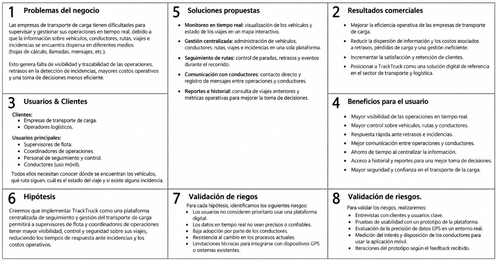

## 1.3. Segmentos objetivo

### Segmento 1: Empresas de transporte de carga

Este segmento está conformado por empresas dedicadas al transporte terrestre de mercancías que administran una flota de vehículos y conductores. Estas organizaciones necesitan supervisar constantemente el desarrollo de sus operaciones para conocer la ubicación de sus unidades, verificar el cumplimiento de las rutas y responder oportunamente ante retrasos, paradas, accidentes u otras incidencias.

TrackTruck busca atender estas necesidades mediante una plataforma que centralice la geolocalización de los vehículos, el seguimiento de los recorridos, la comunicación con los conductores y el registro histórico de las operaciones. De esta manera, las empresas pueden obtener mayor visibilidad y trazabilidad sobre sus viajes y contar con información que facilite la supervisión de sus recursos.

**Segmento Objetivo: Empresas de transporte de carga**

| Característica | Descripción |
|---|---|
| Tipo de cliente | Empresa (B2B) |
| Sector | Transporte terrestre de carga |
| Ubicación | Perú |
| Usuarios principales | Gestores de flota, supervisores y responsables de operaciones |
| Recursos gestionados | Camiones, conductores, rutas y viajes |
| Necesidad principal | Supervisar y controlar las operaciones de transporte en tiempo real |
| Funcionalidades de mayor valor | Geolocalización, seguimiento de rutas, comunicación, incidencias e historial de operaciones |

### Segmento 2: Operadores y empresas de logística

Este segmento comprende operadores y empresas de logística que coordinan operaciones relacionadas con el traslado de mercancías y requieren mantener visibilidad sobre el desarrollo del transporte. Debido a que pueden gestionar múltiples rutas, vehículos y operaciones simultáneamente, necesitan acceder de manera rápida a información actualizada que facilite el seguimiento y la toma de decisiones.

Para este segmento, TrackTruck permite centralizar la información de los recorridos y consultar el estado de las operaciones en tiempo real. Asimismo, el registro de rutas, conductores, vehículos e incidencias permite mantener la trazabilidad de los viajes y consultar posteriormente lo ocurrido durante cada operación.

**Segmento Objetivo: Operadores y empresas de logística**

| Característica | Descripción |
|---|---|
| Tipo de cliente | Empresa (B2B) |
| Sector | Logística y gestión del transporte |
| Ubicación | Perú |
| Usuarios principales | Operadores logísticos, coordinadores y responsables de operaciones |
| Recursos supervisados | Vehículos, conductores, rutas y operaciones de transporte |
| Necesidad principal | Obtener visibilidad y trazabilidad sobre el transporte de mercancías |
| Funcionalidades de mayor valor | Monitoreo en tiempo real, seguimiento de recorridos, comunicación, historial e incidencias |

# Capítulo II: Requirements Elicitation & Analysis

## 2.1. Competidores

Para comprender el entorno competitivo de **TrackTruck**, se analizaron soluciones relacionadas con el monitoreo de vehículos, gestión de flotas y seguimiento de operaciones de transporte. Este análisis permite identificar las principales funcionalidades ofrecidas actualmente en el mercado, así como sus fortalezas y diferencias frente a nuestra propuesta.

Para el análisis competitivo se han considerado competidores directos e indirectos que ofrecen funcionalidades relacionadas con geolocalización, seguimiento de rutas, gestión de conductores y supervisión de operaciones de transporte.

### FourKites

**Tipo de competidor: Directo**

FourKites ofrece soluciones orientadas a proporcionar visibilidad sobre las operaciones de transporte y la cadena de suministro. Sus herramientas permiten realizar seguimiento de cargas y obtener información sobre su ubicación y progreso durante el transporte, facilitando que las empresas tengan mayor visibilidad sobre sus operaciones.

Representa un competidor para TrackTruck debido a sus capacidades de seguimiento y visibilidad del transporte. Sin embargo, TrackTruck busca concentrar su propuesta en la supervisión de vehículos y conductores, integrando geolocalización, seguimiento de recorridos, comunicación y registro histórico de operaciones dentro de una misma plataforma.

### Fleet Complete

**Tipo de competidor: Directo**

Fleet Complete es una plataforma orientada a la gestión de flotas que permite a las empresas supervisar vehículos y conductores mediante tecnologías de geolocalización y telemática. Sus funcionalidades están enfocadas en proporcionar información sobre la ubicación de los vehículos, comportamiento de los conductores y desempeño de las operaciones de una flota.

Es uno de los competidores más cercanos a TrackTruck debido a que ambos buscan proporcionar mayor control y visibilidad sobre vehículos y conductores. TrackTruck busca diferenciarse mediante una experiencia centralizada para el seguimiento de recorridos, identificación de incidencias, comunicación directa con los conductores y consulta del historial de las operaciones de transporte.

### Tookan

**Tipo de competidor: Indirecto**

Tookan es una plataforma orientada principalmente a la gestión de entregas y operaciones de campo. Permite asignar tareas a conductores o agentes, realizar seguimiento en tiempo real y administrar rutas y entregas desde una plataforma centralizada.

Se considera un competidor indirecto debido a que comparte funcionalidades relacionadas con el seguimiento y gestión de vehículos y conductores, aunque su enfoque está más orientado a la administración de entregas y servicios de última milla. En contraste, TrackTruck se enfoca en la supervisión y trazabilidad de operaciones de transporte de carga, incluyendo vehículos, conductores, rutas, recorridos e incidencias.

### 2.1.1. Análisis competitivo

| | **TrackTruck** | **FourKites** | **Fleet Complete** | **Tookan** |
|---|---|---|---|---|
| **Perfil** | | | | |
| Overview | Plataforma de gestión y monitoreo del transporte de carga que permite supervisar vehículos y conductores en tiempo real mediante geolocalización, visualizar rutas y recorridos, identificar paradas, retrasos e incidencias, mantener comunicación con los conductores y consultar el historial de las operaciones realizadas. | Plataforma de visibilidad de la cadena de suministro que permite realizar seguimiento de cargas y operaciones de transporte en tiempo real, proporcionando información sobre el estado y progreso de los envíos. | Plataforma de gestión de flotas que permite supervisar vehículos y conductores mediante geolocalización y telemática, además de analizar diferentes aspectos relacionados con el desempeño de las operaciones. | Plataforma orientada a la gestión de entregas y operaciones de campo que permite asignar tareas, administrar conductores, planificar rutas y realizar seguimiento de las operaciones en tiempo real. |
| Ventaja competitiva | Centralización del monitoreo de vehículos, seguimiento de recorridos, comunicación con conductores, registro de incidencias e historial de operaciones en una plataforma orientada al transporte de carga. | Amplia visibilidad sobre operaciones de transporte y cadenas de suministro, con capacidades avanzadas para el seguimiento y gestión de excepciones. | Gestión integral de flotas con herramientas de seguimiento, telemática y análisis del desempeño de vehículos y conductores. | Facilidad para administrar entregas, asignar tareas y coordinar conductores mediante una plataforma flexible orientada a operaciones de distribución. |
| **Perfil de Marketing** | | | | |
| Mercado objetivo | Empresas de transporte de carga y operadores logísticos que necesitan supervisar vehículos, conductores, rutas y operaciones de transporte. | Empresas de logística, transporte y organizaciones que requieren visibilidad sobre sus operaciones y cadenas de suministro. | Empresas que administran flotas de vehículos y requieren herramientas para supervisar sus unidades y conductores. | Empresas de delivery, logística, comercio electrónico y organizaciones que gestionan entregas u operaciones de campo. |
| Estrategias de marketing | Marketing digital B2B, contacto directo con empresas de transporte y logística, presencia en redes profesionales y alianzas estratégicas con organizaciones relacionadas con el sector. | Posicionamiento empresarial basado en visibilidad de la cadena de suministro, integración tecnológica y optimización de operaciones logísticas. | Posicionamiento basado en eficiencia operativa, seguridad, telemática y optimización de la gestión de flotas. | Posicionamiento basado en facilidad de uso, automatización de operaciones, optimización de entregas y flexibilidad para diferentes tipos de empresas. |
| **Perfil de Producto** | | | | |
| Productos & Servicios | Geolocalización y monitoreo de vehículos en tiempo real, visualización de rutas y recorridos, identificación de paradas, descansos, retrasos e incidencias, comunicación mediante llamadas y registro histórico de conductores, vehículos, rutas y operaciones. | Seguimiento de transporte en tiempo real, visibilidad de envíos, gestión de excepciones, alertas y herramientas de análisis para operaciones logísticas. | Seguimiento GPS de vehículos, gestión de flotas, monitoreo de conductores, telemática, mantenimiento y herramientas de análisis operativo. | Planificación y optimización de rutas, asignación de tareas, gestión de conductores, seguimiento de entregas en tiempo real y reportes de desempeño. |
| Precios & Costos | Modelo de suscripción empresarial. Precios por definir según el alcance y las funcionalidades ofrecidas. | Precios personalizados de acuerdo con las necesidades y características de la operación empresarial. | Precios variables según la solución, cantidad de vehículos y servicios contratados. | Planes de suscripción según las funcionalidades y necesidades de las operaciones gestionadas. |
| Canales de distribución | Plataforma web responsive y acceso desde dispositivos móviles. | Web y móvil. | Web y móvil. | Web y móvil. |
| **Análisis SWOT** | | | | |
| Fortalezas | Plataforma enfocada en transporte de carga; centralización del monitoreo, comunicación e historial de operaciones; seguimiento de recorridos e incidencias; interfaz orientada a facilitar la supervisión de vehículos y conductores. | Plataforma consolidada con amplia capacidad de seguimiento y visibilidad de operaciones logísticas y de transporte. | Amplia variedad de herramientas para la gestión de flotas, vehículos y conductores, además de capacidades de telemática y análisis. | Facilidad de uso, flexibilidad para diferentes operaciones y herramientas especializadas en planificación, asignación y seguimiento de entregas. |
| Debilidades | Producto nuevo sin una base de clientes consolidada; menor cantidad de funcionalidades avanzadas frente a plataformas internacionales establecidas; dependencia de GPS y conectividad para el monitoreo en tiempo real. | Puede resultar una solución más compleja de implementar para organizaciones pequeñas que únicamente requieren seguimiento básico de vehículos. | La cantidad de funcionalidades disponibles puede incrementar la complejidad de adopción para empresas que buscan una solución sencilla de monitoreo. | Su enfoque principal en entregas y operaciones de última milla puede limitar su adaptación a determinadas operaciones de transporte de carga de mayor recorrido. |
| Oportunidades | Digitalización de las empresas de transporte de carga; necesidad de mayor trazabilidad de las operaciones; posibilidad de atender empresas peruanas que buscan centralizar el seguimiento de vehículos, conductores y rutas. | Expansión de la digitalización y necesidad de mayor visibilidad en las cadenas de suministro y operaciones de transporte. | Crecimiento de la digitalización de flotas y mayor demanda de herramientas de telemática y gestión vehicular. | Crecimiento del comercio electrónico, delivery y operaciones de última milla que requieren herramientas digitales de coordinación y seguimiento. |
| Amenazas | Competencia de plataformas internacionales consolidadas; aparición de nuevas soluciones de rastreo y gestión de flotas; riesgos relacionados con seguridad y privacidad de los datos de ubicación. | Competencia creciente de otras plataformas de visibilidad logística y desarrollo de nuevas tecnologías de seguimiento. | Competencia de soluciones de gestión de flotas más económicas y aparición de nuevas tecnologías para monitoreo vehicular. | Competencia de plataformas más especializadas y completas para gestión de flotas y transporte de carga. |

### 2.1.2. Estrategias y tácticas frente a competidores

En esta sección se presentan las principales estrategias y tácticas que **TrackTruck** aplicará para competir dentro del mercado de soluciones de monitoreo y gestión del transporte de carga. Estas acciones buscan fortalecer la propuesta de valor de la plataforma, diferenciarla de otras alternativas y responder a las necesidades de las empresas de transporte y operadores logísticos.

## Estrategias

**Diferenciación del producto:**  
TrackTruck buscará diferenciarse mediante la integración, en una sola plataforma, de funcionalidades orientadas a la supervisión del transporte de carga, como geolocalización en tiempo real, visualización de rutas y recorridos, identificación de paradas, retrasos e incidencias, comunicación con los conductores y consulta del historial de las operaciones.

**Enfoque en la trazabilidad de las operaciones:**  
Se priorizará el registro y almacenamiento de información relacionada con conductores, vehículos, rutas, recorridos e incidencias. Esto permitirá que las empresas no solo supervisen sus operaciones en tiempo real, sino que también puedan consultar posteriormente lo ocurrido durante cada viaje.

**Experiencia de usuario accesible:**  
TrackTruck buscará ofrecer una interfaz clara e intuitiva que facilite la supervisión de las operaciones sin requerir conocimientos técnicos avanzados. De esta manera, los responsables de operaciones y gestores de flota podrán acceder rápidamente a la información relevante sobre sus vehículos y conductores.

**Adaptación a las necesidades de las empresas:**  
La plataforma evolucionará considerando las necesidades identificadas en empresas de transporte de carga y operadores logísticos, priorizando aquellas funcionalidades que aporten mayor valor a la supervisión, comunicación y control de sus operaciones.

## Tácticas

**Implementación de retroalimentación de usuarios:**  
Se recopilarán y analizarán comentarios de empresas, gestores de flota y operadores logísticos para identificar problemas de uso, nuevas necesidades y oportunidades de mejora. Esta información permitirá priorizar las funcionalidades que generen mayor valor para los usuarios de TrackTruck.

**Monitoreo de la competencia:**  
Se realizará un seguimiento periódico de plataformas como FourKites, Fleet Complete y Tookan para identificar nuevas funcionalidades, cambios en sus propuestas de valor y tendencias relacionadas con el monitoreo y la gestión del transporte.

**Marketing digital B2B:**  
Se desarrollarán acciones de marketing digital dirigidas específicamente a empresas de transporte de carga y operadores logísticos, utilizando contenido relacionado con trazabilidad, monitoreo en tiempo real, gestión de flotas y control de operaciones para dar a conocer la propuesta de valor de TrackTruck.

**Contacto y demostraciones con empresas:**  
Se buscará establecer contacto directo con empresas del sector transporte y logística para presentar el funcionamiento de TrackTruck mediante demostraciones de la plataforma. Esto permitirá mostrar de forma práctica cómo la solución puede facilitar la supervisión de vehículos, conductores y recorridos.

**Mejora continua de la plataforma:**  
Se realizarán iteraciones constantes sobre TrackTruck a partir de los resultados obtenidos durante las pruebas con usuarios y del análisis del mercado, con el objetivo de mantener una solución competitiva y alineada con las necesidades del sector.

## 2.2. Entrevistas

## 2.2.1. Diseño de entrevistas

Las entrevistas tienen como objetivo conocer las necesidades, dificultades y procesos actuales de los segmentos objetivo de **TrackTruck** en relación con la supervisión de vehículos, conductores, rutas y operaciones de transporte. Asimismo, buscan identificar las herramientas que utilizan actualmente, la manera en que gestionan incidencias y el nivel de importancia que tiene para ellos disponer de información en tiempo real.

La información obtenida permitirá validar las principales suposiciones planteadas durante el proceso Lean UX y determinar qué funcionalidades de TrackTruck generan mayor valor para los usuarios.

### Segmento objetivo 1: Empresas de transporte de carga

1. ¿Cuánto tiempo lleva su empresa realizando operaciones de transporte de carga?
2. ¿Cuántos vehículos y conductores aproximadamente gestionan actualmente?
3. ¿Cómo supervisan actualmente la ubicación y el recorrido de sus vehículos durante un viaje?
4. ¿Qué herramientas o tecnologías utilizan para realizar el seguimiento de sus vehículos y conductores?
5. ¿Cuáles son los principales problemas que enfrentan al supervisar sus operaciones de transporte?
6. ¿Cómo identifican actualmente retrasos, paradas no previstas, problemas en la ruta u otras incidencias durante un recorrido?
7. ¿Cómo se comunican con los conductores cuando necesitan conocer el estado de un viaje o cuando ocurre algún problema?
8. ¿Qué procedimiento siguen cuando ocurre una incidencia o emergencia durante el transporte?
9. ¿Mantienen algún registro o historial de los viajes, rutas e incidencias ocurridas? ¿Cómo gestionan actualmente esta información?
10. ¿Qué información consideran más importante visualizar para supervisar adecuadamente un vehículo durante su recorrido?
11. ¿Qué dificultades encuentran al administrar información relacionada con vehículos, conductores, rutas y viajes?
12. ¿Qué tan útil sería para su empresa contar con una plataforma que centralice el monitoreo de vehículos, recorridos, comunicación e incidencias?
13. ¿Qué funcionalidades consideraría indispensables en una plataforma de gestión y monitoreo del transporte de carga?
14. ¿Qué factores tomaría en cuenta su empresa antes de adoptar una plataforma como TrackTruck?

### Segmento objetivo 2: Operadores y empresas de logística

1. ¿Qué tipo de operaciones logísticas y de transporte gestiona actualmente su empresa?
2. ¿Con qué frecuencia necesitan supervisar vehículos, rutas o viajes durante el transporte de mercancías?
3. ¿Cómo realizan actualmente el seguimiento de las operaciones de transporte?
4. ¿Qué herramientas o sistemas utilizan para conocer la ubicación y el estado de los vehículos o cargas?
5. ¿Cuáles son las principales dificultades que encuentran al supervisar múltiples operaciones de transporte?
6. ¿Cómo detectan actualmente retrasos, paradas, problemas de tráfico u otras incidencias que puedan afectar un viaje?
7. ¿Cómo mantienen la comunicación con los conductores o responsables del transporte durante los recorridos?
8. ¿Qué información necesitan conocer para determinar si una operación de transporte se está desarrollando correctamente?
9. ¿Cómo registran y consultan actualmente la información de rutas, recorridos e incidencias de operaciones anteriores?
10. ¿Qué dificultades tienen para mantener la trazabilidad de una operación desde su inicio hasta su finalización?
11. ¿Qué tan importante es para sus operaciones disponer de información actualizada sobre vehículos, conductores y recorridos?
12. ¿Qué tan útil sería contar con una plataforma que permita visualizar y centralizar esta información en tiempo real?
13. ¿Qué funcionalidades esperaría encontrar en una plataforma como TrackTruck?
14. ¿Qué aspectos relacionados con facilidad de uso, acceso a la información o comunicación considerarían importantes para utilizar este tipo de plataforma?

### 2.2.2. Registro de entrevistas

En esta sección se presenta el registro de las entrevistas realizadas a los usuarios pertenecientes a los segmentos objetivo de **TrackTruck**. Para cada entrevista se registrarán los datos del entrevistado, la evidencia visual, el enlace al video, el timing correspondiente y un resumen de las principales respuestas obtenidas.

---

## Segmento objetivo 1: Empresas de transporte de carga

### Entrevista 1

| Campo | Detalle |
|---|---|
| Nombres y apellidos | Gianfranco Quispe |
| Segmento objetivo | Empresas de transporte de carga |
| Cargo / actividad | Empresario del sector de transporte y logística |
| Duración | 4:34 |
| URL del video | [Ver video](https://upcedupe-my.sharepoint.com/:v:/g/personal/u202218899_upc_edu_pe/IQDkzObcE5ATSpmZvlKaZk58ARkz3Yp5qF9_nS_ZYSTAGaQ?nav=eyJyZWZlcnJhbEluZm8iOnsicmVmZXJyYWxBcHAiOiJPbmVEcml2ZUZvckJ1c2luZXNzIiwicmVmZXJyYWxBcHBQbGF0Zm9ybSI6IldlYiIsInJlZmVycmFsTW9kZSI6InZpZXciLCJyZWZlcnJhbFZpZXciOiJNeUZpbGVzTGlua0NvcHkifX0&e=QOjMzT) |

  

**Resumen:**  
Gianfranco Quispe es un empresario con cinco años de experiencia en el sector logístico y de transporte. Durante la entrevista destacó la importancia de utilizar tecnología para mejorar la eficiencia y seguridad de las operaciones, especialmente en zonas rurales del Perú. Actualmente emplea herramientas GPS y medios de comunicación en tiempo real para supervisar y coordinar los viajes. También recopila información de sus clientes mediante encuestas y sistemas de calificación. Frente a incrementos de demanda, aumenta temporalmente la disponibilidad de vehículos y reorganiza sus operaciones. Sus respuestas evidencian la necesidad de contar con una aplicación como **TrackTruck**, que permita centralizar la gestión de vehículos, conductores, rutas y viajes.

---

### Entrevista 2

| Campo | Detalle |
|---|---|
| Nombres y apellidos | Diego Cisneros |
| Segmento objetivo | Empresas de transporte de carga |
| Cargo / actividad | Personal relacionado con la gestión de transporte |
| Duración | 6:25 |
| URL del video | [Ver video](https://upcedupe-my.sharepoint.com/:v:/g/personal/u202218899_upc_edu_pe/IQA-12ReLDzQR49ealZCQkCfATl5EcCRvhjS1SzkyXFY-xU?nav=eyJyZWZlcnJhbEluZm8iOnsicmVmZXJyYWxBcHAiOiJPbmVEcml2ZUZvckJ1c2luZXNzIiwicmVmZXJyYWxBcHBQbGF0Zm9ybSI6IldlYiIsInJlZmVycmFsTW9kZSI6InZpZXciLCJyZWZlcnJhbFZpZXciOiJNeUZpbGVzTGlua0NvcHkifX0&e=Ujrc4n) |

  

**Resumen:**  
Diego Cisneros considera que una aplicación móvil permitiría automatizar y optimizar diferentes procesos relacionados con el transporte, brindando mayor control sobre las operaciones. Señala que uno de los principales problemas son los retrasos ocasionados por el mal estado de algunas carreteras. Actualmente utiliza Excel para registrar información sobre los camiones, controlar su estado y programar mantenimientos según el tiempo de uso. Esto demuestra la necesidad de una solución como **TrackTruck**, donde la información de vehículos, viajes, rutas y estados pueda mantenerse centralizada y disponible de manera más rápida.

---

### Entrevista 3

| Campo | Detalle |
|---|---|
| Nombres y apellidos | Valeria Cardenas |
| Segmento objetivo | Empresas de transporte de carga |
| Cargo / actividad | Administradora en empresa de transporte de carga |
| Duración | 4:08 |
| URL del video | [Ver video](https://upcedupe-my.sharepoint.com/:v:/g/personal/u202218899_upc_edu_pe/IQBtRonP6CraSJUSB36JKYOyActf48po9v-Z1ghUJw-bAgE?nav=eyJyZWZlcnJhbEluZm8iOnsicmVmZXJyYWxBcHAiOiJPbmVEcml2ZUZvckJ1c2luZXNzIiwicmVmZXJyYWxBcHBQbGF0Zm9ybSI6IldlYiIsInJlZmVycmFsTW9kZSI6InZpZXciLCJyZWZlcnJhbFZpZXciOiJNeUZpbGVzTGlua0NvcHkifX0&e=6Xlw1F) |

  

**Resumen:**  
Valeria Cardenas cuenta con dos años de experiencia como administradora en el sector de transporte de carga. Menciona que las condiciones geográficas y de infraestructura del país representan dificultades importantes para las operaciones. Actualmente utiliza herramientas como Excel y rastreo satelital para gestionar los envíos y consultar su avance. También considera importantes la seguridad, puntualidad y adecuada gestión de los vehículos y conductores. La entrevista evidencia la necesidad de centralizar la información operativa y mantener un historial de vehículos, viajes y recorridos mediante una solución móvil como **TrackTruck**.

---

## Segmento objetivo 2: Operadores y empresas de logística

### Entrevista 4

| Campo | Detalle |
|---|---|
| Nombres y apellidos | Rodrigo Guerra |
| Segmento objetivo | Operadores y empresas de logística |
| Cargo / actividad | Emprendedor |
| Duración | 5:49 |
| URL del video | [Ver video](https://upcedupe-my.sharepoint.com/:v:/g/personal/u202218899_upc_edu_pe/IQAV3DQLGB33SpVkVyUbv9pQAUsYOLoLLNGkZGiAaly_qig?nav=eyJyZWZlcnJhbEluZm8iOnsicmVmZXJyYWxBcHAiOiJPbmVEcml2ZUZvckJ1c2luZXNzIiwicmVmZXJyYWxBcHBQbGF0Zm9ybSI6IldlYiIsInJlZmVycmFsTW9kZSI6InZpZXciLCJyZWZlcnJhbFZpZXciOiJNeUZpbGVzTGlua0NvcHkifX0&e=wJlceN) |

  

**Resumen:**  
Rodrigo Guerra es un emprendedor que depende de servicios de transporte de mercancías para desarrollar sus actividades comerciales. Durante la entrevista destacó problemas relacionados con la falta de visibilidad de los envíos y el control de los costos. Considera importante poder consultar el estado de un traslado y conocer su avance de forma sencilla. Mostró interés en utilizar una aplicación móvil que mejore la transparencia de las operaciones y destacó que la interfaz debería ser intuitiva y contar con un diseño moderno.

---

### Entrevista 5

| Campo | Detalle |
|---|---|
| Nombres y apellidos | Por completar |
| Segmento objetivo | Operadores y empresas de logística |
| Cargo / actividad | Personal de empresa de mobiliario |
| Duración | 3:35 |
| URL del video | [Ver video](https://upcedupe-my.sharepoint.com/:v:/g/personal/u202218899_upc_edu_pe/IQCYIb0z_NwBTLbajN-6r4f9AWyuPx7pVcLQDYFiSKfXhjQ?nav=eyJyZWZlcnJhbEluZm8iOnsicmVmZXJyYWxBcHAiOiJPbmVEcml2ZUZvckJ1c2luZXNzIiwicmVmZXJyYWxBcHBQbGF0Zm9ybSI6IldlYiIsInJlZmVycmFsTW9kZSI6InZpZXciLCJyZWZlcnJhbFZpZXciOiJNeUZpbGVzTGlua0NvcHkifX0&e=ah7IkZ) |

  

**Resumen:**  
El entrevistado trabaja en una empresa dedicada al sector mobiliario y considera fundamental el servicio de transporte para realizar las entregas de sus productos. Entre los principales problemas identifica los retrasos, los posibles daños a la mercancía y la falta de comunicación con los transportistas. Considera útil disponer de una aplicación que permita conocer el estado de los envíos y mejorar la transparencia durante el traslado. También menciona como importante conocer la ubicación y el progreso de la entrega. Sus respuestas muestran interés por una solución que facilite el seguimiento y reduzca la incertidumbre durante las operaciones de transporte.

---

### Entrevista 6

| Campo | Detalle |
|---|---|
| Nombres y apellidos | Jael Pinta |
| Segmento objetivo | Operadores y empresas de logística |
| Cargo / actividad | Comerciante mayorista de prendas |
| Duración | 4:12 |
| URL del video | [Ver video](https://upcedupe-my.sharepoint.com/:v:/g/personal/u202218899_upc_edu_pe/IQAz-85vOfF1R46gy8UA0z54AfCV6TF7BxvrpjY63Y2yBAs?nav=eyJyZWZlcnJhbEluZm8iOnsicmVmZXJyYWxBcHAiOiJPbmVEcml2ZUZvckJ1c2luZXNzIiwicmVmZXJyYWxBcHBQbGF0Zm9ybSI6IldlYiIsInJlZmVycmFsTW9kZSI6InZpZXciLCJyZWZlcnJhbFZpZXciOiJNeUZpbGVzTGlua0NvcHkifX0&e=CS9mfl) |

  

**Resumen:**  
Jael Pinta se dedica a la venta mayorista de prendas hacia diferentes zonas del interior del país y utiliza servicios de transporte para realizar sus envíos. Su principal preocupación es la seguridad de la mercancía, debido a que en algunas ocasiones los productos no llegan completos o en las mismas condiciones en las que fueron enviados. También menciona que la comunicación mediante canales tradicionales puede resultar lenta y generar pérdida de tiempo al consultar el estado de los envíos. Considera importante contar con mayor información sobre el traslado y mejorar la organización y trazabilidad de las operaciones.

---

### Entrevista 7

| Campo | Detalle |
|---|---|
| Nombres y apellidos |  Alonso Shovl |
| Segmento objetivo | Operadores y empresas de logística |
| Cargo / actividad | Comerciante de equipo de ferretería |
| Duración | 8:22 |
| URL del video | [Ver video](https://upcedupe-my.sharepoint.com/:v:/g/personal/u202213553_upc_edu_pe/IQBnolRqUlm5SoIE66MFLH98AU3jHadHbl2VdK9mHX7oo6A?nav=eyJyZWZlcnJhbEluZm8iOnsicmVmZXJyYWxBcHAiOiJPbmVEcml2ZUZvckJ1c2luZXNzIiwicmVmZXJyYWxBcHBQbGF0Zm9ybSI6IldlYiIsInJlZmVycmFsTW9kZSI6InZpZXciLCJyZWZlcnJhbFZpZXciOiJNeUZpbGVzTGlua0NvcHkifX0&e=OfYgGa) |

  

**Resumen:**  
Alonso habla de las dificultades que tiene a la hora de comunicarse con los conductores de los camiones y cómo es díficil mantener organizado el estado de los mismos, igual que la carga.

## 2.2.3. Análisis de entrevistas

A partir de las entrevistas realizadas se analizaron las principales características, necesidades, dificultades y expectativas de los participantes pertenecientes a cada segmento objetivo. El análisis considera aspectos objetivos y subjetivos identificados de manera recurrente en las respuestas, los cuales servirán posteriormente como base para la construcción de los User Personas y demás artefactos de Needfinding.

### Segmento objetivo 1: Empresas de transporte de carga

A partir de las tres entrevistas realizadas a representantes de empresas de transporte de carga, se identificó que el **100 % de los entrevistados considera importante conocer la ubicación de sus vehículos durante el desarrollo de los viajes**. Asimismo, el **66.7 % indicó tener dificultades para obtener de manera inmediata información sobre el estado de un recorrido cuando ocurre un retraso, parada no prevista u otra incidencia**.

Respecto a la comunicación, el **100 % señaló que mantiene contacto con los conductores durante las operaciones**, principalmente cuando necesita conocer el estado del viaje o resolver algún inconveniente. Sin embargo, el **66.7 % manifestó interés en contar con una solución que facilite la comunicación y permita relacionarla con la información del recorrido.

En cuanto a la trazabilidad, el **66.7 % indicó que actualmente la información relacionada con vehículos, conductores, rutas e incidencias se encuentra distribuida entre diferentes medios o herramientas**, dificultando la consulta posterior de lo ocurrido durante una operación.

Finalmente, el **100 % de los entrevistados mostró interés en disponer de una plataforma que centralice la información de sus operaciones de transporte**, destacando como funcionalidades de mayor valor la geolocalización en tiempo real, la visualización de rutas y recorridos, el registro de incidencias, la comunicación con los conductores y el historial de viajes.

Estos resultados permiten identificar como características comunes del segmento la necesidad de **visibilidad en tiempo real, control operativo, comunicación rápida y trazabilidad de los recorridos**. Por ello, TrackTruck podría responder a sus principales necesidades mediante la centralización del monitoreo y la información relacionada con cada operación.

### Segmento objetivo 2: Operadores y empresas de logística

A partir de las tres entrevistas realizadas a representantes de operadores y empresas de logística, se identificó que el **100 % de los entrevistados necesita realizar seguimiento de las operaciones de transporte para conocer su estado y progreso**. Asimismo, el **66.7 % manifestó dificultades para supervisar simultáneamente diferentes vehículos, rutas u operaciones utilizando las herramientas disponibles actualmente**.

El **100 % consideró importante disponer de información actualizada sobre la ubicación y el recorrido de los vehículos**, mientras que el **66.7 % señaló que la identificación oportuna de retrasos, paradas o incidencias constituye una necesidad relevante para coordinar adecuadamente las operaciones logísticas.

Respecto a la información histórica, el **66.7 % manifestó que sería útil disponer de un registro centralizado de viajes, rutas, conductores e incidencias**, debido a que permitiría revisar posteriormente lo ocurrido durante una operación y mejorar su trazabilidad.

Finalmente, el **100 % mostró interés en una plataforma que permita consultar desde un mismo lugar la información relacionada con las operaciones de transporte**. Entre las funcionalidades consideradas más importantes se encuentran el monitoreo en tiempo real, la visualización del recorrido, la identificación de incidencias, la comunicación con los conductores y el acceso al historial de las operaciones.

A partir de estos resultados, se identifica que este segmento se caracteriza principalmente por buscar **información centralizada, trazabilidad, supervisión simultánea de operaciones y capacidad de respuesta ante incidencias**. Estas características respaldan el enfoque de TrackTruck como una herramienta orientada a facilitar la supervisión y gestión de las operaciones de transporte.

## 2.3. Needfinding

### 2.3.1. User Personas

Las siguientes fichas de **User Persona** fueron elaboradas en **UXPressia** a partir del análisis de los segmentos objetivo de TrackTruck, considerando las necesidades, comportamientos, objetivos y dificultades identificadas durante el proceso de entrevistas. Cada ficha representa un arquetipo de usuario que permite comprender mejor el contexto en el que se desarrollan las operaciones de transporte y las necesidades que TrackTruck busca atender.

Para el primer segmento, correspondiente a **empresas de transporte de carga**, se identificó un perfil relacionado con la gestión y supervisión de flotas, cuyo principal objetivo es mantener control sobre los vehículos, conductores y recorridos. Este usuario necesita conocer la ubicación de sus unidades, detectar retrasos o incidencias y mantener comunicación con los conductores para responder oportunamente ante situaciones que puedan afectar el transporte.

Para el segundo segmento, correspondiente a **operadores y empresas de logística**, se identificó un perfil orientado a la coordinación y seguimiento de múltiples operaciones de transporte. Este usuario valora especialmente el acceso rápido a información actualizada, la trazabilidad de los recorridos y la posibilidad de centralizar información sobre vehículos, conductores, rutas e incidencias para facilitar la supervisión y toma de decisiones.

**1. Primer segmento: Empresas de transporte de carga**

**2. Segundo segmento: Operadores y empresas de logística**

## 2.3.2. User Task Matrix

El **User Task Matrix** permite identificar y comparar las principales tareas que realizan los User Personas de los segmentos objetivo de TrackTruck para alcanzar sus objetivos dentro de las operaciones de transporte.

Para este análisis se consideran dos User Personas. **Carlos Mendoza** representa al segmento de empresas de transporte de carga y desempeña funciones relacionadas con la supervisión de vehículos y conductores. Por otro lado, **Andrea Salazar** representa al segmento de operadores y empresas de logística y se encarga principalmente de coordinar y supervisar las operaciones de transporte.

Las tareas presentadas corresponden a actividades propias de cada usuario dentro de su contexto de trabajo, independientemente de la existencia de TrackTruck.

| **User Task** | **Carlos Mendoza** | | **Andrea Salazar** | |
|---|---|---|---|---|
| | **Frecuencia** | **Importancia** | **Frecuencia** | **Importancia** |
| Supervisar la ubicación de los vehículos durante los recorridos | Siempre | Alta | Siempre | Alta |
| Verificar el cumplimiento de las rutas planificadas | Siempre | Alta | Siempre | Alta |
| Comunicarse con los conductores durante las operaciones | Siempre | Alta | A veces | Alta |
| Identificar retrasos, paradas o problemas durante un recorrido | Siempre | Alta | Siempre | Alta |
| Atender y coordinar acciones frente a incidencias durante el transporte | A veces | Alta | A veces | Alta |
| Revisar el estado de los conductores y vehículos asignados a una operación | Siempre | Alta | A veces | Media |
| Coordinar diferentes operaciones de transporte simultáneamente | A veces | Media | Siempre | Alta |
| Registrar información relacionada con los viajes realizados | Siempre | Media | Siempre | Media |
| Consultar información de recorridos y operaciones anteriores | A veces | Media | A veces | Media |
| Informar sobre el estado y progreso de una operación de transporte | A veces | Media | Siempre | Alta |
| Evaluar el cumplimiento de una operación al finalizar el recorrido | Siempre | Alta | Siempre | Alta |

### Análisis de la User Task Matrix

La matriz evidencia que ambos User Personas comparten como tareas de **alta importancia** la supervisión de los recorridos, la verificación del cumplimiento de las rutas, la identificación de retrasos o incidencias y la evaluación del cumplimiento de las operaciones. Esto demuestra que ambos segmentos requieren mantener visibilidad constante sobre el desarrollo del transporte.

En el caso de **Carlos Mendoza**, debido a su rol como supervisor de flota, destacan con mayor frecuencia las tareas relacionadas con la supervisión directa de vehículos y conductores, la comunicación durante los recorridos y la verificación del estado de los recursos asignados a cada operación.

Por otro lado, **Andrea Salazar**, como coordinadora de operaciones logísticas, realiza con mayor frecuencia tareas relacionadas con la coordinación simultánea de diferentes operaciones y la comunicación del estado y progreso de los transportes.

La principal coincidencia entre ambos perfiles se encuentra en la necesidad de conocer el estado de las operaciones y responder oportunamente ante situaciones que puedan afectar los recorridos. La principal diferencia radica en que el primer User Persona presenta un enfoque más orientado al **control de la flota y los conductores**, mientras que el segundo tiene un enfoque relacionado con la **coordinación y seguimiento general de las operaciones logísticas**.

### 2.3.3. Empathy Mapping

En esta sección se presentan los **Empathy Maps** elaborados en **UXPressia** para cada uno de los User Personas identificados en los segmentos objetivo de TrackTruck. Estos mapas permiten comprender con mayor profundidad las necesidades, comportamientos, pensamientos, preocupaciones y expectativas de los usuarios dentro de su contexto de trabajo.

Para su elaboración, se colocó a cada User Persona como elemento central y se analizaron las observaciones obtenidas durante las entrevistas. A partir de ello, se organizaron los principales hallazgos considerando qué necesita hacer el usuario, qué dice, qué ve, qué hace, qué escucha y qué piensa o siente. Finalmente, se identificaron sus principales **Pains** y **Gains**, los cuales permiten reconocer los problemas que enfrenta actualmente y los resultados que espera obtener.

#### 1. Empathy Map del primer segmento: Empresas de transporte de carga

El primer Empathy Map corresponde a **Carlos Mendoza**, supervisor de flota y representante del segmento de empresas de transporte de carga. Este perfil se caracteriza por la necesidad de mantener control sobre los vehículos y conductores durante los recorridos, verificar el cumplimiento de las rutas y responder oportunamente ante retrasos o incidencias.

Entre sus principales preocupaciones se encuentran la dificultad para conocer inmediatamente lo que ocurre durante un recorrido, la necesidad de comunicarse constantemente con los conductores y la falta de información centralizada sobre viajes anteriores. Como principales resultados esperados, busca disponer de mayor visibilidad sobre su flota, responder rápidamente ante problemas y mantener un mejor registro de las operaciones realizadas.

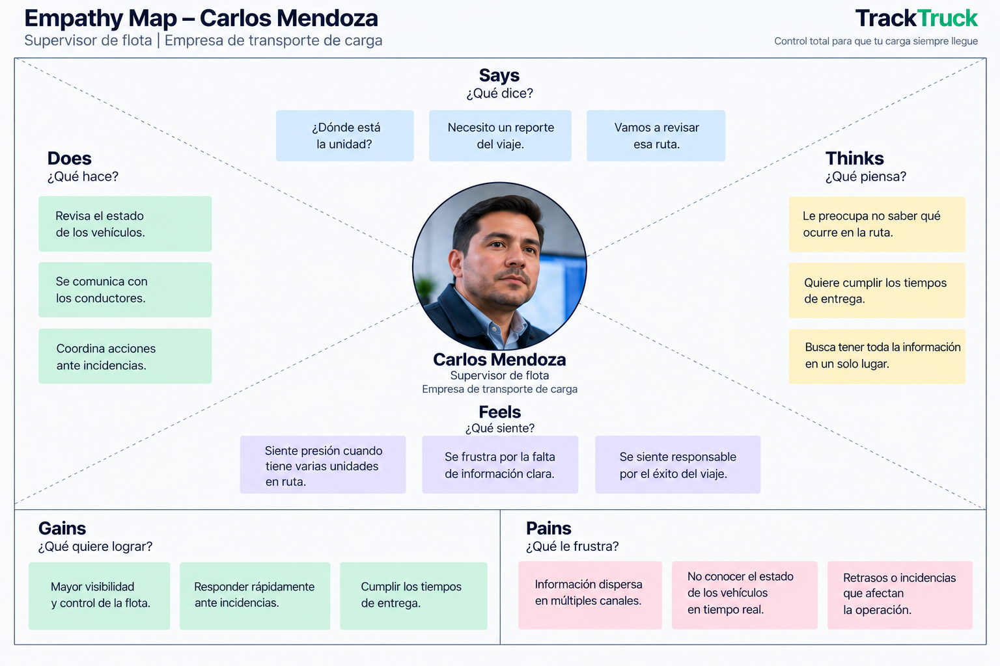

#### 2. Empathy Map del segundo segmento: Operadores y empresas de logística

El segundo Empathy Map corresponde a **Andrea Salazar**, coordinadora de operaciones y representante del segmento de operadores y empresas de logística. Este perfil necesita coordinar y supervisar diferentes operaciones de transporte, conocer el progreso de los recorridos e identificar situaciones que puedan afectar el cumplimiento de las operaciones.

Sus principales preocupaciones están relacionadas con la dificultad para supervisar simultáneamente diferentes operaciones, la información dispersa entre distintos medios y la necesidad de obtener información actualizada cuando ocurre un retraso o incidencia. Como principales resultados esperados, busca centralizar la información de las operaciones, mejorar la trazabilidad de los recorridos y disponer de información que facilite la toma de decisiones.

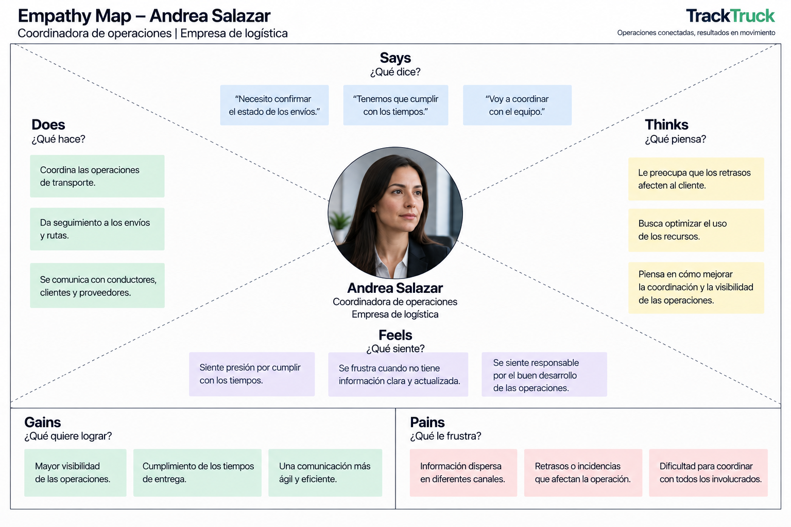

### 2.3.4. As-Is Scenario Mapping

En esta sección se presentan los **As-Is Scenario Mapping** elaborados en **LucidChart** para los User Personas de cada segmento objetivo. Estos escenarios representan la manera en que los usuarios realizan actualmente sus actividades de supervisión y coordinación del transporte de carga **sin contar con TrackTruck**, permitiendo identificar sus acciones, pensamientos y emociones durante las diferentes etapas de una operación.

Para su elaboración, el equipo inició con una etapa de preparación tomando como referencia los User Personas, las entrevistas y los hallazgos obtenidos durante el Needfinding. Posteriormente, se realizó una lluvia de ideas individual para identificar las principales actividades, pensamientos y emociones experimentadas por cada usuario. Los resultados fueron revisados en conjunto y agrupados en diferentes fases que representan el desarrollo de una operación de transporte.

Finalmente, se identificaron las áreas positivas, negativas y **blank areas** presentes durante la experiencia. Las áreas positivas representan situaciones que actualmente funcionan de manera adecuada; las negativas corresponden a dificultades, frustraciones o problemas experimentados por los usuarios; mientras que las blank areas representan aspectos sobre los cuales todavía es necesario obtener mayor información.

Cada As-Is Scenario Mapping se encuentra organizado mediante las filas **Phases, Doing, Thinking y Feeling**.

#### 1. As-Is Scenario Mapping del primer segmento: Empresas de transporte de carga

El primer escenario corresponde a **Carlos Mendoza**, supervisor de flota y representante del segmento de empresas de transporte de carga. El escenario representa el proceso actual que realiza para preparar un viaje, supervisar el recorrido de los vehículos, atender posibles incidencias y revisar el cumplimiento de la operación.

Las fases identificadas para este escenario son **Preparación del viaje, Inicio del recorrido, Supervisión del recorrido, Gestión de incidencias y Finalización del viaje**.

Durante este proceso, Carlos debe consultar diferentes fuentes de información y mantener comunicación frecuente con los conductores para conocer el estado de las unidades. Los principales puntos negativos aparecen cuando necesita identificar rápidamente retrasos, paradas o incidencias y no dispone de toda la información de manera centralizada.

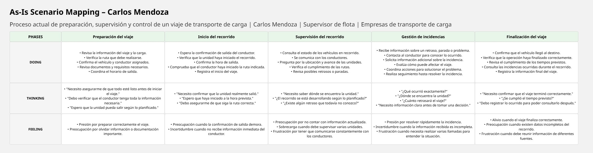

#### 2. As-Is Scenario Mapping del segundo segmento: Operadores y empresas de logística

El segundo escenario corresponde a **Andrea Salazar**, coordinadora de operaciones y representante del segmento de operadores y empresas de logística. El escenario representa el proceso actual que realiza para coordinar diferentes operaciones de transporte, realizar seguimiento a los recorridos, gestionar problemas y verificar posteriormente el cumplimiento de las operaciones.

Las fases identificadas para este escenario son **Planificación de operaciones, Coordinación del transporte, Seguimiento de operaciones, Gestión de incidencias y Evaluación de resultados**.

Durante este proceso, Andrea necesita consultar constantemente información sobre diferentes vehículos y recorridos, además de mantener comunicación con las personas involucradas en cada operación. Los principales puntos negativos se presentan cuando debe supervisar varias operaciones simultáneamente o cuando necesita obtener rápidamente información actualizada sobre un retraso o incidencia.

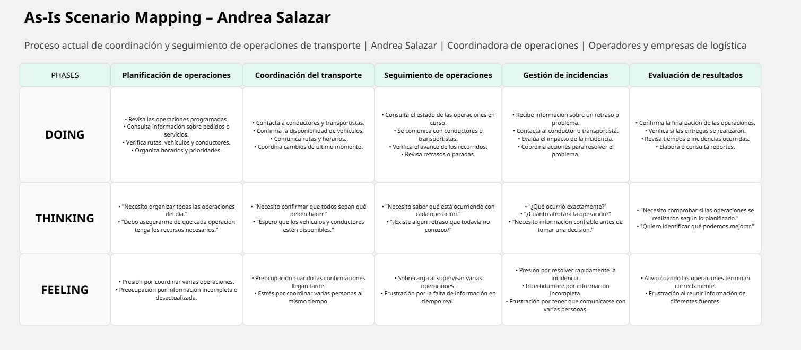

# Capítulo III: Requirements Specification

En esta sección se especifican los principales requisitos de **TrackTruck** a partir de la información obtenida durante las entrevistas y el proceso de Needfinding. Los hallazgos identificados permiten comprender las necesidades, dificultades y objetivos de los segmentos analizados y utilizarlos como base para definir las funcionalidades que deberá ofrecer la solución.

La especificación de requisitos comprende el **To-Be Scenario Mapping**, las **User Stories**, el **Impact Map** y el **Product Backlog**, permitiendo transformar las necesidades identificadas en requisitos concretos para el desarrollo de TrackTruck.

## 3.1. To-Be Scenario Mapping

En esta sección se presentan los **To-Be Scenario Mapping** elaborados en **LucidChart** para los User Personas de TrackTruck. A diferencia del As-Is Scenario Mapping, que representa la forma en que los usuarios realizan actualmente sus actividades, el escenario To-Be permite representar cómo podría mejorar su experiencia mediante el uso de TrackTruck.

Para su elaboración, el equipo tomó como punto de partida los problemas y oportunidades identificados en los **As-Is Scenario Mapping**. Posteriormente, se realizó una lluvia de ideas individual sobre posibles mejoras en la experiencia de cada usuario. Las propuestas fueron revisadas y agrupadas por el equipo para establecer las fases principales del nuevo escenario.

Finalmente, los escenarios To-Be fueron comparados con los escenarios As-Is para identificar los principales cambios que TrackTruck podría generar en las actividades, pensamientos y emociones de los usuarios. Cada escenario se encuentra organizado mediante las filas **Phases, Doing, Thinking y Feeling**.

### 1. To-Be Scenario Mapping del primer segmento: Empresas de transporte de carga

El primer escenario corresponde a **Carlos Mendoza**, supervisor de flota y representante del segmento de empresas de transporte de carga. El escenario representa cómo podría desarrollar sus actividades de supervisión utilizando TrackTruck para acceder de manera centralizada a información sobre vehículos, conductores y recorridos.

Las fases identificadas son **Preparación del viaje, Inicio del recorrido, Monitoreo en tiempo real, Gestión de incidencias y Finalización del viaje**.

Con TrackTruck, Carlos podría consultar la ubicación y recorrido de los vehículos desde una misma plataforma, identificar paradas, retrasos o incidencias y comunicarse con los conductores cuando sea necesario. Al finalizar el viaje, podría consultar el historial de la operación y revisar la información registrada durante el recorrido.

En comparación con el escenario As-Is, se busca reducir la necesidad de consultar información mediante diferentes medios y disminuir la incertidumbre sobre el estado de los vehículos durante los recorridos. Como resultado, Carlos tendría mayor visibilidad sobre las operaciones y una mejor capacidad de respuesta ante incidencias.

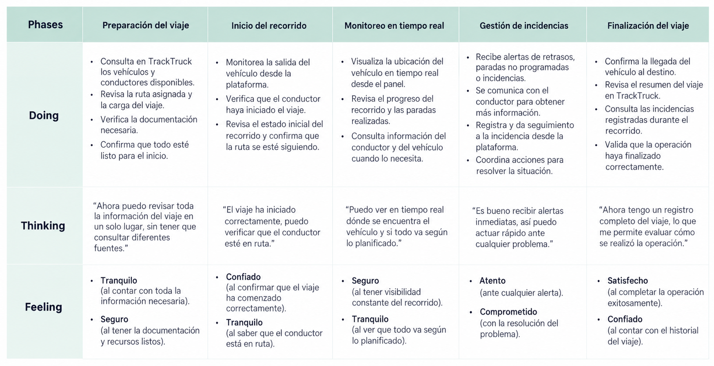

### 2. To-Be Scenario Mapping del segundo segmento: Operadores y empresas de logística

El segundo escenario corresponde a **Andrea Salazar**, coordinadora de operaciones y representante del segmento de operadores y empresas de logística. El escenario representa cómo podría coordinar y supervisar diferentes operaciones de transporte mediante TrackTruck.

Las fases identificadas son **Planificación de operaciones, Coordinación del transporte, Monitoreo de operaciones, Gestión de incidencias y Evaluación de resultados**.

Con TrackTruck, Andrea podría consultar desde una misma plataforma la información relacionada con vehículos, conductores, rutas y recorridos. Durante las operaciones podría visualizar su progreso, identificar retrasos o incidencias y comunicarse con los conductores cuando requiera información adicional.

Al finalizar las operaciones, podría consultar el historial de los recorridos y las incidencias registradas, facilitando la revisión de lo ocurrido durante cada viaje y mejorando la trazabilidad de las operaciones.

En comparación con el escenario As-Is, TrackTruck permitiría reducir la dispersión de información y facilitar la supervisión simultánea de las operaciones. De esta manera, Andrea podría acceder con mayor rapidez a información relevante y tomar decisiones con una visión más completa del estado de los transportes.

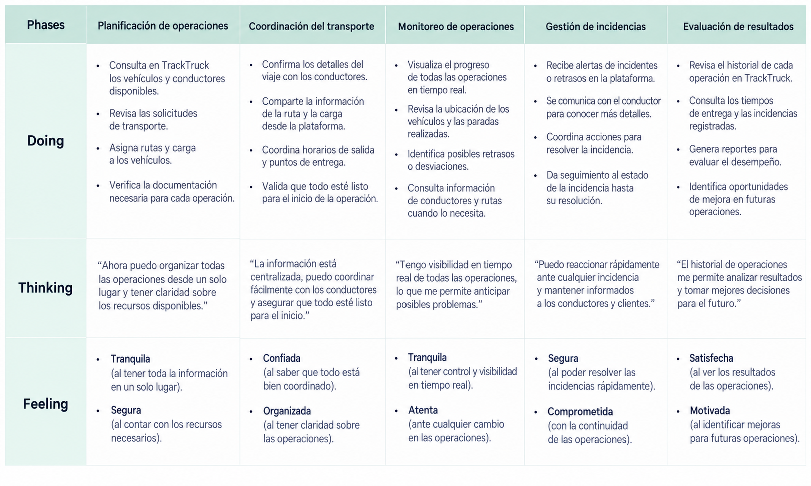

## 3.2. User Stories

En esta sección se presentan los principales requisitos funcionales y arquitectónicos identificados para **TrackTruck** a partir del análisis realizado durante las entrevistas, el Needfinding y los escenarios To-Be.

Las User Stories describen las necesidades de los usuarios utilizando el formato **"Como..., deseo..., para..."**, mientras que los criterios de aceptación permiten establecer las condiciones necesarias para considerar cada historia como completada.

Asimismo, se identifican las funcionalidades principales que afectan la estructura de la aplicación, los escenarios de atributos de calidad, las restricciones arquitectónicas y las principales preocupaciones arquitectónicas del sistema.

### Primary Functionality (Primary User Stories)

Las siguientes User Stories representan las funcionalidades principales de TrackTruck y los requisitos que tienen mayor influencia sobre la estructura de la aplicación.

| Epic / Story ID | Título | Descripción | Criterios de Aceptación | Relacionado con |
|---|---|---|---|---|
| **EP01** | Gestión de empresa | Epic orientado al registro y administración de la empresa que utilizará TrackTruck. | - | - |
| US01 | Registrar empresa | Como representante de una empresa de transporte o logística, deseo registrar mi empresa para comenzar a gestionar mis operaciones de transporte en TrackTruck. | **Scenario 1: Registro exitoso**   **Given** que ingreso los datos obligatorios de la empresa,   **When** confirmo el registro,   **Then** el sistema registra la empresa correctamente. | EP01 |
| US02 | Visualizar información de la empresa | Como responsable de operaciones, deseo consultar la información de mi empresa para verificar los datos registrados. | **Scenario 1: Consulta exitosa**   **Given** que la empresa se encuentra registrada,   **When** accedo a su información,   **Then** el sistema muestra los datos correspondientes. | EP01 |
| **EP02** | Gestión de vehículos | Epic orientado al registro y administración de los vehículos utilizados en las operaciones de transporte. | - | - |
| US03 | Registrar vehículo | Como supervisor de flota, deseo registrar un vehículo para incluirlo en las operaciones de transporte de mi empresa. | **Scenario 1: Registro exitoso**   **Given** que ingreso los datos obligatorios del vehículo,   **When** confirmo el registro,   **Then** el sistema almacena el vehículo y lo muestra como disponible. | EP02 |
| US04 | Consultar vehículos | Como supervisor de flota, deseo visualizar los vehículos registrados para conocer las unidades disponibles de la empresa. | **Scenario 1: Vehículos disponibles**   **Given** que existen vehículos registrados,   **When** accedo a la sección de vehículos,   **Then** el sistema muestra las unidades pertenecientes a la empresa. | EP02 |
| US05 | Actualizar información de vehículo | Como supervisor de flota, deseo actualizar la información de un vehículo para mantener sus datos correctos. | **Scenario 1: Actualización exitosa**   **Given** que selecciono un vehículo existente,   **When** modifico sus datos y confirmo los cambios,   **Then** el sistema almacena la información actualizada. | EP02 |
| **EP03** | Gestión de conductores | Epic orientado al registro y administración de los conductores involucrados en las operaciones de transporte. | - | - |
| US06 | Registrar conductor | Como supervisor de flota, deseo registrar un conductor para asignarlo posteriormente a las operaciones de transporte. | **Scenario 1: Registro exitoso**   **Given** que ingreso los datos obligatorios del conductor,   **When** confirmo el registro,   **Then** el sistema almacena al conductor correctamente. | EP03 |
| US07 | Consultar conductores | Como supervisor de flota, deseo visualizar los conductores registrados para conocer el personal disponible para las operaciones. | **Scenario 1: Consulta exitosa**   **Given** que existen conductores registrados,   **When** accedo a la sección de conductores,   **Then** el sistema muestra la información correspondiente. | EP03 |
| US08 | Actualizar información de conductor | Como supervisor de flota, deseo actualizar los datos de un conductor para mantener su información vigente. | **Scenario 1: Actualización exitosa**   **Given** que selecciono un conductor registrado,   **When** modifico y guardo sus datos,   **Then** el sistema actualiza la información del conductor. | EP03 |
| **EP04** | Gestión de rutas y viajes | Epic orientado a la planificación y administración de los recorridos realizados por los vehículos. | - | - |
| US09 | Registrar ruta | Como responsable de operaciones, deseo registrar una ruta indicando su origen y destino para utilizarla en las operaciones de transporte. | **Scenario 1: Ruta registrada**   **Given** que ingreso información válida sobre el origen y destino,   **When** confirmo el registro,   **Then** el sistema almacena la ruta correctamente. | EP04 |
| US10 | Crear viaje | Como responsable de operaciones, deseo crear un viaje para organizar una nueva operación de transporte. | **Scenario 1: Creación exitosa**   **Given** que existen los datos necesarios para la operación,   **When** creo un nuevo viaje,   **Then** el sistema registra la operación correctamente. | EP04 |
| US11 | Asignar vehículo a viaje | Como responsable de operaciones, deseo asignar un vehículo a un viaje para determinar qué unidad realizará el recorrido. | **Scenario 1: Asignación exitosa**   **Given** que existe un viaje y un vehículo disponible,   **When** asigno el vehículo,   **Then** el sistema relaciona la unidad con el viaje. | EP04 |
| US12 | Asignar conductor a viaje | Como responsable de operaciones, deseo asignar un conductor a un viaje para establecer quién realizará el recorrido. | **Scenario 1: Asignación exitosa**   **Given** que existe un viaje y un conductor disponible,   **When** realizo la asignación,   **Then** el sistema relaciona al conductor con el viaje. | EP04 |
| US13 | Consultar viajes activos | Como responsable de operaciones, deseo visualizar los viajes activos para conocer qué operaciones se encuentran actualmente en ejecución. | **Scenario 1: Consulta de viajes**   **Given** que existen viajes activos,   **When** accedo a las operaciones actuales,   **Then** el sistema muestra los viajes que se encuentran en ejecución. | EP04 |
| **EP05** | Monitoreo en tiempo real | Epic orientado a proporcionar visibilidad sobre la ubicación y el recorrido de los vehículos durante las operaciones. | - | - |
| US14 | Visualizar ubicación del vehículo | Como supervisor de flota, deseo visualizar la ubicación actual de un vehículo para conocer dónde se encuentra durante el viaje. | **Scenario 1: Ubicación disponible**   **Given** que el vehículo está realizando un viaje y existe información de ubicación disponible,   **When** consulto la operación,   **Then** el sistema muestra su ubicación actual en el mapa. | EP05 |
| US15 | Visualizar recorrido del viaje | Como responsable de operaciones, deseo visualizar el recorrido realizado por un vehículo para supervisar el progreso de la operación. | **Scenario 1: Recorrido disponible**   **Given** que existe información de geolocalización del viaje,   **When** visualizo el recorrido,   **Then** el sistema representa en el mapa el trayecto registrado. | EP05 |
| US16 | Identificar paradas durante el recorrido | Como supervisor de flota, deseo identificar las paradas realizadas durante un viaje para comprender mejor el desarrollo del recorrido. | **Scenario 1: Parada registrada**   **Given** que el vehículo ha permanecido detenido durante el recorrido,   **When** consulto el viaje,   **Then** el sistema muestra la parada registrada. | EP05 |
| US17 | Identificar retrasos en el viaje | Como responsable de operaciones, deseo identificar retrasos durante un viaje para tomar decisiones oportunamente. | **Scenario 1: Retraso identificado**   **Given** que el progreso de una operación presenta un retraso registrado,   **When** consulto su estado,   **Then** el sistema muestra la situación correspondiente. | EP05 |
| **EP06** | Gestión de incidencias | Epic orientado al registro y consulta de situaciones inesperadas ocurridas durante los viajes. | - | - |
| US18 | Registrar incidencia | Como conductor, deseo registrar una incidencia durante el recorrido para informar a la empresa sobre una situación que afecta el viaje. | **Scenario 1: Incidencia registrada**   **Given** que el conductor se encuentra realizando un viaje,   **When** registra la información de una incidencia,   **Then** el sistema la relaciona con la operación correspondiente. | EP06 |
| US19 | Consultar incidencias de un viaje | Como responsable de operaciones, deseo visualizar las incidencias de un viaje para conocer los problemas ocurridos durante el recorrido. | **Scenario 1: Consulta exitosa**   **Given** que existen incidencias registradas,   **When** consulto el viaje,   **Then** el sistema muestra las incidencias asociadas. | EP06 |
| **EP07** | Comunicación con conductores | Epic orientado a facilitar la comunicación entre los responsables de la empresa y los conductores. | - | - |
| US20 | Contactar al conductor | Como responsable de operaciones, deseo iniciar una llamada con el conductor asignado para comunicarme rápidamente cuando necesite información sobre el viaje. | **Scenario 1: Inicio de comunicación**   **Given** que existe un conductor asignado al viaje,   **When** selecciono la opción para contactarlo,   **Then** el sistema permite iniciar la comunicación con el conductor. | EP07 |
| **EP08** | Historial y trazabilidad | Epic orientado a mantener y consultar información histórica sobre las operaciones realizadas. | - | - |
| US21 | Consultar historial de viajes | Como responsable de operaciones, deseo consultar los viajes realizados anteriormente para revisar las operaciones de transporte de la empresa. | **Scenario 1: Historial disponible**   **Given** que existen viajes finalizados,   **When** accedo al historial,   **Then** el sistema muestra las operaciones anteriores. | EP08 |
| US22 | Consultar detalle de viaje finalizado | Como responsable de operaciones, deseo consultar el detalle de un viaje finalizado para revisar el vehículo, conductor, ruta, recorrido e incidencias relacionadas. | **Scenario 1: Detalle disponible**   **Given** que selecciono un viaje finalizado,   **When** solicito visualizar sus detalles,   **Then** el sistema muestra la información registrada durante la operación. | EP08 |
| US23 | Consultar detalle de vehículo | Como supervisor de flota, deseo consultar el detalle de un vehículo para conocer su información y los viajes asociados. | **Scenario 1: Consulta exitosa**   **Given** que existe un vehículo registrado,   **When** selecciono el vehículo,   **Then** el sistema muestra su información disponible. | EP02 |
| US24 | Consultar detalle de conductor | Como supervisor de flota, deseo consultar el detalle de un conductor para conocer su información y los viajes en los que ha participado. | **Scenario 1: Consulta exitosa**   **Given** que existe un conductor registrado,   **When** selecciono al conductor,   **Then** el sistema muestra su información disponible. | EP03 |
| US25 | Consultar rutas registradas | Como responsable de operaciones, deseo consultar las rutas registradas para seleccionar o revisar los recorridos utilizados por la empresa. | **Scenario 1: Rutas disponibles**   **Given** que existen rutas registradas,   **When** accedo a la sección de rutas,   **Then** el sistema muestra las rutas disponibles. | EP04 |
| US26 | Consultar detalle de viaje activo | Como responsable de operaciones, deseo consultar el detalle de un viaje activo para conocer su vehículo, conductor, ruta y estado actual. | **Scenario 1: Viaje activo**   **Given** que existe un viaje en ejecución,   **When** selecciono el viaje,   **Then** el sistema muestra la información actual de la operación. | EP04 |
| US27 | Iniciar viaje | Como conductor, deseo iniciar el viaje que me fue asignado para indicar que la operación de transporte ha comenzado. | **Scenario 1: Inicio exitoso**   **Given** que tengo un viaje asignado pendiente,   **When** confirmo el inicio,   **Then** el sistema cambia el estado del viaje a en curso. | EP04 |
| US28 | Finalizar viaje | Como conductor, deseo finalizar mi viaje para indicar que la operación de transporte ha concluido. | **Scenario 1: Finalización exitosa**   **Given** que existe un viaje en curso,   **When** confirmo su finalización,   **Then** el sistema registra el viaje como finalizado. | EP04 |
| US29 | Visualizar estado de un viaje | Como responsable de operaciones, deseo visualizar el estado de un viaje para conocer si se encuentra pendiente, en curso o finalizado. | **Scenario 1: Estado disponible**   **Given** que existe un viaje registrado,   **When** consulto su información,   **Then** el sistema muestra su estado actual. | EP04 |
| US30 | Visualizar vehículos en mapa | Como supervisor de flota, deseo visualizar los vehículos que se encuentran realizando viajes en un mapa para supervisar la flota desde una vista centralizada. | **Scenario 1: Vehículos activos**   **Given** que existen vehículos realizando viajes,   **When** accedo al mapa de monitoreo,   **Then** el sistema muestra sus ubicaciones disponibles. | EP05 |
| US31 | Seleccionar vehículo desde el mapa | Como supervisor de flota, deseo seleccionar un vehículo desde el mapa para consultar rápidamente la información de su operación actual. | **Scenario 1: Selección de vehículo**   **Given** que el mapa muestra un vehículo activo,   **When** selecciono su marcador,   **Then** el sistema muestra información relacionada con el viaje. | EP05 |
| US32 | Consultar última ubicación conocida | Como responsable de operaciones, deseo consultar la última ubicación conocida de un vehículo para disponer de información cuando no exista una actualización reciente. | **Scenario 1: Sin actualización reciente**   **Given** que temporalmente no existe una nueva ubicación,   **When** consulto el vehículo,   **Then** el sistema muestra la última ubicación registrada e indica que puede estar desactualizada. | EP05 |
| US33 | Visualizar progreso del recorrido | Como responsable de operaciones, deseo visualizar el progreso de un recorrido para conocer el avance de un vehículo hacia su destino. | **Scenario 1: Viaje en curso**   **Given** que el vehículo se encuentra realizando un viaje,   **When** consulto el recorrido,   **Then** el sistema muestra la información disponible sobre su progreso. | EP05 |
| US34 | Consultar información de una parada | Como supervisor de flota, deseo consultar una parada identificada durante un recorrido para conocer dónde ocurrió dentro del viaje. | **Scenario 1: Parada disponible**   **Given** que existe una parada registrada,   **When** selecciono la parada,   **Then** el sistema muestra su información asociada. | EP05 |
| US35 | Visualizar incidencias en el recorrido | Como responsable de operaciones, deseo visualizar las incidencias asociadas al recorrido para identificar dónde ocurrieron los problemas durante el viaje. | **Scenario 1: Incidencias disponibles**   **Given** que existen incidencias asociadas al viaje,   **When** consulto el recorrido,   **Then** el sistema muestra las incidencias registradas. | EP06 |
| US36 | Consultar detalle de incidencia | Como responsable de operaciones, deseo consultar el detalle de una incidencia para comprender la situación reportada durante el viaje. | **Scenario 1: Consulta exitosa**   **Given** que existe una incidencia registrada,   **When** selecciono la incidencia,   **Then** el sistema muestra su información correspondiente. | EP06 |
| US37 | Consultar incidencias anteriores | Como supervisor de flota, deseo consultar incidencias ocurridas en operaciones anteriores para revisar los problemas registrados durante los viajes. | **Scenario 1: Historial disponible**   **Given** que existen incidencias anteriores,   **When** accedo al historial de incidencias,   **Then** el sistema muestra los registros disponibles. | EP06 |
| US38 | Contactar conductor desde un viaje | Como responsable de operaciones, deseo acceder a la opción de llamada desde el detalle de un viaje para contactar rápidamente al conductor asignado. | **Scenario 1: Conductor asignado**   **Given** que el viaje tiene un conductor asignado,   **When** selecciono la opción de llamada,   **Then** el sistema permite iniciar la comunicación con dicho conductor. | EP07 |
| US39 | Filtrar historial de viajes | Como responsable de operaciones, deseo filtrar los viajes anteriores para encontrar con mayor facilidad una operación específica. | **Scenario 1: Aplicación de filtro**   **Given** que existen viajes registrados,   **When** aplico un criterio disponible,   **Then** el sistema muestra los viajes que cumplen con dicho criterio. | EP08 |
| US40 | Consultar historial de un vehículo | Como supervisor de flota, deseo consultar los viajes realizados por un vehículo para revisar su participación en operaciones anteriores. | **Scenario 1: Historial disponible**   **Given** que el vehículo ha participado en viajes,   **When** consulto su historial,   **Then** el sistema muestra sus operaciones anteriores. | EP08 |
| US41 | Consultar historial de un conductor | Como supervisor de flota, deseo consultar los viajes realizados por un conductor para revisar las operaciones en las que participó. | **Scenario 1: Historial disponible**   **Given** que el conductor ha participado en viajes,   **When** consulto su historial,   **Then** el sistema muestra las operaciones asociadas. | EP08 |
| US42 | Consultar historial de una ruta | Como responsable de operaciones, deseo consultar los viajes realizados sobre una ruta para revisar las operaciones asociadas a dicho recorrido. | **Scenario 1: Operaciones existentes**   **Given** que existen viajes asociados a la ruta,   **When** consulto su historial,   **Then** el sistema muestra las operaciones registradas. | EP08 |
| **EP09** | Dashboard de operaciones | Epic orientado a proporcionar una vista general del estado de las operaciones de transporte de la empresa. | - | - |
| US43 | Visualizar resumen de operaciones | Como responsable de operaciones, deseo visualizar un resumen de las operaciones para conocer rápidamente el estado general de los transportes gestionados. | **Scenario 1: Información disponible**   **Given** que existen operaciones registradas,   **When** accedo al dashboard,   **Then** el sistema muestra un resumen del estado de las operaciones. | EP09 |
| US44 | Visualizar viajes activos en dashboard | Como responsable de operaciones, deseo visualizar los viajes activos desde el dashboard para acceder rápidamente a las operaciones que requieren seguimiento. | **Scenario 1: Viajes activos**   **Given** que existen viajes en ejecución,   **When** accedo al dashboard,   **Then** el sistema muestra las operaciones activas. | EP09 |
| US45 | Visualizar incidencias actuales | Como responsable de operaciones, deseo visualizar las incidencias asociadas a operaciones activas para identificar situaciones que requieren atención. | **Scenario 1: Incidencias existentes**   **Given** que existen incidencias en operaciones activas,   **When** accedo al resumen de operaciones,   **Then** el sistema muestra las incidencias correspondientes. | EP09 |
| **EP10** | Acceso y cuentas | Epic orientado al acceso de los usuarios autorizados a la plataforma TrackTruck. | - | - |
| US46 | Iniciar sesión | Como usuario registrado, deseo iniciar sesión para acceder a las funciones de TrackTruck correspondientes a mi cuenta. | **Scenario 1: Credenciales válidas**   **Given** que ingreso credenciales válidas,   **When** solicito iniciar sesión,   **Then** el sistema permite el acceso a la plataforma.    **Scenario 2: Credenciales inválidas**   **Given** que ingreso credenciales incorrectas,   **When** intento iniciar sesión,   **Then** el sistema rechaza el acceso e informa que las credenciales no son válidas. | EP10 |
| US47 | Cerrar sesión | Como usuario autenticado, deseo cerrar mi sesión para finalizar de forma segura mi acceso a TrackTruck. | **Scenario 1: Cierre exitoso**   **Given** que tengo una sesión activa,   **When** selecciono cerrar sesión,   **Then** el sistema finaliza mi sesión y restringe el acceso a las funciones protegidas. | EP10 |
| US48 | Recuperar contraseña | Como usuario registrado, deseo recuperar mi contraseña para volver a acceder a TrackTruck si olvido mis credenciales. | **Scenario 1: Solicitud válida**   **Given** que mi correo se encuentra registrado,   **When** solicito recuperar mi contraseña,   **Then** el sistema inicia el procedimiento de recuperación. | EP10 |
| US49 | Consultar perfil | Como usuario autenticado, deseo consultar mi perfil para visualizar la información asociada a mi cuenta. | **Scenario 1: Perfil disponible**   **Given** que tengo una sesión activa,   **When** accedo a mi perfil,   **Then** el sistema muestra la información correspondiente a mi cuenta. | EP10 |
| US50 | Actualizar perfil | Como usuario autenticado, deseo actualizar la información de mi perfil para mantener mis datos vigentes. | **Scenario 1: Actualización exitosa**   **Given** que modifico información válida de mi perfil,   **When** guardo los cambios,   **Then** el sistema actualiza mis datos. | EP10 |

## 3.3. Impact Mapping

El **Impact Map** de TrackTruck fue elaborado en **UXPressia**. Este permite relacionar el objetivo de negocio del producto con los actores involucrados, los impactos esperados y las funcionalidades necesarias para alcanzarlos.

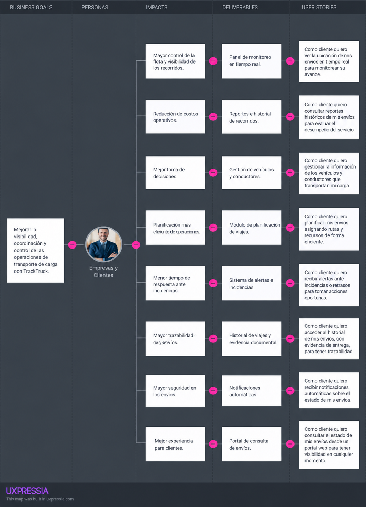

## Business Goal

Mejorar la visibilidad, el control y la trazabilidad de las operaciones de transporte de carga.

## Personas

- **Carlos Mendoza:** Supervisor de flota de una empresa de transporte de carga.
- **Andrea Salazar:** Coordinadora de operaciones de una empresa logística.

## Impacts

**Carlos Mendoza**
- Tener mayor visibilidad sobre la ubicación de los vehículos.
- Detectar retrasos, paradas e incidencias con mayor rapidez.
- Mejorar la comunicación con los conductores.
- Mantener mayor control sobre vehículos y viajes.

**Andrea Salazar**
- Supervisar varias operaciones desde un mismo lugar.
- Centralizar la información de los viajes.
- Mejorar la trazabilidad de las operaciones.
- Tomar decisiones con información más actualizada.

## Deliverables

- Monitoreo de vehículos en tiempo real.
- Visualización de rutas y recorridos.
- Gestión de paradas, retrasos e incidencias.
- Comunicación con conductores.
- Gestión de vehículos, conductores, rutas y viajes.
- Dashboard de operaciones.
- Historial de viajes.

## User Stories

Algunas User Stories relacionadas con el Impact Map son:

- **US14:** Visualizar ubicación del vehículo.
- **US15:** Visualizar recorrido del viaje.
- **US17:** Identificar retrasos en el viaje.
- **US18:** Registrar incidencia.
- **US20:** Contactar al conductor.
- **US21:** Consultar historial de viajes.
- **US30:** Visualizar vehículos en mapa.
- **US43:** Visualizar resumen de operaciones.

## 3.4. Product Backlog

El Product Backlog de **TrackTruck** reúne y prioriza las User Stories identificadas para el desarrollo del producto. El orden se establece principalmente según el valor que cada historia aporta a las empresas de transporte de carga y operadores logísticos, priorizando las funcionalidades relacionadas con el monitoreo, seguimiento de viajes, gestión de incidencias y trazabilidad de las operaciones.

La estimación se realiza mediante **Story Points**, utilizando los valores 1, 2, 3, 5 y 8 según la complejidad relativa de cada historia.

| **# Orden** | **User Story Id** | **Título** | **Descripción** | **Story Points** |
|---:|---|---|---|---:|
| 1 | US14 | Visualizar ubicación del vehículo | Como supervisor de flota, deseo visualizar la ubicación actual de un vehículo para conocer dónde se encuentra durante el viaje. | 8 |
| 2 | US30 | Visualizar vehículos en mapa | Como supervisor de flota, deseo visualizar los vehículos que se encuentran realizando viajes en un mapa para supervisar la flota desde una vista centralizada. | 8 |
| 3 | US15 | Visualizar recorrido del viaje | Como responsable de operaciones, deseo visualizar el recorrido realizado por un vehículo para supervisar el progreso de la operación. | 8 |
| 4 | US10 | Crear viaje | Como responsable de operaciones, deseo crear un viaje para organizar una nueva operación de transporte. | 5 |
| 5 | US13 | Consultar viajes activos | Como responsable de operaciones, deseo visualizar los viajes activos para conocer qué operaciones se encuentran actualmente en ejecución. | 5 |
| 6 | US26 | Consultar detalle de viaje activo | Como responsable de operaciones, deseo consultar el detalle de un viaje activo para conocer su vehículo, conductor, ruta y estado actual. | 5 |
| 7 | US17 | Identificar retrasos en el viaje | Como responsable de operaciones, deseo identificar retrasos durante un viaje para tomar decisiones oportunamente. | 5 |
| 8 | US16 | Identificar paradas durante el recorrido | Como supervisor de flota, deseo identificar las paradas realizadas durante un viaje para comprender mejor el desarrollo del recorrido. | 5 |
| 9 | US18 | Registrar incidencia | Como conductor, deseo registrar una incidencia durante el recorrido para informar a la empresa sobre una situación que afecta el viaje. | 5 |
| 10 | US19 | Consultar incidencias de un viaje | Como responsable de operaciones, deseo visualizar las incidencias de un viaje para conocer los problemas ocurridos durante el recorrido. | 3 |
| 11 | US35 | Visualizar incidencias en el recorrido | Como responsable de operaciones, deseo visualizar las incidencias asociadas al recorrido para identificar dónde ocurrieron los problemas durante el viaje. | 5 |
| 12 | US20 | Contactar al conductor | Como responsable de operaciones, deseo iniciar una llamada con el conductor asignado para comunicarme rápidamente cuando necesite información sobre el viaje. | 5 |
| 13 | US43 | Visualizar resumen de operaciones | Como responsable de operaciones, deseo visualizar un resumen de las operaciones para conocer rápidamente el estado general de los transportes gestionados. | 5 |
| 14 | US44 | Visualizar viajes activos en dashboard | Como responsable de operaciones, deseo visualizar los viajes activos desde el dashboard para acceder rápidamente a las operaciones que requieren seguimiento. | 3 |
| 15 | US45 | Visualizar incidencias actuales | Como responsable de operaciones, deseo visualizar las incidencias asociadas a operaciones activas para identificar situaciones que requieren atención. | 3 |
| 16 | US33 | Visualizar progreso del recorrido | Como responsable de operaciones, deseo visualizar el progreso de un recorrido para conocer el avance de un vehículo hacia su destino. | 5 |
| 17 | US09 | Registrar ruta | Como responsable de operaciones, deseo registrar una ruta indicando su origen y destino para utilizarla en las operaciones de transporte. | 3 |
| 18 | US11 | Asignar vehículo a viaje | Como responsable de operaciones, deseo asignar un vehículo a un viaje para determinar qué unidad realizará el recorrido. | 3 |
| 19 | US12 | Asignar conductor a viaje | Como responsable de operaciones, deseo asignar un conductor a un viaje para establecer quién realizará el recorrido. | 3 |
| 20 | US27 | Iniciar viaje | Como conductor, deseo iniciar el viaje que me fue asignado para indicar que la operación de transporte ha comenzado. | 3 |
| 21 | US28 | Finalizar viaje | Como conductor, deseo finalizar mi viaje para indicar que la operación de transporte ha concluido. | 3 |
| 22 | US29 | Visualizar estado de un viaje | Como responsable de operaciones, deseo visualizar el estado de un viaje para conocer si se encuentra pendiente, en curso o finalizado. | 2 |
| 23 | US32 | Consultar última ubicación conocida | Como responsable de operaciones, deseo consultar la última ubicación conocida de un vehículo para disponer de información cuando no exista una actualización reciente. | 3 |
| 24 | US34 | Consultar información de una parada | Como supervisor de flota, deseo consultar una parada identificada durante un recorrido para conocer dónde ocurrió dentro del viaje. | 3 |
| 25 | US36 | Consultar detalle de incidencia | Como responsable de operaciones, deseo consultar el detalle de una incidencia para comprender la situación reportada durante el viaje. | 2 |
| 26 | US38 | Contactar conductor desde un viaje | Como responsable de operaciones, deseo acceder a la opción de llamada desde el detalle de un viaje para contactar rápidamente al conductor asignado. | 3 |
| 27 | US21 | Consultar historial de viajes | Como responsable de operaciones, deseo consultar los viajes realizados anteriormente para revisar las operaciones de transporte de la empresa. | 5 |
| 28 | US22 | Consultar detalle de viaje finalizado | Como responsable de operaciones, deseo consultar el detalle de un viaje finalizado para revisar el vehículo, conductor, ruta, recorrido e incidencias relacionadas. | 5 |
| 29 | US39 | Filtrar historial de viajes | Como responsable de operaciones, deseo filtrar los viajes anteriores para encontrar con mayor facilidad una operación específica. | 3 |
| 30 | US40 | Consultar historial de un vehículo | Como supervisor de flota, deseo consultar los viajes realizados por un vehículo para revisar su participación en operaciones anteriores. | 3 |
| 31 | US41 | Consultar historial de un conductor | Como supervisor de flota, deseo consultar los viajes realizados por un conductor para revisar las operaciones en las que participó. | 3 |
| 32 | US42 | Consultar historial de una ruta | Como responsable de operaciones, deseo consultar los viajes realizados sobre una ruta para revisar las operaciones asociadas a dicho recorrido. | 3 |
| 33 | US37 | Consultar incidencias anteriores | Como supervisor de flota, deseo consultar incidencias ocurridas en operaciones anteriores para revisar los problemas registrados durante los viajes. | 3 |
| 34 | US03 | Registrar vehículo | Como supervisor de flota, deseo registrar un vehículo para incluirlo en las operaciones de transporte de mi empresa. | 3 |
| 35 | US04 | Consultar vehículos | Como supervisor de flota, deseo visualizar los vehículos registrados para conocer las unidades disponibles de la empresa. | 2 |
| 36 | US05 | Actualizar información de vehículo | Como supervisor de flota, deseo actualizar la información de un vehículo para mantener sus datos correctos. | 2 |
| 37 | US23 | Consultar detalle de vehículo | Como supervisor de flota, deseo consultar el detalle de un vehículo para conocer su información y los viajes asociados. | 3 |
| 38 | US06 | Registrar conductor | Como supervisor de flota, deseo registrar un conductor para asignarlo posteriormente a las operaciones de transporte. | 3 |
| 39 | US07 | Consultar conductores | Como supervisor de flota, deseo visualizar los conductores registrados para conocer el personal disponible para las operaciones. | 2 |
| 40 | US08 | Actualizar información de conductor | Como supervisor de flota, deseo actualizar los datos de un conductor para mantener su información vigente. | 2 |
| 41 | US24 | Consultar detalle de conductor | Como supervisor de flota, deseo consultar el detalle de un conductor para conocer su información y los viajes en los que ha participado. | 3 |
| 42 | US25 | Consultar rutas registradas | Como responsable de operaciones, deseo consultar las rutas registradas para seleccionar o revisar los recorridos utilizados por la empresa. | 2 |
| 43 | US01 | Registrar empresa | Como representante de una empresa de transporte o logística, deseo registrar mi empresa para comenzar a gestionar sus operaciones de transporte en TrackTruck. | 5 |
| 44 | US02 | Visualizar información de la empresa | Como responsable de operaciones, deseo consultar la información de mi empresa para verificar los datos registrados. | 2 |
| 45 | US46 | Iniciar sesión | Como usuario registrado, deseo iniciar sesión para acceder a las funciones de TrackTruck correspondientes a mi cuenta. | 3 |
| 46 | US47 | Cerrar sesión | Como usuario autenticado, deseo cerrar mi sesión para finalizar de forma segura mi acceso a TrackTruck. | 1 |
| 47 | US48 | Recuperar contraseña | Como usuario registrado, deseo recuperar mi contraseña para volver a acceder a TrackTruck si olvido mis credenciales. | 3 |
| 48 | US49 | Consultar perfil | Como usuario autenticado, deseo consultar mi perfil para visualizar la información asociada a mi cuenta. | 2 |
| 49 | US50 | Actualizar perfil | Como usuario autenticado, deseo actualizar la información de mi perfil para mantener mis datos vigentes. | 2 |

### Product Backlog en Trello

El Product Backlog de **TrackTruck** fue gestionado en **Trello**, donde las User Stories fueron organizadas y priorizadas de acuerdo con el valor que aportan al negocio. Asimismo, se realizó la estimación de cada historia mediante Story Points utilizando los valores 1, 2, 3, 5 y 8.

A continuación, se presenta la captura del Product Backlog gestionado en Trello:

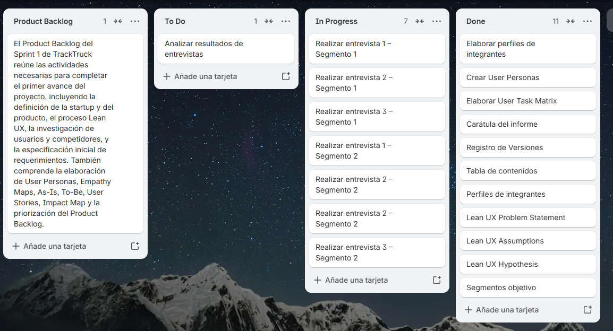

**Enlace público del Product Backlog:**  
https://trello.com/invite/b/6a9f35b637f25ac414075cf7/ATTIf84a9d213de599cd378224b9c2fa3fe4F4197A6F/mi-tablero-de-trello

# Capítulo IV: Product Architecture Design

## 4.1. Design Concepts, ViewPoints & ER Diagrams

### 4.1.1. Principles Statements

Los principios de LogiGo / TrackTruck orientan el diseño y la evolución del sistema a largo plazo. Se basan en el objetivo de mejorar la visibilidad y el control del transporte de carga, considerando la disponibilidad, interoperabilidad, rendimiento y seguridad.

| Principio | Aplicación en el proyecto |
|---|---|
| **Priorizar la disponibilidad de las funciones esenciales.** | Mantener operativas la gestión de viajes y el seguimiento, procurando que las fallas de servicios externos tengan un impacto limitado. |
| **Preferir llamadas asincrónicas cuando no se necesite una respuesta inmediata.** | Procesar reportes de ubicación, incidencias y notificaciones sin bloquear otras operaciones del sistema. |
| **Separar las responsabilidades del negocio.** | Organizar la gestión de viajes, conductores, camiones y seguimiento en componentes con responsabilidades claras para facilitar su mantenimiento. |
| **Integrar servicios mediante interfaces definidas.** | Utilizar contratos documentados para comunicarse con proveedores de geolocalización y otros sistemas, facilitando futuras integraciones. |
| **Aplicar seguridad desde el diseño.** | Restringir el acceso a la información y a las operaciones según el rol del usuario, protegiendo los datos de conductores y viajes. |
| **Conservar la trazabilidad de los viajes.** | Mantener un historial de estados, paradas e incidencias para revisar lo ocurrido y evaluar el servicio después de cada viaje. |
| **Elegir bibliotecas estables y con soporte.** | Priorizar herramientas con documentación y mantenimiento activo para facilitar la continuidad y evolución del proyecto. |

### 4.1.2. Approaches Statements Architectural Styles & Patterns

LogiGo / TrackTruck considera los siguientes enfoques, estilos y patrones para facilitar su mantenimiento y el seguimiento del transporte.

#### Enfoque de desarrollo

- **Domain Driven Design (DDD):** organizar el sistema según las áreas del negocio: viajes, flota y seguimiento, utilizando un lenguaje común.

#### Estilos arquitectónicos

- **Arquitectura por capas:** separar presentación, aplicación, dominio e infraestructura para mantener claras las responsabilidades.
- **Arquitectura orientada a eventos:** comunicar ubicaciones, paradas e incidencias de forma asincrónica, reduciendo el acoplamiento.

#### Patrones de apoyo

- **Repository:** separar el acceso a los datos de las reglas del negocio, apoyando la arquitectura por capas.
- **Adapter:** integrar proveedores externos mediante interfaces propias, manteniendo sus detalles en infraestructura.
- **Publish–Subscribe:** distribuir eventos a los componentes interesados, apoyando la arquitectura orientada a eventos.

### 4.1.3. Context Diagram

El diagrama presenta a TrackTruck como el sistema de LogiGo que permite gestionar y monitorear el transporte de carga. Muestra a sus usuarios y al sistema externo con el que interactúa.

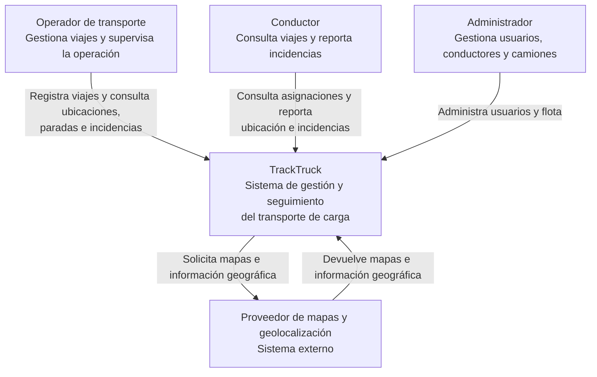
```mermaid
flowchart TB
    operador["Operador de transporte<br/>Gestiona viajes y supervisa la operación"]
    conductor["Conductor<br/>Consulta viajes y reporta incidencias"]
    administrador["Administrador<br/>Gestiona usuarios, conductores y camiones"]

    sistema["TrackTruck<br/>Sistema de gestión y seguimiento<br/>del transporte de carga"]

    mapas["Proveedor de mapas y geolocalización<br/>Sistema externo"]

    operador -->|"Registra viajes y consulta ubicaciones,<br/>paradas e incidencias"| sistema
    conductor -->|"Consulta asignaciones y reporta<br/>ubicación e incidencias"| sistema
    administrador -->|"Administra usuarios y flota"| sistema
    sistema -->|"Solicita mapas e información geográfica"| mapas
    mapas -->|"Devuelve mapas e información geográfica"| sistema
```

El sistema centraliza la información de los viajes para facilitar el control operativo. El proveedor externo aporta los mapas y la información geográfica utilizada para visualizar el seguimiento.

### 4.1.4. Approach driven ViewPoints Diagrams

Los siguientes diagramas UML muestran el flujo de seguimiento, los estados de un viaje y las principales clases del negocio. Su organización se relaciona con el enfoque DDD propuesto para TrackTruck.

#### Diagrama de actividad

Representa el seguimiento de un viaje, desde su inicio hasta su finalización, incluyendo la actualización de ubicaciones y el registro de paradas e incidencias.

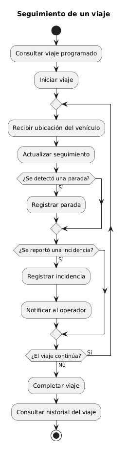

#### Diagrama de estado

Muestra los estados de un viaje: programado, en curso, completado y cancelado, junto con las acciones que permiten cambiar entre ellos.

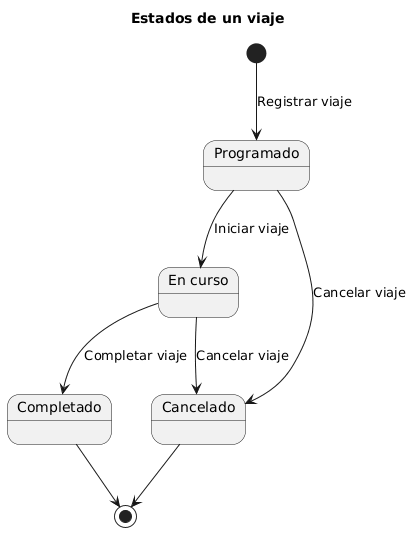

#### Diagrama de clases

Presenta las clases principales del dominio y sus relaciones, agrupadas en gestión de flota, gestión de viajes y seguimiento.

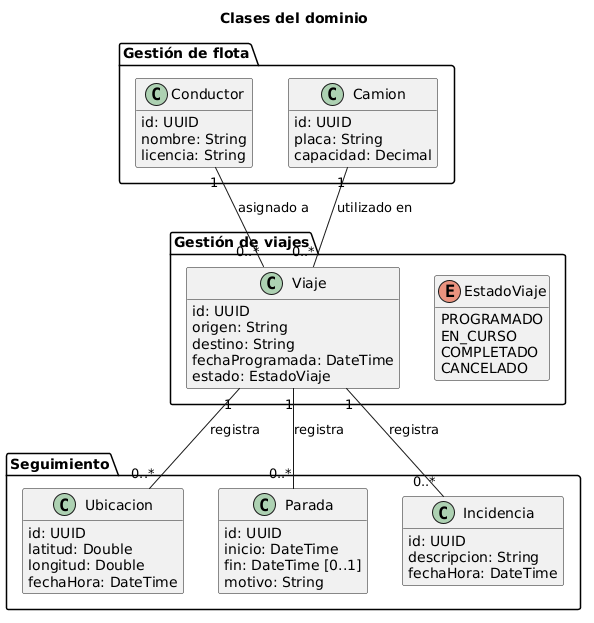

### 4.1.5. Relational/Non Relational Database Diagram

Se propone una base de datos relacional para persistir la información de TrackTruck. Las tablas se organizan según los bounded contexts de gestión de flota, gestión de viajes y seguimiento.

#### Tablas y columnas

| Bounded context | Tabla | Columnas |
|---|---|---|
| Gestión de flota | conductor | id UUID PK, nombre VARCHAR(100) NOT NULL, licencia VARCHAR(20) UNIQUE NOT NULL |
| Gestión de flota | camion | id UUID PK, placa VARCHAR(10) UNIQUE NOT NULL, capacidad DECIMAL(10,2) NOT NULL CHECK (capacidad > 0) |
| Gestión de viajes | viaje | id UUID PK, conductor_id UUID FK NOT NULL, camion_id UUID FK NOT NULL, origen VARCHAR(200) NOT NULL, destino VARCHAR(200) NOT NULL, fecha_programada TIMESTAMP NOT NULL, estado VARCHAR(20) NOT NULL |
| Seguimiento | ubicacion | id UUID PK, viaje_id UUID FK NOT NULL, latitud DECIMAL(9,6) NOT NULL, longitud DECIMAL(9,6) NOT NULL, fecha_hora TIMESTAMP NOT NULL |
| Seguimiento | parada | id UUID PK, viaje_id UUID FK NOT NULL, inicio TIMESTAMP NOT NULL, fin TIMESTAMP NULL, motivo VARCHAR(100) NOT NULL |
| Seguimiento | incidencia | id UUID PK, viaje_id UUID FK NOT NULL, descripcion TEXT NOT NULL, fecha_hora TIMESTAMP NOT NULL |

#### Relaciones y restricciones

- Cada viaje referencia a un conductor y un camión mediante `conductor_id` y `camion_id`.
- Cada ubicación, parada e incidencia referencia a un viaje mediante `viaje_id`.
- Un conductor y un camión pueden participar en varios viajes a lo largo del tiempo.
- Un viaje puede tener múltiples ubicaciones, paradas e incidencias.
- El estado del viaje se restringe mediante `CHECK` a: `PROGRAMADO`, `EN_CURSO`, `COMPLETADO` o `CANCELADO`.
- La latitud se restringe mediante `CHECK` entre -90 y 90, y la longitud entre -180 y 180.
- El fin de una parada puede ser nulo mientras continúe activa; mediante `CHECK`, si existe, debe ser mayor o igual al inicio.
- Las claves foráneas impiden registrar referencias inexistentes y se restringe la eliminación de registros que tengan información relacionada.

#### Diagrama de base de datos

El diagrama muestra las tablas, sus columnas, las claves primarias y foráneas, y las relaciones uno a muchos que permiten conservar el historial de cada viaje.

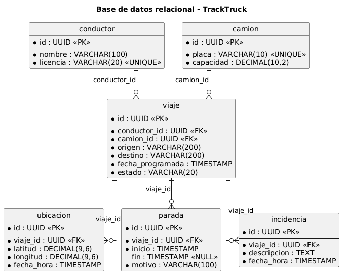

### 4.1.6. Design Patterns

TrackTruck propone utilizar los siguientes patrones para separar responsabilidades y facilitar el mantenimiento y la integración del sistema.

| Patrón | Aplicación en TrackTruck |
|---|---|
| **Repository.** | Encapsular el acceso a los datos de viajes, conductores, camiones y seguimiento, separándolo de las reglas del negocio. |
| **Adapter.** | Adaptar los servicios externos de mapas y geolocalización a las interfaces del sistema. |
| **Publish–Subscribe.** | Distribuir eventos de ubicación, paradas e incidencias a los componentes interesados sin generar dependencias directas entre ellos. |
| **Circuit Breaker.** | Suspender temporalmente las llamadas a proveedores que presenten fallas y permitir su recuperación antes de reanudar las solicitudes. |

### 4.1.7. Tactics

Las siguientes tácticas apoyan los atributos de calidad priorizados para TrackTruck.

| Atributo de calidad | Táctica | Aplicación en TrackTruck |
|---|---|---|
| **Disponibilidad.** | Detección de fallas y recuperación. | Supervisar los servicios y reiniciar los componentes que fallen para recuperar su funcionamiento. |
| **Disponibilidad.** | Limitar tiempos de espera. | Establecer tiempos máximos para las llamadas a proveedores externos y evitar bloqueos prolongados. |
| **Rendimiento.** | Gestión de recursos. | Procesar eventos mediante colas y limitar la concurrencia según la capacidad del sistema. |
| **Rendimiento.** | Reducir el costo de las consultas. | Crear índices en los campos utilizados para consultar el seguimiento y el historial de los viajes. |
| **Seguridad.** | Autenticación y autorización. | Verificar la identidad del usuario y permitir únicamente las operaciones correspondientes a su rol. |
| **Seguridad.** | Protección de la información. | Cifrar las comunicaciones y registrar las operaciones sensibles para permitir su auditoría. |
| **Interoperabilidad.** | Estandarización de interfaces. | Definir contratos y formatos de intercambio consistentes para integrar servicios externos. |

## 4.2. Architectural Drivers

Los drivers arquitectónicos de TrackTruck orientan las decisiones de diseño según los objetivos del negocio, las funcionalidades requeridas y los atributos de calidad prioritarios: disponibilidad, interoperabilidad, rendimiento y seguridad.

### 4.2.1. Design Purpose

El propósito del proceso de diseño es definir una arquitectura que permita implementar de forma coherente la gestión de viajes, flota y seguimiento del transporte de carga.

Para ello, se establecen las responsabilidades, interfaces y relaciones de los componentes, manteniendo la correspondencia entre la implementación y las entidades representadas en los modelos y vistas arquitectónicas.

El diseño busca facilitar el mantenimiento y la evolución del sistema, proteger la información y permitir un seguimiento oportuno y disponible para apoyar el control operativo de LogiGo.

### 4.2.2. Primary Functionality (Primary User Stories)

Las siguientes historias de usuario representan funcionalidades que afectan la estructura de TrackTruck, ya que requieren componentes de gestión, seguimiento, integración y control de acceso.

| Código | Historia de usuario | Impacto en la arquitectura |
|---|---|---|
| PUS01 | Como operador, quiero registrar viajes y asignar conductores y camiones para organizar el transporte de carga. | Requiere integrar la gestión de viajes con la gestión de flota y validar las asignaciones. |
| PUS02 | Como operador, quiero visualizar la ubicación de los camiones para supervisar el avance de los viajes. | Requiere recibir y almacenar ubicaciones, actualizar el seguimiento e integrar un proveedor de mapas. |
| PUS03 | Como operador, quiero consultar las paradas e incidencias de un viaje para identificar problemas durante el traslado. | Requiere componentes para registrar eventos y relacionarlos con el viaje correspondiente. |
| PUS04 | Como conductor, quiero reportar incidencias para informar al operador sobre problemas durante el viaje. | Requiere recibir reportes y distribuir notificaciones mediante eventos. |
| PUS05 | Como operador, quiero consultar el historial de un viaje para evaluar lo ocurrido después de su finalización. | Requiere persistir y consultar estados, ubicaciones, paradas e incidencias. |
| PUS06 | Como administrador, quiero gestionar usuarios y sus roles para controlar el acceso al sistema. | Requiere autenticación y autorización en las interfaces y operaciones de la aplicación. |

### 4.2.3. Quality Attribute Scenarios

Se proponen los siguientes escenarios para evaluar la disponibilidad, rendimiento, seguridad e interoperabilidad de TrackTruck. Las medidas representan objetivos que deberán comprobarse mediante pruebas.

#### QAS01: Disponibilidad

| Parte | Descripción |
|---|---|
| Fuente de estímulo | Proveedor de mapas. |
| Estímulo | Deja de responder. |
| Medioambiente | Operación normal con viajes en curso. |
| Artefacto | Integración con mapas. |
| Respuesta | Informa la falla y mantiene el registro de ubicaciones. |
| Medida de respuesta | Detectar la falla en máximo 5 segundos y guardar todos los reportes válidos recibidos durante una interrupción de 10 minutos. |

#### QAS02: Rendimiento

| Parte | Descripción |
|---|---|
| Fuente de estímulo | Dispositivos de 100 vehículos. |
| Estímulo | Envían una ubicación por vehículo cada 10 segundos. |
| Medioambiente | Los 100 vehículos están activos durante 30 minutos. |
| Artefacto | Servicio de seguimiento. |
| Respuesta | Procesa las ubicaciones y las deja disponibles para consulta. |
| Medida de respuesta | El 95 % de las ubicaciones queda disponible en máximo 3 segundos desde su recepción. |

#### QAS03: Seguridad

| Parte | Descripción |
|---|---|
| Fuente de estímulo | Conductor autenticado. |
| Estímulo | Intenta administrar usuarios sin permiso. |
| Medioambiente | Operación normal. |
| Artefacto | Control de acceso. |
| Respuesta | Rechaza la solicitud sin mostrar ni modificar datos protegidos. |
| Medida de respuesta | Bloquear el 100 % de 20 solicitudes de prueba realizadas sin el permiso requerido. |

#### QAS04: Interoperabilidad

| Parte | Descripción |
|---|---|
| Fuente de estímulo | Sistema externo de geolocalización. |
| Estímulo | Envía reportes de ubicación según el contrato acordado. |
| Medioambiente | Operación normal con la integración habilitada. |
| Artefacto | Adaptador de geolocalización. |
| Respuesta | Valida y transforma los reportes al formato interno. |
| Medida de respuesta | Procesar correctamente 100 de 100 reportes válidos de prueba, conservando el identificador del vehículo, las coordenadas y la fecha de captura. |

### 4.2.4. Constraints

Las siguientes restricciones delimitan el diseño y la implementación de TrackTruck.

| Código | Restricción | Implicación arquitectónica |
|---|---|---|
| CON01 | Implementar los servicios mediante interfaces REST. | Las operaciones deben exponerse mediante endpoints y contratos definidos. |
| CON02 | Utilizar una base de datos relacional para la persistencia propuesta. | Los datos deben organizarse en tablas con claves y relaciones que aseguren su integridad. |
| CON03 | Integrarse con un proveedor externo de mapas. | La integración debe respetar sus formatos, límites de uso y mecanismos de acceso. |
| CON04 | Utilizar GitHub para el control de versiones, conforme a los lineamientos del curso. | El desarrollo debe seguir GitFlow, Conventional Commits y versionado semántico. |

### 4.2.5. Architectural Concerns

Las siguientes preocupaciones representan aspectos de alto impacto que deben abordarse durante el diseño de TrackTruck.

| Código | Preocupación | Orientación de diseño |
|---|---|---|
| AC01 | Las fallas del proveedor de mapas pueden afectar la operación. | Aislar la integración y mantener el registro de seguimiento durante la interrupción. |
| AC02 | El aumento de vehículos puede retrasar el procesamiento de ubicaciones. | Procesar eventos de forma asincrónica y permitir ampliar la capacidad del seguimiento. |
| AC03 | Los usuarios podrían acceder a información u operaciones sin autorización. | Aplicar autenticación y permisos según el rol del usuario. |
| AC04 | Los reportes duplicados o fuera de orden pueden generar un historial incorrecto. | Identificar los reportes y considerar su fecha de captura al procesarlos. |
| AC05 | Los cambios en un proveedor pueden afectar las reglas del negocio. | Mantener los detalles externos separados mediante adaptadores e interfaces propias. |

## 4.3. ADD Iterations

Se aplicará ADD v3 mediante iteraciones que refinan la arquitectura de TrackTruck según sus funcionalidades principales, atributos de calidad, restricciones y preocupaciones arquitectónicas.

### 4.3.1. Iteration 1: Global System Structure

Esta primera iteración tiene como propósito establecer la estructura arquitectónica global de **TrackTruck**, identificando las principales capacidades del dominio logístico y delimitándolas mediante bounded contexts. Asimismo, se definen sus responsabilidades, relaciones y mecanismos generales de integración, proporcionando una base arquitectónica sobre la cual se realizarán los refinamientos de las siguientes iteraciones.

La descomposición busca representar el flujo completo de una operación logística, desde el registro del cliente y la recepción de un envío hasta su almacenamiento, planificación, transporte, seguimiento, entrega, facturación y posterior análisis de la operación.

#### 4.3.1.1. Architectural Design Backlog 1

El Architectural Design Backlog de esta iteración reúne las principales decisiones de diseño necesarias para obtener una primera estructura global de TrackTruck.

| Código | Trabajo de diseño | Drivers relacionados | Prioridad |
|---|---|---|---|
| ADB01 | Identificar y delimitar los bounded contexts principales de TrackTruck. | Funcionalidad primaria, mantenibilidad, separación de responsabilidades | Alta |
| ADB02 | Definir las responsabilidades principales y límites de cada bounded context. | Funcionalidad primaria, mantenibilidad | Alta |
| ADB03 | Definir las relaciones e intercambio de información entre los bounded contexts. | Interoperabilidad, trazabilidad, consistencia | Alta |
| ADB04 | Establecer una arquitectura orientada a microservicios alineada con los bounded contexts identificados. | Mantenibilidad, escalabilidad, disponibilidad | Alta |
| ADB05 | Definir mecanismos generales de comunicación síncrona y asíncrona entre servicios. | Rendimiento, disponibilidad, interoperabilidad | Alta |
| ADB06 | Identificar los principales sistemas externos requeridos por TrackTruck. | Interoperabilidad, disponibilidad | Alta |
| ADB07 | Definir Identity & Access como capacidad transversal para proteger las operaciones del sistema. | Seguridad, control de acceso | Alta |
| ADB08 | Definir criterios de autonomía de datos para evitar el acceso directo entre las bases de datos de los bounded contexts. | Integridad, mantenibilidad, bajo acoplamiento | Alta |
| ADB09 | Establecer mecanismos generales para mantener la trazabilidad de eventos durante el ciclo completo de una operación logística. | Trazabilidad, confiabilidad | Alta |

#### 4.3.1.2. Establish Iteration Goal by Selecting Drivers

El objetivo de esta iteración es **definir la estructura arquitectónica global de TrackTruck**, identificando las capacidades principales del dominio logístico, organizándolas mediante bounded contexts y estableciendo sus mecanismos iniciales de integración.

La iteración prioriza aquellos drivers que tienen un impacto directo sobre la estructura general del sistema.

| Tipo | Drivers seleccionados |
|---|---|
| Funcionalidades principales | Gestión de clientes, envíos, almacén, flota, mantenimiento, personal, planificación de despachos, ejecución de viajes, seguimiento, incidencias, entregas, facturación, historial y reportes. |
| Atributos de calidad | Disponibilidad, rendimiento, seguridad, interoperabilidad, mantenibilidad, escalabilidad y trazabilidad. |
| Restricciones | Arquitectura orientada a microservicios, interfaces REST, persistencia independiente por contexto, integración con proveedores externos y uso de mecanismos de comunicación basados en eventos cuando corresponda. |
| Preocupaciones arquitectónicas | Desacoplamiento entre dominios, consistencia de información, crecimiento del sistema, aislamiento de datos, seguridad, integración con terceros y trazabilidad de operaciones. |

Los drivers seleccionados permiten definir primero una visión global de la solución antes de profundizar en decisiones específicas relacionadas con almacenamiento, planificación inteligente, seguimiento, facturación u otros procesos particulares.

#### 4.3.1.3. Choose One or More Elements of the System to Refine

En esta iteración se refinará inicialmente el sistema **TrackTruck** como elemento arquitectónico principal, descomponiéndolo según las capacidades del dominio.

Los siguientes bounded contexts forman parte de la estructura global propuesta:

- **Identity & Access:** gestiona autenticación, autorización, usuarios, roles y permisos de acceso.
- **Customer Management:** administra la información de los clientes y organizaciones que utilizan los servicios de LogiGo.
- **Shipment Management:** administra los envíos, cargas y solicitudes de transporte desde su creación hasta su entrega.
- **Warehouse Operations:** controla la recepción, almacenamiento, preparación y salida de mercancía.
- **Fleet Management:** administra la información operativa de conductores y vehículos.
- **Maintenance Management:** controla mantenimientos preventivos y correctivos, kilometraje y condición técnica de los vehículos.
- **Workforce Management:** administra empleados, asignaciones y disponibilidad laboral.
- **Time & Attendance:** registra jornadas, horas trabajadas, descansos y horas adicionales.
- **Driver Safety & Compliance:** evalúa restricciones operativas, condiciones de elegibilidad y cumplimiento de reglas aplicables a los conductores.
- **Dispatch Planning:** planifica los despachos y selecciona las alternativas adecuadas de conductor, vehículo y ruta.
- **Trip Execution:** controla el inicio, ejecución, cambios de estado y finalización de los viajes.
- **Tracking & Geolocation:** procesa y mantiene la ubicación de los vehículos durante las operaciones.
- **Incident Management:** administra incidencias, emergencias y situaciones excepcionales durante las operaciones.
- **Delivery Management:** controla la entrega de la mercancía, su confirmación y el cierre de la operación.
- **Billing & Payments:** administra precios, cobros, pagos, boletas, facturas y comprobantes.
- **Operational History:** conserva el historial consolidado de los eventos relevantes producidos durante una operación.
- **Reporting & Analytics:** genera indicadores, reportes y análisis sobre la información operacional.

La separación propuesta permite que cada capacidad del negocio evolucione de manera independiente y evita concentrar todas las reglas del sistema en un único modelo de dominio.

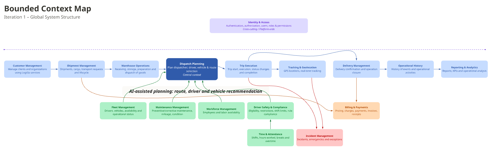

#### 4.3.1.4. Choose One or More Design Concepts That Satisfy the Selected Drivers

Para satisfacer los drivers seleccionados se consideran los siguientes conceptos de diseño:

| Concepto seleccionado | Propósito | Drivers relacionados |
|---|---|---|
| Domain-Driven Design (DDD) | Organizar las capacidades del negocio mediante bounded contexts con modelos y lenguaje propios. | Mantenibilidad, funcionalidad, bajo acoplamiento |
| Arquitectura de microservicios | Permitir que las principales capacidades del negocio sean implementadas, desplegadas y evolucionadas de forma independiente. | Escalabilidad, mantenibilidad, disponibilidad |
| RESTful APIs | Permitir comunicación síncrona cuando un servicio requiere una respuesta inmediata de otro contexto. | Interoperabilidad, funcionalidad |
| Event-Driven Architecture | Propagar cambios del negocio sin generar dependencias directas entre los servicios. | Rendimiento, escalabilidad, mantenibilidad |
| Publish–Subscribe | Permitir que diferentes bounded contexts reaccionen independientemente ante eventos relevantes. | Interoperabilidad, bajo acoplamiento |
| Database per Service | Mantener autonomía sobre los datos y evitar que un bounded context modifique directamente información perteneciente a otro. | Integridad, mantenibilidad |
| Adapter / Anti-Corruption Layer | Aislar proveedores externos y evitar que sus modelos contaminen el dominio interno. | Interoperabilidad, mantenibilidad |
| API Gateway | Proporcionar un punto de entrada controlado hacia los servicios de TrackTruck. | Seguridad, mantenibilidad |
| Identity Provider / Token-Based Authentication | Centralizar autenticación y proporcionar identidad verificable a los servicios protegidos. | Seguridad |
| Circuit Breaker | Evitar que las fallas de proveedores externos se propaguen al resto de la plataforma. | Disponibilidad, tolerancia a fallos |
| Idempotencia | Evitar efectos duplicados cuando una operación o evento sea procesado más de una vez. | Integridad, confiabilidad |

La combinación de estos conceptos permite construir una arquitectura distribuida en la que los bounded contexts mantienen responsabilidades claramente delimitadas, mientras que los mecanismos de integración facilitan la colaboración entre ellos.

#### 4.3.1.5. Instantiate Architectural Elements, Allocate Responsibilities, and Define Interfaces

A partir de los conceptos seleccionados se instancian inicialmente los siguientes elementos arquitectónicos.

| Elemento arquitectónico | Responsabilidad principal | Interfaces / mecanismos de integración |
|---|---|---|
| Identity Service | Autenticar usuarios, administrar roles y proporcionar autorización. | REST, tokens de acceso |
| Customer Service | Administrar clientes y organizaciones registradas. | REST, eventos de dominio |
| Shipment Service | Gestionar envíos y cargas durante su ciclo de vida. | REST, eventos de dominio |
| Warehouse Service | Gestionar recepción, almacenamiento, preparación y salida de mercancías. | REST, eventos de dominio |
| Fleet Service | Administrar conductores, vehículos y disponibilidad de recursos. | REST, eventos de dominio |
| Maintenance Service | Administrar mantenimientos y condición técnica de los vehículos. | REST, eventos de dominio |
| Workforce Service | Gestionar empleados y disponibilidad laboral. | REST, eventos de dominio |
| Time & Attendance Service | Registrar jornadas, horas trabajadas y descansos. | REST, eventos de dominio |
| Driver Compliance Service | Evaluar elegibilidad y restricciones operativas del conductor. | REST, eventos de dominio |
| Dispatch Planning Service | Planificar despachos y recomendar conductor, vehículo y ruta. | REST, eventos de dominio |
| Trip Execution Service | Administrar la ejecución y estados de los viajes. | REST, eventos de dominio |
| Tracking Service | Procesar ubicaciones y mantener el seguimiento de los vehículos. | API de ingestión, eventos |
| Incident Service | Registrar y administrar incidencias operativas. | REST, eventos de dominio |
| Delivery Service | Confirmar entregas y cerrar el proceso de transporte. | REST, eventos de dominio |
| Billing Service | Gestionar cobros, pagos y comprobantes. | REST, proveedor de pagos/facturación |
| Operational History Service | Mantener un historial consultable de eventos y operaciones relevantes. | Suscripción a eventos, consultas |
| Reporting Service | Generar indicadores, reportes y analítica. | Consultas y consumo de información operacional |
| API Gateway | Exponer de manera controlada los servicios de TrackTruck a los clientes de la plataforma. | HTTP/REST |
| Event Broker | Distribuir eventos entre los diferentes bounded contexts. | Publish–Subscribe |

Los bounded contexts mantienen autonomía sobre sus reglas de negocio y persistencia. Ningún servicio debe modificar directamente la base de datos perteneciente a otro contexto.

Las interacciones síncronas se utilizarán principalmente cuando un contexto requiera una respuesta inmediata. Las comunicaciones asíncronas se emplearán para propagar eventos cuyo procesamiento pueda realizarse independientemente.

Ejemplos de eventos:

- `ShipmentCreated`
- `WarehouseReceptionCompleted`
- `VehicleMaintenanceRequired`
- `DriverEligibilityChanged`
- `DispatchPlanned`
- `TripStarted`
- `VehicleLocationUpdated`
- `IncidentReported`
- `TripCompleted`
- `DeliveryConfirmed`
- `InvoiceGenerated`
- `PaymentCompleted`

Estos eventos permitirán mantener desacoplados los procesos que forman parte del ciclo completo de una operación logística.

#### 4.3.1.6. Sketch Views (C4 & UML) and Record Design Decisions

Para representar la estructura definida durante esta iteración se utilizarán diferentes vistas arquitectónicas.

El **Bounded Context Map** muestra las principales capacidades del dominio de TrackTruck y las relaciones generales entre ellas.

El **C4 Container Diagram** representa las aplicaciones cliente, API Gateway, servicios principales, mecanismos de mensajería y persistencia que forman parte de la solución.

El **diagrama UML de componentes** representa las dependencias principales entre los servicios y permite visualizar qué componentes proporcionan o consumen interfaces dentro de la arquitectura.

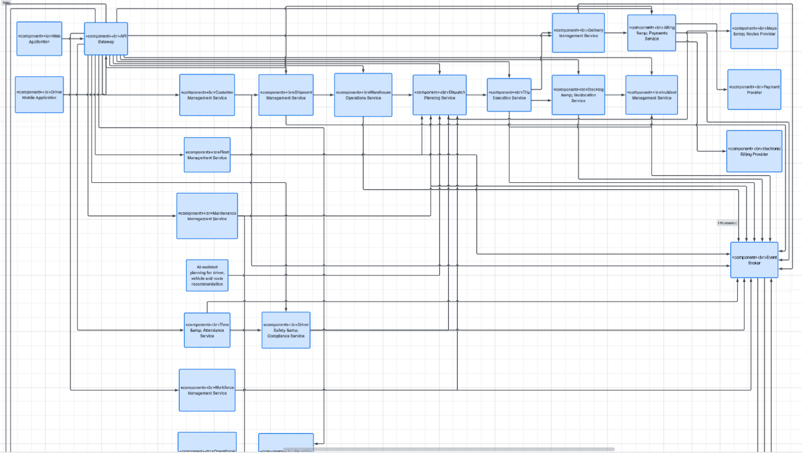

Las principales decisiones de diseño registradas durante esta iteración son las siguientes:

| Código | Decisión de diseño | Justificación |
|---|---|---|
| DD01 | Utilizar Domain-Driven Design para delimitar las capacidades principales mediante bounded contexts. | Reducir el acoplamiento entre áreas del negocio y mantener modelos especializados. |
| DD02 | Implementar los bounded contexts principales mediante una arquitectura orientada a microservicios. | Facilitar el despliegue independiente, evolución y escalamiento de las capacidades del sistema. |
| DD03 | Evitar el acceso directo a bases de datos pertenecientes a otros bounded contexts. | Mantener autonomía e integridad de los datos. |
| DD04 | Utilizar REST para interacciones que requieran respuesta inmediata. | Mantener interfaces simples y explícitas entre servicios. |
| DD05 | Utilizar eventos para comunicar cambios del negocio que puedan ser procesados de manera independiente. | Reducir dependencias directas y facilitar la extensibilidad. |
| DD06 | Incorporar un Event Broker para distribuir eventos entre los servicios. | Facilitar integración asíncrona y Publish–Subscribe. |
| DD07 | Utilizar Adapter o Anti-Corruption Layer para integraciones externas. | Evitar dependencia directa del dominio respecto de proveedores externos. |
| DD08 | Centralizar el ingreso externo mediante un API Gateway. | Simplificar acceso, seguridad y gestión de interfaces externas. |
| DD09 | Mantener Identity & Access como una capacidad transversal de la plataforma. | Aplicar autenticación y autorización de manera consistente. |
| DD10 | Incorporar mecanismos de idempotencia en operaciones sensibles y procesamiento de eventos. | Evitar duplicación de efectos ante reintentos o mensajes repetidos. |

#### 4.3.1.7. Analysis of Current Design and Review Iteration Goal (Kanban Board)

La arquitectura obtenida permite representar TrackTruck como una plataforma empresarial compuesta por bounded contexts especializados y servicios con responsabilidades claramente delimitadas.

El cumplimiento del objetivo de la iteración se revisará mediante los siguientes criterios:

| Aspecto | Criterio de revisión |
|---|---|
| Cobertura del dominio | Las principales capacidades del proceso logístico están representadas mediante bounded contexts. |
| Separación de responsabilidades | Cada bounded context posee una responsabilidad claramente diferenciada. |
| Autonomía | Cada contexto mantiene control sobre sus reglas de negocio y datos. |
| Bajo acoplamiento | Los servicios no acceden directamente a la persistencia de otros bounded contexts. |
| Integración | Se identifican mecanismos síncronos y asíncronos de comunicación. |
| Seguridad | Identity & Access proporciona mecanismos de autenticación y autorización para los servicios protegidos. |
| Interoperabilidad | Los proveedores externos se encuentran aislados mediante interfaces y adaptadores. |
| Escalabilidad | Los servicios pueden evolucionar y escalar de manera independiente según su carga. |
| Trazabilidad | Los principales eventos de una operación pueden conservarse para construir un historial operacional. |
| Evolución | La arquitectura permite que las siguientes iteraciones profundicen en bounded contexts específicos sin redefinir completamente la estructura global. |

A partir del análisis realizado, el objetivo de la iteración se considera alcanzado cuando los bounded contexts principales, sus responsabilidades, relaciones y mecanismos generales de integración se encuentran definidos y representados mediante las vistas arquitectónicas correspondientes.

El tablero Kanban permitirá realizar el seguimiento de los elementos **ADB01–ADB09** mediante las columnas **Por hacer**, **En proceso**, **En revisión** y **Terminado**.

Cada elemento podrá considerarse terminado cuando su definición haya sido revisada por el equipo y exista evidencia en los modelos, diagramas o decisiones arquitectónicas correspondientes.

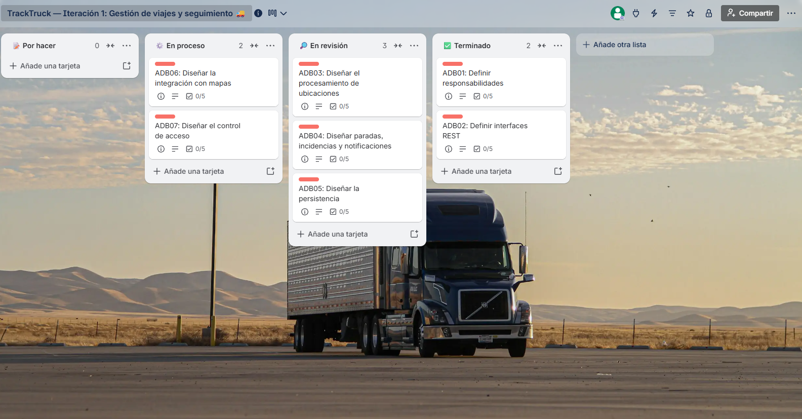

[Ver tablero Kanban en Trello](https://trello.com/invite/b/6ac2dd2b34ad352f3eb33e7a/ATTIf963f61854ba1e4384cb7fcf73ed07f28507791F/tracktruck-iteracion-1-gestion-de-viajes-y-seguimiento-🚚)

### 4.3.2. Iteration 2: Shipment and Warehouse Operations

Esta iteración tiene como objetivo refinar la gestión de envíos y las operaciones de almacén de **TrackTruck**, considerando el proceso desde el registro del envío hasta que la carga se encuentra preparada para su posterior planificación de despacho.

#### 4.3.2.1. Architectural Design Backlog 2

El Architectural Design Backlog de esta iteración reúne los principales elementos que deben ser refinados para gestionar correctamente los envíos y las operaciones realizadas dentro del almacén.

| ID | Elemento de diseño | Prioridad |
|---|---|---|
| ADB10 | Definir las responsabilidades de Shipment Management y Warehouse Operations. | Alta |
| ADB11 | Definir el ciclo de vida de un envío. | Alta |
| ADB12 | Diseñar el proceso de recepción y almacenamiento de carga. | Alta |
| ADB13 | Diseñar la preparación y liberación de carga para despacho. | Alta |
| ADB14 | Definir la comunicación entre Shipment Management y Warehouse Operations. | Alta |
| ADB15 | Definir los principales eventos generados durante el proceso. | Media |
| ADB16 | Definir mecanismos para mantener consistencia y evitar operaciones duplicadas. | Media |

#### 4.3.2.2. Establish Iteration Goal by Selecting Drivers

El objetivo de esta iteración es establecer una arquitectura que permita gestionar el ciclo de vida de los envíos y las operaciones realizadas sobre la carga dentro del almacén.

Los principales drivers seleccionados son:

| Driver | Aplicación |
|---|---|
| Funcionalidad | Registrar envíos, recibir carga, almacenarla, prepararla y dejarla disponible para despacho. |
| Integridad | Mantener estados válidos durante el proceso. |
| Trazabilidad | Registrar los principales cambios realizados sobre el envío y la carga. |
| Interoperabilidad | Permitir comunicación entre los diferentes servicios involucrados. |
| Mantenibilidad | Mantener separadas las responsabilidades de envíos y almacén. |
| Confiabilidad | Evitar operaciones duplicadas o inconsistentes. |

#### 4.3.2.3. Choose One or More Elements of the System to Refine

Los principales elementos seleccionados para ser refinados durante esta iteración son:

- **Shipment Management:** administra la información y el ciclo de vida de los envíos.
- **Warehouse Operations:** administra la recepción, almacenamiento, preparación y liberación de la carga.
- **Customer Management:** proporciona la información del cliente relacionado con el envío.
- **Dispatch Planning:** recibe la información cuando una carga se encuentra preparada para ser despachada.
- **Operational History:** conserva los eventos relevantes generados durante el proceso.

La iteración busca establecer límites claros entre estos elementos y definir cómo intercambian información sin compartir directamente sus datos internos.

#### 4.3.2.4. Choose One or More Design Concepts That Satisfy the Selected Drivers

Para satisfacer los drivers seleccionados se consideran los siguientes conceptos y patrones:

| Concepto / Patrón | Aplicación |
|---|---|
| Domain-Driven Design | Separar Shipment Management y Warehouse Operations en bounded contexts independientes. |
| Microservices Architecture | Mantener servicios con responsabilidades específicas y autonomía. |
| RESTful APIs | Gestionar operaciones que necesitan una respuesta inmediata. |
| Event-Driven Architecture | Comunicar cambios importantes del estado del envío. |
| Publish–Subscribe | Permitir que diferentes servicios reaccionen a los eventos publicados. |
| Database per Service | Mantener la persistencia independiente por servicio. |
| Repository | Separar el dominio del mecanismo de persistencia. |
| Idempotency | Evitar que una misma solicitud genere efectos duplicados. |

Estos conceptos permiten reducir el acoplamiento entre los servicios y mantener claramente separadas las responsabilidades del proceso logístico.

#### 4.3.2.5. Instantiate Architectural Elements, Allocate Responsibilities, and Define Interfaces

A partir de los conceptos seleccionados se establecen los siguientes elementos arquitectónicos:

| Elemento | Responsabilidad | Integración |
|---|---|---|
| Customer Service | Gestionar información de clientes. | REST |
| Shipment Service | Gestionar envíos y sus estados. | REST / Eventos |
| Warehouse Service | Gestionar recepción, almacenamiento y preparación de carga. | REST / Eventos |
| Dispatch Planning Service | Recibir información de cargas disponibles para planificación. | Eventos / REST |
| Operational History Service | Registrar eventos relevantes de la operación. | Eventos |
| Event Broker | Distribuir eventos entre los servicios. | Publish–Subscribe |

Los principales eventos definidos para esta iteración son:

- `ShipmentCreated`
- `ShipmentReceived`
- `CargoStored`
- `CargoPrepared`
- `ShipmentReadyForDispatch`
- `ShipmentCancelled`

El evento `ShipmentReadyForDispatch` permite informar a **Dispatch Planning** que una carga se encuentra disponible para iniciar el proceso de planificación del transporte.

#### 4.3.2.6. Sketch Views (C4 & UML) and Record Design Decisions

Durante esta iteración se elaboran vistas arquitectónicas que permiten representar los servicios involucrados y sus principales interacciones.

El C4 Container Diagram muestra la relación entre Shipment Management, Warehouse Operations y los demás servicios relacionados.

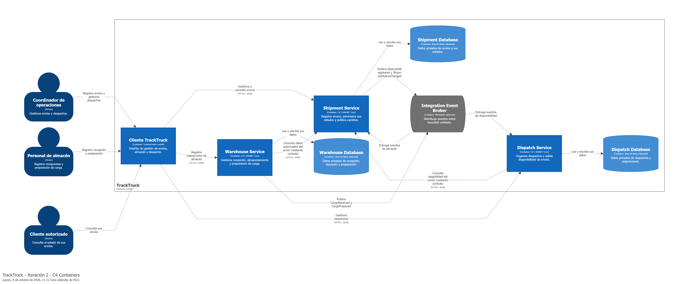

El UML Sequence Diagram representa el flujo principal desde la creación del envío hasta que la carga queda preparada para despacho.

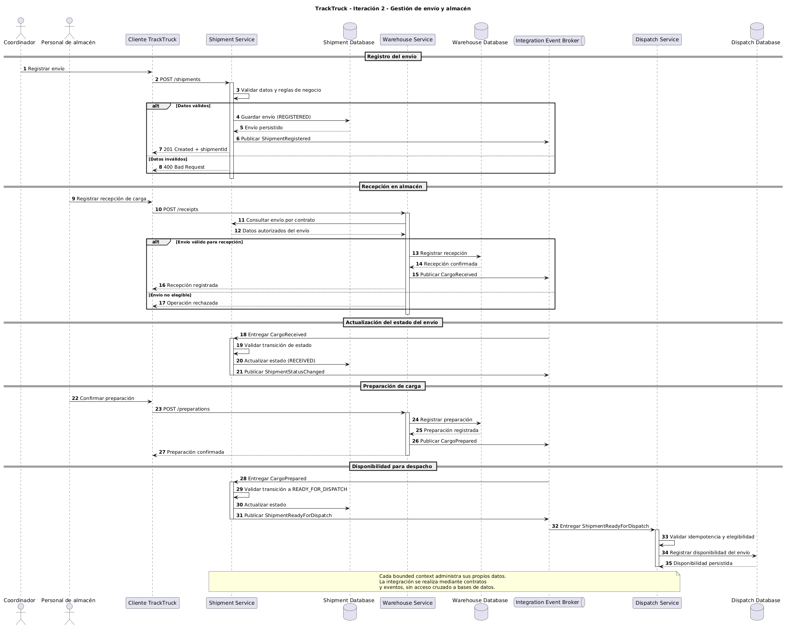

Las principales decisiones arquitectónicas registradas son:

| ID | Decisión | Justificación |
|---|---|---|
| DD11 | Separar Shipment Management de Warehouse Operations. | Cada contexto posee responsabilidades y reglas diferentes. |
| DD12 | Mantener persistencia independiente por servicio. | Evita dependencias directas entre bounded contexts. |
| DD13 | Utilizar eventos para comunicar cambios importantes. | Reduce el acoplamiento entre servicios. |
| DD14 | Utilizar REST para operaciones que requieren respuesta inmediata. | Facilita interacciones síncronas entre servicios. |
| DD15 | Aplicar idempotencia en operaciones sensibles. | Evita efectos duplicados ante reintentos. |
| DD16 | Utilizar `ShipmentReadyForDispatch` para comunicar la disponibilidad de la carga. | Permite integrar Warehouse Operations con Dispatch Planning de forma desacoplada. |

#### 4.3.2.7. Analysis of Current Design and Review Iteration Goal (Kanban Board)

El diseño obtenido permite separar la administración del envío de las operaciones físicas realizadas sobre la carga dentro del almacén.

La revisión de la iteración considera los siguientes aspectos:

| Aspecto | Resultado |
|---|---|
| Separación de responsabilidades | Cumplido |
| Gestión del ciclo de vida del envío | Cumplido |
| Comunicación entre servicios | Cumplido |
| Persistencia independiente | Cumplido |
| Uso de eventos | Cumplido |
| Trazabilidad del proceso | Cumplido |
| Preparación para Dispatch Planning | Cumplido |

La iteración permite establecer el flujo necesario para que un envío pueda ser registrado, recibido, almacenado y preparado hasta encontrarse disponible para su planificación de despacho.

El avance de los elementos del Architectural Design Backlog se gestiona mediante el tablero Kanban de la iteración.

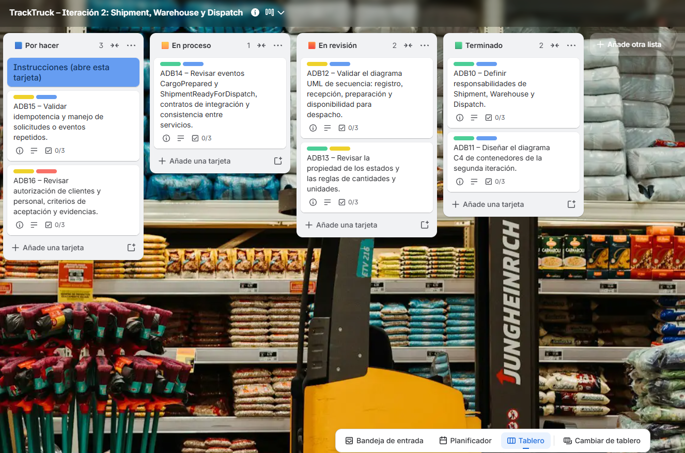

**URL del tablero:** [Iteration 2 - Trello](PEGAR_AQUI_URL_DEL_TABLERO)

### 4.3.3. Iteration 3: [Nombre de la iteración]

#### 4.3.3.1. Architectural Design Backlog 3

<!-- PENDIENTE: agregar el Architectural Design Backlog de esta iteración. -->

#### 4.3.3.2. Establish Iteration Goal by Selecting Drivers

<!-- PENDIENTE: indicar el objetivo de la iteración y los drivers seleccionados. -->

#### 4.3.3.3. Choose One or More Elements of the System to Refine

<!-- PENDIENTE: especificar los elementos arquitectónicos que serán refinados. -->

#### 4.3.3.4. Choose One or More Design Concepts That Satisfy the Selected Drivers

<!-- PENDIENTE: justificar los conceptos, patrones, tácticas o enfoques elegidos. -->

#### 4.3.3.5. Instantiate Architectural Elements, Allocate Responsibilities, and Define Interfaces

<!-- PENDIENTE: definir elementos, responsabilidades e interfaces resultantes. -->

#### 4.3.3.6. Sketch Views (C4 & UML) and Record Design Decisions

<!-- PENDIENTE: insertar los diagramas C4/UML correspondientes y registrar las decisiones de diseño. -->

#### 4.3.3.7. Analysis of Current Design and Review Iteration Goal (Kanban Board)

<!-- PENDIENTE: analizar el diseño, revisar el cumplimiento del objetivo e insertar captura y enlace del tablero Kanban. -->

### 4.3.4. Iteration 4: [Nombre de la iteración]

#### 4.3.4.1. Architectural Design Backlog 4

<!-- PENDIENTE: agregar el Architectural Design Backlog de esta iteración. -->

#### 4.3.4.2. Establish Iteration Goal by Selecting Drivers

<!-- PENDIENTE: indicar el objetivo de la iteración y los drivers seleccionados. -->

#### 4.3.4.3. Choose One or More Elements of the System to Refine

<!-- PENDIENTE: especificar los elementos arquitectónicos que serán refinados. -->

#### 4.3.4.4. Choose One or More Design Concepts That Satisfy the Selected Drivers

<!-- PENDIENTE: justificar los conceptos, patrones, tácticas o enfoques elegidos. -->

#### 4.3.4.5. Instantiate Architectural Elements, Allocate Responsibilities, and Define Interfaces

<!-- PENDIENTE: definir elementos, responsabilidades e interfaces resultantes. -->

#### 4.3.4.6. Sketch Views (C4 & UML) and Record Design Decisions

<!-- PENDIENTE: insertar los diagramas C4/UML correspondientes y registrar las decisiones de diseño. -->

#### 4.3.4.7. Analysis of Current Design and Review Iteration Goal (Kanban Board)

<!-- PENDIENTE: analizar el diseño, revisar el cumplimiento del objetivo e insertar captura y enlace del tablero Kanban. -->

### 4.3.5. Iteration 5: [Nombre de la iteración]

#### 4.3.5.1. Architectural Design Backlog 5

<!-- PENDIENTE: agregar el Architectural Design Backlog de esta iteración. -->

#### 4.3.5.2. Establish Iteration Goal by Selecting Drivers

<!-- PENDIENTE: indicar el objetivo de la iteración y los drivers seleccionados. -->

#### 4.3.5.3. Choose One or More Elements of the System to Refine

<!-- PENDIENTE: especificar los elementos arquitectónicos que serán refinados. -->

#### 4.3.5.4. Choose One or More Design Concepts That Satisfy the Selected Drivers

<!-- PENDIENTE: justificar los conceptos, patrones, tácticas o enfoques elegidos. -->

#### 4.3.5.5. Instantiate Architectural Elements, Allocate Responsibilities, and Define Interfaces

<!-- PENDIENTE: definir elementos, responsabilidades e interfaces resultantes. -->

#### 4.3.5.6. Sketch Views (C4 & UML) and Record Design Decisions

<!-- PENDIENTE: insertar los diagramas C4/UML correspondientes y registrar las decisiones de diseño. -->

#### 4.3.5.7. Analysis of Current Design and Review Iteration Goal (Kanban Board)

<!-- PENDIENTE: analizar el diseño, revisar el cumplimiento del objetivo e insertar captura y enlace del tablero Kanban. -->

### Vista arquitectónica general de TrackTruck

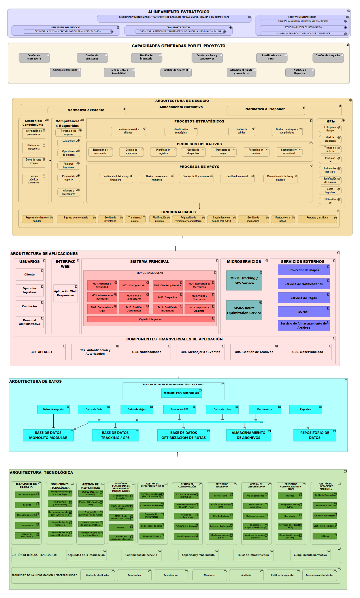

# Capítulo V: Product Implementation, Validation & Deployment

## 5.1. Testing Suites & General Patterns

En esta sección se definen las estrategias de validación y los patrones generales que permitirán comprobar que la arquitectura propuesta para **TrackTruck** satisface las funcionalidades y atributos de calidad establecidos.

Debido a que el alcance del proyecto se centra en el diseño arquitectónico de la solución, las suites de pruebas se presentan como una propuesta de validación para una futura implementación de los microservicios.

### 5.1.1. Backend Application Core Testing Suite

La Backend Application Core Testing Suite define los escenarios que deberían validarse sobre los principales servicios y reglas de negocio de TrackTruck durante una futura implementación.

La estrategia considera pruebas sobre las capacidades centrales del sistema y sobre las decisiones arquitectónicas definidas durante las iteraciones ADD.

| Área a validar | Prueba propuesta | Resultado esperado |
|---|---|---|
| Shipment Management | Registrar un envío con información válida. | El envío es creado con un estado inicial válido. |
| Warehouse Operations | Registrar la recepción y preparación de una carga. | La carga avanza únicamente mediante estados permitidos. |
| Fleet Management | Consultar conductores y vehículos disponibles. | Solo se muestran recursos operativamente disponibles. |
| Driver Safety & Compliance | Evaluar un conductor considerando sus horas trabajadas y restricciones. | El sistema determina correctamente si puede ser considerado para una nueva asignación. |
| Maintenance Management | Evaluar el estado técnico de un vehículo. | Un vehículo con una restricción crítica no puede ser considerado disponible. |
| Dispatch Planning | Evaluar alternativas de conductor, vehículo y ruta. | Se obtiene una recomendación que respeta las restricciones del negocio. |
| Trip Execution | Iniciar y finalizar un viaje. | El viaje realiza únicamente transiciones de estado permitidas. |
| Tracking & Geolocation | Procesar actualizaciones de ubicación. | Las ubicaciones válidas quedan asociadas al viaje correspondiente. |
| Incident Management | Registrar una incidencia durante un viaje. | La incidencia queda relacionada con la operación y puede ser consultada. |
| Delivery Management | Confirmar la entrega de un envío. | La entrega se registra y permite cerrar el proceso de transporte. |
| Billing & Payments | Generar el proceso de facturación después de una operación válida. | La información necesaria para el cobro queda disponible. |
| Operational History | Recibir eventos producidos por otros bounded contexts. | El historial conserva los eventos relevantes de la operación. |

Además de las funcionalidades del dominio, se propone validar los principales atributos de calidad definidos para la arquitectura.

| Atributo de calidad | Validación propuesta |
|---|---|
| Disponibilidad | Verificar que una falla temporal de un proveedor externo no detenga funcionalidades que puedan continuar independientemente. |
| Rendimiento | Verificar que las operaciones críticas respondan dentro de los tiempos definidos en los Quality Attribute Scenarios. |
| Seguridad | Verificar que usuarios sin permisos no puedan acceder a recursos protegidos. |
| Interoperabilidad | Verificar que los servicios puedan intercambiar información utilizando los contratos definidos. |
| Integridad | Verificar que eventos duplicados o solicitudes repetidas no produzcan información inconsistente. |
| Escalabilidad | Evaluar el comportamiento esperado ante un incremento en la cantidad de envíos, viajes y actualizaciones de ubicación. |
| Trazabilidad | Verificar que los eventos relevantes puedan relacionarse con la operación logística correspondiente. |

Estas pruebas constituyen una guía para validar posteriormente que la implementación de los microservicios respete las decisiones arquitectónicas, reglas del dominio y atributos de calidad definidos durante el diseño de TrackTruck.

### 5.1.2. Pattern Based Backend Application(s)

La arquitectura backend propuesta para **TrackTruck** utiliza patrones arquitectónicos y de diseño con el propósito de mantener responsabilidades claramente separadas, reducir el acoplamiento entre bounded contexts y facilitar la evolución de la solución.

Debido a que el alcance del proyecto se concentra en el diseño arquitectónico, esta sección presenta la aplicación propuesta de los patrones sobre los microservicios y componentes definidos para TrackTruck.

Los principales patrones considerados son los siguientes:

| Patrón | Aplicación en TrackTruck | Beneficio arquitectónico |
|---|---|---|
| Domain-Driven Design | El sistema se divide en bounded contexts como Shipment Management, Warehouse Operations, Fleet Management, Dispatch Planning, Trip Execution y Tracking & Geolocation. | Permite separar las capacidades del negocio y mantener modelos especializados. |
| Microservices Architecture | Los bounded contexts principales se plantean como servicios independientes. | Permite evolución, despliegue y escalamiento independiente. |
| Repository | Cada bounded context encapsula el acceso a sus propios datos mediante repositorios. | Separa las reglas del dominio de los mecanismos de persistencia. |
| Adapter | Los proveedores externos, como mapas, rutas, pagos y facturación, se integran mediante adaptadores. | Evita acoplar el dominio a tecnologías o proveedores específicos. |
| Anti-Corruption Layer | Los modelos de servicios externos se transforman antes de ingresar al dominio de TrackTruck. | Protege el modelo interno frente a cambios externos. |
| Publish–Subscribe | Los microservicios publican eventos para que otros bounded contexts puedan reaccionar independientemente. | Reduce dependencias directas entre servicios. |
| Event-Driven Architecture | Cambios como `ShipmentReadyForDispatch`, `TripStarted` o `DeliveryConfirmed` se propagan mediante eventos. | Facilita integración asíncrona y escalabilidad. |
| Circuit Breaker | Las llamadas hacia proveedores externos pueden suspenderse temporalmente cuando presentan fallas reiteradas. | Evita que una falla externa afecte a toda la plataforma. |
| API Gateway | Las aplicaciones cliente utilizan un punto de entrada común hacia los servicios de TrackTruck. | Centraliza el acceso y facilita la aplicación de políticas de seguridad. |
| Database per Service | Cada microservicio mantiene autonomía sobre sus datos. | Evita compartir directamente modelos de persistencia entre bounded contexts. |
| Idempotency | Las operaciones sensibles y los eventos consideran identificadores que permiten detectar reintentos. | Evita duplicidad de efectos y mejora la consistencia. |

La combinación de estos patrones permite que TrackTruck mantenga una arquitectura distribuida en la que cada bounded context conserva sus responsabilidades y puede comunicarse con otros servicios mediante contratos definidos.

La aplicación general de los patrones puede representarse mediante la siguiente vista:

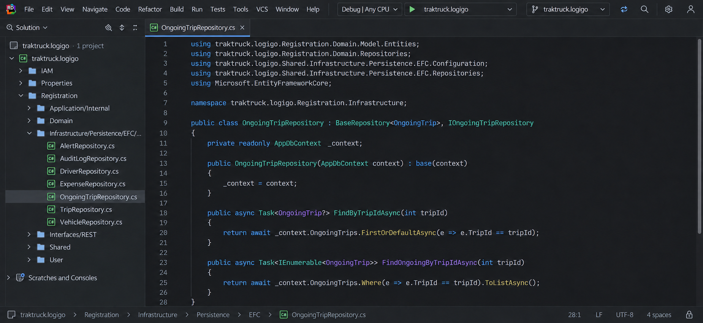

### 5.1.3. Pattern Based Custom Software Library

Como parte del diseño arquitectónico de **TrackTruck**, se propone una librería de software personalizada que reúna componentes técnicos reutilizables por los diferentes microservicios de la plataforma.

Esta librería tiene como objetivo mantener convenciones comunes entre los servicios sin compartir directamente las reglas de negocio pertenecientes a cada bounded context. De esta manera, los microservicios pueden reutilizar estructuras técnicas manteniendo su autonomía.

La librería propuesta se denomina **TrackTruck Shared Kernel Library**.

| Componente reutilizable | Propósito |
|---|---|
| `DomainEvent` | Definir una estructura común para representar eventos de dominio generados por los diferentes servicios. |
| `EventId` | Proporcionar un identificador único para cada evento. |
| `EventMetadata` | Mantener información asociada al evento, como fecha de creación, servicio de origen y tipo de evento. |
| `CorrelationId` | Permitir relacionar solicitudes y eventos que pertenecen a una misma operación logística. |
| `IdempotencyKey` | Identificar operaciones procesadas previamente para evitar efectos duplicados. |
| `ErrorResponse` | Estandarizar la estructura de los errores expuestos por los servicios. |
| `PageResult` | Proporcionar una estructura reutilizable para resultados paginados. |
| `AuditableEvent` | Mantener información necesaria para la trazabilidad y auditoría de operaciones. |

La librería podrá ser utilizada por servicios como **Shipment Management**, **Fleet Management**, **Warehouse Operations**, **Dispatch Planning**, **Trip Execution**, **Tracking & Geolocation** y otros microservicios que necesiten estas capacidades técnicas comunes.

Cada bounded context continuará manteniendo de manera independiente sus entidades, agregados, Value Objects, reglas de negocio y estructuras de persistencia.

Por esta razón, elementos como `Shipment`, `Vehicle`, `Driver`, `Trip`, `Invoice` o `Payment` no formarán parte de la librería compartida, ya que pertenecen a modelos de dominio específicos y compartirlos produciría un mayor acoplamiento entre los servicios.

La propuesta aplica el concepto de **Shared Kernel** de forma limitada, incluyendo únicamente elementos técnicos estables y realmente comunes a la plataforma.

Debido a que el alcance del proyecto se concentra en el diseño arquitectónico, la librería representa una propuesta para una futura implementación de los microservicios de TrackTruck.

### 5.1.4. Framework Pattern Driven Refactoring Report

Durante el proceso de diseño arquitectónico de **TrackTruck** se realizaron diferentes refinamientos sobre la estructura inicial de la solución con el objetivo de mejorar la separación de responsabilidades, reducir el acoplamiento y mantener coherencia con los patrones arquitectónicos seleccionados.

Debido a que el alcance del proyecto se concentra en el diseño de arquitectura y no en la implementación de código, el refactoring presentado en esta sección corresponde a cambios realizados sobre la estructura arquitectónica, los bounded contexts, las responsabilidades de los servicios y sus mecanismos de integración.

Los principales refinamientos realizados fueron los siguientes:

| Situación inicial | Refactorización aplicada | Patrón / principio utilizado | Resultado |
|---|---|---|---|
| La solución estaba centrada principalmente en viajes, flota y seguimiento. | Se amplió la arquitectura para representar el ciclo logístico completo mediante bounded contexts especializados. | Domain-Driven Design | Se obtuvo una arquitectura con mayor cobertura del negocio y responsabilidades más claras. |
| Shipment Management y Warehouse Operations podían concentrarse dentro de una misma responsabilidad. | Se separaron ambos bounded contexts. | Separation of Concerns / DDD | Cada contexto mantiene sus propias reglas, estados y datos. |
| La planificación de viajes podía depender directamente de diferentes servicios operativos. | Se definió Dispatch Planning como el contexto responsable de centralizar la planificación y consumir información de otros servicios. | Service Decomposition / DDD | La lógica de planificación queda separada del resto de capacidades. |
| La información de horas trabajadas y restricciones del conductor podía mantenerse dentro de Fleet Management. | Se separaron Time & Attendance y Driver Safety & Compliance. | Single Responsibility Principle | Se diferencia el registro de jornada de la evaluación de elegibilidad del conductor. |
| El acceso a proveedores externos podía realizarse directamente desde la lógica principal. | Se propuso el uso de Adapter y Anti-Corruption Layer. | Adapter / Anti-Corruption Layer | El dominio queda desacoplado de proveedores de mapas, pagos y facturación. |
| Los servicios podían depender directamente unos de otros para comunicar cambios de estado. | Se incorporó Event-Driven Architecture y Publish–Subscribe mediante un Event Broker. | Publish–Subscribe / Event-Driven Architecture | Se reduce el acoplamiento entre microservicios. |
| Los servicios podían compartir directamente estructuras de persistencia. | Se adoptó Database per Service. | Database per Service | Cada bounded context mantiene autonomía sobre sus datos. |
| Las aplicaciones cliente podían conectarse directamente con múltiples servicios. | Se incorporó un API Gateway como punto de entrada. | API Gateway | Se simplifica el acceso a los servicios y se centralizan controles comunes. |
| Las fallas de proveedores externos podían afectar el funcionamiento de otros componentes. | Se incorporaron tiempos máximos de espera y Circuit Breaker. | Circuit Breaker / Fault Tolerance | Se limita la propagación de fallas externas. |
| Un mismo evento o solicitud podía procesarse más de una vez ante reintentos. | Se incorporó el uso de identificadores únicos e idempotencia. | Idempotency Pattern | Se reduce el riesgo de duplicidad e inconsistencias. |
| Diferentes microservicios podían definir estructuras técnicas similares de forma independiente. | Se propuso TrackTruck Shared Kernel Library. | Shared Kernel | Se reutilizan elementos técnicos comunes sin compartir reglas específicas del dominio. |

Uno de los principales cambios realizados fue evolucionar desde una arquitectura enfocada principalmente en la gestión de viajes y seguimiento hacia una arquitectura empresarial que representa capacidades como gestión de clientes, envíos, almacén, flota, mantenimiento, personal, planificación, ejecución de viajes, seguimiento, entregas, facturación, historial y analítica.

El proceso de refactorización permitió establecer límites más claros entre los bounded contexts y definir mecanismos de comunicación adecuados según el tipo de interacción requerida.

Las operaciones que necesitan una respuesta inmediata utilizan principalmente interfaces síncronas mediante REST, mientras que los cambios de estado que pueden ser procesados de manera independiente se comunican mediante eventos.

También se estableció que cada bounded context mantendrá autonomía sobre sus datos y reglas de negocio, evitando que un servicio acceda directamente a la persistencia de otro contexto.

Estos refinamientos permiten que la arquitectura propuesta para TrackTruck pueda evolucionar de manera progresiva y que cambios realizados sobre una capacidad específica generen un impacto limitado sobre el resto de la plataforma.

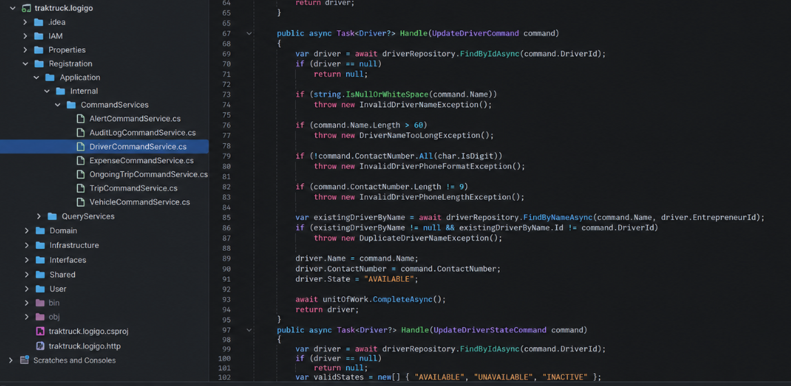

## 5.2. Software Configuration Management

En esta sección se describen las herramientas, configuraciones y convenciones utilizadas para organizar y mantener el proyecto **TrackTruck** de forma consistente durante su desarrollo.

### 5.2.1. Software Development Environment Configuration

Para el desarrollo de **TrackTruck** se utilizan distintas herramientas para organizar, diseñar, documentar y gestionar el proyecto.

| Actividad | Herramienta | Propósito |
|---|---|---|
| Project Management | Trello | Gestionar tareas mediante tableros Kanban. |
| Requirements Management | GitHub / Markdown | Documentar requisitos y User Stories. |
| Domain Modeling | Miro | Elaborar Bounded Context Maps. |
| Architecture Design | Structurizr | Elaborar diagramas C4. |
| UML Modeling | Lucidchart | Elaborar diagramas UML. |
| Version Control | Git / GitHub | Gestionar cambios y versiones del proyecto. |
| Documentation | Markdown | Elaborar y mantener el informe. |

### 5.2.2. Source Code Management

Para la gestión de versiones de **TrackTruck** se utiliza **Git y GitHub**, permitiendo mantener un historial organizado de los cambios realizados por el equipo.

**Repositorio del proyecto:**

[TrackTruck - GitHub](https://github.com/1ASI0657-2620-15987-G4/tracktruck-report/tree/feature/dazai)

Se considera una organización basada en **GitFlow**:

| Rama | Propósito |
|---|---|
| `main` | Versión estable del proyecto. |
| `develop` | Integración de cambios antes de su liberación. |
| `feature/*` | Desarrollo de nuevas funcionalidades o artefactos. |
| `release/*` | Preparación de nuevas versiones. |
| `hotfix/*` | Correcciones importantes. |

Para las versiones se utiliza **Semantic Versioning** con el formato `MAJOR.MINOR.PATCH`, por ejemplo `1.0.0`.

Los commits siguen **Conventional Commits**, utilizando prefijos como:

- `feat:` nueva funcionalidad.
- `fix:` corrección.
- `docs:` cambios en documentación.
- `refactor:` reorganización o mejora.
- `chore:` tareas de mantenimiento.

### 5.2.3. Source Code Style Guide & Conventions

Para mantener consistencia en los artefactos técnicos de **TrackTruck**, se establecen convenciones comunes de nomenclatura y organización.

Las principales convenciones son:

- Utilizar nombres en **inglés** para componentes, servicios, clases, atributos y elementos arquitectónicos.
- Utilizar **PascalCase** para nombres de clases, servicios y componentes.
- Utilizar **camelCase** para atributos, variables y operaciones.
- Utilizar nombres descriptivos y relacionados con el dominio.
- Mantener una nomenclatura consistente entre diagramas, documentación y repositorio.
- Evitar abreviaciones poco claras o nombres genéricos.

Ejemplos:

`ShipmentManagement`

`DispatchPlanningService`

`trackingStatus`

`driverEligibility`

`ShipmentReadyForDispatch`

Estas convenciones permiten mantener una documentación y arquitectura más clara y uniforme entre los integrantes del equipo.

### 5.2.4. Software Deployment Configuration

La configuración de despliegue de **TrackTruck** define cómo los diferentes servicios de la solución podrían ser publicados y ejecutados en un entorno de infraestructura.

La arquitectura considera el despliegue independiente de los microservicios, permitiendo que cada servicio pueda actualizarse o escalarse sin afectar directamente a los demás.

Los principales elementos considerados son:

| Elemento | Propósito |
|---|---|
| API Gateway | Centralizar el acceso a los servicios. |
| Microservices | Ejecutar las capacidades principales de TrackTruck de forma independiente. |
| Databases | Mantener la persistencia separada por servicio. |
| Event Broker | Gestionar la comunicación asíncrona entre microservicios. |
| External Providers | Integrar servicios externos como mapas, pagos y facturación. |
| Cloud Infrastructure | Alojar y ejecutar los componentes de la solución. |

El despliegue puede realizarse sobre una plataforma cloud como **AWS, Microsoft Azure o Google Cloud**, manteniendo separados los servicios, bases de datos y componentes de integración.

El siguiente diagrama representa la configuración general de despliegue propuesta para TrackTruck.

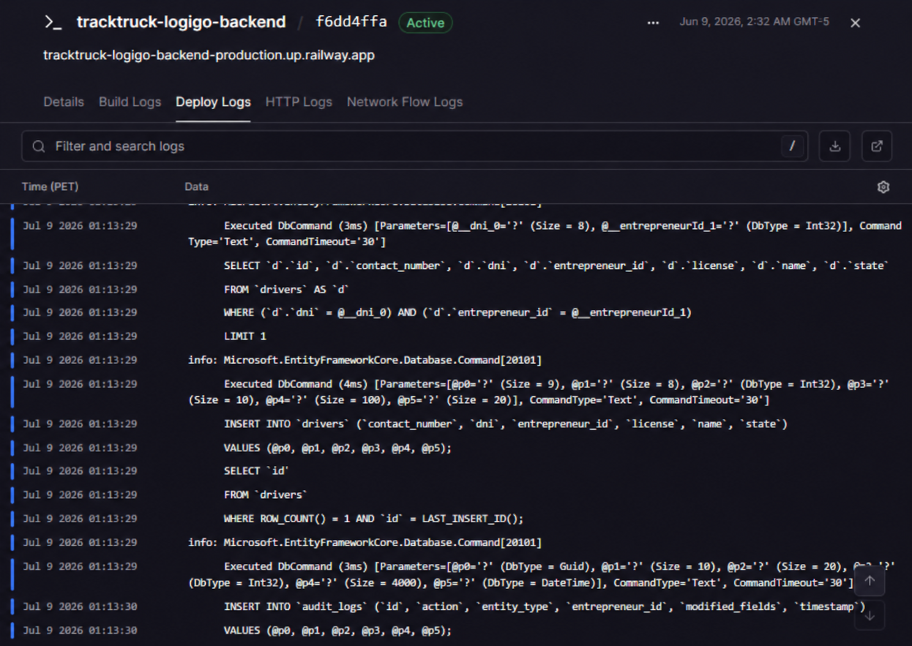

## 5.3. Microservices Implementation

En esta sección se documenta el desarrollo progresivo de la arquitectura de microservicios de **TrackTruck** mediante diferentes Sprints.

Cada Sprint permite avanzar de manera incremental en la definición de los servicios, sus responsabilidades, integraciones y principales decisiones arquitectónicas.

### 5.3.1. Sprint 1

El objetivo del Sprint 1 es establecer la estructura inicial de la arquitectura de microservicios de TrackTruck.

Durante este Sprint se prioriza la definición de los principales bounded contexts, sus responsabilidades y las relaciones necesarias para soportar el flujo logístico principal.

Se consideran como actividades principales:

- definir los microservicios iniciales de la solución;
- establecer responsabilidades y límites entre servicios;
- definir las principales interfaces de comunicación;
- establecer comunicación síncrona mediante REST y asíncrona mediante eventos;
- elaborar las primeras vistas C4 y UML;
- registrar las principales decisiones arquitectónicas;
- organizar las actividades mediante el Sprint Backlog y tablero Kanban.

El resultado esperado del Sprint es contar con una base arquitectónica consistente que permita continuar refinando e integrando los demás servicios en los siguientes Sprints.

#### 5.3.1.1. Sprint Backlog 1

El Sprint Backlog 1 organiza las actividades necesarias para establecer la estructura inicial de la arquitectura de microservicios de **TrackTruck**.

**Sprint Goal:** definir la base arquitectónica de la solución, identificando los principales microservicios, sus responsabilidades, relaciones e interfaces de comunicación.

| ID | Work Item / Task | Descripción | Estimación | Estado |
|---|---|---|---|---|
| SB01 | Define Microservices | Identificar los microservicios principales de TrackTruck. | 3 h | Terminado |
| SB02 | Define Bounded Context Responsibilities | Establecer las responsabilidades y límites de cada bounded context. | 3 h | Terminado |
| SB03 | Define Service Relationships | Definir las relaciones e intercambio de información entre servicios. | 3 h | Terminado |
| SB04 | Define REST Communication | Establecer las principales comunicaciones síncronas mediante REST. | 2 h | Terminado |
| SB05 | Define Event Communication | Identificar los principales eventos para comunicación asíncrona. | 3 h | Terminado |
| SB06 | Define External Integrations | Identificar proveedores externos de mapas, pagos y facturación. | 2 h | Terminado |
| SB07 | Create C4 Architecture View | Elaborar la vista C4 de la arquitectura inicial. | 4 h | Terminado |
| SB08 | Create UML Architecture View | Elaborar los diagramas UML principales del Sprint. | 4 h | Terminado |
| SB09 | Document Architecture Decisions | Registrar las decisiones arquitectónicas tomadas durante el Sprint. | 2 h | Terminado |

El avance de las actividades se gestiona mediante un tablero Kanban con las columnas **Por hacer**, **En proceso**, **En revisión** y **Terminado**.

**URL del tablero:** [Sprint 1 - Trello](PEGAR_AQUI_URL_DEL_TABLERO)

#### 5.3.1.2. Development Evidence for Sprint Review

Durante el Sprint 1 se desarrollaron los principales artefactos arquitectónicos necesarios para establecer la estructura inicial de **TrackTruck**.

Como evidencia del trabajo realizado se consideran los siguientes resultados:

- definición de los bounded contexts principales;
- identificación de los microservicios de la solución;
- definición de responsabilidades por servicio;
- relaciones entre bounded contexts;
- definición de comunicación síncrona mediante REST;
- definición de comunicación asíncrona mediante eventos;
- identificación de integraciones con proveedores externos;
- elaboración de diagramas C4 y UML;
- registro de decisiones arquitectónicas.

Las siguientes evidencias muestran los principales artefactos desarrollados durante el Sprint.

Estos artefactos permiten validar que el Sprint 1 estableció una base arquitectónica para continuar con el refinamiento de los microservicios en los siguientes Sprints.

#### 5.3.1.3. Testing Suite Evidence for Sprint Review

Durante el Sprint 1 se revisaron los principales artefactos arquitectónicos definidos para **TrackTruck**, verificando que las responsabilidades, relaciones e interfaces fueran coherentes con los requerimientos y drivers seleccionados.

Las principales validaciones realizadas fueron:

| Elemento validado | Criterio de revisión | Resultado |
|---|---|---|
| Bounded Contexts | Cada contexto posee responsabilidades claramente diferenciadas. | Cumplido |
| Microservices | Los servicios representan capacidades independientes del negocio. | Cumplido |
| REST Communication | Las operaciones síncronas poseen interfaces claramente definidas. | Cumplido |
| Event Communication | Los eventos permiten comunicación desacoplada entre servicios. | Cumplido |
| External Integrations | Los proveedores externos se encuentran separados mediante interfaces y adaptadores. | Cumplido |
| Data Ownership | Cada servicio mantiene autonomía sobre sus propios datos. | Cumplido |
| Architectural Views | Los diagramas C4 y UML representan la estructura propuesta. | Cumplido |

La evidencia de validación del Sprint se presenta en la siguiente imagen.

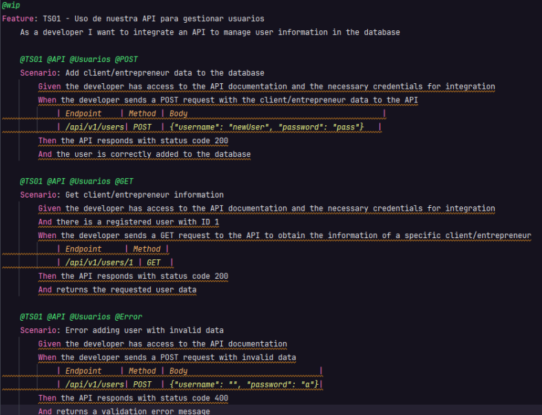

Los resultados obtenidos permiten continuar con el refinamiento de los bounded contexts y microservicios en los siguientes Sprints.

#### 5.3.1.4. Execution Evidence for Sprint Review

Durante el Sprint 1 se revisó la ejecución del diseño arquitectónico propuesto para **TrackTruck**, verificando el flujo general entre los principales microservicios y sus mecanismos de comunicación.

La evidencia considera el recorrido de una operación desde el registro del envío hasta su procesamiento por los servicios involucrados, validando que cada bounded context participe únicamente dentro de sus responsabilidades definidas.

Se verificaron principalmente los siguientes flujos:

- registro de un envío;
- recepción y preparación de la carga;
- comunicación entre microservicios mediante REST;
- publicación y consumo de eventos;
- interacción con servicios externos mediante adaptadores;
- transferencia de información hacia los servicios responsables de las siguientes etapas del proceso.

La siguiente evidencia representa la ejecución del flujo arquitectónico definido durante el Sprint.

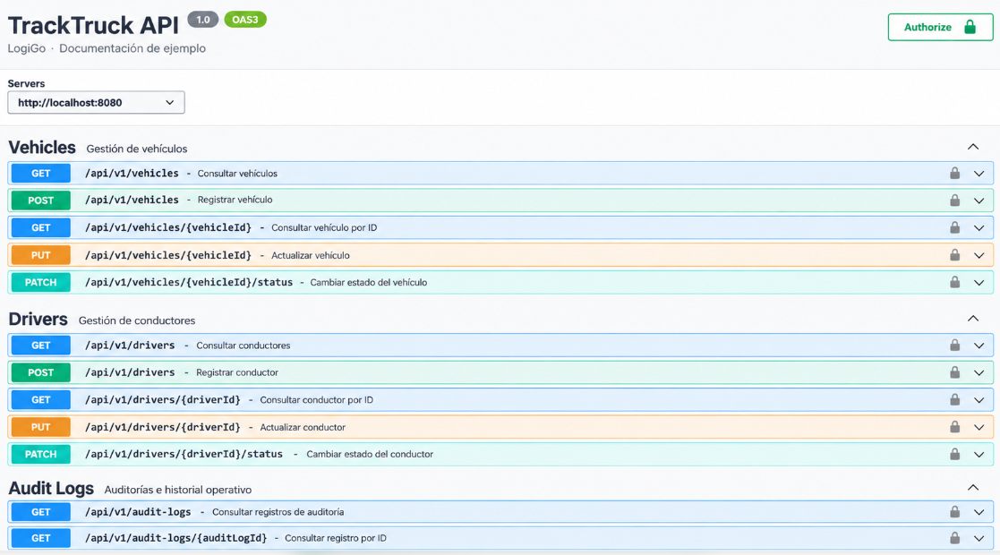

Esta revisión permitió comprobar que la arquitectura propuesta mantiene una secuencia coherente de interacción entre los componentes definidos para TrackTruck.

#### 5.3.1.5. Microservices Documentation Evidence for Sprint Review

Durante el Sprint 1 se documentaron los principales microservicios definidos para **TrackTruck**, incluyendo sus responsabilidades, relaciones e interfaces de comunicación.

La documentación considera los servicios principales de la solución y su participación dentro del flujo logístico.

| Microservice | Responsabilidad principal |
|---|---|
| Shipment Service | Gestionar la información y estados de los envíos. |
| Warehouse Service | Gestionar la recepción, almacenamiento y preparación de carga. |
| Fleet Service | Gestionar conductores y vehículos. |
| Dispatch Planning Service | Planificar la asignación de recursos y rutas. |
| Trip Execution Service | Gestionar la ejecución y estados de los viajes. |
| Tracking Service | Gestionar ubicaciones y seguimiento de los vehículos. |
| Delivery Service | Gestionar la confirmación de entregas. |
| Billing Service | Gestionar información relacionada con facturación y pagos. |

También se documentaron los principales mecanismos de integración entre servicios, considerando comunicación mediante **REST APIs** y eventos publicados a través del **Event Broker**.

Como evidencia se presentan las vistas arquitectónicas y documentación generadas durante el Sprint.

Esta documentación permite mantener una referencia común sobre la estructura, responsabilidades y relaciones de los microservicios definidos para TrackTruck.

#### 5.3.1.6. Software Deployment Evidence for Sprint Review

Durante el Sprint 1 se definió la configuración inicial de despliegue de los principales componentes de **TrackTruck**.

La propuesta considera el despliegue independiente de los microservicios, junto con los componentes necesarios para comunicación, persistencia e integración con servicios externos.

Los principales elementos considerados son:

- API Gateway.
- Microservicios de TrackTruck.
- Bases de datos independientes por servicio.
- Event Broker.
- Proveedores externos.
- Infraestructura Cloud.

Como evidencia se presenta el diagrama de despliegue correspondiente al Sprint 1.

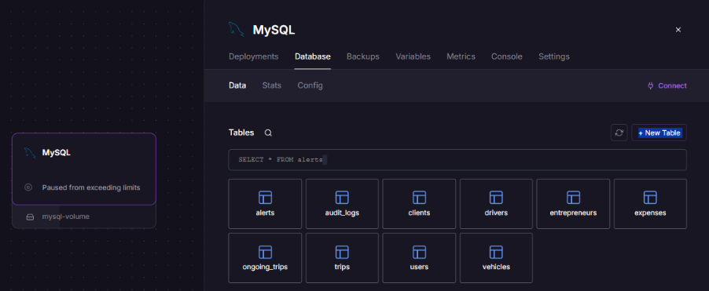

La configuración definida servirá como base para continuar refinando el despliegue de la solución en los siguientes Sprints.

#### 5.3.1.7. Team Collaboration Insights during Sprint

Durante el Sprint 1, los integrantes del equipo colaboraron en la definición y revisión de la arquitectura inicial de **TrackTruck**.

Las principales actividades de colaboración fueron:

- distribución de tareas entre los integrantes;
- revisión conjunta de bounded contexts y microservicios;
- elaboración y validación de diagramas arquitectónicos;
- discusión de responsabilidades e interfaces entre servicios;
- actualización del tablero Kanban;
- revisión de decisiones arquitectónicas antes de integrarlas al informe.

La colaboración permitió mantener una visión común de la arquitectura y detectar inconsistencias antes de continuar con los siguientes Sprints.

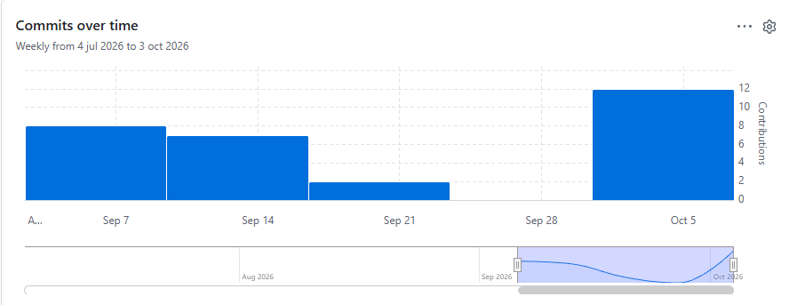

#### 5.3.1.8. Kanban Board

El tablero Kanban del Sprint 1 permite visualizar y controlar el avance de las actividades relacionadas con la definición inicial de la arquitectura de **TrackTruck**.

Las tareas se organizan en las siguientes columnas:

- **Por hacer**
- **En proceso**
- **En revisión**
- **Terminado**

El tablero permite identificar el estado de cada actividad, facilitar la distribución del trabajo y realizar seguimiento al cumplimiento del Sprint Goal.

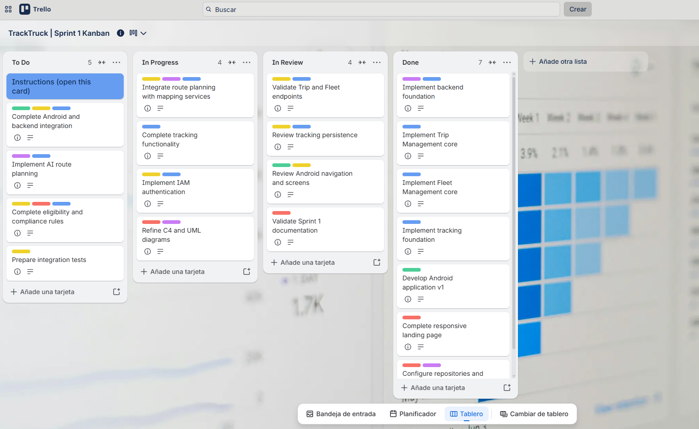

**URL del tablero:** [Sprint 1 - Trello](PEGAR_AQUI_URL_DEL_TABLERO)

# Conclusiones

## Conclusiones y recomendaciones

A partir del desarrollo de la AV1, se definió la problemática que **TrackTruck** busca atender: la dificultad de las empresas de transporte de carga y operadores logísticos para centralizar el monitoreo de vehículos, recorridos, comunicación e incidencias durante sus operaciones.

El proceso Lean UX permitió establecer assumptions e hipótesis relacionadas con la necesidad de contar con mayor visibilidad, control y trazabilidad. Estas hipótesis deberán contrastarse con los resultados reales de las entrevistas y posteriores pruebas con usuarios para determinar si los criterios de éxito planteados se cumplen.

Como siguiente paso, se recomienda continuar validando las necesidades de los segmentos objetivo, ajustar el Product Backlog según los hallazgos obtenidos y priorizar en el roadmap las funcionalidades de mayor valor, principalmente el monitoreo en tiempo real, seguimiento de recorridos, gestión de incidencias, comunicación con conductores e historial de viajes.

# Referencias Bibliográficas

Angular. (s. f.). *Angular documentation*. https://angular.dev/

GitHub. (s. f.). *GitHub documentation*. https://docs.github.com/

Git. (s. f.). *Git documentation*. https://git-scm.com/doc

Lucid Software Inc. (s. f.). *Lucidchart*. https://www.lucidchart.com/

Microsoft. (s. f.). *.NET documentation*. https://learn.microsoft.com/dotnet/

Microsoft. (s. f.). *C# documentation*. https://learn.microsoft.com/dotnet/csharp/

OpenAPI Initiative. (s. f.). *OpenAPI Specification*. https://spec.openapis.org/oas/latest.html

Oracle. (s. f.). *Java documentation*. https://docs.oracle.com/en/java/

Swagger. (s. f.). *Swagger documentation*. https://swagger.io/docs/

Trello. (s. f.). *Trello*. https://trello.com/

TypeScript. (s. f.). *TypeScript documentation*. https://www.typescriptlang.org/docs/

UXPressia. (s. f.). *UXPressia*. https://uxpressia.com/

# Anexos

## Anexo A. Herramientas utilizadas en el proyecto

| Actividad | Herramienta |
|---|---|
| User Personas | UXPressia |
| Empathy Maps | UXPressia |
| Impact Map | UXPressia |
| As-Is Scenario Mapping | LucidChart |
| To-Be Scenario Mapping | LucidChart |
| Control y gestión del proyecto | Trello |
| Control de versiones | GitHub / Git |
| Flujo de trabajo de Git | GitFlow Workflow |

# Links

| Recurso | Enlace |
|---|---|
| Repositorio de GitHub | [Ver repositorio](https://github.com/1ASI0657-2620-15987-G4) |
| Tablero de Trello | [Ver tablero](https://trello.com/invite/b/6a9f35b637f25ac414075cf7/ATTIf84a9d213de599cd378224b9c2fa3fe4F4197A6F/mi-tablero-de-trello) |
